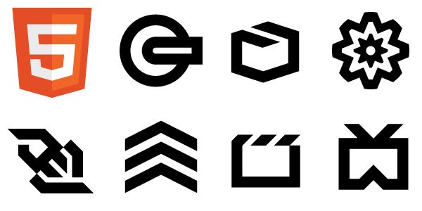
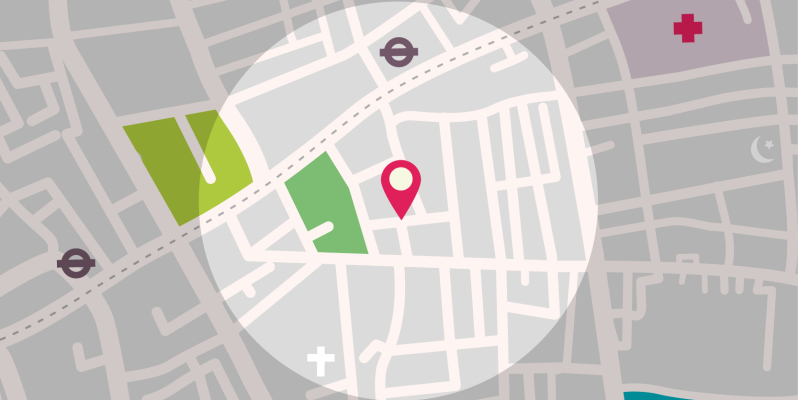
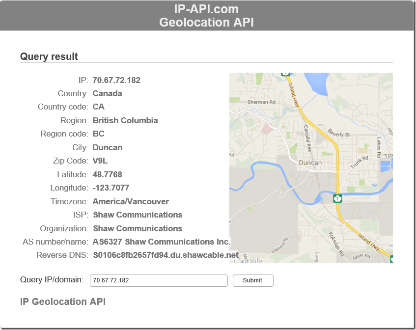
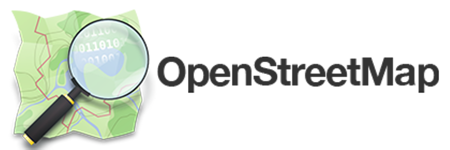

# [Curso de JavaScript Avanzado para desarrolladores Front-end](https://fictizia.com/formacion/curso-javascript-avanzado)
### POO con JS, ECMA6, Patrones de diseño, AJAX avanzado, HTML5 avanzado, APIs externas.


## Clase 13

### HTML5 APIS



- [The Web platform: Browser technologies](https://platform.html5.org/)


### Geolocalización



- [Espeficicación](http://dev.w3.org/geo/api/spec-source.html)
- [Compatibildiad](http://caniuse.com/#feat=geolocation)

- Seguridad:
  - Necesario SSL
    - HTTPS
  - Confirmación del usuario

- Precisión:
    - Wi-fi (MAC)
    - Ethernet (IP)
    - Triangulación (3G y 4G)    
    - GPS (máxima precisión, pero tardará más en cargar)

### Geolocalización: Métodos

**[Geolocation.getCurrentPosition()](https://developer.mozilla.org/es/docs/Web/API/Geolocation/getCurrentPosition)**
```javascript
    // Posición Actual
    navigator.geolocation.getCurrentPosition();
```

**[Geolocation.watchPosition()](https://developer.mozilla.org/es/docs/Web/API/Geolocation/watchPosition)**
```javascript
    // Seguimiento como un GPS
    navigator.geolocation.watchPosition();
```

**[Geolocation.clearWatch()](https://developer.mozilla.org/es/docs/Web/API/Geolocation/clearWatch)**
```javascript
    // Para el seguimiento
    navigator.geolocation.clearWatch();
```

### Geolocalización: Propiedades

**Latitud (en base 10)**
```javascript
     console.log(position.coords.latitude);
```

**Longitud (en base 10)**
```javascript
     console.log(position.coords.longitude);
```

**Precisión en posicionamiento**
```javascript
     console.log(position.coords.accuracy);
```

**Altitud (metros por encima del nivel del mar)**
```javascript
     console.log(position.coords.altitude);
```

**Precisión de altitud**
```javascript
     console.log(position.coords.altitudeAccuracy);
```

**Rumbo (Grados respectos al norte)**
```javascript
     console.log(position.coords.heading);
```

**Velocidad (m/s)**
```javascript
     console.log(position.coords.speed);
```

**Timestamp**
```javascript
     console.log(position.timestamp);
```

### Geolocalización: Ajustes

***enableHighAccuracy**
- Mejora los datos para conexiones no GPS, pero aumenta drásticamente el consumo de batería del dispositivo.
- *False por defecto*

**timeout**
- Tiempo (ms) de espera antes de lanzar el error.
- *0 por defecto*

**maximumAge**
- Tiempo (ms) para el almacenamiento en memoria cache de la posición actual
- *0 por defecto*

**Ejemplo**
```javascript
const opciones = {
    enableHighAccuracy: true,
    maximumAge: 1000, // 1s
    timeout: 2000 // 2s
};
```

### Geolocalización: Ejemplos

**Comprobando la compatibildiad de `geolocation`**
```javascript
if ("geolocation" in navigator) {
   console.log("Podemos usar Geolocation! :-) ");
} else {
  console.warn("Geolocation no soportado :-( ");
}
```

**Probando la geolocalización**
```javascript
if ("geolocation" in navigator) {
    navigator.geolocation.getCurrentPosition(position => {
         console.log(`Latitud: ${position.coords.latitude}\nLongitud: ${position.coords.longitude}`);
        let datos = `<h1>Te pille!</h1>
        <p>Latitud: ${position.coords.latitude.toFixed(4)}</p>
        <p>Longitud: ${position.coords.longitude.toFixed(4)}</p>`
        document.body.innerHTML = datos;
    });
} else {
  console.warn("Geolocation no soportado :-( ");
}
```

**Mostrar la localización en una imagen estatica usando Gogole Maps**
```javascript
if ("geolocation" in navigator) {
    navigator.geolocation.getCurrentPosition(position => {
        const latlon = `${position.coords.latitude},${position.coords.longitude}`;
        const img_url = `http://maps.googleapis.com/maps/api/staticmap?center=${latlon}&zoom=14&size=400x300&sensor=false`;
        document.body.innerHTML = ``;
    });
} else {
  console.warn("Geolocation no soportado :-( ");
}
```

**Gestionar los Errores y rechazos**
```javascript
navigator.geolocation.getCurrentPosition(geo_success, geo_error);

function geo_success(position) {
   console.log(`${position.coords.latitude},${position.coords.longitude}`);
}

function geo_error(error) {
    switch(error.code) {
        case error.PERMISSION_DENIED:
            document.body.innerHTML = "El usuario ha rechazado la petición.";
            console.warn(error);
            break;
        case error.POSITION_UNAVAILABLE:
            document.body.innerHTML = "La posición de usuario no es correcta.";
            console.warn(error);
            break;
        case error.TIMEOUT:
            document.body.innerHTML = "No hay respuesta en el tiempo limite previsto.";
            console.warn(error);
            break;
        case error.UNKNOWN_ERROR:
            document.body.innerHTML = "Error Desconocido";
            console.warn(error);
            break;
    }
}
```   

**Trabajando con ajustes personalizados**
```javascript
navigator.geolocation.getCurrentPosition(position => {
     console.log(`${position.coords.latitude}, ${position.coords.longitude}`)
}, error => {
    console.warn(`Error! - ${error}`);
}, {
    enableHighAccuracy: true,
    maximumAge: 1000, // 1s
    timeout: 2000 // 2s
});
```

**Convirtiendo las coordenadas a hexadecimal**
```javascript
/**
 * From Isabel Castillo
 * http://isabelcastillo.com/convert-latitude-longitude-decimal-degrees
 * Convert longitude/latitude decimal degrees to degrees and minutes
 * DDD to DMS, no seconds
 * @param lat, latitude degrees decimal
 * @param lng, longitude degrees decimal
 */

function convertDMS( lat, lng ) {
        // Latitud
        const convertLat = Math.abs(lat);
        const LatDeg = Math.floor(convertLat);
        const LatSec = (Math.floor((convertLat - LatDeg) * 60));
        const LatCardinal = ((lat > 0) ? "n" : "s");
        // Longitud
        const convertLng = Math.abs(lng);
        const LngDeg = Math.floor(convertLng);
        const LngSec = (Math.floor((convertLng - LngDeg) * 60));
        const LngCardinal = ((lng > 0) ? "e" : "w");

        return `${LatDeg + LatCardinal + LatSec}<br />${LngDeg}${LngCardinal}${LngSec}`;
}
```

**Sigue a un usuario**
```javascript
navigator.geolocation.watchPosition(position => {
     console.log(`${position.coords.latitude}, ${position.coords.longitude}`)
}, error => {
    console.warn(`Error! - ${error}`);
});
```

### ip-api.com



- [Web](http://ip-api.com/)
- [Docs](http://ip-api.com/docs/)
- [API](http://ip-api.com/docs/api:json)


### Carto


**Documentación**
- [Carto](https://carto.com/)
- [Pricing](https://carto.com/pricing/)
- [Resources](https://carto.com/resources/)
- [Docs](https://carto.com/docs)
- [Guides](https://carto.com/learn/guides)
- [Blog](https://carto.com/blog)
- [CARTO en Github](https://github.com/CartoDB)

**Ejemplos**
- [Carto test by Robert Rouse](http://codepen.io/robertrouse/pen/Qdbzeb)
- [Galería de ejemplos](https://carto.com/gallery/)


### Esri ArcGIS


**Documentación**
- [Web Oficial](http://www.esri.es/)
- [ArcGIS Developers](http://desarrolladores.esri.es/)
- [Ejemplos: API JavaScript de ArcGIS](http://esri-es.github.io/JavascriptAPI/)
- [ESRI españa Github](https://github.com/esri-es)


### OpenStreetMap (OSM)



**Documentación**
- [OSM | Web oficial](https://www.openstreetmap.org/#map=7/40.007/-2.488)
- [Learn OpenStreetMap Step by Step](https://learnosm.org/en/)
- [HOT | Humanitarian OpenStreetMap Team](https://www.hotosm.org/)
- [HOT | Tools & Data](https://www.hotosm.org/tools-and-data)
- [Wheelmap | Project](https://news.wheelmap.org/en/wheelmap-ambassador/)
- [Wheelmap | Map](https://wheelmap.org/es/map#/?zoom=14)
- [Awesome open street map](https://github.com/osmlab/awesome-openstreetmap)
- [OSM | Wiki](https://wiki.openstreetmap.org/wiki/Main_Page)
- [SWITCH2OSM](https://switch2osm.org/)

### Open Layers


**Documentación**
- [Web Oficial](https://openlayers.org/)
- [Docuemntación oficial](https://openlayers.org/en/latest/doc/)
- [Ejemplos](https://openlayers.org/en/latest/examples/)
- [API](http://openlayers.org/en/latest/apidoc/)
- [Awesome OpenLayers](https://github.com/webgeodatavore/awesome-openlayers)
- [OpenLayers Simple Example](https://wiki.openstreetmap.org/wiki/OpenLayers_Simple_Example)
- [OpenLayers Marker Example](https://wiki.openstreetmap.org/wiki/OpenLayers_Marker_Example)
- [Github](https://github.com/openlayers/openlayers)
- [@openlayers en Twitter](https://twitter.com/openlayers?lang=es)

### Leaflet


**Documentación**
- [Web oficial](https://leafletjs.com/)
- [Tutoriales](https://leafletjs.com/examples.html)
- [Documentación oficial](https://leafletjs.com/reference-1.3.2.html)
- [Descargas](https://leafletjs.com/download.html)
- [Plugins](https://leafletjs.com/plugins.html)
- [Blog](https://leafletjs.com/blog.html)
- [Stackoverflow](https://stackoverflow.com/questions/tagged/leaflet)
- [Github](https://github.com/Leaflet/Leaflet)
- [@LeafletJS en Twitter](https://twitter.com/LeafletJS)
- [Ebook | Leaflet Tips and Tricks](https://leanpub.com/leaflet-tips-and-tricks)


### Google Maps


**Documentación**
- [Portal informativo](https://developers.google.com/maps/?hl=Es)
- [Pricing](https://developers.google.com/maps/pricing-and-plans/?hl=Es)
- [Maps JavaScript API](https://developers.google.com/maps/documentation/javascript/?hl=Es)
    - [Tutorial](https://developers.google.com/maps/documentation/javascript/tutorial?hl=Es)
    - [API Ref.](https://developers.google.com/maps/documentation/javascript/3.exp/reference?hl=Es)
    - [Ejemplos](https://developers.google.com/maps/documentation/javascript/examples/?hl=Es)
- [Google Maps Embed API](https://developers.google.com/maps/documentation/embed/?hl=Es)
- [Google Street View Image API](https://developers.google.com/maps/documentation/streetview/?hl=Es)
- [Google Static Maps API](https://developers.google.com/maps/documentation/static-maps/?hl=Es)
- [Biblioteca JavaScript de Google Places API](https://developers.google.com/places/javascript/?hl=Es)

**Usarlo en tu proyecto**

- Librería
```html
<script type='text/javascript' src="http://maps.googleapis.com/maps/api/js?sensor=false&extension=.js&output=embed"></script>
```

- Centrar el mapa
```javascript
function initMap() {
  const map = new google.maps.Map(document.getElementById('map'), {
    zoom: 8,
    center: {lat: -3.8199647, lng: 40.4381307}
  });
}
```

- Markers ( [Demo](https://developers.google.com/maps/documentation/javascript/examples/marker-labels) )
```javascript
// In the following example, markers appear when the user clicks on the map.
// Each marker is labeled with a single alphabetical character.
const labels = 'ABCDEFGHIJKLMNOPQRSTUVWXYZ';
let labelIndex = 0;

function initialize() {
  const bangalore = { lat: 12.97, lng: 77.59 };
  const map = new google.maps.Map(document.getElementById('map'), {
    zoom: 12,
    center: bangalore
  });

  // This event listener calls addMarker() when the map is clicked.
  google.maps.event.addListener(map, 'click', event => {
    addMarker(event.latLng, map);
  });

  // Add a marker at the center of the map.
  addMarker(bangalore, map);
}

// Adds a marker to the map.
function addMarker(location, map) {
  // Add the marker at the clicked location, and add the next-available label
  // from the array of alphabetical characters.
  const marker = new google.maps.Marker({
    position: location,
    label: labels[labelIndex++ % labels.length],
    map
  });
}

google.maps.event.addDomListener(window, 'load', initialize);
```

- Markers Personalizados ( [Demo](https://developers.google.com/maps/documentation/javascript/examples/icon-simple) )
```javascript
// This example adds a marker to indicate the position of Bondi Beach in Sydney,
// Australia.
function initMap() {
  const map = new google.maps.Map(document.getElementById('map'), {
    zoom: 4,
    center: {lat: -33, lng: 151}
  });

  const image = 'images/beachflag.png';
  const beachMarker = new google.maps.Marker({
    position: {lat: -33.890, lng: 151.274},
    map,
    icon: image
  });
}
```

- InfoWindows ( [Demo](https://developers.google.com/maps/documentation/javascript/examples/infowindow-simple) )
```javascript
// This example displays a marker at the center of Australia.
// When the user clicks the marker, an info window opens.

function initMap() {
  const uluru = {lat: -25.363, lng: 131.044};
  const map = new google.maps.Map(document.getElementById('map'), {
    zoom: 4,
    center: uluru
  });

  const contentString = `<div id="content">
          <div id="siteNotice"></div>
          <h1 id="firstHeading" class="firstHeading">Uluru</h1>
          <div id="bodyContent">
              <p><b>Uluru</b>, also referred to as <b>Ayers Rock</b>, is a large 
              sandstone rock formation in the southern part of the 
              Northern Territory, central Australia. It lies 335 km (208 mi) 
              south west of the nearest large town, Alice Springs; 450 km 
              (280 mi) by road. Kata Tjuta and Uluru are the two major 
              features of the Uluru - Kata Tjuta National Park. Uluru is 
              sacred to the Pitjantjatjara and Yankunytjatjara, the 
              Aboriginal people of the area. It has many springs, waterholes, 
              rock caves and ancient paintings. Uluru is listed as a World 
              Heritage Site.</p>
              <p>Attribution: Uluru, <a href="https://en.wikipedia.org/w/index.php?title=Uluru&oldid=297882194">
              https://en.wikipedia.org/w/index.php?title=Uluru</a>
              (last visited June 22, 2009).</p>
          </div>
      </div>`;

  const infowindow = new google.maps.InfoWindow({
    content: contentString
  });

  const marker = new google.maps.Marker({
    position: uluru,
    map,
    title: 'Uluru (Ayers Rock)'
  });
  marker.addListener('click', () => {
    infowindow.open(map, marker);
  });
}
```


### GeoJSON

- [Especificación](http://geojson.org/geojson-spec.html)
- [Web oficial](http://geojson.org/)
- [Ejemplo de uso en Github](https://github.com/timwaters/geojsonpastie/blob/master/test_places.fixture.geojson)

**Ejemplos**
```json
  { "type": "FeatureCollection",
    "features": [
      { "type": "Feature",
        "geometry": {"type": "Point", "coordinates": [102.0, 0.5]},
        "properties": {"prop0": "value0"}
        },
      { "type": "Feature",
        "geometry": {
          "type": "LineString",
          "coordinates": [
            [102.0, 0.0], [103.0, 1.0], [104.0, 0.0], [105.0, 1.0]
            ]
          },
        "properties": {
          "prop0": "value0",
          "prop1": 0.0
          }
        },
      { "type": "Feature",
         "geometry": {
           "type": "Polygon",
           "coordinates": [
             [ [100.0, 0.0], [101.0, 0.0], [101.0, 1.0],
               [100.0, 1.0], [100.0, 0.0] ]
             ]
         },
         "properties": {
           "prop0": "value0",
           "prop1": {"this": "that"}
           }
         }
       ]
     }
```

**Extras**

- [Validador/linter online](http://geojsonlint.com/)
- [Awesome Geojson](https://github.com/tmcw/awesome-geojson)


### Ejercicios


**1 -** Utiliza Google Maps para posicionar al usuario.

[Solución](../OTROS/geoposition/google_maps.html)

**2 -** Utiliza Leaflet para posicionar al usuario.

[Solución](../OTROS/geoposition/leaflet.html)

**3 -** Posiciona todos los vehículos de transporte (trenes y autobuses) de Los Angeles en el mapa.

- [Información sobre la API de Metro.net](http://developer.metro.net/)
- [Utiliza un esquema de color personalizado](https://mapstyle.withgoogle.com/)
- [Snazzy, alternativa al sistema de estilos de Google Maps](https://snazzymaps.com/)
- [Utiliza Google Maps con un API Token](https://developers.google.com/maps/documentation/javascript/get-api-key?hl=ES)
- [Puedes utilizar Cluster de Google Maps](https://developers.google.com/maps/documentation/javascript/marker-clustering)

[Solución](../OTROS/geoposition/transport_metro.html)