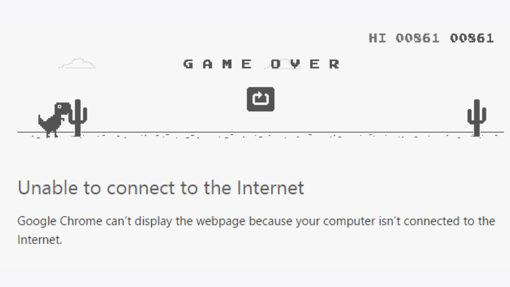
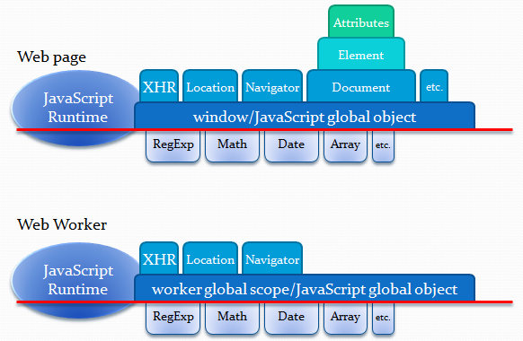

# [Curso de JavaScript Avanzado para desarrolladores Front-end](https://fictizia.com/formacion/curso-javascript-avanzado)
### POO con JS, ECMA6, Patrones de diseño, AJAX avanzado, HTML5 avanzado, APIs externas.


## Clase 15




### Offline
[Soporte en Navegadores](http://caniuse.com/#search=offline%20web%20app)

**Recursos**
- [HTML5 Rocks! | Offline](https://www.html5rocks.com/es/features/offline)
- [MDN | Eventos online y offline](https://developer.mozilla.org/es/docs/Web/API/NavigatorOnLine/Eventos_online_y_offline)
- [HTML5 Rocks! | "Offline": What does it mean and why should I care?](https://www.html5rocks.com/en/tutorials/offline/whats-offline/)
- [Trabaja offline gracias a la API de caché de HTML5](https://www.genbeta.com/desarrollo/trabaja-offline-gracias-a-la-api-de-cache-de-html5)
- [MDN | Usar el caché de aplicaciones](https://developer.mozilla.org/es/docs/Web/HTML/Recursos_offline_en_firefox)
- [Ebook | Pro HTML5 Programming | Chapter 12: Creating HTML5 Offline Web Applications](http://apress.jensimmons.com/v5/pro-html5-programming/ch12.html)
- [HTML5 Docter | let’s take this offline](http://diveinto.html5doctor.com/offline.html)
- [W3C Spec | Offline](https://www.w3.org/TR/2011/WD-html5-20110525/offline.html)
- [TheFox/html5-offline-example](https://github.com/TheFox/html5-offline-example)
- [Tutorial: How to make an offline HTML5 web app, FT style](https://labs.ft.com/2012/08/basic-offline-html5-web-app/)
- [How To Use HTML5 Offline Storage In Your Website](https://www.hongkiat.com/blog/html5-offline-storage/)
- [Offline-capable applications with HTML5](http://www.linux-magazine.com/Online/Features/HTML5-Offline)
- [Offline Application: using manifest](https://html5demos.com/offlineapp/)
- [Researching HTML5 Offline](https://spin.atomicobject.com/2010/08/16/researching-html5-offline/)


**Uso y limitaciones**
- Aplicación disponible independientemente del estado de la conexión
- Se acelera la carga de los archivos
- Disminuyen las consultas al servidor
- En algunos navegadores es necesario que el usuario permita el almacenamiento
- Para incluir cambios en la aplicación es necesario modificar el manifiesto


### Offline: Comprobación
```javascript
if (!window.applicationCache) {
    console.warn("No se puede utilizar applicationCache :-(");
} else {
    console.log("Podemos utilizar applicationCache :-)");
}
```

### Offline: Verificando la conexión
```javascript
if (window.navigator.onLine) {
    const detalles = `<h1>Estas Conectado a Internet!!</h1>
    <h3>Detalles del navegador:</h3>
    <p>CodeName: ${navigator.appCodeName}</p>
    <p>Nombre: ${navigator.appName}</p>
    <p>Versión: ${navigator.appVersion}</p>
    <p>Cookies Habilitadas: ${navigator.cookieEnabled}</p>
    <p>Lenguaje: ${navigator.language}</p>
    <p>Plataforma: ${navigator.platform}</p>
    <p>User-agent header: ${navigator.userAgent}</p>`;
    document.body.innerHTML = detalles;

} else {
    document.body.innerHTML = "<h1>No estas Conectado!!</h1>"
    console.warn("No estamos conectados a Internet!");
}
```

### Offline: Verificando la conexión con eventos
- Verificando la conexión usando eventos:
```javascript
window.addEventListener("offline", () => {
    console.warn("Estas desconectado!")
});

window.addEventListener("online", () => {
    console.info("Estas conectado!")
});
```

### Offline: Usando Cache (manifest)

**Uso**
- Los archivos son visibles en la pestaña Resources/Application Cache
- El atributo manifest puede señalar a una URL pero deben tener el mismo origen que la aplicación web
- Los sitios no pueden tener más de 5MB de datos almacenados en caché, pueden ser menos si el usuario lo cambia.
- Si no se puede descargar el archivo de manifiesto o algún recurso especificado en él, fallará todo el proceso de actualización de la caché.
- Añadir la versión del manifest como comentario.
- JAMAS incluir el propio manifest dentro del manifest
- Es necesario ajustar el MIME en algunos servidores
```
// Ex: Apache
AddType text/cache-manifest .appcache
```

**Nuevo sistema de carga**
- Si existe manifest, el navegador carga el documento y sus recursos asociados directamente desde local.
- Se verifica si hubo actualizaciones al manifest.
- Si se actualizo, el navegador descarga la nueva versión del archivo y de los recursos listados en él (segundo plano).

**Estructura**
- `CACHE` lo que se cacheará
- `NETWORK` lo que NO se cacheará
- `FALLBACK` que se visualizará si algo no esta disponible de manera offline


**Incluyendo el manifest**
```html
<html manifest="ejemplo.appcache">
  <!-- ... -->
</html>
```

**Ejemplo de Manifest**
```
CACHE MANIFEST
# versión 1.0

# SI CACHEAR
CACHE:
index.html
offline.html
css/style.css
js/script.js
img1.jpg
img2.jpg
img3.jpg
logo.png

# Mostraremos offline.html cuando algo falle
FALLBACK:
offline.html

# NO CACHEAR
NETWORK:
*
# * es todo aquello que no este en CACHE
```

### Offline: Estados de Cache (manifest)
```javascript
const appCache = window.applicationCache;

switch (appCache.status) {
  case appCache.UNCACHED: // appCache.status == 0
    console.warn('Un objeto caché de la aplicación no se inicializó correctamente o falló.');
    break;
  case appCache.IDLE: // appCache.status == 1
    console.info('La caché no esta en uso.');
    break;
  case appCache.CHECKING: // appCache.status == 2
    console.info('El manifesto se ha obtenido y esta siendo revisado para actualizarse.');
    break;
  case appCache.DOWNLOADING: // appCache.status == 3
    console.info('Se estan descargando nuevos recursos debido a una actualización del manifesto.');
    break;
  case appCache.UPDATEREADY: // appCache.status == 4
    console.info('Hay una nueva versión del manifiesto.');
    break;
  case appCache.OBSOLETE: // appCache.status == 5
    console.info('El caché esta ahora obsoleto');
    break;
  default:
    console.warn('El Caché esta en estado desconocido');
    break;
};
```    

### Offline: Eventos de Cache
```javascript
function eventosCache(){
    const appCache = window.applicationCache;
    appCache.addEventListener('cached', chivato);
    appCache.addEventListener('checking', chivato);
    appCache.addEventListener('downloading', chivato);
    appCache.addEventListener('error', chivato);
    appCache.addEventListener('noupdate', chivato);
    appCache.addEventListener('obsolete', chivato);
    appCache.addEventListener('progress', chivato);
    appCache.addEventListener('updateready', chivato);
    
    function chivato(e) {
        const conexion = (navigator.onLine) ? 'sí': 'no';
        const type = e.type;
        console.log(`Conectado: ${conexion}, Evento: ${type}, \nMás Información: %O`, e);
    }
}
```

**Forzar la actualización (manualmente)**

```javascript
const appCache = window.applicationCache;

appCache.update(); // Intentamos actualizar la versión del usuario con un nuevo manifest

if (appCache.status == window.applicationCache.UPDATEREADY) {
  appCache.swapCache();  // La ctualización es correcta y se cambiado a la nueva versión
}
```


### Web Workers

- Los Web Workers se ejecutan en un subproceso aislado.
- Funcionan aunque la pagina se haya cerrado
- Siguen funcionando aunque el navegadro se cierre.
- [Especificación](http://www.whatwg.org/specs/web-workers/current-work/)
- [Soporte](http://caniuse.com/#feat=webworkers)


**Arquitectura**




**Alcance**
- En el contexto de un Worker, tanto self como this hacen referencia al alcance global del Worker
- Puede acceder a:
	- Objeto navigator
	- Objeto location (de solo lectura)
	- XMLHttpRequest
	- setTimeout(), setInterval(), etc...
	- [Caché de la aplicación](https://developer.mozilla.org/es/docs/Web/API/Window/applicationCache)
	- Importación de secuencias de comandos externas, [importScripts()](https://developer.mozilla.org/en-US/docs/Web/API/WorkerGlobalScope/importScripts)
	- Generación de otros Web Workers

**Limitaciones**
- No se ejecutarán de forma local
- DOM
- Objeto window
- Objeto document
- Objeto parent


**Recomendaciones**

- Obtención previa y/o almacenamiento en caché de datos para un uso futuro
- Métodos para destacar la sintaxis de código u otros formatos de texto en tiempo real
- Corrector ortográfico
- Análisis de datos de vídeo o audio
- Entrada y salida en segundo plano o solicitud de servicios web
- Procesamiento de conjuntos o respuestas JSON de gran tamaño
- Filtrado de imágenes en <canvas>
- Actualización de varias filas de una base de datos web local

**Ejemplos**

- [Web Workers and Service Workers](http://codepen.io/ruzz311/pen/NNroab)
- [WEB Worker sample](http://codepen.io/nacholozano/pen/dpqvYk)

**Recursos**
- [Introducción a los Web Workers en html5rocks](https://www.html5rocks.com/es/tutorials/workers/basics/)
- [Web workers without a separate Javascript file?](http://stackoverflow.com/questions/5408406/web-workers-without-a-separate-javascript-file)
- [Offline Recipes for Service Workers by DWB](https://davidwalsh.name/offline-recipes-service-workers)
- [Using Web Workers to Speed-Up Your JavaScript Applications by treehouse](http://blog.teamtreehouse.com/using-web-workers-to-speed-up-your-javascript-applications)
- [Debugging Web Workers with Chrome Developer Tools](https://blog.chromium.org/2012/04/debugging-web-workers-with-chrome.html)
- [Using Web Workers en MDN](https://developer.mozilla.org/en-US/docs/Web/API/Web_Workers_API/Using_web_workers)
- [Concurrency in JavaScript](http://typedarray.org/concurrency-in-javascript/)

**Librerías**
- [parallel.js](https://github.com/parallel-js/parallel.js) 
- [promise-worker](https://github.com/nolanlawson/promise-worker)
- [Catiline.js](http://catilinejs.com/)

### Web Workers: Básico

**Definición y puesta en marcha**

- Instanciando el Web Worker
```javascript
const worker = new Worker('fichero.js');
```

- Arrancando el Web Worker
```javascript
const worker = new Worker('fichero.js');
worker.postMessage();
```

**Comunicación**

- Desde el archivo principal
```javascript
const worker = new Worker('fichero.js');

worker.addEventListener('message', evento => {
  console.log('El worker dice: ', evento.data);
}, false);

worker.postMessage('Hola Mundo!');
```

- Desde el Web Worker
```javascript
self.addEventListener('message', evento => {
  self.postMessage(evento.data);
}, false);
```

**Parar un Web Worker**

- Desde el archivo principal
```javascript
worker.terminate()
```

- Desde el Web Worker
```javascript
self.close()
```

#### Web Workers: Avanzado

**Subworkers**
- La resolución de las URI de los Subworkers está relacionada con la ubicación de su Worker principal (en oposición a la página principal)
- Los Workers tienen la capacidad de generar Workers secundarios.
- Los Subworkers deben estar alojados en el mismo origen que la página principal.


**Blob**
En el HTML:
```html
<!-- inline worker -->
<script id="worker" type="javascript/worker">
    ((s => {
    	const increment = 1;
      let count = 0;
      const loop = 999999999;
      
      s.onmessage = e => {
          console.log(e.data);
          let test = 0;
          for( let i = 0 ; i < loop ;i++ ){
          	test = i;
            const int = Math.trunc( i*100/loop );
            if( int === count ){
          		s.postMessage( int );
              count += increment;
            }
          }
        s.postMessage( {finish:'loop finished'} );
      };
    }))(self);
 </script>
```


En JS:
```javascript
const blob = new Blob([document.querySelector('#worker').textContent], { type: "text/javascript" });
const worker = new Worker(window.URL.createObjectURL(blob));
```

**Shared Web Workers**

- [Epecificación](https://html.spec.whatwg.org/multipage/workers.html#sharedworker)
- [Soporte Shared Web Workers](http://caniuse.com/#feat=sharedworkers)


**Definición y puesta en marcha**

- Instanciando el Web Worker
```javascript
const worker = new SharedWorker("fichero.js");
```

- Arrancando el Web Worker utiliznado port
```javascript
const worker = new SharedWorker("/html5/web-worker-shared.jsp");

worker.port.addEventListener("message", event => {
	console.log("datos del ShraedWorker", event.data);
}, false);

worker.port.start();
```

**Comunicación**

- Desde el archivo principal
```javascript
const worker = new SharedWorker("/html5/web-worker-shared.jsp");

worker.port.addEventListener("message", event => {
	console.log("datos del ShraedWorker", event.data);
}, false);

worker.port.postMessage("First Message");
```

- Desde el Web Worker
```javascript
const ports = [];

onconnect = event => {
    const port = event.ports[0];
    ports.push(port);
    port.start();
    port.addEventListener("message", event => { listenForMessage(event, port); } );
}


listenForMessage = (event, port) => {
    port.postMessage(`Reply from SharedWorker to: ${event.data}`);
}

//Implementation of shared worker thread code
setInterval(() => { runEveryXSeconds() }, 5000);

function runEveryXSeconds() {
    for(i = 0; i < ports.length; i++) {
        ports[i].postMessage(`Calling back at : ${new Date().getTime()}`);
    }
}
```

### Tiempo para proyecto personal y terminar ejercicios pendientes!

