# [Curso de JavaScript Avanzado para desarrolladores Front-end](https://fictizia.com/formacion/curso-javascript-avanzado)
### POO con JS, ECMA6, Patrones de diseño, AJAX avanzado, HTML5 avanzado, APIs externas.


## Clase 17

### Patrones de diseño

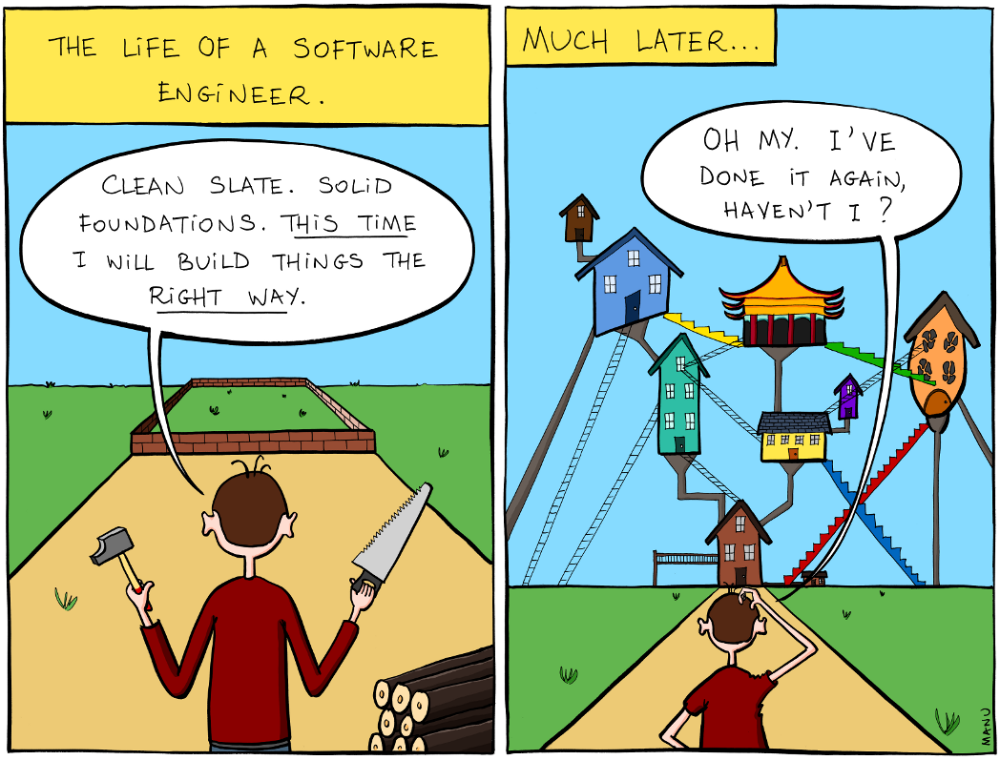

> Los patrones de diseño son unas técnicas para resolver problemas comunes en el desarrollo de software y otros ámbitos referentes al diseño de interacción o interfaces.

> Un patrón de diseño resulta ser una solución a un problema de diseño. Para que una solución sea considerada un patrón debe poseer ciertas características. Una de ellas es que debe haber comprobado su efectividad resolviendo problemas similares en ocasiones anteriores. Otra es que debe ser reutilizable, lo que significa que es aplicable a diferentes problemas de diseño en distintas circunstancias. [Wikipedia](https://es.wikipedia.org/wiki/Patr%C3%B3n_de_dise%C3%B1o)

**Importante**
- Proporcionar catálogos de elementos reusables en el diseño de sistemas software.
- Evitar la reiteración en la búsqueda de soluciones a problemas ya conocidos y solucionados anteriormente.
- Formalizar un vocabulario común entre diseñadores.
- Estandarizar el modo en que se realiza el diseño.
- Facilitar el aprendizaje de las nuevas generaciones de diseñadores condensando conocimiento ya existente.
- NO Imponen ciertas alternativas de diseño frente a otras.
- NO Eliminan la creatividad inherente al proceso de diseño.

**Categorías por magnitud**
- Patrones de arquitectura: Aquellos que expresan un esquema organizativo estructural fundamental para sistemas de software.
- Patrones de diseño: Aquellos que expresan esquemas para definir estructuras de diseño (o sus relaciones) con las que construir sistemas de software.
- Dialectos: Patrones de bajo nivel específicos para un lenguaje de programación o entorno concreto.

**La Relación de los principales patrones**
- Patrones creacionales: Corresponden a patrones de diseño de software que solucionan problemas de creación de instancias. Nos ayudan a encapsular y abstraer dicha creación.
- Patrones estructurales: Son los patrones de diseño software que solucionan problemas de composición (agregación) de clases y objetos.
- Patrones de comportamiento: Se definen como patrones de diseño software que ofrecen soluciones respecto a la interacción y responsabilidades entre clases y objetos, así como los algoritmos que encapsulan.

**Recursos**
muy academico cn ejemplos JAVA
- [Libro | patrones de diseño de GoF](https://www.amazon.es/Patrones-dise%C3%B1o-Erich-Gamma/dp/8478290591)


Es menos academico, bueno:
- [Ebook | Addy Osmani's Learning JavaScript Design Patterns](https://addyosmani.com/resources/essentialjsdesignpatterns/book/)
- [Ebook | JavaScript Patterns de Stoyan Stefanov](https://www.amazon.es/JavaScript-Patterns-Stoyan-Stefanov/dp/0596806752)
- [Software design patterns implemented in EcmaScript 6](http://loredanacirstea.github.io/es6-design-patterns/)
- [JavaScript Weekly: Fundamental Object Design Patterns](https://medium.com/launch-school/javascript-weekly-fundamental-object-design-patterns-31453f68427f)


Clasico 
- [The Importance Of Abstraction in JS](https://netbasal.com/the-importance-of-abstraction-in-js-ea27e07e996)
- [JS design patterns Quick Look](https://medium.com/@tkssharma/js-design-patterns-quick-look-fbc9ebfaf9aa)
- [Javascript reveal and module design patterns](https://medium.com/@filipjerga/javascript-reveal-and-module-design-patterns-cee54358110b)
- [Patrones de diseño en JavaScript](https://medium.com/@jmz12/patrones-de-dise%C3%B1o-en-js-43beab8f5756)
- [4 JavaScript Design Patterns You Should Know](https://scotch.io/bar-talk/4-javascript-design-patterns-you-should-know)
- [JavaScript Design Patterns](https://www.dofactory.com/javascript/design-patterns)
- [fbeline/Design-Patterns-JS](https://github.com/fbeline/Design-Patterns-JS)
- [The Comprehensive Guide to JavaScript Design Patterns](https://www.toptal.com/javascript/comprehensive-guide-javascript-design-patterns)
- [JavaScript Design Patterns](https://medium.com/beginners-guide-to-mobile-web-development/javascript-design-patterns-25f0faaaa15)

Interesante:
- [23 JavaScript design patterns](https://boostlog.io/@sonuton/23-javascript-design-patterns-5adb006847018500491f3f7f)
- [Understanding Design Patterns in JavaScript](https://code.tutsplus.com/tutorials/understanding-design-patterns-in-javascript--net-25930)
- [Design Patterns for Developers using JavaScript - Part One](https://dev.to/omensah/design-patterns-for-developers-using-javascript----part-one--b3e)

### Patrones de diseño: Catálogo General

**Patrones creacionales**
- [Abstract Factory](https://es.wikipedia.org/wiki/Abstract_Factory_(patr%C3%B3n_de_dise%C3%B1o)) (Fábrica abstracta): Crea una instancia de varias familias de clases.
- [Builder](https://es.wikipedia.org/wiki/Builder_(patr%C3%B3n_de_dise%C3%B1o)) (Constructor): Separa la construcción del objeto de su representación.
- [Factory Method](https://es.wikipedia.org/wiki/Factory_Method_(patr%C3%B3n_de_dise%C3%B1o)) (Método de fabricación): Crea una instancia de varias clases derivadas.
- [Namespace](https://es.wikipedia.org/wiki/Espacio_de_nombres): Ayudan a reducir el número de variables globales requeridas y evitar el nombramiento de colisiones o el prefijo excesivo del nombre
- [Prototype](https://es.wikipedia.org/wiki/Prototype_(patr%C3%B3n_de_dise%C3%B1o)) (Prototipo): Una instancia completamente inicializada para ser copiada o clonada.
- [Singleton](https://es.wikipedia.org/wiki/Patr%C3%B3n_de_dise%C3%B1o_Singleton) (Instancia única): Una clase de la cual solo una instancia puede existir.

**Patrones estructurales**

- [Adapter/Wrapper](https://es.wikipedia.org/wiki/Adapter_(patr%C3%B3n_de_dise%C3%B1o)) (Adaptador/Envoltorio): Adapta interfaces de diferentes clases.
- [Bridge](https://es.wikipedia.org/wiki/Bridge_(patr%C3%B3n_de_dise%C3%B1o)) (Puente): Separa la interfaz de un objeto de su implementación.
- [Composite](https://es.wikipedia.org/wiki/Composite_(patr%C3%B3n_de_dise%C3%B1o)) (Compuesto): Una estructura de árbol de objetos simples y compuestos.
- [Decorator](https://es.wikipedia.org/wiki/Decorator_(patr%C3%B3n_de_dise%C3%B1o)) (Decorador): Agrega responsabilidades a los objetos dinámicamente.
- [Facade](https://es.wikipedia.org/wiki/Facade_(patr%C3%B3n_de_dise%C3%B1o)) (Fachada): Una sola clase que representa un subsistema completo.
- [Flyweight](https://es.wikipedia.org/wiki/Flyweight_(patr%C3%B3n_de_dise%C3%B1o)) (Peso ligero): Reduce la redundancia cuando gran cantidad de objetos poseen idéntica información.
- [Proxy](https://es.wikipedia.org/wiki/Proxy_(patr%C3%B3n_de_dise%C3%B1o)) (Apoderado): Proporciona un intermediario de un objeto para controlar su acceso.
- [Module](https://es.wikipedia.org/wiki/Module_(patr%C3%B3n_de_dise%C3%B1o)) (Módulo): Agrupa varios elementos relacionados, como clases, singletons, y métodos, utilizados globalmente, en una entidad única.
- Revealing Module (Módulo revelado): Es una variante del patrón de módulo que nos asegura un funcionamiento más simple.

**Patrones de comportamiento**

- [Chain of Responsibility](https://es.wikipedia.org/wiki/Chain_of_Responsibility_(patr%C3%B3n_de_dise%C3%B1o)) (Cadena de responsabilidad): Una forma de pasar una solicitud entre una cadena de objetos.
- [Command](https://es.wikipedia.org/wiki/Command_(patr%C3%B3n_de_dise%C3%B1o)) (Orden): Encapsula una operación en un objeto, permitiendo ejecutar dicha operación sin necesidad de conocer el contenido de la misma.
- [Interpreter](https://es.wikipedia.org/wiki/Interpreter_(patr%C3%B3n_de_dise%C3%B1o)) (Intérprete): Una forma de incluir elementos de lenguaje en un programa.
- [Iterator](https://es.wikipedia.org/wiki/Iterator_(patr%C3%B3n_de_dise%C3%B1o)) (Iterador): Acceda de forma secuencial a los elementos de una colección.
- [Mediator](https://es.wikipedia.org/wiki/Mediator_(patr%C3%B3n_de_dise%C3%B1o)) (Mediador): Define un objeto que coordine la comunicación entre objetos de distintas clases, pero que funcionando como un conjunto.
- [Memento](https://es.wikipedia.org/wiki/Memento_(patr%C3%B3n_de_dise%C3%B1o)) (Recuerdo): Representa y externaliza el estado interno de un objeto sin violar la encapsulación, de forma que éste puede volver a dicho estado más tarde.
- [Observer](https://es.wikipedia.org/wiki/Observer_(patr%C3%B3n_de_dise%C3%B1o)) (Observador): Define una dependencia de uno-a-muchos entre objetos, de forma que cuando un objeto cambie de estado se notifique y actualicen automáticamente todos los objetos que dependen de él.
- [State](https://es.wikipedia.org/wiki/State_(patr%C3%B3n_de_dise%C3%B1o)) (Estado): Permite que un objeto modifique su comportamiento cada vez que cambie su estado interno.
- [Strategy](https://es.wikipedia.org/wiki/Strategy_(patr%C3%B3n_de_dise%C3%B1o)) (Estrategia): Permite disponer de varios métodos para resolver un problema y elegir cuál utilizar en tiempo de ejecución.
- [Template Method](https://es.wikipedia.org/wiki/Template_Method_(patr%C3%B3n_de_dise%C3%B1o)) (Método plantilla): Aplazar los pasos exactos de un algoritmo a una subclase.
- [Visitor](https://es.wikipedia.org/wiki/Visitor_(patr%C3%B3n_de_dise%C3%B1o)) (Visitante): Define una nueva operación para una clase sin alterarla.


### Patrones de diseño: Relación entre los distintos patrones

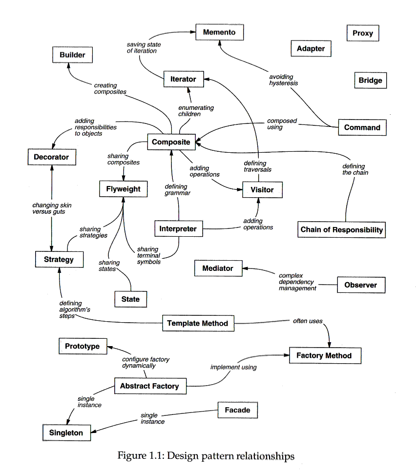

*Source: [Libro patrones de diseño de GoF](https://www.amazon.es/Patrones-dise%C3%B1o-Erich-Gamma/dp/8478290591)*


### Patrones de arquitectura: 3 Capas

**CSS (Diseño)**
- en archivos.css

**HTML (Contenido)**
- Nada de css o js en línea
- Manejo de eventos en archivos.js
- Contenido del JS no accesible desde el HTML

**JS (Funcionalidad y plantillas)**
- en archivos.js


### Patrones creacionales: [Factory Method](https://es.wikipedia.org/wiki/Factory_Method_(patr%C3%B3n_de_dise%C3%B1o)) (Método de fabricación)
:seedling: Crea una instancia de varias clases derivadas

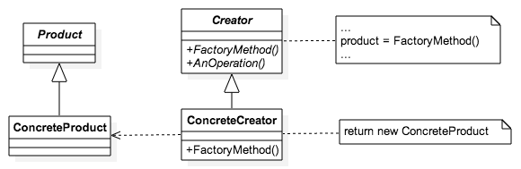

> Las clases principales en este patrón son el creador y el producto. El creador necesita crear instancias de productos, pero el tipo concreto de producto no debe ser forzado en las subclases del creador, porque las posibles subclases del creador deben poder especificar subclases del producto para utilizar.

> La solución para esto es hacer un método abstracto (el método de la fábrica) que se define en el creador. Este método abstracto se define para que devuelva un producto. Las subclases del creador pueden sobrescribir este método para devolver subclases apropiadas del producto... *[Wikipedia](https://www.wikiwand.com/es/Factory_Method_(patr%C3%B3n_de_dise%C3%B1o))*

**Claves:**
- Bastante extendido en JavaScript
- No usaremos `new`
- Un objeto Factory nos devuelve el nuevo objeto
- Reduce muchisimo la complejidad, al no tener que lidiar con constructores

**Implementación**
```javascript
const opcionesCoche = {
    marca: "Land Rover",
    modelo: "Santana Aníbal",
    antiguedad: 35,
    color: "Marrón tierra",
    tipo: "4x4"
};

const opcionesFurgon = {
    taraMinima: 1200,  
    cargaUtil:  768,
    volumenCarga: 4.5,
    tipo: "furgon"
};

const coche = function (opciones) {
    this.marca = opciones.marca;
    this.modelo = opciones.modelo;
    this.antiguedad = opciones.antiguedad;
    this.color = opciones.color;
    this.tipo = opciones.tipo;

    this.detalles = function (){
        console.log(`Tu vehículo es un ${this.marca} ${this.modelo} con ${this.antiguedad} años, clase ${this.tipo} y color ${this.color}`);
    };
};

const furgon = function (opciones) {
    this.taraMinima = opciones.taraMinima;
    this.cargaUtil = opciones.cargaUtil;
    this.volumenCarga = opciones.volumenCarga;

    this.detallesTecnicos = function(){
        console.warn(`Tu vehículo tiene una Tara mínima de ${this.taraMinima}. Carga útil de ${this.cargaUtil} y un volumen de carga de ${this.volumenCarga}m3`);
    };
};

// Patrón Factory Method
class factoriaVehiculos {
    createVehicle(options) {
        if (options.tipo === "turismo"  || options.tipo === "4x4"  ) {
            this.claseVehiculo = coche;
        } else {
            this.claseVehiculo = furgon;
        }
        return new this.claseVehiculo(options);
    }
}

factoriaVehiculos.prototype.claseVehiculo = coche;

// Aplicando el Patrón
const factoriaCoches = new factoriaVehiculos();

const miFurgon = factoriaCoches.createVehicle(opcionesFurgon);
const mi4x4 = factoriaCoches.createVehicle(opcionesCoche);
const miCoche = factoriaCoches.createVehicle({
    marca: "Seat",
    modelo: "Ibiza",
    antiguedad: 20,
    color: "Azul Oscuro",
    tipo: "turismo"
});

// Comprobaciones
function chequearInstanciacion(){
    console.log(`¿Es "miCoche" una instancia de "coche" ? ${miCoche instanceof coche}`);
    miCoche.detalles();
    console.log(`¿Es "mi4x4" una instancia de "coche" ? ${mi4x4 instanceof coche}`);
    mi4x4.detalles();
    console.log(`¿Es "miFurgon" una instancia de "furgon" ? ${miFurgon instanceof furgon}`);
    miFurgon.detallesTecnicos();
}

chequearInstanciacion();
```

**Recursos**
- [Wikipedia | Factory Method](https://es.wikipedia.org/wiki/Factory_Method_(patr%C3%B3n_de_dise%C3%B1o))
- [es6-design-patterns | Factory Method](http://loredanacirstea.github.io/es6-design-patterns/#factory-method)
- [dofactory | Factory Method](https://www.dofactory.com/javascript/factory-method-design-pattern)
- [fbeline/Design-Patterns-JS | Factory Method](https://github.com/fbeline/Design-Patterns-JS/tree/master/src/creational/factory)
- [Ebook | Learning JavaScript Design Patterns| Factory Method](https://addyosmani.com/resources/essentialjsdesignpatterns/book/#factorypatternjavascript)


### Patrones creacionales: [Namespace](https://es.wikipedia.org/wiki/Espacio_de_nombres)
:seedling: Ayudan a reducir el número de variables globales requeridas y evitar el nombramiento de colisiones o el prefijo excesivo del nombre

> Un espacio de nombres es un contenedor abstracto en el que un grupo de uno o más identificadores únicos pueden existir. Un identificador definido en un espacio de nombres está asociado con ese espacio de nombres. El mismo identificador puede independientemente ser definido en múltiples espacios de nombres, eso es, el sentido asociado con un identificador definido en un espacio de nombres es independiente del mismo identificador declarado en otro espacio de nombres. Los lenguajes que manejan espacio de nombres especifican las reglas que determinan a qué espacio de nombres pertenece una instancia de un identificador. [Wikipedia](https://es.wikipedia.org/wiki/Espacio_de_nombres)

**Claves**
- Muy extendido en JavaScript
- Reducir el número de objetos globales
- Todo forma parte de un único objeto
- Se puede trabajar en diversos archivos javascript

**Implementación: Namespace (función anónima):**
```javascript
var myApp = (function () {
    // privado
    var metodoPrivado1 = function () {
        console.info("Método Privado 1");
    };
    var metodoPrivado2 = function () {
        console.info("Método Privado 2");           
    };
    var propiedadPrivada1 = 'dato1';
    return {
        // público
        metodoPublico1: metodoPrivado1,
        propiedadesPublicas:{
            propiedad1: propiedadPrivada1,
            otro: "otro"
        },
        mas:{
            MetodoPublico2: metodoPrivado2
        }
        //...
    }
})();
```

**Implementación: Namespace (Extensión):**
```javascript
var myApp = myApp || {};

(function( namespace ){
    namespace.propiedad1 = "Propiedad 1";
    namespace.metodo1 = function(){
        return "metodo1";
    };
})(myApp);
console.log(myApp);
```

**Implementación: Usando Namespace:**
```javascript
// global
var myApp = myApp || {};

// sub-objeto
myApp.ejemploDatos = {}

myApp.ejemploDatos = {
    metodo: function () {
        console.log("esto es un metodo");           
    },
    propiedad1: 1,
    propiedad2: "dos"
}
```

**Implementación: Simplificar la creación de elementos:**
```javascript
var myApp = myApp || {};

myApp.crearElemento = function(nombre){
    var partes = nombre.split('.');
    var nameSpace = myApp;
    for (var i in partes) {
        if (!nameSpace[partes[i]]) {
            nameSpace[partes[i]] = {};
        }
        nameSpace = nameSpace[partes[i]];
    }
}

myApp.crearElemento('uno.dos.tres.cuatro.cinco.y.mas.niveles');
myApp.uno.dos.tres.cuatro.cinco.y.mas.niveles = "Funciona!"
```

**Recursos**
- [Wikipedia | Namespace](https://es.wikipedia.org/wiki/Espacio_de_nombres)
- [How do I declare a namespace in JavaScript?](https://stackoverflow.com/questions/881515/how-do-i-declare-a-namespace-in-javascript)
- [Essential JavaScript Namespacing Patterns](https://addyosmani.com/blog/essential-js-namespacing/)
- [Namespacing in JavaScript](https://javascriptweblog.wordpress.com/2010/12/07/namespacing-in-javascript/)
- [jQuery Namespace Pattern](https://es.slideshare.net/dfleury/jquery-namespace-pattern)


### Patrones creacionales: [Prototype](https://es.wikipedia.org/wiki/Prototype_(patr%C3%B3n_de_dise%C3%B1o)) (Prototipo)
:seedling: Una instancia completamente inicializada para ser copiada o clonada

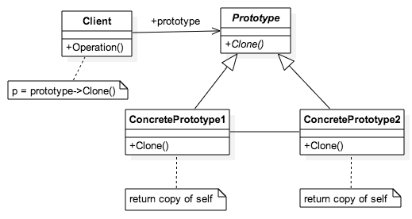

> Este patrón resulta útil en escenarios donde es preciso abstraer la lógica que decide qué tipos de objetos utilizará una aplicación, de la lógica que luego usarán esos objetos en su ejecución. Los motivos de esta separación pueden ser variados, por ejemplo, puede ser que la aplicación deba basarse en alguna configuración o parámetro en tiempo de ejecución para decidir el tipo de objetos que se debe crear. En ese caso, la aplicación necesitará crear nuevos objetos a partir de modelos. Estos modelos, o prototipos, son clonados y el nuevo objeto será una copia exacta de los mismos, con el mismo estado. Como decimos, esto resulta interesante para crear, en tiempo de ejecución, copias de objetos concretos inicialmente fijados, o también cuando sólo existe un número pequeño de combinaciones diferentes de estado para las instancias de una clase.

> Dicho de otro modo, este patrón propone la creación de distintas variantes de objetos que nuestra aplicación necesite, en el momento y contexto adecuado. Toda la lógica necesaria para la decisión sobre el tipo de objetos que usará la aplicación en su ejecución se hace independiente, de manera que el código que utiliza estos objetos solicitará una copia del objeto que necesite. En este contexto, una copia significa otra instancia del objeto. El único requisito que debe cumplir este objeto es suministrar la funcionalidad de clonarse. *[Wikipedia](https://www.wikiwand.com/es/Prototype_(patr%C3%B3n_de_dise%C3%B1o))*

**Claves:**
- Muy popular en JavaScript
- En JavaScript podemos hacer uso de `Object.create()`, que internamente ya implementa este patrón.

**Clonación simple con `Object.create()`**
```javascript
const coche = {
  marca: "Seat",
  modelo: "Panda",
  antiguedad: 20,
  color: "azul",
  tipo: "turismo"
};

const clonCoche = Object.create(coche);
console.log(`${clonCoche.marca} ${clonCoche.modelo}`);  
```

**Clonación compleja con `Object.create()`**
```javascript
const coche = {
  marca: "Land Rover",
  modelo: "Santana Aníbal",
  antiguedad: 35,
  color: "Marrón tierra",
  tipo: "4x4",
  detalles: dameDetalles
};

const furgon = {
  taraMinima: 1200,
  cargaUtil: 768,
  volumenCarga: 4.5,
  detalles: detallesTecnicos
};

const conductor = {
  nombre: "Yo",
  apellido: "Mismo",
  experiencia: 10000,
  limite: 120,
  detalles() {
    console.log(`El conductor es ${this.nombre} ${this.apellido}. Con ${this.experiencia} horas de experiencia y una restricción a ${this.limite}Km/h.`);
  }
};

function dameDetalles(){
  console.log(`Tu coche es un ${this.marca} ${this.modelo} con ${this.antiguedad} años, clase ${this.tipo} y color ${this.color}`);
};

function detallesTecnicos(){
  console.warn(`Tu coche tiene una Tara mínima de ${this.taraMinima}. Carga útil de ${this.cargaUtil} y un volumen de carga de ${this.volumenCarga}m3`);
};

// Patrón de Prototype
const miPickup = Object.create(coche, {
    'conductor': { value: conductor },
    'carga': { value: furgon}
  });


miPickup.detalles();
miPickup.carga.detalles();
miPickup.conductor.detalles();
console.log(`Es "coche" prototipo de "miPickup" ? ${coche.isPrototypeOf(miPickup)}`);
console.log(`Es "conductor" prototipo de "miPickup" ? ${conductor.isPrototypeOf(miPickup)}`);
console.log(`Es "furgon" prototipo de "miPickup" ? ${furgon.isPrototypeOf(miPickup)}`);
```

**Sin `Object.create()`**
```javascript
class constructorCoches {
  constructor(modelo, color) {
    this.marca = "Seat";
    this.modelo = modelo || "Ibiza";
    this.antiguedad = 20;
    this.color = color || "rojo";
    this.detalles = function (){
      console.log(`Tu coche es un ${this.marca} ${this.modelo} con ${this.antiguedad} años y color ${this.color}`);
    }
  }

  clone() {
      return new constructorCoches(this.modelo, this.marca);
  }
}


// Comprobaciones
const cocheRojo = new constructorCoches();
const otroCoche = constructorCoches.prototype.clone( "Azul" );
console.log(`¿Es "cocheRojo" una instancia de "constructorCoches"? ${cocheRojo instanceof constructorCoches}`); //true
console.log(`¿Es "otroCoche" una instancia de "constructorCoches"? ${otroCoche instanceof constructorCoches}`); //true
```

**Recursos**
- [Wikipedia | Prototype](https://es.wikipedia.org/wiki/Prototipo_(patr%C3%B3n_de_dise%C3%B1o))
- [es6-design-patterns | Prototype](http://loredanacirstea.github.io/es6-design-patterns/#prototype)
- [dofactory | Prototype](https://www.dofactory.com/javascript/prototype-design-pattern)
- [fbeline/Design-Patterns-JS | Prototype](https://github.com/fbeline/Design-Patterns-JS/tree/master/src/creational/prototype)
- [Ebook | Learning JavaScript Design Patterns| Prototype](https://addyosmani.com/resources/essentialjsdesignpatterns/book/#prototypepatternjavascript)


### Patrones creacionales: [Singleton](https://es.wikipedia.org/wiki/Patr%C3%B3n_de_dise%C3%B1o_Singleton) (Instancia única)
:seedling: Una clase de la cual solo una instancia puede existir.

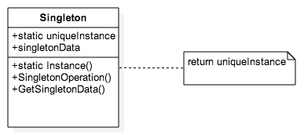

> Es un patrón de diseño diseñado para restringir la creación de objetos pertenecientes a una clase o el valor de un tipo a un único objeto.

> Su intención consiste en garantizar que una clase sólo tenga una instancia y proporcionar un punto de acceso global a ella.

> El patrón singleton se implementa creando en nuestra clase un método que crea una instancia del objeto sólo si todavía no existe alguna. Para asegurar que la clase no puede ser instanciada nuevamente se regula el alcance del constructor (con modificadores de acceso como protegido o privado). *[Wikipedia](https://www.wikiwand.com/es/Singleton)*


**Claves:**
- Muy popular en JavaScript
- limitamos la instanciación de una clase a un objeto único

**Implementación**
```javascript
const miSingleton = ((() => {
    let instancia;

    function crearInstancia() {
        const objeto = new Object();
        return objeto;
    }

    return {
        instanciacion() {
            if (!instancia) {
                instancia = crearInstancia();
            }
            return instancia;
        }
    };
}))();

/*
    let instancia1 = {};
    let instancia2 = {};
    console.log(`¿Es lo mismo? ${instancia1 === instancia2}`);  
    instancia1 = miSingleton.instanciacion();
    instancia2 = miSingleton.instanciacion();
    console.log(`¿Es la misma instaciación? ${instancia1 === instancia2}`);  
*/
```

**Recursos**
- [Wikipedia | Singleton](https://es.wikipedia.org/wiki/Patr%C3%B3n_de_dise%C3%B1o_Singleton)
- [es6-design-patterns | Singleton](http://loredanacirstea.github.io/es6-design-patterns/#singleton)
- [dofactory | Singleton](https://www.dofactory.com/javascript/singleton-design-pattern)
- [fbeline/Design-Patterns-JS | Singleton](https://github.com/fbeline/Design-Patterns-JS/tree/master/src/creational/singleton)
- [Ebook | Learning JavaScript Design Patterns| Singleton](https://addyosmani.com/resources/essentialjsdesignpatterns/book/#singletonpatternjavascript)


### Patrones estructurales: [Decorator](https://es.wikipedia.org/wiki/Decorator_(patr%C3%B3n_de_dise%C3%B1o)) (Decorador)
:seedling: Agrega responsabilidades a los objetos dinámicamente.

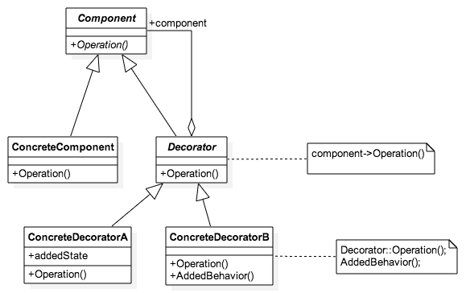

> El patrón Decorator responde a la necesidad de añadir dinámicamente funcionalidad a un Objeto. Esto nos permite no tener que crear sucesivas clases que hereden de la primera incorporando la nueva funcionalidad, sino otras que la implementan y se asocian a la primera. [Wikipedia](https://es.wikipedia.org/wiki/Decorator_(patr%C3%B3n_de_dise%C3%B1o))

**Claves:**
- Bastante extendido en JavaScript
- Extender objetos.
- Sobreescribir dinamicamente los métodos.

**Implementación: Añadiendo una funcionalidad**
```javascript
function constructorCoches( color ){
  this.marca = "Seat";
  this.modelo = "Ibiza";
  this.antiguedad = 20;
  this.color = color || "rojo";
  this.detalles = function (){
    console.log(`Tu coche es un ${this.marca} ${this.modelo} con ${this.antiguedad} años y color ${this.color}`);
  }
}


const cocheRojo = new constructorCoches();
cocheRojo.detalles();


const otroCoche = new constructorCoches( "Azul" );
otroCoche.detalles();


// Decorator
otroCoche.definirModelo = function( nuevoModelo ){
this.modelo = nuevoModelo;
};

otroCoche.definirColor = function( nuevoColor ){
this.color = nuevoColor;
};

otroCoche.definirModelo( "Panda" );
otroCoche.definirColor( "Azul Oscuro" );
otroCoche.detalles();

const nuevoCoche = new constructorCoches( "Verde" );
nuevoCoche.detalles();
```

**Implementación: Añadiendo multiples funcionalidades:**
```javascript
// Constructor
function constructorCoches( color ){
  this.marca = "Seat";
  this.modelo = "Ibiza";
  this.antiguedad = 20;
  this.color = color || "rojo";
  this.extras = 0;
  this.detalles = function (){
    console.log(`Tu coche es un ${this.marca} ${this.modelo} con ${this.antiguedad} años y color ${this.color}`);
  }
}

// Decorator 1
function gps( coche ) {
  coche.gps = true;
  coche.extras++;
}

// Decorator 2
function aireAcondiccionado( coche ){
  coche["aire acondiccionado"] = true;
  coche.extras++;
}

// Decorator 3
function elevaLunas( coche ){
  coche.elevaLunas = true;
  coche.extras++;
}

// Decorator 4
function farosLed( coche ){
  coche["faros led"] = true;
  coche.extras++;
}

// Decorator 5
function detallesTecnicos( coche ){
  coche.detallesTecnicos = () => {
    if(coche.extras > 0){
      console.log(`El coche tiene ${coche.extras} extras: \n`);
      (coche.gps) ? console.log("- GPS"):console.log("- SIN GPS");
      (coche["aire acondiccionado"]) ? console.log("- Aire acondiccionado"):console.log("- SIN Aire acondiccionado");
      (coche["faros led"]) ? console.log("- Faros Led"):console.log("- SIN Faros Led");
      (coche.elevaLunas) ? console.log("- Elevalunas"):console.log("- SIN Elevalunas");
    } else {
      console.log("Parece.. que no se han añadido extras aun.");
    }
  };
}

const cocheRojo = new constructorCoches();
cocheRojo.detalles();


// Aplicando cambios
detallesTecnicos(cocheRojo);
cocheRojo.detallesTecnicos();

// Aplicando más cambios
gps(cocheRojo);
aireAcondiccionado(cocheRojo);
elevaLunas(cocheRojo);
farosLed(cocheRojo);
cocheRojo.detallesTecnicos();


const nuevoCoche = new constructorCoches( "Verde" );
nuevoCoche.detalles();
```


**Recursos**
- [Wikipedia | Decorator](https://es.wikipedia.org/wiki/Decorator_(patr%C3%B3n_de_dise%C3%B1o))
- [es6-design-patterns | Decorator](http://loredanacirstea.github.io/es6-design-patterns/#decorator)
- [dofactory | Decorator](https://www.dofactory.com/javascript/decorator-design-pattern)
- [fbeline/Design-Patterns-JS | Decorator](https://github.com/fbeline/Design-Patterns-JS/tree/master/src/structural/decorator)
- [Ebook | Learning JavaScript Design Patterns | Decorator](https://addyosmani.com/resources/essentialjsdesignpatterns/book/#decoratorpatternjavascript)


### Patrones estructurales: [Façade](https://es.wikipedia.org/wiki/Facade_(patr%C3%B3n_de_dise%C3%B1o)) (Fachada)
:seedling: Una sola clase que representa un subsistema completo.

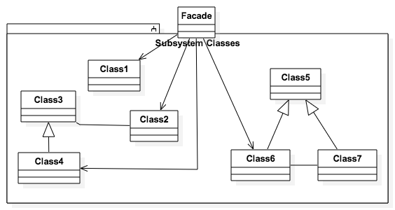

> Fachada (Facade) es un tipo de patrón de diseño estructural. Viene motivado por la necesidad de estructurar un entorno de programación y reducir su complejidad con la división en subsistemas, minimizando las comunicaciones y dependencias entre estos. [Wikipedia](https://es.wikipedia.org/wiki/Facade_(patr%C3%B3n_de_dise%C3%B1o))


**Claves:**
- Muy popular en JavaScript
- Creación de interfaces de alto nivel.
- Muy usado en librerías
- Oculta el código más complejo
- Desacoplarnos de código externo

**Implementación**
```javascript
const moduloRobotAutonomo = ((() => {
    const _privado = {
        velocidad: 0,  // Km/h
        velocidadMax: 20, // Km/h
        velocidadMin: 2, // Km/h
        // ... más propiedades relativos a sensores, navegación, etc...
        velocidadActual() {
            console.log( `Velocidad Actual:${_privado.velocidad}`);
        },
        ajustarVelocidad(valor) {
            this.velocidad = valor;
        },
        acelerar() {
          if (_privado.velocidad >= _privado.velocidadMax ) {
            console.warn("Máxima velocidad Alcanzada!");
            _privado.velocidadActual();
          } else if (_privado.velocidad < _privado.velocidadMax){
              _privado.ajustarVelocidad (_privado.velocidad+1)
              _privado.velocidadActual();
          };
        },
        desacelerar() {
          if (_privado.velocidad <= _privado.velocidadMin ) {
            console.warn("Mínima velocidad Alcanzada!");
            _privado.velocidadActual();
          } else if (_privado.velocidad > _privado.velocidadMin){
              _privado.ajustarVelocidad (_privado.velocidad-1)
              _privado.velocidadActual();
          };
        },
        parar() {
          _privado.velocidad = 0;
          console.log("Robot parado");
        },
        validarVelocidad(valor) {
          if( valor <= _privado.velocidadMax && valor >= _privado.velocidadMin ){
            return true
          }else {
            return false
          }  
        }
		// más métodos relativos a sensores, navegación, etc...
    };

    return {
        facadeAPI: {
          velocidadCrucero(valor) {
            if(_privado.validarVelocidad(valor)){
              _privado.ajustarVelocidad(valor);
              _privado.velocidadActual();
            }else{
              console.warn(`La velocidad deseada ${valor}Km/h no esta entre ${_privado.velocidadMin}Km/h y los ${_privado.velocidadMax}Km/h. permitidos` )
            }
          },
          masLento: _privado.desacelerar,
          masRapido: _privado.acelerar,
          stop:_privado.parar
        }
    };
})());

//Jugando con el robot
const robot = moduloRobotAutonomo.facadeAPI;
robot.velocidadCrucero(20); // velocidad = 20
robot.masRapido(); // Max alcanzado
robot.stop(); // Parado
robot.masLento(); // Min alcanzado
```


**Recursos**
- [Wikipedia | Facade](https://es.wikipedia.org/wiki/Facade_(patr%C3%B3n_de_dise%C3%B1o))
- [es6-design-patterns | Facade](http://loredanacirstea.github.io/es6-design-patterns/#fa%C3%A7ade)
- [dofactory | Facade](https://www.dofactory.com/javascript/facade-design-pattern)
- [fbeline/Design-Patterns-JS | Facade](https://github.com/fbeline/Design-Patterns-JS/tree/master/src/structural/facade)
- [Ebook | Learning JavaScript Design Patterns | Facade](https://addyosmani.com/resources/essentialjsdesignpatterns/book/#facadepatternjavascript)


### Patrones estructurales: [Module](https://es.wikipedia.org/wiki/Module_(patr%C3%B3n_de_dise%C3%B1o)) (Módulo)
:seedling: Agrupa varios elementos relacionados, como clases, singletons, y métodos, utilizados globalmente, en una entidad única.

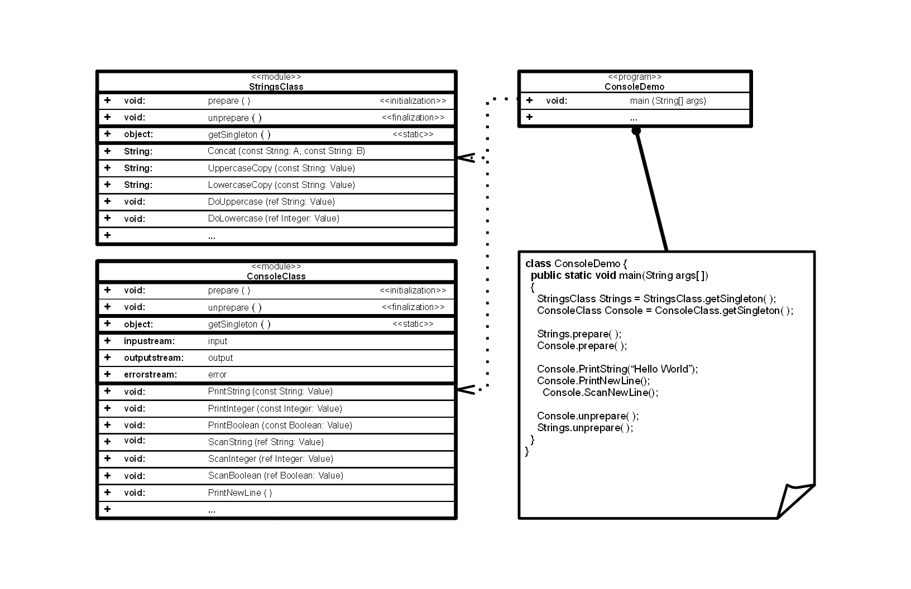

> La meta del patrón para diseño de software, consiste en proporcionar las características y estructura sintáctica, definida por el paradigma de programación modular, a lenguajes de programación, que no son compatibles totalmente, o que solo lo son a medias.[Wikipedia](https://es.wikipedia.org/wiki/Module_(patr%C3%B3n_de_dise%C3%B1o))

**Claves:**
- Muy popular en JavaScript
- Usamos funciones anonimas autoejecutadas
- Encapsulamos la lógica
- Exponemos solo parte

**Frecuencia de uso:** Muy Alta

**Implementación**
```javascript
const mates = mates || {};

mates.operaciones = ((() => {
  let total = 0;

  return {
    sumar(a, b) {
      const suma = a + b;
      total += suma;
      return suma;
    },
    restar(a, b) {
      const resta = a - b;
      total -= resta;
      return resta;
    },
    total() {
      return total;
    }
  };
}))();

mates.operaciones.total();  
mates.operaciones.sumar(12, 21);
mates.operaciones.total();
mates.operaciones.restar(40, 1);
mates.operaciones.total();
```

**Recursos**
- [Wikipedia | Module](https://es.wikipedia.org/wiki/Module_(patr%C3%B3n_de_dise%C3%B1o))
- [Ebook | Learning JavaScript Design Patterns | Module](https://addyosmani.com/resources/essentialjsdesignpatterns/book/#modulepatternjavascript)
- [Etnassoft | El Patrón Módulo Javascript en Profundidad](http://www.etnassoft.com/2011/04/11/el-patron-de-modulo-en-javascript-en-profundidad/)


### Patrones estructurales: Revealing Module
:seedling: Es una variante del patrón de módulo que nos asegura un funcionamiento más simple.

> El patrón Revealing Module surgió cuando Heilmann se sintió frustrado por el hecho de que tenía que repetir el nombre del objeto principal cuando queríamos llamar a un método público desde otro o acceder a variables públicas. Tampoco le gustó el requisito del patrón del Módulo de tener que cambiar a la notación literal del objeto para las cosas que deseaba hacer públicas. [Addy Osmani]()

**Claves:**
- Muy popular en JavaScript
- Incluir métodos privados en el retorno

**Frecuencia de uso:** Muy Alta

**Implementación**

```javascript
const constructorCocheEmpresa = (function (marca, modelo, antiguedad, color) {
    this.marca = marca;
    this.modelo = modelo;
    this.antiguedad = antiguedad;
    this.color = color;

    const _ITVPasada = true;
    const _ITVfrecuencia = "Cada año";
    const _seguroEnRegla = true;
    const _companySeguros = "SegurExpress";
    const _tipoSeguro = "a terceros";

    function _dameDetalles(){
      console.log(`Tu coche es un ${marca} ${modelo} con ${antiguedad} años y color ${color}`);
    }

    function _datosPrivados() {
        if (_ITVPasada && _seguroEnRegla)
            console.log(`INFO: Todo en Regla, tienes que pasar la ITV ${_ITVfrecuencia}. Tienes un seguro ${_tipoSeguro} con ${_companySeguros}`);
        else{
            console.error("ALERTA! El coche no puede usarse. El seguro o la ITV no esta en regla.");
        }
    }

    return {
     datosPrivados:   _datosPrivados,
     dameDetalles:   _dameDetalles
    }
})();

/*
const miCoche = new constructorCocheEmpresa ("Audi", "S8", 2, "negro", "Berlina");
miCoche.datosPrivados();
miCoche.dameDetalles();
*/
```

**Recursos**
- [Ebook | Learning JavaScript Design Patterns | Revealing Module](https://addyosmani.com/resources/essentialjsdesignpatterns/book/#revealingmodulepatternjavascript)
- [Etnassoft | El Módulo Revelado (Revealing Module) Javascript](http://www.etnassoft.com/2011/04/12/revealing-module-javascript/)


### Patrones de comportamiento: [Chain of Responsibility](https://es.wikipedia.org/wiki/Chain_of_Responsibility_(patr%C3%B3n_de_dise%C3%B1o)) (Cadena de responsabilidad)
:seedling: Una forma de pasar una solicitud entre una cadena de objetos.


> El patrón de diseño Chain of Responsibility es un patrón de comportamiento que evita acoplar el emisor de una petición a su receptor dando a más de un objeto la posibilidad de responder a una petición. Para ello, se encadenan los receptores y pasa la petición a través de la cadena hasta que es procesada por algún objeto. Este patrón es utilizado a menudo en el contexto de las interfaces gráficas de usuario donde un objeto puede estar compuesto de varios objetos (que generalmente heredan de una super clase "vista"). [Wikipedia](https://es.wikipedia.org/wiki/Chain_of_Responsibility_(patr%C3%B3n_de_dise%C3%B1o))

**Claves:**
- Muy extendido en JavaScript

**Implementación**
```javascript
class Peticion {
    constructor(cantidad) {
        this.cantidad = cantidad;
        logger.registra(`Pedido: ${cantidad}€\n`);
    }

    get(valorMoneda) {
        const cuenta = Math.floor(this.cantidad / valorMoneda);
        this.cantidad -= cuenta * valorMoneda;

		if(cuenta !== 0){
	        if(valorMoneda < 5 ) {
				logger.registra(`Facilita un total de ${cuenta} monedas de ${valorMoneda}€`);
	        } else {
	        	logger.registra(`Facilita un total de ${cuenta} billetes de ${valorMoneda}€`);
	        }
		}

        return this;
    }
}

var logger = ((() => {
    let registro = "";
    return {
        registra(mensaje) { registro += `${mensaje}\n`; },
        resumen() {
        	console.log(registro);
        	registro = "";
        }
    }
}))();

function calcularBilletes(cantidad) {
    const peticion = new Peticion(cantidad);

    peticion.get(500).get(200).get(100).get(50).get(20).get(10).get(5) // Billetes
    		.get(2).get(1).get(0.50).get(0.20).get(0.10).get(0.05).get(0.02).get(0.01); // Monedas

    logger.resumen();
}

calcularBilletes(443.79);
```

**Recursos**
- [Wikipedia | Chain of Responsibility](https://es.wikipedia.org/wiki/Chain_of_Responsibility_(patr%C3%B3n_de_dise%C3%B1o))
- [es6-design-patterns | Chain of Responsibility](http://loredanacirstea.github.io/es6-design-patterns/#chain-of-responsibility)
- [dofactory | Chain of Responsibility](https://www.dofactory.com/javascript/chain-of-responsibility-design-pattern)
- [fbeline/Design-Patterns-JS | Chain of Responsibility](https://github.com/fbeline/Design-Patterns-JS/tree/master/src/behavioral/chain-of-resp)


### Patrones de comportamiento: [Iterator](https://es.wikipedia.org/wiki/Iterator_(patr%C3%B3n_de_dise%C3%B1o)) (Iterador)
:seedling: Acceda de forma secuencial a los elementos de una colección.

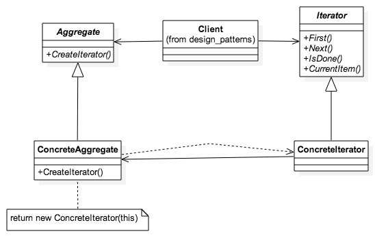

> En diseño de software, el patrón de diseño Iterador, define una interfaz que declara los métodos necesarios para acceder secuencialmente a un grupo de objetos de una colección. Algunos de los métodos que podemos definir en la interfaz Iterador son:

> `Primero()`, `Siguiente(`), `HayMas()` y `ElementoActual()`.

> Este patrón de diseño permite recorrer una estructura de datos sin que sea necesario conocer la estructura interna de la misma. [Wikipedia](https://es.wikipedia.org/wiki/Iterator_(patr%C3%B3n_de_dise%C3%B1o))

**Claves:**
- Muy popular en JavaScript
- Acceso secuencial a los elementos de un array o propiedades de un objeto sin exponerlos.

**Implementación: Array:**
```javascript
// Patrón Iterador
const iterador = ((() => {
    let indice = 0;
    const datos = [1, 2, 3, 4, 5, 6, 7, 8, 9, 10];
    const totalDatos = datos.length;

    return {
        siguiente() {
            let elemento;
            if (!this.tieneSiguiente()) {
                return null;
            }
            elemento = datos[indice];
            indice ++;
            return elemento;
        },
        tieneSiguiente() {
            return indice < totalDatos;
        },
        rebobinar() {
            indice = 0;
            return datos[indice];
        },
        actual() {
            return datos[indice];
        }
    };
})());

/* Probando
while(iterador.tieneSiguiente()) {  
    console.log(iterador.siguiente());
}

iterador.rebobinar();  
console.log(iterador.actual());  
*/
```

**Implementación: Objeto:**
```javascript
const iterador = ((() => {
    let indice = 0;
    const datos = { primerDato: 1, segundoDato: 'dos', tercerDato: 'tercero' };
    const llaves = Object.keys(datos);
    const totalDatos = llaves.length;

    return {
        siguiente() {
            let elemento;
            if (!this.tieneSiguiente()) {
                return null;
            }
            elemento = datos[llaves[indice]];
            indice ++;
            return elemento;
        },
        tieneSiguiente() {
            return indice < totalDatos;
        },
        rebobinar() {
            indice = 0;
            return datos[llaves[indice]];
        },
        actual() {
            return datos[llaves[indice]];
        }
    };
})());

/* Probando
while(iterador.tieneSiguiente()) {  
    console.log(iterador.siguiente());
}

iterador.rebobinar();  
console.log(iterador.actual());  
*/
```

**Recursos**
- [Wikipedia | Iterator](https://es.wikipedia.org/wiki/Iterator_(patr%C3%B3n_de_dise%C3%B1o))
- [es6-design-patterns | Iterator](http://loredanacirstea.github.io/es6-design-patterns/#iterator)
- [dofactory | Iterator](https://www.dofactory.com/javascript/iterator-design-pattern)
- [fbeline/Design-Patterns-JS | Iterator](https://github.com/fbeline/Design-Patterns-JS/tree/master/src/behavioral/iterator)
- [Ebook | Learning JavaScript Design Patterns | Iterator](https://addyosmani.com/resources/essentialjsdesignpatterns/book/#iteratorpatternjquery)


IMPORTANTE


### Patrones de comportamiento: [Mediator](https://es.wikipedia.org/wiki/Mediator_(patr%C3%B3n_de_dise%C3%B1o)) (Mediador)
:seedling: Define un objeto que coordine la comunicación entre objetos de distintas clases, pero que funcionando como un conjunto.

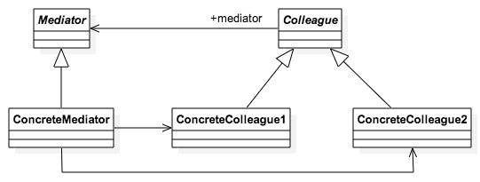

> El patrón mediador define un objeto que encapsula cómo un conjunto de objetos interactúan. Este patrón de diseño está considerado como un patrón de comportamiento debido al hecho de que puede alterar el comportamiento del programa en ejecución.

> Habitualmente un programa está compuesto de un número de clases (muchas veces elevado). La lógica y computación es distribuida entre esas clases. Sin embargo, cuantas más clases son desarrolladas en un programa, especialmente durante mantenimiento y/o refactorización, el problema de comunicación entre estas clases quizás llegue a ser más complejo. Esto hace que el programa sea más difícil de leer y mantener. Además, puede llegar a ser difícil cambiar el programa, ya que cualquier cambio podría afectar código en muchas otras clases.

> Con el patrón mediador, la comunicación entre objetos es encapsulada con un objeto mediador. Los objetos no se comunican de forma directa entre ellos, en lugar de ello se comunican mediante el mediador. Esto reduce las dependencias entre los objetos en comunicación, reduciendo entonces la Dependencia de código. [Wikipedia](https://es.wikipedia.org/wiki/Mediator_(patr%C3%B3n_de_dise%C3%B1o))


**Claves:**
- No excesivamente utilizado en JavaScript
- Una interfaz única - Objeto central.
- Todos los módulos comunican con este módulo central.

**Implementación**
```javascript
// Patron de Mediador
const moduloCentral = ((() => {
    const _temas = {};
    const _suscribir = function( tema, fn ){
        if ( !_temas[tema] ){
            _temas[tema] = [];
        }
        _temas[tema].push( { context: this, callback: fn } );
        return this;
    };
    const _publicar = function( tema ){
        let args;
        if ( !_temas[tema] ){
            return false;
        }
        args = Array.prototype.slice.call( arguments, 1 );
        for ( let i = 0, l = _temas[tema].length; i < l; i++ ) {
            const subscription = _temas[tema][i];
            subscription.callback.apply( subscription.context, args );
        }
        return this;
    };
    return {
        verTemas: _temas,
        publicar: _publicar,
        suscribir: _suscribir,
        instalarEn(obj) {
            obj.suscribir = _suscribir;
            obj.publicar = _publicar;
        }
    };
})());

// Creamos dos Objetos
const modulo1 = {};
const modulo2 = {};
console.clear();

// Instalamos ...
moduloCentral.instalarEn(modulo1);
moduloCentral.instalarEn(modulo2);

// Ajustamos las suscripciones
modulo1.suscribir("test", () => {
    console.info("\"modulo1\" suscrito a \"test\". Callback disparado! ")
});

modulo2.suscribir("test2", () => {
    console.info("\"modulo2\" suscrito a \"test2\". Callback disparado! ")
});

moduloCentral.suscribir("testCentral", () => {
    console.info("\"moduloCentral\" suscrito a \"testCentral\". Callback disparado! ")
});

// Suscripciones extra...
moduloCentral.suscribir("test", () => {
    console.info("\"moduloCentral\" suscrito a \"test\". Callback disparado! ")
});
moduloCentral.suscribir("test2", () => {
    console.info("\"moduloCentral\" suscrito a \"test2\". Callback disparado! ")
});
console.clear();

// Disparamos las publicaciones
modulo2.publicar("testCentral");
modulo2.publicar("test2");
modulo2.publicar("test");

modulo1.publicar("testCentral");
modulo1.publicar("test2");
modulo1.publicar("test");

moduloCentral.publicar("testCentral");
moduloCentral.publicar("test2");
moduloCentral.publicar("test");
```


**Recursos**
- [Wikipedia | Mediator](https://es.wikipedia.org/wiki/Mediator_(patr%C3%B3n_de_dise%C3%B1o))
- [es6-design-patterns | Mediator](http://loredanacirstea.github.io/es6-design-patterns/#mediator)
- [dofactory | Mediator](https://www.dofactory.com/javascript/mediator-design-pattern)
- [fbeline/Design-Patterns-JS | Mediator](https://github.com/fbeline/Design-Patterns-JS/tree/master/src/behavioral/mediator)
- [Ebook | Learning JavaScript Design Patterns | Mediator](https://addyosmani.com/resources/essentialjsdesignpatterns/book/#mediatorpatternjavascript)


### Patrones de comportamiento: [Observer](https://es.wikipedia.org/wiki/Observer_(patr%C3%B3n_de_dise%C3%B1o)) (Observador)
:seedling: Define una dependencia de uno-a-muchos entre objetos, de forma que cuando un objeto cambie de estado se notifique y actualicen automáticamente todos los objetos que dependen de él.

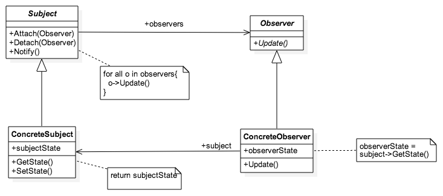

> Observador (en inglés: Observer) es un patrón de diseño de software que define una dependencia del tipo uno a muchos entre objetos, de manera que cuando uno de los objetos cambia su estado, notifica este cambio a todos los dependientes. Se trata de un patrón de comportamiento (existen de tres tipos: creación, estructurales y de comportamiento), por lo que está relacionado con algoritmos de funcionamiento y asignación de responsabilidades a clases y objetos. [Wikipedia](https://es.wikipedia.org/wiki/Observer_(patr%C3%B3n_de_dise%C3%B1o))

**Claves:**
- Muy popular en JavaScript


**Interacción**

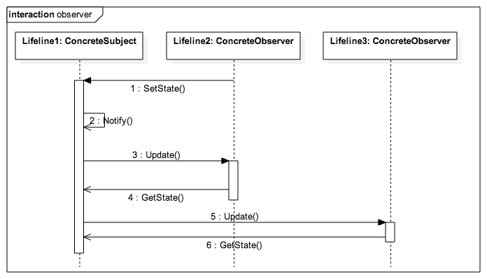


**Implementación**
```javascript
const objetoPrincipal = {
    observadores: [],
	suscripcion(f) {
        this.observadores.push(f);
    },
    eliminarSuscripcion(f) {
        this.observadores = this.observadores.filter(
            observador => {
                if (observador !== f) {
                    return observador;
                }
            }
        );
    },
    mensaje(o, objeto) {
        const ambito = objeto || window;
        this.observadores.forEach(observador => {
            observador.call(ambito, o);
        });
    }
};

const otraFuncion1 = item => {
    console.info(`${item} desde otraFuncion1`);
};

function otraFuncion2(item) {
    console.info(`${item} desde otraFuncion2`);  
};

// Pruebas
objetoPrincipal.mensaje('mensaje #1');
objetoPrincipal.suscripcion(otraFuncion1);
objetoPrincipal.suscripcion(otraFuncion2);
objetoPrincipal.mensaje('mensaje #2');
objetoPrincipal.eliminarSuscripcion(otraFuncion2);
objetoPrincipal.mensaje('mensaje #2');
objetoPrincipal.suscripcion(otraFuncion2);
objetoPrincipal.mensaje('mensaje #3');
```

**Recursos**
- [Wikipedia | Observer](https://es.wikipedia.org/wiki/Observer_(patr%C3%B3n_de_dise%C3%B1o))
- [es6-design-patterns | Observer](http://loredanacirstea.github.io/es6-design-patterns/#observer)
- [dofactory | Observer](https://www.dofactory.com/javascript/observer-design-pattern)
- [fbeline/Design-Patterns-JS | Observer](https://github.com/fbeline/Design-Patterns-JS/tree/master/src/behavioral/observer)
- [Ebook | Learning JavaScript Design Patterns | Observer](https://addyosmani.com/resources/essentialjsdesignpatterns/book/#observerpatternjavascript)

### Dialectos: Init-time branching

**Claves:**
- Muy popular en JavaScript
- Cuando algo no cambia durante la ejecucción
- Se carga una vez al principio y devuelve funciones segun la condicción

**Implementación**
```javascript
const myApp = {};
myApp.eventos = {
    agregar: null,
    quitar: null,
    manejador(evento) {

        console.log("-----------------------------")
        console.log(`Type: ${evento.type}`); // Tipo
        console.log(`Bubbles: ${evento.bubbles}`); // sube por el DOM
        console.log(`Cancelable: ${evento.cancelable}`);
        console.log("CurrentTarget: ", evento.currentTarget);
        console.log(`DefaultPrevented: ${evento.defaultPrevented}`);
        console.log(`EventPhase: ${evento.eventPhase}`);
        console.log("Target: ", evento.target);
        console.log(`TimeStamp: ${evento.timeStamp}`);
        console.log(`IsTrusted: ${evento.isTrusted}`); // true - Usuario o false - Script
        console.log("=============================")

    }
};

if (typeof window.addEventListener === 'function') {
    myApp.eventos.agregar = (el, type, fn) => {
        el.addEventListener(type, fn, false);
    };
    myApp.eventos.quitar = (el, type, fn) => {
        el.removeEventListener(type, fn, false);
    };
} else { // IE8
    myApp.eventos.agregar = (el, type, fn) => {
        el.attachEvent(`on${type}`, fn);
    };
    myApp.eventos.quitar = (el, type, fn) => {
        el.detachEvent(`on${type}`, fn);
    };
}

/*
    myApp.eventos.agregar(window, 'click', myApp.eventos.manejador);
    myApp.eventos.quitar(window, 'click', myApp.eventos.manejador);
*/
```


### Dialectos: Lazy Definition

> En la teoría de lenguajes de programación, La evaluación perezosa (del inglés lazy evaluation) o llamada por necesidad es una estrategia de evaluación que retrasa el cálculo de una expresión hasta que su valor sea necesario, y que también evita repetir la evaluación en caso de ser necesaria en posteriores ocasiones. Esta compartición del cálculo puede reducir el tiempo de ejecución de ciertas funciones de forma exponencial, comparado con otros tipos de evaluación. [Wikipedia](http://www.wikiwand.com/es/Evaluaci%C3%B3n_perezosa)

**Claves:**
- Muy popular en JavaScript
- Se crean las funciones cuando se ejecuta por primera vez
- Ahorra recursos en calculos complejos

**Implementación**
```javascript

const myApp = {};

myApp.eventos = {
    agregar(el, type, fn) {
        if (typeof window.addEventListener === 'function') {
            myApp.eventos.agregar = (el, type, fn) => {
                el.addEventListener(type, fn, false);
            };
        } else { // IE8
            myApp.eventos.agregar = (el, type, fn) => {
                el.attachEvent(`on${type}`, fn);
            };
        }

        myApp.eventos.agregar(el, type, fn);
    },
    quitar(el, type, fn) {
        if (typeof window.addEventListener === 'function') {
            myApp.eventos.quitar = (el, type, fn) => {
                el.removeEventListener(type, fn, false);
            };
        } else { // IE8
            myApp.eventos.quitar = (el, type, fn) => {
                el.detachEvent(`on${type}`, fn);
            };
        }
        myApp.eventos.quitar(el, type, fn);
    },
    manejador(evento) {

        console.log("-----------------------------")
        console.log(`Type: ${evento.type}`); // Tipo
        console.log(`Bubbles: ${evento.bubbles}`); // sube por el DOM
        console.log(`Cancelable: ${evento.cancelable}`);
        console.log("CurrentTarget: ", evento.currentTarget);
        console.log(`DefaultPrevented: ${evento.defaultPrevented}`);
        console.log(`EventPhase: ${evento.eventPhase}`);
        console.log("Target: ", evento.target);
        console.log(`TimeStamp: ${evento.timeStamp}`);
        console.log(`IsTrusted: ${evento.isTrusted}`); // true - Usuario o false - Script
        console.log("=============================")

    }
};

/*
    myApp.eventos.agregar(window, 'click', myApp.eventos.manejador);
    myApp.eventos.quitar(window, 'click', myApp.eventos.manejador);
*/

```

### Dialectos: Memoization

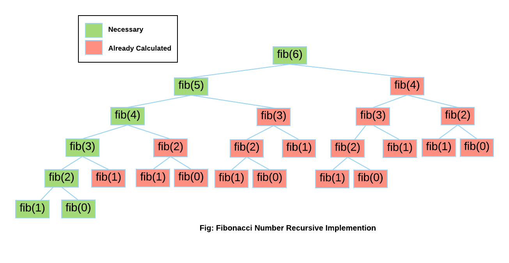

> In computing, memoization or memoisation is an optimization technique used primarily to speed up computer programs by storing the results of expensive function calls and returning the cached result when the same inputs occur again. Memoization has also been used in other contexts (and for purposes other than speed gains), such as in simple mutually recursive descent parsing. Although related to caching, memoization refers to a specific case of this optimization, distinguishing it from forms of caching such as buffering or page replacement. In the context of some logic programming languages, memoization is also known as tabling. [Wikipedia](https://en.wikipedia.org/wiki/Memoization)

**Claves:**
- Muy popular en JavaScript
- EL objetivo es tener una mequeña cache, que almacene los resultados de operaciones previas.
- La idea es ganar velocidad y capacidad, preguntando primero a la cache.
- En caso de no tener datos en cache, se procede con el calculo directamente.
- Esta tecnica es una gran compañera de la recursividad y la programación funcional.
- Aunque es más facil incluir un cache en la propia función, es muy reocmendado hacer un función extra para el cache.
- Para evitar errores de referencia y problemas de putneros, se parsean a JSON los datos almacenados

```javascript
//@see: https://davidtranscend.com/blog/generic-memoization-js/
function memoize(fn) {
    const cache = {};

    return function(...args) {
        const key = JSON.stringify(args);

        if (cache[key]) {
            return cache[key];
        }

        const result = fn(...args);

        cache[key] = result;

        return result;
    }
}

function fib(n) {
    if (n < 2) {
        return n;
    }

    return fib(n - 1) + fib(n - 2);
}

fib = memoize(fib);


```

**Librerias**
- [addyosmani/memoize.js](https://github.com/addyosmani/memoize.js)
- [caiogondim/fast-memoize.js](https://github.com/caiogondim/fast-memoize.js)

**Recursos**
- [Wikipedia | Memoization](https://en.wikipedia.org/wiki/Memoization)
- [Generic Memoization in JavaScript](https://davidtranscend.com/blog/generic-memoization-js/)
- [How to use Memoize to cache JavaScript function results and speed up your code](https://medium.freecodecamp.org/understanding-memoize-in-javascript-51d07d19430e)
- [Memoization in JavaScript](http://www.zsoltnagy.eu/memoization-in-javascript/)
- [Today I Learned: Memoization with Pure Functions in ES6](https://medium.com/front-end-hacking/today-i-learned-memoization-with-pure-functions-in-es6-33a4765518b5)
- [Stackoverflow | How to create a memoize function](https://stackoverflow.com/questions/30386943/how-to-create-a-memoize-function)
- [Acelerar las funciones recursivas con memoization](http://www.jstips.co/es_es/javascript/speed-up-recursive-functions-with-memoization/)
- [How I wrote the world's fastest JavaScript memoization library](https://community.risingstack.com/the-worlds-fastest-javascript-memoization-library/)
- [JavaScript Function Memoization](http://inlehmansterms.net/2015/03/01/javascript-memoization/)
- [Faster JavaScript Memoization For Improved Application Performance](https://addyosmani.com/blog/faster-javascript-memoization/)
- [Understanding JavaScript Memoization In 3 Minutes](https://codeburst.io/understanding-memoization-in-3-minutes-2e58daf33a19)
- [Implementing Memoization in JavaScript](https://www.sitepoint.com/implementing-memoization-in-javascript/)


### Dialectos: Mixins

> En los lenguajes de programación orientada a objetos, un mixin es una clase que ofrece cierta funcionalidad para ser heredada por una subclase, pero no está ideada para ser autónoma. Heredar de un mixin no es una forma de especialización sino más bien un medio de obtener funcionalidad. Una subclase puede incluso escoger heredar gran parte o el total de su funcionalidad heredando de uno o más mixins mediante herencia múltiple.

> Un mixin puede aplazar la definición y la vinculación de métodos hasta el tiempo de ejecución, aunque los atributos y los parámetros de instanciación siguen siendo definidos en tiempo de compilación. [Wikipedia](https://www.wikiwand.com/es/Mixin)

**Claves:**
- Muy popular en JavaScript


**Implementación**
```javascript
//ES6
// http://www.etnassoft.com/2016/12/12/los-mixins-en-la-programacion-orientada-a-objetos-moderna-en-es6/
// ES5.1, The old days...
var Perro = function(nombre) {
    this.nombre = nombre  || "Sin nombre aún"
    this.patas = 4;
    this.ojos = 2;
};

// Mixin 1
var PerroGuia = function() {};

PerroGuia.prototype = {
    guiar: function() {
        console.log("Te estoy guiando...");
    }
};

// Mixin 2
var PerroSuperPoderes = function() {};

PerroSuperPoderes.prototype = {
	perseguir: function() {
        console.log("Te estoy persiguiendo....");
    },
    rastrear: function() {
        console.log("Te estoy rastreando...");
    },
    camuflar: function() {
        console.log("Ya no me ves...");
    },
    conducir: function() {
        console.log("Ahora... estoy conduciendo!");
    }
};

// Mixin 3
var PastorAleman = function () {};

PastorAleman.prototype = {
    colorLengua: "negra",
    colorOjos: "marrón",
    capacidadTrabajo: true,
    especialidad: "Pastoreo"
};


function extender(claseReceptora, claseDonante) {
    // solo extendemos los metodos que pasamos por parametros
    if (arguments[2]) {
        for (var i = 2, len = arguments.length; i < len; i++) {
            claseReceptora.prototype[arguments[i]] = claseDonante.prototype[arguments[i]];
        }
    }
    // extendemos todos los metodos
    else {
        for (var nombreMetodo in claseDonante.prototype) {
            // comprobamos que ya no existiese un metodo llamado igual
            if (!claseReceptora.prototype[nombreMetodo]) {
                claseReceptora.prototype[nombreMetodo] = claseDonante.prototype[nombreMetodo];
            }
        }
    }
}

// Extendemos todos los metodos
extender(Perro, PerroGuia);
extender(Perro, PastorAleman);

// Extendemos solo conducir
extender(Perro, PerroSuperPoderes, "conducir");

var miPerroGuia = new Perro("K9");

// utilizamos los metodos heredados
console.log("Nombre: "+miPerroGuia.nombre+"\nNúmero patas: "+miPerroGuia.patas+"\n Número ojos: "+miPerroGuia.ojos+"\n Color Lengua: "+miPerroGuia.colorLengua+"\n Color ojos: "+miPerroGuia.colorOjos+"\n Capacidad de trabajo: "+miPerroGuia.capacidadTrabajo+"\n Especialidad: "+miPerroGuia.especialidad);
miPerroGuia.guiar();
miPerroGuia.conducir();
```


### Metaprogramación


> La metaprogramación consiste en escribir programas que escriben o manipulan otros programas (o a sí mismos) como datos, o que hacen en tiempo de compilación parte del trabajo que, de otra forma, se haría en tiempo de ejecución. Esto permite al programador ahorrar tiempo en la producción de código. [Wikipedia](https://es.wikipedia.org/wiki/Metaprogramaci%C3%B3n)

**Un problema real**
```javascript
// @see: https://unoyunodiez.wordpress.com/2012/04/03/metaprogramacion-en-javascript/
class MyCompany {
    constructor() {
        this.url = 'mycompany.com';
    }

    projects() {
        return this._get('/projects');
    }

    employeecs() {
        return this._get('/employees');
    }

    customers() {
        return this._get('/customers');
    }

    _get(path) {
        return `GET ${this.url}${path}`;
    }
}
```

**Aproximación: Quitando redundancia**
```javascript
// @see: https://unoyunodiez.wordpress.com/2012/04/03/metaprogramacion-en-javascript/
function MyCompany() {
    this.url = 'mycompany.com';
};
 
function makeGet(path) {
    return function(){
        return `GET ${this.url}/${path}`;
    };
}
 
['projects', 'employees', 'customers'].forEach(name => {
    MyCompany.prototype[name] = makeGet(name);
});
```

**Aproximación: Desacoplamiento real**
```javascript
// @see: https://unoyunodiez.wordpress.com/2012/04/03/metaprogramacion-en-javascript/
class HTTP {
    get() {
        function makeGet(path) {
            return function(){
                return `GET ${this.url}/${path}`;
            };
        }
     
        Array.prototype.forEach.call(arguments, function(name){
            this[name] = makeGet(name);
        }, this);
    }
}

function MyCompany() {
    this.url = 'mycompany.com';
}
MyCompany.prototype = new HTTP();
MyCompany.prototype.get('projects', 'employees', 'customers');

function YourCompany() {
    this.url = 'yourcompany.com';
}
YourCompany.prototype = new HTTP();
YourCompany.prototype.get('projects', 'employees');
```

**Metaprogramación con Proxies**
```javascript
const handler = {
  get(target, name) {
    return name in target ? target[name] : 42;
}};
const p = new Proxy({}, handler);
p.a = 1;
console.log(p.a, p.b); // 1, 42
```


**Recursos**
- [MDN | Meta programming](https://developer.mozilla.org/es/docs/Web/JavaScript/Guide/Meta_programming)
- [Wikipedia | Metaprogramación](https://es.wikipedia.org/wiki/Metaprogramaci%C3%B3n)
- [unoyunodiez | Metaprogramación en JavaScript](https://unoyunodiez.wordpress.com/2012/04/03/metaprogramacion-en-javascript/)
- [Understanding Proxy — Metaprogramming in JavaScript](https://medium.com/@paulrohan/understanding-proxy-metaprogramming-in-javascript-b1c727b747f2)
- [Eirik Vullum: JavaScript Metaprogramming - ES6 Proxy Use and Abuse | JSConf Budapest 2017](https://www.youtube.com/watch?v=_5X2aB_mNp4)
- [JavaScript Metaprogramming - ES6 Proxy Use and Abuse - Eirik Langholm Vullum](https://www.youtube.com/watch?v=opf7xX-whIw)
- [JavaScript Metaprogramming - Nick Nisi](https://www.youtube.com/watch?v=nsG_izwv_0U)
- [Metaprogramación En JavaScript con Javier Velez](http://www.javiervelezreyes.com/metaprogramacion-en-javascript/)
- [[T3chFest 2015] Metaprogramación en JavaScript](https://www.youtube.com/watch?v=JMDX3gdQVhw)
- [Stackoverflow | What exactly is metaprogramming?](https://stackoverflow.com/questions/514644/what-exactly-is-metaprogramming)

### Más Patrones


- [Colección de patrones de Javascript de Shi Chuan](https://github.com/shichuan/javascript-patterns)
- [Libro "Essential Javascript Design Patterns" de Addy Osmani](https://github.com/addyosmani/essential-js-design-patterns)
- [Libro "JavaScript Patterns" de Stoyan Stefanov](http://shop.oreilly.com/product/9780596806767.do)