# [Curso de JavaScript Avanzado para desarrolladores Front-end](https://fictizia.com/formacion/curso-javascript-avanzado)
### POO con JS, ECMA6, Patrones de diseño, AJAX avanzado, HTML5 avanzado, APIs externas.

## Clase 18

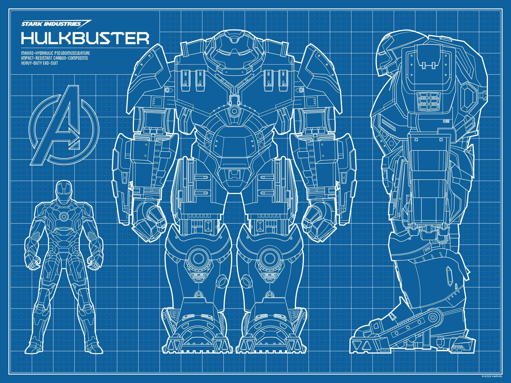

### Principios de Diseño Comunes

**DRY (Don't repeat yourself)**
- No te repitas
- No hay que escribir código duplicado
- Encapsula y mejora tu abstracción
- Hacer cambios en un solo punto hace que todo sea más mantenible

**KISS (Keep It Simple Stupid)**
- Cuánto más sencillo sea, mejor
- No te excedas con la complejidad ni las ultimas tendencias porque si
- La sobreingenieria es un riesgo muy real en el ecosistema de JS
- “en igualdad de condiciones, la explicación más sencilla suele ser la correcta”, [La navaja de Occam](http://es.wikipedia.org/wiki/Navaja_de_Occam)

**SoC (separation of concerns).**
- Separa los asuntos por capas (negocio, visualizacion, etc...)
- Implementa patrones ya testeados que te ayuden con esta tarea

**YAGNI (You ain't gonna need it)**
- No implementes algo que no necesites, aunque exista la incertidumbre de usarse en el futuro
- No almacenes codigo que no uses

**La regla del Boy Scout**
- Deja el código mejor que cuando lo encontraste
- Dedica tiempo a refactorizar el código
- Dedica tiempo a mejorar arquitectura

**La Ley de Demeter**
- Un elemento solo puede interaccionar con elementos cercanos y conocidos, nunca con elementos extraños
- No debemos hablar con extraños

### S.O.L.I.D

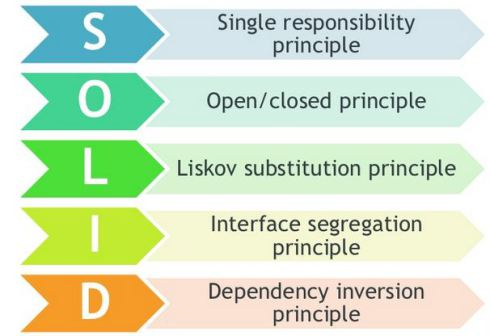

**SRP (Single Responsibility Principle)**
- Cada elemento tiene una finalidad muyd efinida y concreta
- Midamos la reutilización y no olvidemos el contexto
- Cada elemento solo tiene una responsabildiad muy clara

**Open/Close Principle**
- Las estrcuturas que creamos deben ser lo suficientemente abiertas como para modificar su comportamiento sin alterar su estructura
- Muchas veces haremos uso de `prototype`, clases y herencias
- Abierto para su extensión, pero cerrado para su modificación

**Sustitucion Liskov (Liskov substitution)**
- Una clase derivada no debe modificar el comportamiento de la clase base
- Una interfaz sencilla es lo mejor
- Muchas interfaces pequeñas y especialzadas es mejor que una interfaz sobredimensionada y terrorifica

**ISP (Interface segregation principle)**
- Una clase que implementa una interfaz no debe depender de métodos que no utiliza

**DIP (Dependency Inversion Principle)**
- Las clases de alto nivel, no deben depender de clases de bajo nivel
- Reducir el acoplamiento lo máximo posible
- Una buena abstraccion nos permite comunicar componentes sin comprometerlos directamente
- Tener un buen sistema definido de inyeccion de dependencias

### Separación de intereses (Separation of Concerns, "SoC principle")

> En informática, la separación de intereses, también denominada separación de preocupaciones o separación de conceptos (en inglés separation of concerns), es un principio de diseño para separar un programa informático en secciones distintas, tal que cada sección enfoca un interés delimitado. Un interés o una preocupación es un conjunto de información que afecta al código de un programa. Una preocupación puede ser algo tan general como los detalles del hardware para el que se va a optimizar el código, o tan concreto como el nombre de una clase que se pretende instanciar. Un programa que utiliza una buena separación de intereses es un programa modular.1​ La modularidad, y por tanto la separación de intereses, se consigue a través de la encapsulación de información en una sección de código que tiene una interfaz bien definida. La encapsulación es una manera de ocultar información que consigue que cada capa no conozca el estado de las demás.2​ Otro ejemplo de separación de intereses es la división de un sistema de información en capas (p. ej., capa de presentación, capa de lógica de negocio, capa de acceso a datos, capa de persistencia).3​

> El valor de la separación de intereses es simplificar el desarrollo y mantenimiento de programas informáticos. Cuando los intereses están bien separados, se pueden reutilizar, desarrollar y actualizar las distintas secciones individuales de forma independiente. La posibilidad de modificar una parte del código del programa sin tener que revisar y modificar las demás es de gran valor en el mantenimiento de software. [Wikipedia](https://es.wikipedia.org/wiki/Separaci%C3%B3n_de_intereses)

### Modelo–vista–controlador (MVC)

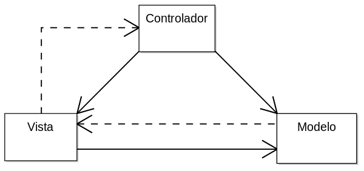

> Modelo-vista-controlador (MVC) es un patrón de arquitectura de software, que separa los datos y la lógica de negocio de una aplicación de su representación y el módulo encargado de gestionar los eventos y las comunicaciones. Para ello MVC propone la construcción de tres componentes distintos que son el modelo, la vista y el controlador, es decir, por un lado define componentes para la representación de la información, y por otro lado para la interacción del usuario. Este patrón de arquitectura de software se basa en las ideas de reutilización de código y la separación de conceptos, características que buscan facilitar la tarea de desarrollo de aplicaciones y su posterior mantenimiento. [Wikipedia](https://es.wikipedia.org/wiki/Modelo%E2%80%93vista%E2%80%93controlador)

**Las claves**
- Tiene su origen en las interfaces graficas en aplicaciones de escritorio
- Su primera definición se remonta a principios de los 70
- Separa los datos y la lógica de negocio
- Se compone del modelo, la vista y el controlador
- Facilita enormemente la reutilización de código en un mismo proyecto

**¿Cuando usarlo?**
- Cuando la conexión con la vista y el resto de la estructura es imposible
- Si no es necesario tener binding

### Modelo–vista–controlador (MVC): Las partes del Modelo Clásico
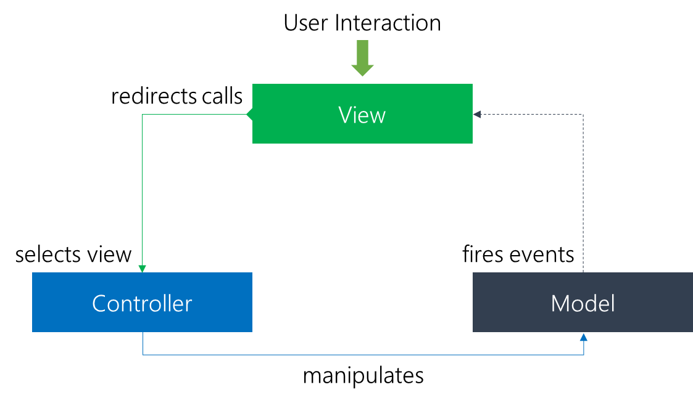

**Modelo**
- Representa la información que usamos en la aplicacion.
- Se encarga de mandar la información a la(s) vista(s)
- Encapsula la lógica de negocio
- Simula un enfoque real al mundo a nivel de datos (información del usuario, libro, etc...)

**Vista**
- Muestra la información al usuario
- Debería ser simple y no contener lógica de negocio
- La vista puede invocar metodos del controlador
- Se puede implementar el patrón observador para actualizar la vista con los cambios en el modelo
- Es responsable de mantener la consistencia cuando el modelo cambia

**Controlador**
- Responde a los eventos del usuario y genera cambios en el modelo. 
- Hace de intermediacción entre la vista y el modelo
- Es invocado desde la vista
- No es un mediador entre la vista y el modelo
- Solamente procesa la acción del usuario al modelo

### Modelo–vista–controlador (MVC): La variante del Modelo 2 (Aplicaciones Web)

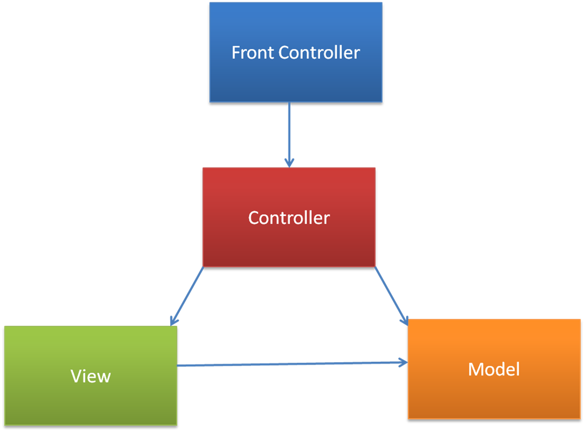

**Las Claves y las variaciones**
- Ampliamente extendido: ASP.NET MVC (.NET), Rails (Ruby), Spring (Java), AngularJS (JavaScript), CakePHP (PHP), etc...
- Escribir un framework MVC no es sencillo ni poco costoso
- Todo pasa por un controlador frontal
- No existe contacto directo entre la vista y el modelo
- El modelo es más cercado a una `ViewModel`
- El modelo captura el estado de la vista
- La relacion entre el modelo y la vista es indirecta

**Esquema completo implementado**

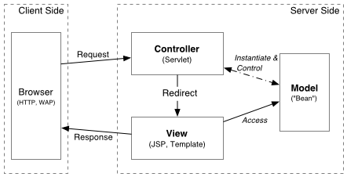

### Modelo–vista–controlador (MVC): MV*, las variantes
- `HMVC` MVC Jerárquico
- `MVA` Modelo-Vista-Adaptador
- `MVP` Modelo-Vista-Presentador
- `MVVM` Modelo-Vista Vista-Modelo
- etc...

**Recursos**
- [Libro "Clean Architecture: A Craftsman's Guide to Software Structure and Design" de Robert C Martin](https://www.amazon.es/dp/0134494164/ref=asc_df_013449416455531008/)
- [Libro "Software Architecture Patterns" de Mark Richards](https://www.oreilly.com/library/view/software-architecture-patterns/9781491971437/)
- [Software Design Patterns de Florian Rappl](https://patterns.florian-rappl.de/Category/Presentation%20patterns?full#Cover)
- [Presentation Patterns : MVC, MVP, PM, MVVM](https://manojjaggavarapu.wordpress.com/2012/05/02/presentation-patterns-mvc-mvp-pm-mvvm/)
- [Módelo Vista Controlador y algunas variantes](http://www.neleste.com/modelo-vista-controlador-y-algunas-variantes/)
- [A Simplified View of MV* Web Pattern Differences](http://presentationtier.com/a-simplified-view-of-mv-web-pattern-differences/)
- [Mv* patterns](https://es.slideshare.net/RaduIscu/mv-patterns)
- [GUI Architectures de Martin Fowler](https://www.martinfowler.com/eaaDev/uiArchs.html)

### MVP
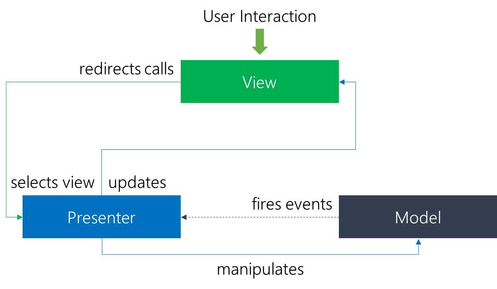

**Limitaciones del MVC**
- El modelo tiene que notificar los cambios de estado a la vista
- La vista tiene un conocimiento completo del modelo
- La vista no es tan pasiva como deberia, por culpa de su relación con el modelo

**Lo básico**
- Es una variante desarrollado para [Taligent](https://en.wikipedia.org/wiki/Taligent) en los 90
- El MVP Puro no se usa a día de hoy, pero si sus variantes.
- En MVP rompemos la relacion directa entre el modelo y la vista
- Super popular en el mundo de .NET
- Puede ser muy compleja para proyectos pequeños
- Llega a permitir una comunicacion de dos vias con la vista (two way data binding)

**¿Cuando usarlo?**
- No se requiere un binding global, pero si especifico
- Los mismos casos que MVC, pero donde las vistas tengan que estar conectadas

**Recursos**
- [Wikipedia | Modelo–vista–presentador](https://es.wikipedia.org/wiki/Modelo%E2%80%93vista%E2%80%93presentador)
- [MVP: Model-View-Presenter. The Taligent Programming Model for C++ and Java](http://www.wildcrest.com/Potel/Portfolio/mvp.pdf)
- [An MVP guide to JavaScript – Model-View-Presenter de Roy Peled](http://www.roypeled.com/an-mvp-guide-to-javascript-model-view-presenter/) 
- [Ebook | Learning JavaScript Design Patterns by Adnan Osmani | MVP](https://www.safaribooksonline.com/library/view/learning-javascript-design/9781449334840/ch10s05.html)
- [Understanding MVC And MVP (For JavaScript And Backbone Developers)](https://addyosmani.com/blog/understanding-mvc-and-mvp-for-javascript-and-backbone-developers/)
- [Let’s talk about React and MVP](https://medium.com/pdvend-engineering/lets-talk-about-react-and-mvp-67ae35b8968c)

### MVP: Partes

**Modelo**
- Simplemente representa la lógica de negocio
- Gestiona la comunicación con la base de datos
- Dispara eventos cuando la información es generada

**Vista**
- Es un elemento ligero
- Carente de logica de negocio
- Realmente solo es la implementación de la UI
- Se pueden hacer pequeñas tareas como la validación de un email

**Presentador**
- Es mucho más que un cambio de nombre (Controlador por presentador)
- Presenta los cambios dle usuario directamente al backend
- Cuando obtiene una respuesta del backend gestiona su representación

### MVP: Variante Pasiva (Vista pasiva)
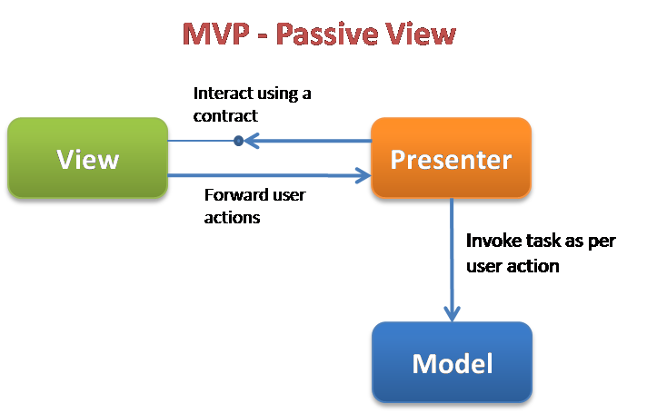

**Las claves**
- La vista es realmente pasiva
- La vista no conoce el modelo
- Toda la carga esta más asentada en el presentador

### MVP: Variante supervisada (Controlador Supervisor)
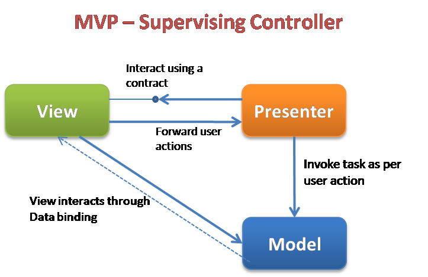

**Las claves**
- La vista juega un papel activo
- La vista conoce el modelo
- Se implementa un rol de simple binding o incluso data binding

### Presentation Model (PM)

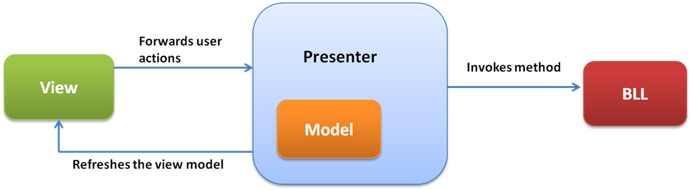

**Las claves**
- Desarrollado por Martin Fowler
- Es una evolucion de MVP
- Esta pensado para aplicaciones muy ricas en UI
- De esta arquitectura derivaron otras como MVVM
- La vista es pasiva de verdad
- El modelo tiene un enfoque más complejo

**Recursos**
- [Presentation Model de Martin Fowler](https://martinfowler.com/eaaDev/PresentationModel.html)
- [The Presentation Model](https://medium.com/@sandofsky/the-presentation-model-6aeaaab607a0)

### Presentation Model (PM): Las partes

**Modelo**
- Controla la lógica de negocio
- Puede contener mucho más que lógica de negocio
- Puede gestionar estados y guardar propiedades de las vistas
- Cuando el modelo esta construido la vista puede ser renderizada directamente

**Vista**
- Simple y sencilla
- Solo contiene elementos de UI
- Todos los eventos son delegados en el presentador (PM), que gestiona la actualización del modelo
- Es el presentador quien marca los cambios en la vista cuando el modelo se actualiza

**Presentador**
- Recibe y procesa eventos de la vista
- Actualiza el modelo
- Gestiona el modelo dentro de si mismo
- Desde el presentador se invocan los cambios a la vista

### Model View View Model (MVVM) 

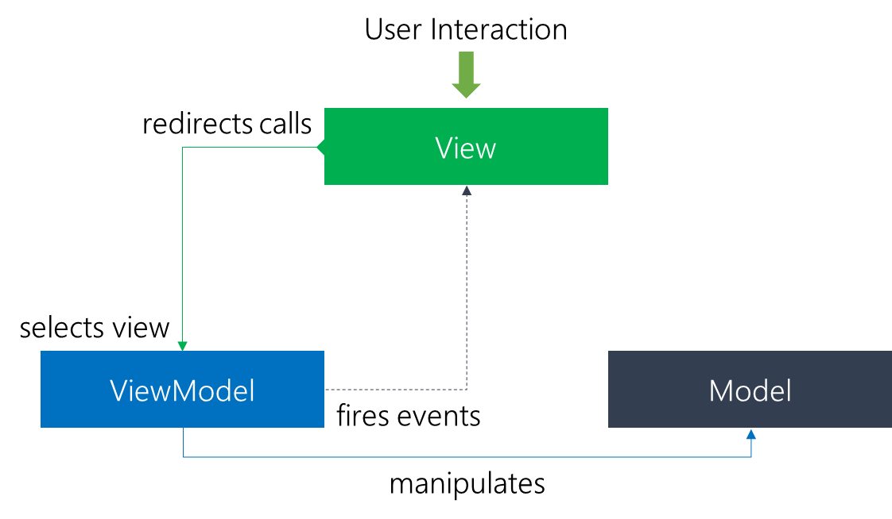

**Las claves**
- Desarrollado por John Gossman (Microsoft) en 2005
- Es una variante del Presentation Model
- Es una versión más especializada para crear componentes core de [WPF](https://es.wikipedia.org/wiki/Windows_Presentation_Foundation) y [Silverlight](https://www.microsoft.com/silverlight/)
- Suma las ventajas de MVC (SoC) y le añada data-binding
- Este modelo en ocasiones se le conoce como Model View Binder (MVB)

**¿Cuando usarlo?**
- El binding debe ser global y estendido automáticamente
- Las vistas se conectan directamente y tiene una alta interacción

**Recursos**
- [Wikipedia | Modelo–vista–modelo de vista](https://es.wikipedia.org/wiki/Modelo%E2%80%93vista%E2%80%93modelo_de_vista)
- [Presentation Model (or MVVM) with Mate](https://blog.scottlogic.com/2011/01/31/presentation-model-with-mate.html)
- [Model-View-ViewModel (MVVM) Explained by Jeremy Likness](https://www.wintellect.com/model-view-viewmodel-mvvm-explained/)
- [How not to get desperate with MVVM implementation](https://medium.com/flawless-app-stories/how-to-use-a-model-view-viewmodel-architecture-for-ios-46963c67be1b)
- [JavaScript MVVM — You’re (Probably) Doing it Wrong](https://dzone.com/articles/javascript-mvvm-youre-probably-doing-it-wrong)
- [JavaScript Intermediate — MVVM vanilla flavour](https://medium.com/@bouab.nabil/javascript-intermediate-mvvm-vanilla-flavour-7f7cfbdf2da6)
- [Patrón MVVM con Vue. Una joya para javascript](http://buhoprogramador.com/entrada/9/patr%C3%B3n-mvvm-con-vue-una-joya-para-javascript)

### Model View View Model (MVVM): Partes

**Modelo**
- Modelo clásico de MVC

**Vista**
- Muy similar a PM y MVC
- Es una vista sencilla y simple
- Solo contiene elemetos de UI
- Utilizaremos Data Binding para comunicarnos entre la vista y el viewModel (y viceversa)
- Las notificaciones y comandos (SilverLight) deben usan otra vía distinta al data binding

**Vista-modelo (ViewModel)**
- Es equivalente al presentador de PM, es una abstracción de la vista
- Es como el modelo de la vista
- Encapsula la lógica de la vista y los datos que serán representados
- Gestiona la comunicación con la vista de los cambios
- Gestiona la comunciacion con el modela para procesar los cambios de la vista
- Permite un esquema Two
- Una única viewModel por vista, no deben reutilizarse

### Model View Adapter (MVA)

**Las Claves**
- Se utiliza un adaptador real
- El adaptador media entre la vista y el modelo
- Escamos del esquema triangular de MVC
- La vista se desacopla completamente
- El adaptador tiene un acople muy grande
- Solo el adaptador conoce la vista y el modelo

**Recursos**
- [Wkipedia | ](https://en.wikipedia.org/wiki/Model%E2%80%93view%E2%80%93adapter)
- [Model-View-Adapter (MVA, Mediated MVC, Model-Mediator-View)](https://stefanoborini.gitbooks.io/modelviewcontroller/content/02_mvc_variations/variations_on_the_triad/10_model_view_adapter.html)
- [MVC is actually MVA or You're not controller anymore](https://ro31337.github.io/MVC-is-actually-MVA/)

### Presentation Abstraction Control (PCA)

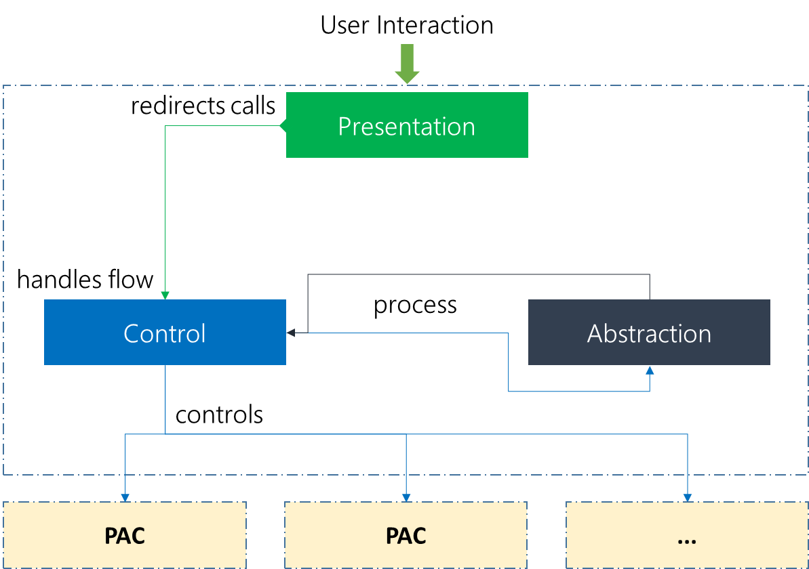

**Las claves**
- Es una variente de MVA
- Puede incluir más estructuras PCA dentro de si misma
- Es muy util para layouts jerarquicos
- El PCA principal puede comunicarse con el resto de PCAs (PCAs hijos)
- Gestiona la comunicacion entre la representacion y la logica de negocio
- Esta pensado para arquitecturas muy grandes con elementos de UI muy jerarquizados

**Recursos**
- [Wikipedia | Presentación–abstracción–control](https://es.wikipedia.org/wiki/Presentaci%C3%B3n%E2%80%93abstracci%C3%B3n%E2%80%93control)

### ¡Ingenieria Inversa!

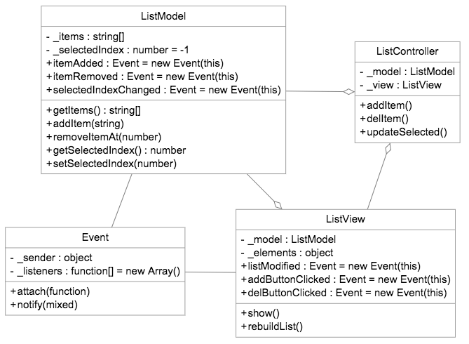

**Recursos**
- [Aproximación de Alex Netkachov](https://webcache.googleusercontent.com/search?q=cache:NQ4lsKof02EJ:https://alexatnet.com/model-view-controller-mvc-in-javascript/+&cd=2&hl=es&ct=clnk&gl=es)
- [Ejemplo de Alex Netkachov](http://jsfiddle.net/alex_netkachov/ZgBrK/)
