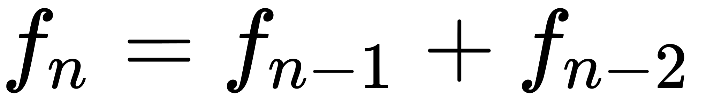
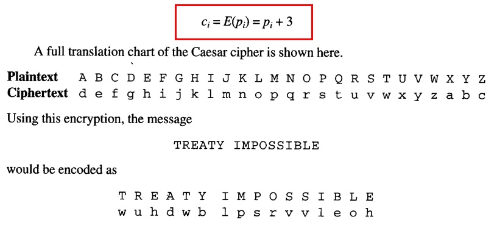

# [Curso de JavaScript Avanzado para desarrolladores Front-end](https://fictizia.com/formacion/curso-javascript-avanzado)
### POO con JS, ECMA6, Patrones de diseño, AJAX avanzado, HTML5 avanzado, APIs externas.

## Clase 19


### Algoritmo
> En matemáticas, lógica, ciencias de la computación y disciplinas relacionadas, un algoritmo (del griego y latín, dixit algorithmus y este del griego arithmos, que significa «número», quizá también con influencia del nombre del matemático persa Al-Juarismi)1​ es un conjunto prescrito de instrucciones o reglas bien definidas, ordenadas y finitas que permite llevar a cabo una actividad mediante pasos sucesivos que no generen dudas a quien deba hacer dicha actividad.2​ Dados un estado inicial y una entrada, siguiendo los pasos sucesivos se llega a un estado final y se obtiene una solución. Los algoritmos son el objeto de estudio de la algoritmia. [Wikipedia](https://es.wikipedia.org/wiki/Algoritmo)

**Recursos**
- [JS: Interview Algorithm. Part 1](http://www.thatjsdude.com/interview/js1.html)
- [JS: Basics and Tricky Questions](http://www.thatjsdude.com/interview/js2.html)
- [Medium | Algorithms in JavaScript](https://medium.com/siliconwat/algorithms-in-javascript-b0bed68f4038)
- [Introducción al diseño de algoritmos en Javascript](http://www.etnassoft.com/2011/07/06/introduccion-al-diseno-de-algoritmos-en-javascript/)
- [Algorithm Visualizer](https://github.com/parkjs814/AlgorithmVisualizer)
- [Minimal and clean examples of machine learning algorithms](https://github.com/rushter/MLAlgorithms)
- [Torch implementation of neural style algorithm](https://github.com/jcjohnson/neural-style)
- [Collection of classic computer science paradigms, algorithms, and approaches written in JavaScript.](https://github.com/nzakas/computer-science-in-javascript)
- [JavaScript implementation of different computer science algorithms](https://github.com/mgechev/javascript-algorithms)
- [Atwood's Law applied to CS101 - Classic algorithms and data structures implemented in JavaScript](https://github.com/felipernb/algorithms.js)


### Algoritmo: Clasificaciones

**Según el sistema de signos**
- `cualitativos` base verbal (receta de cocina, etc...)
- `cuantitativos` base matemática (exponenciales, raices cúbicas, etc...)

**Según función**
- `ordenamiento` ordenar los elementos dentro de un conjunto
- `búsqueda` encontrar elementos especificos en conjuntos
- `encaminamiento` buscar el camino más optimo entre todos los posibles, sedividen en `adaptativos` y `estáticos`

**Según Estrategia**
- [Algoritmos voraces (greedy)](https://es.wikipedia.org/wiki/Algoritmo_voraz): seleccionan los elementos más prometedores del conjunto de candidatos hasta encontrar una solución. En la mayoría de los casos la solución no es óptima.
- [Algoritmos paralelos](https://es.wikipedia.org/wiki/Algoritmos_paralelos): permiten la división de un problema en subproblemas de forma que se puedan ejecutar de forma simultánea en varios procesadores.
- [Algoritmos probabilísticos](https://es.wikipedia.org/wiki/Algoritmo_probabil%C3%ADstico): algunos de los pasos de este tipo de algoritmos están en función de valores pseudoaleatorios.
- [Algoritmos determinísticos](https://es.wikipedia.org/wiki/Algoritmo_determin%C3%ADstico): el comportamiento del algoritmo es lineal: cada paso del algoritmo tiene únicamente un paso sucesor y otro antecesor.
- [Algoritmos no determinísticos](https://es.wikipedia.org/wiki/Algoritmo_no_determin%C3%ADstico): el comportamiento del algoritmo tiene forma de árbol y a cada paso del algoritmo puede bifurcarse a cualquier número de pasos inmediatamente posteriores, además todas las ramas se ejecutan simultáneamente.
- [Divide y vencerás](https://es.wikipedia.org/wiki/Divide_y_vencer%C3%A1s): dividen el problema en subconjuntos disjuntos obteniendo una solución de cada uno de ellos para después unirlas, logrando así la solución al problema completo.
- [Metaheurísticas](https://es.wikipedia.org/wiki/Metaheur%C3%ADsticas): encuentran soluciones aproximadas (no óptimas) a problemas basándose en un conocimiento anterior (a veces llamado experiencia) de los mismos.
- [Programación dinámica](https://es.wikipedia.org/wiki/Programaci%C3%B3n_din%C3%A1mica_(computaci%C3%B3n)): intenta resolver problemas disminuyendo su coste computacional aumentando el coste espacial.
- [Ramificación y acotación](https://es.wikipedia.org/wiki/Ramificaci%C3%B3n_y_acotaci%C3%B3n): se basa en la construcción de las soluciones al problema mediante un árbol implícito que se recorre de forma controlada encontrando las mejores soluciones.
- [Vuelta atrás (backtracking)](https://es.wikipedia.org/wiki/Vuelta_atr%C3%A1s): se construye el espacio de soluciones del problema en un árbol que se examina completamente, almacenando las soluciones menos costosas.


### Algoritmo: Complejidad


**Big-O Complexity/Cota superior asintótica**

> En análisis de algoritmos una cota superior asintótica es una función que sirve de cota superior de otra función cuando el argumento tiende a infinito. Usualmente se utiliza la notación de Landau: O(g(x)), Orden de g(x), coloquialmente llamada Notación O Grande, para referirse a las funciones acotadas superiormente por la función g(x). [Wikipedia](https://es.wikipedia.org/wiki/Cota_superior_asint%C3%B3tica)


**Las claves**
- `Constante en el tiempo` como acceder a un array.
- `Lineal en el tiempo` como recorrer un array.
- `Logaritmico en el tiempo` como [Binary search](https://en.wikipedia.org/wiki/Binary_search_algorithm).
- `Polinomico en el tiempo` como [Bubble sort](https://en.wikipedia.org/wiki/Bubble_sort). 
- `Exponencial en el tiempo` como [Brute-force search](https://en.wikipedia.org/wiki/Brute-force_search).


### Algoritmo: Expresiones

**Herramientas**
- [Diagrama de Fujo](https://es.wikipedia.org/wiki/Diagrama_de_flujo)
- [Pseudocodigo](https://es.wikipedia.org/wiki/Pseudoc%C3%B3digo)
- [Teorema](https://es.wikipedia.org/wiki/Teorema)

### Algoritmo: Pasos de desarrollo
- `Descripción de alto nivel` Definición del problema con una aproximación matemática y apoyo de la idea con imagenes y textos.
- `Descripción formal` describir la secuencia de pasos con pseudocodigo.
- `Implementación` Materializacion en forma de instrucciones en un lenguaje especifico.

### Algoritmo: La sucesión de Fibonacci, un ejemplo real


**Descripción de alto nivel**
> En matemáticas, la sucesión de Fibonacci es la siguiente sucesión infinita de números naturales: `0,1,1,2,3,5,8,13,21,34,55,89,144,233,377,610,987,1597...`

> La espiral de Fibonacci: una aproximación de la espiral áurea generada dibujando arcos circulares conectando las esquinas opuestas de los cuadrados ajustados a los valores de la sucesión;1​ adosando sucesivamente cuadrados de lado 0, 1, 1, 2, 3, 5, 8, 13, 21 y 34.
La sucesión comienza con los números 0 y 1, 2 y a partir de estos, «cada término es la suma de los dos anteriores», es la relación de recurrencia que la define.

> A los elementos de esta sucesión se les llama números de Fibonacci. Esta sucesión fue descrita en Europa por Leonardo de Pisa, matemático italiano del siglo XIII también conocido como Fibonacci. Tiene numerosas aplicaciones en ciencias de la computación, matemática y teoría de juegos. También aparece en configuraciones biológicas, como por ejemplo en las ramas de los árboles, en la disposición de las hojas en el tallo, en las flores de alcachofas y girasoles, en las inflorescencias del brécol romanesco y en la configuración de las piñas de las coníferas. De igual manera, se encuentra en la estructura espiral del caparazón de algunos moluscos, como el nautilus. [Wikipedia](https://es.wikipedia.org/wiki/Sucesi%C3%B3n_de_Fibonacci)


**El Problema práctico**

> Cierto hombre tenía una pareja de conejos en un lugar cerrado y deseaba saber cuántos se podrían reproducir en un año a partir de la pareja inicial, teniendo en cuenta que de forma natural tienen una pareja en un mes, y que a partir del segundo se empiezan a reproducir

| Número de Mes | Explicación de la genealogía | Parejas de conejos |
| ----- | ----- | ----- |
| Comienzo del mes 1 | Nace una pareja de conejos (pareja A). | 1 pareja en total. |
| Fin del mes 1 | La pareja A tiene un mes de edad. Se cruza la pareja A. |	1+0=1 pareja en total. |
| Fin del mes 2 | La pareja A da a luz a la pareja B. Se vuelve a cruzar la pareja A. | 1+1=2 parejas en total. |
| Fin del mes 3 | La pareja A da a luz a la pareja C. La pareja B cumple 1 mes. Se cruzan las parejas A y B. | 2+1=3 parejas en total. |
| Fin del mes 4 | Las parejas A y B dan a luz a D y E. La pareja C cumple 1 mes. Se cruzan las parejas A, B y C. | 3+2=5 parejas en total. |
| Fin del mes 5 | A, B y C dan a luz a F, G y H. D y E cumplen un mes. Se cruzan A, B, C, D y E. | 5+3=8 parejas en total. |
| Fin del mes 6 | A, B, C, D y E dan a luz a I, J, K, L y M. F, G y H cumplen un mes. Se cruzan A, B, C, D, E, F, G y H. | 8+5=13 parejas en total. |


**Descripción formal**


Versión recursiva descendente 
```
función fib(n)
    si n < 2 entonces
        devuelve n
    en otro caso
        devuelve fib(n - 1) + fib(n - 2)
```


Versión iterativa 
```
función fib(n)
    a <- 0
    b <- 1
    c
    para k desde 0 hasta n hacer
        c <- b + a
        a <- b
        b <- c
    devuelve a
```

Versión iterativa con 2 variables 
```
función fib(n)
    a <- 0
    b <- 1
    para k desde 0 hasta n hacer
        b <- b + a
        a <- b - a
    devuelve a
```

Versión iterativa vector
```
función fib(n)
    si n < 2 entonces
        devuelve n
    en otro caso
        vector[0...n + 1]
        vector [0] <- 0
        vector [1] <- 1
        para k desde 2 hasta n + 1 hacer
            vector[k] <- vector[k-1] + vector[k-2]
        devuelve vector[n]
```

**Implementación**


Recursiva: Versión recursiva descendente
```javascript
function fib (n) {
  if (n <= 1) {
    return 1;
  } else {
    return fib(n - 1) + fib(n - 2);
  }
};

console.log(fib(46)); // 2971215073
```

Loop: Versión iterativa
```javascript
function fib (num){
  let a = 1, b = 0, temp;
  while (num >= 0){
    temp = a;
    a = a + b;
    b = temp;
    num--;
  }
  return b;
}
console.log(fib(46)); // 2971215073
```

Memoization: Versión iterativa vector
```javascript

function fib(num, memo) {
  memo = memo || {};

  if (memo[num]) return memo[num];
  if (num <= 1) return 1;

  return memo[num] = fib(num - 1, memo) + fib(num - 2, memo);
}
console.log(fib(46)); // 2971215073
```

[Comparativa de rendimeinto](https://jsperf.com/fibo-algo-tests2)

**Recursos**
- [:trollface: La secuencia Fibonacci demuestra que los gatos son perfectos](http://www.boredpanda.es/composicion-gatos-secuencia-fibonacci/)
- [Fibonacci sequence algorithm in Javascript](https://medium.com/developers-writing/fibonacci-sequence-algorithm-in-javascript-b253dc7e320e)
- [Fibonacci sequence JavaScript interview question. Iterative and Recursive solutions](https://medium.com/quick-code/fibonacci-sequence-javascript-interview-question-iterative-and-recursive-solutions-6a0346d24053)


### Algoritmia: Los algoritmos más usados


**Ejemplos**
- [Page Rank](https://lizrush.gitbooks.io/algorithms-for-webdevs-ebook/content/chapters/page-rank.html)
- [Language Detection](https://lizrush.gitbooks.io/algorithms-for-webdevs-ebook/content/chapters/language-detection.html)
- [Nudity Detection](https://lizrush.gitbooks.io/algorithms-for-webdevs-ebook/content/chapters/nudity-detection.html)
- [Sentiment Analysis](https://lizrush.gitbooks.io/algorithms-for-webdevs-ebook/content/chapters/sentiment-analysis.html)
- [TF-IDF: Term Frequency-Inverse Document Frequency](https://lizrush.gitbooks.io/algorithms-for-webdevs-ebook/content/chapters/tf-idf.html)
- [Dijkstra’s algorithm](https://es.wikipedia.org/wiki/Algoritmo_de_Dijkstra)
- [RSA](https://es.wikipedia.org/wiki/RSA)
- [PGP](https://es.wikipedia.org/wiki/Pretty_Good_Privacy)
- [Hash](https://es.wikipedia.org/wiki/Funci%C3%B3n_hash)
- [Compresión de datos](https://www.tamps.cinvestav.mx/~mmorales/documents/Compre.pdf)
- [Generación de números aletorios](https://es.wikipedia.org/wiki/Generador_de_n%C3%BAmeros_aleatorios)


### Algoritmia: Otros algoritmos, un mundo de posibilidades...


**Herramientas**
- [Algorithm visualizer](http://algorithm-visualizer.org/)
- [trekhleb/javascript-algorithms](https://github.com/trekhleb/javascript-algorithms/blob/master/README.es-ES.md)
- [felipernb/algorithms.js](https://github.com/felipernb/algorithms.js)
- [nzakas/computer-science-in-javascript](https://github.com/nzakas/computer-science-in-javascript)
- [algorithmiaio/algorithmia-nodejs](https://github.com/algorithmiaio/algorithmia-nodejs)

### Estructuras de datos


> En ciencias de la computación, una estructura de datos es una forma particular de organizar datos en una computadora para que puedan ser utilizados de manera eficiente.

> Diferentes tipos de estructuras de datos son adecuados para diferentes tipos de aplicaciones, y algunos son altamente especializados para tareas específicas.

> Las estructuras de datos son un medio para manejar grandes cantidades de datos de manera eficiente para usos tales como grandes bases de datos y servicios de indización de Internet. Por lo general, las estructuras de datos eficientes son clave para diseñar algoritmos eficientes. Algunos métodos formales de diseño y lenguajes de programación destacan las estructuras de datos, en lugar de los algoritmos, como el factor clave de organización en el diseño de software. [Wikipedia](https://es.wikipedia.org/wiki/Estructura_de_datos)

**Recursos**
- [Data structures in JavaScript](http://blog.benoitvallon.com/data-structures-in-javascript/data-structures-in-javascript/)
- [Data structures in JavaScript, all the code](http://blog.benoitvallon.com/data-structures-in-javascript/data-structures-in-javascript-all-the-code/)
- [Know Thy Complexities!](http://bigocheatsheet.com/)
- [Algorithms and Data Structures in JavaScript](https://itnext.io/algorithms-and-data-structures-in-javascript-a71548f902cb)
- [10 Common Data Structures Explained with Videos + Exercises](https://medium.freecodecamp.org/10-common-data-structures-explained-with-videos-exercises-aaff6c06fb2b)
- [Data Structures in JavaScript (ES5 and ES6)](https://github.com/benoitvallon/computer-science-in-javascript/tree/master/data-structures-in-javascript)


### Estructuras de datos: Nuestras opciones


**[Array (Vector/Matriz)](http://blog.benoitvallon.com/data-structures-in-javascript/the-array-data-structure)**


> En programación se denomina 'matriz', vector (de una sola dimensión) o formación (en inglés array) a una zona de almacenamiento contiguo que contiene una serie de elementos del mismo tipo, los elementos de la matriz. Desde el punto de vista lógico una matriz se puede ver como un conjunto de elementos ordenados en fila (o filas y columnas si tuviera dos dimensiones). [Wikipedia](https://es.wikipedia.org/wiki/Vector_(inform%C3%A1tica))

```javascript
// @See: http://blog.benoitvallon.com/data-structures-in-javascript/the-array-data-structure/
class MyArray {
  constructor() {
    this.array = [];
  }

  add(data) {
    this.array.push(data);
  }

  remove(data) {
    this.array = this.array.filter(current => current !== data);
  }

  search(data) {
    const foundIndex = this.array.indexOf(data);
    if(~foundIndex) {
      return foundIndex;
    }

    return null;
  }

  getAtIndex(index) {
    return this.array[index];
  }

  length() {
    return this.array.length;
  }

  print() {
    console.log(this.array.join(' '));
  }
}

const array = new MyArray();
array.add(1);
array.add(2);
array.add(3);
array.add(4);
array.print(); // => 1 2 3 4
console.log('search 3 gives index 2:', array.search(3)); // => 2
console.log('getAtIndex 2 gives 3:', array.getAtIndex(2)); // => 3
console.log('length is 4:', array.length()); // => 4
array.remove(3);
array.print(); // => 1 2 4
array.add(5);
array.add(5);
array.print(); // => 1 2 4 5 5
array.remove(5);
array.print(); // => 1 2 4
```

**[Hash Table (Tabla hash)](http://blog.benoitvallon.com/data-structures-in-javascript/the-hash-table-data-structure/)**


> Una tabla hash, matriz asociativa, hashing, mapa hash, tabla de dispersión o tabla fragmentada es una estructura de datos que asocia llaves o claves con valores. La operación principal que soporta de manera eficiente es la búsqueda: permite el acceso a los elementos (teléfono y dirección, por ejemplo) almacenados a partir de una clave generada (usando el nombre o número de cuenta, por ejemplo). Funciona transformando la clave con una función hash en un hash, un número que identifica la posición (casilla o cubeta) donde la tabla hash localiza el valor deseado. [Wikipedia](https://es.wikipedia.org/wiki/Tabla_hash)

```javascript
//@see: http://blog.benoitvallon.com/data-structures-in-javascript/the-hash-table-data-structure/
class HashTable {
  constructor(size) {
    this.values = {};
    this.numberOfValues = 0;
    this.size = size;
  }

  add(key, value) {
    const hash = this.calculateHash(key);
    if(!this.values.hasOwnProperty(hash)) {
      this.values[hash] = {};
    }
    if(!this.values[hash].hasOwnProperty(key)) {
      this.numberOfValues++;
    }
    this.values[hash][key] = value;
  }

  remove(key) {
    const hash = this.calculateHash(key);
    if(this.values.hasOwnProperty(hash) && this.values[hash].hasOwnProperty(key)) {
      delete this.values[hash][key];
      this.numberOfValues--;
    }
  }

  calculateHash(key) {
    return key.toString().length % this.size;
  }

  search(key) {
    const hash = this.calculateHash(key);
    if(this.values.hasOwnProperty(hash) && this.values[hash].hasOwnProperty(key)) {
      return this.values[hash][key];
    } else {
      return null;
    }
  }

  length() {
    return this.numberOfValues;
  }

  print() {
    let string = '';
    for(const value in this.values) {
      for(const key in this.values[value]) {
        string += `${this.values[value][key]} `;
      }
    }
    console.log(string.trim());
  }
}

const hashTable = new HashTable(3);
hashTable.add('first', 1);
hashTable.add('second', 2);
hashTable.add('third', 3);
hashTable.add('fourth', 4);
hashTable.add('fifth', 5);
hashTable.print(); // => 2 4 1 3 5
console.log('length gives 5:', hashTable.length()); // => 5
console.log('search second gives 2:', hashTable.search('second')); // => 2
hashTable.remove('fourth');
hashTable.remove('first');
hashTable.print(); // => 2 3 5
console.log('length gives 3:', hashTable.length()); // => 3
```

**[Set (Conjunto)](http://blog.benoitvallon.com/data-structures-in-javascript/the-set-data-structure/)**

> En informática, un conjunto es una colección (contenedor) de ciertos valores, sin ningún orden concreto ni valores repetidos. Su correspondencia en las matemáticas sería el conjunto finito. Sin tener en cuenta la secuencia, ni el hecho de que no haya valores repetidos, se asemeja a una lista. Un conjunto puede verse como una cadena asociativa (array) (mapeado parcial) donde no se atiende al valor de cada par clave-valor. [Wikipedia](https://es.wikipedia.org/wiki/Conjunto_(programaci%C3%B3n))

```javascript
//@see: http://blog.benoitvallon.com/data-structures-in-javascript/the-set-data-structure/
class Set {
  constructor() {
    this.values = [];
    this.numberOfValues = 0;
  }

  add(value) {
    if(!~this.values.indexOf(value)) {
      this.values.push(value);
      this.numberOfValues++;
    }
  }

  remove(value) {
    const index = this.values.indexOf(value);
    if(~index) {
      this.values.splice(index, 1);
      this.numberOfValues--;
    }
  }

  contains(value) {
    return this.values.includes(value);
  }

  union(set) {
    const newSet = new Set();
    set.values.forEach(value => {
      newSet.add(value);
    });
    this.values.forEach(value => {
      newSet.add(value);
    });
    return newSet;
  }

  intersect(set) {
    const newSet = new Set();
    this.values.forEach(value => {
      if(set.contains(value)) {
        newSet.add(value);
      }
    });
    return newSet;
  }

  difference(set) {
    const newSet = new Set();
    this.values.forEach(value => {
      if(!set.contains(value)) {
        newSet.add(value);
      }
    });
    return newSet;
  }

  isSubset(set) {
    return set.values.every(function(value) {
      return this.contains(value);
    }, this);
  }

  length() {
    return this.numberOfValues;
  }

  print() {
    console.log(this.values.join(' '));
  }
}

const set = new Set();
set.add(1);
set.add(2);
set.add(3);
set.add(4);
set.print(); // => 1 2 3 4
set.remove(3);
set.print(); // => 1 2 4
console.log('contains 4 is true:', set.contains(4)); // => true
console.log('contains 3 is false:', set.contains(3)); // => false
console.log('---');
const set1 = new Set();
set1.add(1);
set1.add(2);
const set2 = new Set();
set2.add(2);
set2.add(3);
const set3 = set2.union(set1);
set3.print(); // => 1 2 3
const set4 = set2.intersect(set1);
set4.print(); // => 2
const set5 = set.difference(set3); // 1 2 4 diff 1 2 3
set5.print(); // => 4
const set6 = set3.difference(set); // 1 2 3 diff 1 2 4
set6.print(); // => 3
console.log('set1 subset of set is true:', set.isSubset(set1)); // => true
console.log('set2 subset of set is false:', set.isSubset(set2)); // => false
console.log('set1 length gives 2:', set1.length()); // => 2
console.log('set3 length gives 3:', set3.length()); // => 3
```

**[Singly Linked List (Lista enlazada)](http://blog.benoitvallon.com/data-structures-in-javascript/the-singly-linked-list-data-structure/)**


> En ciencias de la computación, una lista enlazada es una de las estructuras de datos fundamentales, y puede ser usada para implementar otras estructuras de datos. Consiste en una secuencia de nodos, en los que se guardan campos de datos arbitrarios y una o dos referencias, enlaces o punteros al nodo anterior o posterior. El principal beneficio de las listas enlazadas respecto a los vectores convencionales es que el orden de los elementos enlazados puede ser diferente al orden de almacenamiento en la memoria o el disco, permitiendo que el orden de recorrido de la lista sea diferente al de almacenamiento. [Wikipedia](https://es.wikipedia.org/wiki/Lista_enlazada)

```javascript
//@See: http://blog.benoitvallon.com/data-structures-in-javascript/the-singly-linked-list-data-structure/
function Node(data) {
  this.data = data;
  this.next = null;
}

class SinglyLinkedList {
  constructor() {
    this.head = null;
    this.tail = null;
    this.numberOfValues = 0;
  }

  add(data) {
    const node = new Node(data);
    if(!this.head) {
      this.head = node;
      this.tail = node;
    } else {
      this.tail.next = node;
      this.tail = node;
    }
    this.numberOfValues++;
  }

  remove(data) {
    let previous = this.head;
    let current = this.head;
    while(current) {
      if(current.data === data) {
        if(current === this.head) {
          this.head = this.head.next;
        }
        if(current === this.tail) {
          this.tail = previous;
        }
        previous.next = current.next;
        this.numberOfValues--;
      } else {
        previous = current;
      }
      current = current.next;
    }
  }

  insertAfter(data, toNodeData) {
    let current = this.head;
    while(current) {
      if(current.data === toNodeData) {
        const node = new Node(data);
        if(current === this.tail) {
          this.tail.next = node;
          this.tail = node;
        } else {
          node.next = current.next;
          current.next = node;
        }
        this.numberOfValues++;
      }
      current = current.next;
    }
  }

  traverse(fn) {
    let current = this.head;
    while(current) {
      if(fn) {
        fn(current);
      }
      current = current.next;
    }
  }

  length() {
    return this.numberOfValues;
  }

  print() {
    let string = '';
    let current = this.head;
    while(current) {
      string += `${current.data} `;
      current = current.next;
    }
    console.log(string.trim());
  }
}

const singlyLinkedList = new SinglyLinkedList();
singlyLinkedList.print(); // => ''
singlyLinkedList.add(1);
singlyLinkedList.add(2);
singlyLinkedList.add(3);
singlyLinkedList.add(4);
singlyLinkedList.print(); // => 1 2 3 4
console.log('length is 4:', singlyLinkedList.length()); // => 4
singlyLinkedList.remove(3); // remove value
singlyLinkedList.print(); // => 1 2 4
singlyLinkedList.remove(9); // remove non existing value
singlyLinkedList.print(); // => 1 2 4
singlyLinkedList.remove(1); // remove head
singlyLinkedList.print(); // => 2 4
singlyLinkedList.remove(4); // remove tail
singlyLinkedList.print(); // => 2
console.log('length is 1:', singlyLinkedList.length()); // => 1
singlyLinkedList.add(6);
singlyLinkedList.print(); // => 2 6
singlyLinkedList.insertAfter(3, 2);
singlyLinkedList.print(); // => 2 3 6
singlyLinkedList.insertAfter(4, 3);
singlyLinkedList.print(); // => 2 3 4 6
singlyLinkedList.insertAfter(5, 9); // insertAfter a non existing node
singlyLinkedList.print(); // => 2 3 4 6
singlyLinkedList.insertAfter(5, 4);
singlyLinkedList.insertAfter(7, 6); // insertAfter the tail
singlyLinkedList.print(); // => 2 3 4 5 6 7
singlyLinkedList.add(8); // add node with normal method
singlyLinkedList.print(); // => 2 3 4 5 6 7 8
console.log('length is 7:', singlyLinkedList.length()); // => 7
singlyLinkedList.traverse(node => { node.data = node.data + 10; });
singlyLinkedList.print(); // => 12 13 14 15 16 17 18
singlyLinkedList.traverse(node => { console.log(node.data); }); // => 12 13 14 15 16 17 18
console.log('length is 7:', singlyLinkedList.length()); // => 7
```

**[Doubly Linked List (Lista doblemente enlazada)](https://es.wikipedia.org/wiki/Lista_doblemente_enlazada)**


> En ciencias de la computación, una lista doblemente enlazada es una estructura de datos que consiste en un conjunto de nudos enlazados secuencialmente. Cada nudo contiene dos campos, llamados enlaces, que son referencias al nodo siguiente y al anterior en la secuencia de nudos. El enlace al nudo anterior del primer nudo y el enlace al nudo siguiente del último nudo, apuntan a un tipo de nudo que marca el final de la lista, normalmente un nudo centinela o puntero null,para facilitar el recorrido de la lista. Si existe un único nudo centinela, entonces la lista es circular a través del nudo centinela. [Wikipedia](https://es.wikipedia.org/wiki/Lista_doblemente_enlazada)

```javascript
//@see: http://blog.benoitvallon.com/data-structures-in-javascript/the-doubly-linked-list-data-structure/
function Node(data) {
  this.data = data;
  this.previous = null;
  this.next = null;
}

class DoublyLinkedList {
  constructor() {
    this.head = null;
    this.tail = null;
    this.numberOfValues = 0;
  }

  add(data) {
    const node = new Node(data);
    if(!this.head) {
      this.head = node;
      this.tail = node;
    } else {
      node.previous = this.tail;
      this.tail.next = node;
      this.tail = node;
    }
    this.numberOfValues++;
  }

  remove(data) {
    let current = this.head;
    while(current) {
      if(current.data === data) {
        if(current === this.head && current === this.tail) {
          this.head = null;
          this.tail = null;
        } else if(current === this.head) {
          this.head = this.head.next;
          this.head.previous = null;
        } else if(current === this.tail) {
          this.tail = this.tail.previous;
          this.tail.next = null;
        } else {
          current.previous.next = current.next;
          current.next.previous = current.previous;
        }
        this.numberOfValues--;
      }
      current = current.next;
    }
  }

  insertAfter(data, toNodeData) {
    let current = this.head;
    while(current) {
      if(current.data === toNodeData) {
        const node = new Node(data);
        if(current === this.tail) {
          this.add(data);
        } else {
          current.next.previous = node;
          node.previous = current;
          node.next = current.next;
          current.next = node;
          this.numberOfValues++;
        }
      }
      current = current.next;
    }
  }

  traverse(fn) {
    let current = this.head;
    while(current) {
      if(fn) {
        fn(current);
      }
      current = current.next;
    }
  }

  traverseReverse(fn) {
    let current = this.tail;
    while(current) {
      if(fn) {
        fn(current);
      }
      current = current.previous;
    }
  }

  length() {
    return this.numberOfValues;
  }

  print() {
    let string = '';
    let current = this.head;
    while(current) {
      string += `${current.data} `;
      current = current.next;
    }
    console.log(string.trim());
  }
}

const doublyLinkedList = new DoublyLinkedList();
doublyLinkedList.print(); // => ''
doublyLinkedList.add(1);
doublyLinkedList.add(2);
doublyLinkedList.add(3);
doublyLinkedList.add(4);
doublyLinkedList.print(); // => 1 2 3 4
console.log('length is 4:', doublyLinkedList.length()); // => 4
doublyLinkedList.remove(3); // remove value
doublyLinkedList.print(); // => 1 2 4
doublyLinkedList.remove(9); // remove non existing value
doublyLinkedList.print(); // => 1 2 4
doublyLinkedList.remove(1); // remove head
doublyLinkedList.print(); // => 2 4
doublyLinkedList.remove(4); // remove tail
doublyLinkedList.print(); // => 2
console.log('length is 1:', doublyLinkedList.length()); // => 1
doublyLinkedList.remove(2); // remove tail, the list should be empty
doublyLinkedList.print(); // => ''
console.log('length is 0:', doublyLinkedList.length()); // => 0
doublyLinkedList.add(2);
doublyLinkedList.add(6);
doublyLinkedList.print(); // => 2 6
doublyLinkedList.insertAfter(3, 2);
doublyLinkedList.print(); // => 2 3 6
doublyLinkedList.traverseReverse(node => { console.log(node.data); });
doublyLinkedList.insertAfter(4, 3);
doublyLinkedList.print(); // => 2 3 4 6
doublyLinkedList.insertAfter(5, 9); // insertAfter a non existing node
doublyLinkedList.print(); // => 2 3 4 6
doublyLinkedList.insertAfter(5, 4);
doublyLinkedList.insertAfter(7, 6); // insertAfter the tail
doublyLinkedList.print(); // => 2 3 4 5 6 7
doublyLinkedList.add(8); // add node with normal method
doublyLinkedList.print(); // => 2 3 4 5 6 7 8
console.log('length is 7:', doublyLinkedList.length()); // => 7
doublyLinkedList.traverse(node => { node.data = node.data + 10; });
doublyLinkedList.print(); // => 12 13 14 15 16 17 18
doublyLinkedList.traverse(node => { console.log(node.data); }); // => 12 13 14 15 16 17 18
console.log('length is 7:', doublyLinkedList.length()); // => 7
doublyLinkedList.traverseReverse(node => { console.log(node.data); }); // => 18 17 16 15 14 13 12
doublyLinkedList.print(); // => 12 13 14 15 16 17 18
console.log('length is 7:', doublyLinkedList.length()); // => 7
```

**[Stack (Pila)](http://blog.benoitvallon.com/data-structures-in-javascript/the-stack-data-structure/)**


> Una pila (stack en inglés) es una lista ordenada o estructura de datos que permite almacenar y recuperar datos, el modo de acceso a sus elementos es de tipo LIFO (del inglés Last In, First Out, «último en entrar, primero en salir») . Esta estructura se aplica en multitud de supuestos en el área de informática debido a su simplicidad y capacidad de dar respuesta a numerosos procesos. [Wikipedia](https://es.wikipedia.org/wiki/Pila_(inform%C3%A1tica))

```javascript
//@see: http://blog.benoitvallon.com/data-structures-in-javascript/the-stack-data-structure/
class Stack {
  constructor() {
    this.stack = [];
  }

  push(value) {
    this.stack.push(value);
  }

  pop() {
    return this.stack.pop();
  }

  peek() {
    return this.stack[this.stack.length - 1];
  }

  length() {
    return this.stack.length;
  }

  print() {
    console.log(this.stack.join(' '));
  }
}

const stack = new Stack();
stack.push(1);
stack.push(2);
stack.push(3);
stack.print(); // => 1 2 3
console.log('length is 3:', stack.length()); // => 3
console.log('peek is 3:', stack.peek()); // => 3
console.log('pop is 3:', stack.pop()); // => 3
stack.print(); // => 1 2
console.log('pop is 2:', stack.pop());  // => 2
console.log('length is 1:', stack.length()); // => 1
console.log('pop is 1:', stack.pop()); // => 1
stack.print(); // => ''
console.log('peek is undefined:', stack.peek()); // => undefined
console.log('pop is undefined:', stack.pop()); // => undefined
```

**[Queue (Cola)](http://blog.benoitvallon.com/data-structures-in-javascript/the-queue-data-structure/)**


> Una cola (también llamada fila) es una estructura de datos, caracterizada por ser una secuencia de elementos en la que la operación de inserción push se realiza por un extremo y la operación de extracción pop por el otro. También se le llama estructura FIFO (del inglés First In First Out), debido a que el primer elemento en entrar será también el primero en salir. [Wikipedia](https://es.wikipedia.org/wiki/Cola_(inform%C3%A1tica))

```javascript
class Queue {
  constructor() {
    this.queue = [];
  }

  enqueue(value) {
    this.queue.push(value);
  }

  dequeue() {
    return this.queue.shift();
  }

  peek() {
    return this.queue[0];
  }

  length() {
    return this.queue.length;
  }

  print() {
    console.log(this.queue.join(' '));
  }
}

const queue = new Queue();
queue.enqueue(1);
queue.enqueue(2);
queue.enqueue(3);
queue.print(); // => 1 2 3
console.log('length is 3:', queue.length()); // => 3
console.log('peek is 1:', queue.peek()); // => 3
console.log('dequeue is 1:', queue.dequeue()); // => 1
queue.print(); // => 2 3
console.log('dequeue is 2:', queue.dequeue());  // => 2
console.log('length is 1:', queue.length()); // => 1
console.log('dequeue is 3:', queue.dequeue()); // => 3
queue.print(); // => ''
console.log('peek is undefined:', queue.peek()); // => undefined
console.log('dequeue is undefined:', queue.dequeue()); // => undefined
```


**[Tree (árbol)](http://blog.benoitvallon.com/data-structures-in-javascript/the-tree-data-structure/)**


> En ciencias de la computación y en informática, un árbol es un tipo abstracto de datos (TAD) ampliamente usado que imita la estructura jerárquica de un árbol, con un valor en la raíz y subárboles con un nodo padre, representado como un conjunto de nodos enlazados.

> Una estructura de datos de árbol se puede definir de forma recursiva (localmente) como una colección de nodos (a partir de un nodo raíz), donde cada nodo es una estructura de datos con un valor, junto con una lista de referencias a los nodos (los hijos) , con la condición de que ninguna referencia esté duplicada ni que ningún nodo apunte a la raíz. [Wikipedia](https://es.wikipedia.org/wiki/%C3%81rbol_(inform%C3%A1tica))

```javascript
//@see: http://blog.benoitvallon.com/data-structures-in-javascript/the-tree-data-structure/

function Node(data) {
  this.data = data;
  this.children = [];
}

class Tree {
  constructor() {
    this.root = null;
  }

  add(data, toNodeData) {
    const node = new Node(data);
    const parent = toNodeData ? this.findBFS(toNodeData) : null;
    if(parent) {
      parent.children.push(node);
    } else {
      if(!this.root) {
        this.root = node;
      } else {
        return 'Root node is already assigned';
      }
    }
  }

  remove(data) {
    if(this.root.data === data) {
      this.root = null;
    }

    const queue = [this.root];
    while(queue.length) {
      const node = queue.shift();
      for(let i = 0; i < node.children.length; i++) {
        if(node.children[i].data === data) {
          node.children.splice(i, 1);
        } else {
          queue.push(node.children[i]);
        }
      }
    }
  }

  contains(data) {
    return this.findBFS(data) ? true : false;
  }

  findBFS(data) {
    const queue = [this.root];
    while(queue.length) {
      const node = queue.shift();
      if(node.data === data) {
        return node;
      }
      for(let i = 0; i < node.children.length; i++) {
        queue.push(node.children[i]);
      }
    }
    return null;
  }

  _preOrder(node, fn) {
    if(node) {
      if(fn) {
        fn(node);
      }
      for(let i = 0; i < node.children.length; i++) {
        this._preOrder(node.children[i], fn);
      }
    }
  }

  _postOrder(node, fn) {
    if(node) {
      for(let i = 0; i < node.children.length; i++) {
        this._postOrder(node.children[i], fn);
      }
      if(fn) {
        fn(node);
      }
    }
  }

  traverseDFS(fn, method) {
    const current = this.root;
    if(method) {
      this[`_${method}`](current, fn);
    } else {
      this._preOrder(current, fn);
    }
  }

  traverseBFS(fn) {
    const queue = [this.root];
    while(queue.length) {
      const node = queue.shift();
      if(fn) {
        fn(node);
      }
      for(let i = 0; i < node.children.length; i++) {
        queue.push(node.children[i]);
      }
    }
  }

  print() {
    if(!this.root) {
      return console.log('No root node found');
    }
    const newline = new Node('|');
    const queue = [this.root, newline];
    let string = '';
    while(queue.length) {
      const node = queue.shift();
      string += `${node.data.toString()} `;
      if(node === newline && queue.length) {
        queue.push(newline);
      }
      for(let i = 0; i < node.children.length; i++) {
        queue.push(node.children[i]);
      }
    }
    console.log(string.slice(0, -2).trim());
  }

  printByLevel() {
    if(!this.root) {
      return console.log('No root node found');
    }
    const newline = new Node('\n');
    const queue = [this.root, newline];
    let string = '';
    while(queue.length) {
      const node = queue.shift();
      string += node.data.toString() + (node.data !== '\n' ? ' ' : '');
      if(node === newline && queue.length) {
        queue.push(newline);
      }
      for(let i = 0; i < node.children.length; i++) {
        queue.push(node.children[i]);
      }
    }
    console.log(string.trim());
  }
}

const tree = new Tree();
tree.add('ceo');
tree.add('cto', 'ceo');
tree.add('dev1', 'cto');
tree.add('dev2', 'cto');
tree.add('dev3', 'cto');
tree.add('cfo', 'ceo');
tree.add('accountant', 'cfo');
tree.add('cmo', 'ceo');
tree.print(); // => ceo | cto cfo cmo | dev1 dev2 dev3 accountant
tree.printByLevel();  // => ceo \n cto cfo cmo \n dev1 dev2 dev3 accountant
console.log('tree contains dev1 is true:', tree.contains('dev1')); // => true
console.log('tree contains dev4 is false:', tree.contains('dev4')); // => false
console.log('--- BFS');
tree.traverseBFS(node => { console.log(node.data); }); // => ceo cto cfo cmo dev1 dev2 dev3 accountant
console.log('--- DFS preOrder');
tree.traverseDFS(node => { console.log(node.data); }, 'preOrder'); // => ceo cto dev1 dev2 dev3 cfo accountant cmo
console.log('--- DFS postOrder');
tree.traverseDFS(node => { console.log(node.data); }, 'postOrder'); // => dev1 dev2 dev3 cto accountant cfo cmo ceo
tree.remove('cmo');
tree.print(); // => ceo | cto cfo | dev1 dev2 dev3 accountant
tree.remove('cfo');
tree.print(); // => ceo | cto | dev1 dev2 dev3
```


**[Binary Search Tree (Árbol binario de búsqueda)](http://blog.benoitvallon.com/data-structures-in-javascript/the-binary-search-tree-data-structure/)**


> Para una fácil comprensión queda resumido en que es un árbol binario que cumple que el subárbol izquierdo de cualquier nodo (si no está vacío) contiene valores menores que el que contiene dicho nodo, y el subárbol derecho (si no está vacío) contiene valores mayores. [Wikipedia](https://es.wikipedia.org/wiki/%C3%81rbol_binario_de_b%C3%BAsqueda)

```javascript
//@see: http://blog.benoitvallon.com/data-structures-in-javascript/the-binary-search-tree-data-structure/

function Node(data) {
  this.data = data;
  this.left = null;
  this.right = null;
}

class BinarySearchTree {
  constructor() {
    this.root = null;
  }

  add(data) {
    const node = new Node(data);
    if(!this.root) {
      this.root = node;
    } else {
      let current = this.root;
      while(current) {
        if(node.data < current.data) {
          if(!current.left) {
            current.left = node;
            break;
          }
          current = current.left;
        } else if (node.data > current.data) {
          if(!current.right) {
            current.right = node;
            break;
          }
          current = current.right;
        } else {
          break;
        }
      }
    }
  }

  remove(data) {
    const that = this;
    const removeNode = (node, data) => {
      if(!node) {
        return null;
      }
      if(data === node.data) {
        if(!node.left && !node.right) {
          return null;
        }
        if(!node.left) {
          return node.right;
        }
        if(!node.right) {
          return node.left;
        }
        // 2 children
        const temp = that.getMin(node.right);
        node.data = temp;
        node.right = removeNode(node.right, temp);
        return node;
      } else if(data < node.data) {
        node.left = removeNode(node.left, data);
        return node;
      } else {
        node.right = removeNode(node.right, data);
        return node;
      }
    };
    this.root = removeNode(this.root, data);
  }

  contains(data) {
    let current = this.root;
    while(current) {
      if(data === current.data) {
        return true;
      }
      if(data < current.data) {
        current = current.left;
      } else {
        current = current.right;
      }
    }
    return false;
  }

  _preOrder(node, fn) {
    if(node) {
      if(fn) {
        fn(node);
      }
      this._preOrder(node.left, fn);
      this._preOrder(node.right, fn);
    }
  }

  _inOrder(node, fn) {
    if(node) {
      this._inOrder(node.left, fn);
      if(fn) {
        fn(node);
      }
      this._inOrder(node.right, fn);
    }
  }

  _postOrder(node, fn) {
    if(node) {
      this._postOrder(node.left, fn);
      this._postOrder(node.right, fn);
      if(fn) {
        fn(node);
      }
    }
  }

  traverseDFS(fn, method) {
    const current = this.root;
    if(method) {
      this[`_${method}`](current, fn);
    } else {
      this._preOrder(current, fn);
    }
  }

  traverseBFS(fn) {
    this.queue = [];
    this.queue.push(this.root);
    while(this.queue.length) {
      const node = this.queue.shift();
      if(fn) {
        fn(node);
      }
      if(node.left) {
        this.queue.push(node.left);
      }
      if(node.right) {
        this.queue.push(node.right);
      }
    }
  }

  print() {
    if(!this.root) {
      return console.log('No root node found');
    }
    const newline = new Node('|');
    const queue = [this.root, newline];
    let string = '';
    while(queue.length) {
      const node = queue.shift();
      string += `${node.data.toString()} `;
      if(node === newline && queue.length) {
        queue.push(newline);
      }
      if(node.left) {
        queue.push(node.left);
      }
      if(node.right) {
        queue.push(node.right);
      }
    }
    console.log(string.slice(0, -2).trim());
  }

  printByLevel() {
    if(!this.root) {
      return console.log('No root node found');
    }
    const newline = new Node('\n');
    const queue = [this.root, newline];
    let string = '';
    while(queue.length) {
      const node = queue.shift();
      string += node.data.toString() + (node.data !== '\n' ? ' ' : '');
      if(node === newline && queue.length) {
        queue.push(newline);
      }
      if(node.left) {
        queue.push(node.left);
      }
      if(node.right) {
        queue.push(node.right);
      }
    }
    console.log(string.trim());
  }

  getMin(node) {
    if(!node) {
      node = this.root;
    }
    while(node.left) {
      node = node.left;
    }
    return node.data;
  }

  getMax(node) {
    if(!node) {
      node = this.root;
    }
    while(node.right) {
      node = node.right;
    }
    return node.data;
  }

  _getHeight(node) {
    if(!node) {
      return -1;
    }
    const left = this._getHeight(node.left);
    const right = this._getHeight(node.right);
    return Math.max(left, right) + 1;
  }

  getHeight(node) {
    if(!node) {
      node = this.root;
    }
    return this._getHeight(node);
  }

  _isBalanced(node) {
    if(!node) {
      return true;
    }
    const heigthLeft = this._getHeight(node.left);
    const heigthRight = this._getHeight(node.right);
    const diff = Math.abs(heigthLeft - heigthRight);
    if(diff > 1) {
      return false;
    } else {
      return this._isBalanced(node.left) && this._isBalanced(node.right);
    }
  }

  isBalanced(node) {
    if(!node) {
      node = this.root;
    }
    return this._isBalanced(node);
  }

  _checkHeight(node) {
    if(!node) {
      return 0;
    }
    const left = this._checkHeight(node.left);
    if(left === -1) {
      return -1;
    }
    const right = this._checkHeight(node.right);
    if(right === -1) {
      return -1;
    }
    const diff = Math.abs(left - right);
    if(diff > 1) {
      return -1;
    } else {
      return Math.max(left, right) + 1;
    }
  }

  isBalancedOptimized(node) {
    if(!node) {
      node = this.root;
    }
    if(!node) {
      return true;
    }
    if(this._checkHeight(node) === -1) {
      return false;
    } else {
      return true;
    }
  }
}

const binarySearchTree = new BinarySearchTree();
binarySearchTree.add(5);
binarySearchTree.add(3);
binarySearchTree.add(7);
binarySearchTree.add(2);
binarySearchTree.add(4);
binarySearchTree.add(4);
binarySearchTree.add(6);
binarySearchTree.add(8);
binarySearchTree.print(); // => 5 | 3 7 | 2 4 6 8
binarySearchTree.printByLevel(); // => 5 \n 3 7 \n 2 4 6 8
console.log('--- DFS inOrder');
binarySearchTree.traverseDFS(node => { console.log(node.data); }, 'inOrder'); // => 2 3 4 5 6 7 8
console.log('--- DFS preOrder');
binarySearchTree.traverseDFS(node => { console.log(node.data); }, 'preOrder'); // => 5 3 2 4 7 6 8
console.log('--- DFS postOrder');
binarySearchTree.traverseDFS(node => { console.log(node.data); }, 'postOrder'); // => 2 4 3 6 8 7 5
console.log('--- BFS');
binarySearchTree.traverseBFS(node => { console.log(node.data); }); // => 5 3 7 2 4 6 8
console.log('min is 2:', binarySearchTree.getMin()); // => 2
console.log('max is 8:', binarySearchTree.getMax()); // => 8
console.log('tree contains 3 is true:', binarySearchTree.contains(3)); // => true
console.log('tree contains 9 is false:', binarySearchTree.contains(9)); // => false
console.log('tree height is 2:', binarySearchTree.getHeight()); // => 2
console.log('tree is balanced is true:', binarySearchTree.isBalanced()); // => true
binarySearchTree.remove(11); // remove non existing node
binarySearchTree.print(); // => 5 | 3 7 | 2 4 6 8
binarySearchTree.remove(5); // remove 5, 6 goes up
binarySearchTree.print(); // => 6 | 3 7 | 2 4 8
binarySearchTree.remove(7); // remove 7, 8 goes up
binarySearchTree.print(); // => 6 | 3 8 | 2 4
binarySearchTree.remove(8); // remove 8, the tree becomes unbalanced
binarySearchTree.print(); // => 6 | 3 | 2 4
console.log('tree is balanced is false:', binarySearchTree.isBalanced()); // => true
binarySearchTree.remove(4);
binarySearchTree.remove(2);
binarySearchTree.remove(3);
binarySearchTree.remove(6);
binarySearchTree.print(); // => 'No root node found'
binarySearchTree.printByLevel(); // => 'No root node found'
console.log('tree height is -1:', binarySearchTree.getHeight()); // => -1
console.log('tree is balanced is true:', binarySearchTree.isBalanced()); // => true
console.log('---');
binarySearchTree.add(10);
console.log('tree height is 0:', binarySearchTree.getHeight()); // => 0
console.log('tree is balanced is true:', binarySearchTree.isBalanced()); // => true
binarySearchTree.add(6);
binarySearchTree.add(14);
binarySearchTree.add(4);
binarySearchTree.add(8);
binarySearchTree.add(12);
binarySearchTree.add(16);
binarySearchTree.add(3);
binarySearchTree.add(5);
binarySearchTree.add(7);
binarySearchTree.add(9);
binarySearchTree.add(11);
binarySearchTree.add(13);
binarySearchTree.add(15);
binarySearchTree.add(17);
binarySearchTree.print(); // => 10 | 6 14 | 4 8 12 16 | 3 5 7 9 11 13 15 17
binarySearchTree.remove(10); // remove 10, 11 goes up
binarySearchTree.print(); // => 11 | 6 14 | 4 8 12 16 | 3 5 7 9 x 13 15 17
binarySearchTree.remove(12); // remove 12; 13 goes up
binarySearchTree.print(); // => 11 | 6 14 | 4 8 13 16 | 3 5 7 9 x x 15 17
console.log('tree is balanced is true:', binarySearchTree.isBalanced()); // => true
console.log('tree is balanced optimized is true:', binarySearchTree.isBalancedOptimized()); // => true
binarySearchTree.remove(13); // remove 13, 13 has no children so nothing changes
binarySearchTree.print(); // => 11 | 6 14 | 4 8 x 16 | 3 5 7 9 x x 15 17
console.log('tree is balanced is false:', binarySearchTree.isBalanced()); // => false
console.log('tree is balanced optimized is false:', binarySearchTree.isBalancedOptimized()); // => false
```
**[Trie (Trie)](http://blog.benoitvallon.com/data-structures-in-javascript/the-trie-data-structure/)**


> Introducidos en 1959 independientemente por Rene de la Briandais1 y Edward Fredking, un trie es una estructura de datos de tipo árbol que permite la recuperación de información (de ahí su nombre del inglés reTRIEval). La información almacenada en un trie es un conjunto de claves, donde una clave es una secuencia de símbolos pertenecientes a un alfabeto. Las claves son almacenadas en las hojas del árbol y los nodos internos son pasarelas para guiar la búsqueda. El árbol se estructura de forma que cada letra de la clave se sitúa en un nodo de forma que los hijos de un nodo representan las distintas posibilidades de símbolos diferentes que pueden continuar al símbolo representado por el nodo padre. [Wikipedia](https://es.wikipedia.org/wiki/Trie)

```javascript
// @see: http://blog.benoitvallon.com/data-structures-in-javascript/the-trie-data-structure/

function Node(data) {
  this.data = data;
  this.isWord = false;
  this.prefixes = 0;
  this.children = {};
}

class Trie {
  constructor() {
    this.root = new Node('');
  }

  add(word) {
    if(!this.root) {
      return null;
    }
    this._addNode(this.root, word);
  }

  _addNode(node, word) {
    if(!node || !word) {
      return null;
    }
    node.prefixes++;
    const letter = word.charAt(0);
    let child = node.children[letter];
    if(!child) {
      child = new Node(letter);
      node.children[letter] = child;
    }
    const remainder = word.substring(1);
    if(!remainder) {
      child.isWord = true;
    }
    this._addNode(child, remainder);
  }

  remove(word) {
    if(!this.root) {
      return;
    }
    if(this.contains(word)) {
      this._removeNode(this.root, word);
    }
  }

  _removeNode(node, word) {
    if(!node || !word) {
      return;
    }
    node.prefixes--;
    const letter = word.charAt(0);

    const child = node.children[letter];
    if(child) {
      const remainder = word.substring(1);
      if(remainder) {
        if(child.prefixes === 1) {
          delete node.children[letter];
        } else {
          this._removeNode(child, remainder);
        }
      } else {
        if(child.prefixes === 0) {
          delete node.children[letter];
        } else {
          child.isWord = false;
        }
      }
    }
  }

  contains(word) {
    if(!this.root) {
      return false;
    }
    return this._contains(this.root, word);
  }

  _contains(node, word) {
    if(!node || !word) {
      return false;
    }
    const letter = word.charAt(0);
    const child = node.children[letter];
    if(child) {
      const remainder = word.substring(1);
      if(!remainder && child.isWord) {
        return true;
      } else {
        return this._contains(child, remainder);
      }
    } else {
      return false;
    }
  }

  countWords() {
    if(!this.root) {
      return console.log('No root node found');
    }
    const queue = [this.root];
    let counter = 0;
    while(queue.length) {
      const node = queue.shift();
      if(node.isWord) {
        counter++;
      }
      for(const child in node.children) {
        if(node.children.hasOwnProperty(child)) {
          queue.push(node.children[child]);
        }
      }
    }
    return counter;
  }

  getWords() {
    const words = [];
    const word = '';
    this._getWords(this.root, words, words, word);
    return words;
  }

  _getWords(node, words, word) {
    for(const child in node.children) {
      if(node.children.hasOwnProperty(child)) {
        word += child;
        if (node.children[child].isWord) {
          words.push(word);
        }
        this._getWords(node.children[child], words, word);
        word = word.substring(0, word.length - 1);
      }
    }
  }

  print() {
    if(!this.root) {
      return console.log('No root node found');
    }
    const newline = new Node('|');
    const queue = [this.root, newline];
    let string = '';
    while(queue.length) {
      const node = queue.shift();
      string += `${node.data.toString()} `;
      if(node === newline && queue.length) {
        queue.push(newline);
      }
      for(const child in node.children) {
        if(node.children.hasOwnProperty(child)) {
          queue.push(node.children[child]);
        }
      }
    }
    console.log(string.slice(0, -2).trim());
  }

  printByLevel() {
    if(!this.root) {
      return console.log('No root node found');
    }
    const newline = new Node('\n');
    const queue = [this.root, newline];
    let string = '';
    while(queue.length) {
      const node = queue.shift();
      string += node.data.toString() + (node.data !== '\n' ? ' ' : '');
      if(node === newline && queue.length) {
        queue.push(newline);
      }
      for(const child in node.children) {
        if(node.children.hasOwnProperty(child)) {
          queue.push(node.children[child]);
        }
      }
    }
    console.log(string.trim());
  }
}

const trie = new Trie();
trie.add('one');
trie.add('two');
trie.add('fifth');
trie.add('fifty');
trie.print(); // => | o t f | n w i | e o f | t | h y
trie.printByLevel(); // => o t f \n n w i \n e o f \n t \n h y
console.log('words are: one, two, fifth, fifty:', trie.getWords()); // => [ 'one', 'two', 'fifth', 'fifty' ]
console.log('trie count words is 4:', trie.countWords()); // => 4
console.log('trie contains one is true:', trie.contains('one')); // => true
console.log('trie contains on is false:', trie.contains('on')); // => false
trie.remove('one');
console.log('trie contains one is false:', trie.contains('one')); // => false
console.log('trie count words is 3:', trie.countWords()); // => 3
console.log('words are two, fifth, fifty:', trie.getWords()); // => [ 'two', 'fifth', 'fifty' ]
```


**[Graph (Grafo (tipo de dato abstracto))](http://blog.benoitvallon.com/data-structures-in-javascript/the-graph-data-structure/)**


> Un grafo en el ámbito de las ciencias de la computación es un tipo abstracto de datos (TAD), que consiste en un conjunto de nodos (también llamados vértices) y un conjunto de arcos (aristas) que establecen relaciones entre los nodos. El concepto de grafo TAD desciende directamente del concepto matemático de grafo. [Wikipedia](https://es.wikipedia.org/wiki/Grafo_(tipo_de_dato_abstracto))

```javascript
// @See: http://blog.benoitvallon.com/data-structures-in-javascript/the-graph-data-structure/

class Graph {
  constructor() {
    this.vertices = [];
    this.edges = [];
    this.numberOfEdges = 0;
  }

  addVertex(vertex) {
    this.vertices.push(vertex);
    this.edges[vertex] = [];
  }

  removeVertex(vertex) {
    const index = this.vertices.indexOf(vertex);
    if(~index) {
      this.vertices.splice(index, 1);
    }
    while(this.edges[vertex].length) {
      const adjacentVertex = this.edges[vertex].pop();
      this.removeEdge(adjacentVertex, vertex);
    }
  }

  addEdge(vertex1, vertex2) {
    this.edges[vertex1].push(vertex2);
    this.edges[vertex2].push(vertex1);
    this.numberOfEdges++;
  }

  removeEdge(vertex1, vertex2) {
    const index1 = this.edges[vertex1] ? this.edges[vertex1].indexOf(vertex2) : -1;
    const index2 = this.edges[vertex2] ? this.edges[vertex2].indexOf(vertex1) : -1;
    if(~index1) {
      this.edges[vertex1].splice(index1, 1);
      this.numberOfEdges--;
    }
    if(~index2) {
      this.edges[vertex2].splice(index2, 1);
    }
  }

  size() {
    return this.vertices.length;
  }

  relations() {
    return this.numberOfEdges;
  }

  traverseDFS(vertex, fn) {
    if(!~this.vertices.indexOf(vertex)) {
      return console.log('Vertex not found');
    }
    const visited = [];
    this._traverseDFS(vertex, visited, fn);
  }

  _traverseDFS(vertex, visited, fn) {
    visited[vertex] = true;
    if(this.edges[vertex] !== undefined) {
      fn(vertex);
    }
    for(let i = 0; i < this.edges[vertex].length; i++) {
      if(!visited[this.edges[vertex][i]]) {
        this._traverseDFS(this.edges[vertex][i], visited, fn);
      }
    }
  }

  traverseBFS(vertex, fn) {
    if(!~this.vertices.indexOf(vertex)) {
      return console.log('Vertex not found');
    }
    const queue = [];
    queue.push(vertex);
    const visited = [];
    visited[vertex] = true;

    while(queue.length) {
      vertex = queue.shift();
      fn(vertex);
      for(let i = 0; i < this.edges[vertex].length; i++) {
        if(!visited[this.edges[vertex][i]]) {
          visited[this.edges[vertex][i]] = true;
          queue.push(this.edges[vertex][i]);
        }
      }
    }
  }

  pathFromTo(vertexSource, vertexDestination) {
    if(!~this.vertices.indexOf(vertexSource)) {
      return console.log('Vertex not found');
    }
    const queue = [];
    queue.push(vertexSource);
    const visited = [];
    visited[vertexSource] = true;
    const paths = [];

    while(queue.length) {
      const vertex = queue.shift();
      for(let i = 0; i < this.edges[vertex].length; i++) {
        if(!visited[this.edges[vertex][i]]) {
          visited[this.edges[vertex][i]] = true;
          queue.push(this.edges[vertex][i]);
          // save paths between vertices
          paths[this.edges[vertex][i]] = vertex;
        }
      }
    }
    if(!visited[vertexDestination]) {
      return undefined;
    }

    const path = [];
    for(var j = vertexDestination; j != vertexSource; j = paths[j]) {
      path.push(j);
    }
    path.push(j);
    return path.reverse().join('-');
  }

  print() {
    console.log(this.vertices.map(function(vertex) {
      return (`${vertex} -> ${this.edges[vertex].join(', ')}`).trim();
    }, this).join(' | '));
  }
}

const graph = new Graph();
graph.addVertex(1);
graph.addVertex(2);
graph.addVertex(3);
graph.addVertex(4);
graph.addVertex(5);
graph.addVertex(6);
graph.print(); // 1 -> | 2 -> | 3 -> | 4 -> | 5 -> | 6 ->
graph.addEdge(1, 2);
graph.addEdge(1, 5);
graph.addEdge(2, 3);
graph.addEdge(2, 5);
graph.addEdge(3, 4);
graph.addEdge(4, 5);
graph.addEdge(4, 6);
graph.print(); // 1 -> 2, 5 | 2 -> 1, 3, 5 | 3 -> 2, 4 | 4 -> 3, 5, 6 | 5 -> 1, 2, 4 | 6 -> 4
console.log('graph size (number of vertices):', graph.size()); // => 6
console.log('graph relations (number of edges):', graph.relations()); // => 7
graph.traverseDFS(1, vertex => { console.log(vertex); }); // => 1 2 3 4 5 6
console.log('---');
graph.traverseBFS(1, vertex => { console.log(vertex); }); // => 1 2 5 3 4 6
graph.traverseDFS(0, vertex => { console.log(vertex); }); // => 'Vertex not found'
graph.traverseBFS(0, vertex => { console.log(vertex); }); // => 'Vertex not found'
console.log('path from 6 to 1:', graph.pathFromTo(6, 1)); // => 6-4-5-1
console.log('path from 3 to 5:', graph.pathFromTo(3, 5)); // => 3-2-5
graph.removeEdge(1, 2);
graph.removeEdge(4, 5);
graph.removeEdge(10, 11);
console.log('graph relations (number of edges):', graph.relations()); // => 5
console.log('path from 6 to 1:', graph.pathFromTo(6, 1)); // => 6-4-3-2-5-1
graph.addEdge(1, 2);
graph.addEdge(4, 5);
console.log('graph relations (number of edges):', graph.relations()); // => 7
console.log('path from 6 to 1:', graph.pathFromTo(6, 1)); // => 6-4-5-1
graph.removeVertex(5);
console.log('graph size (number of vertices):', graph.size()); // => 5
console.log('graph relations (number of edges):', graph.relations()); // => 4
console.log('path from 6 to 1:', graph.pathFromTo(6, 1)); // => 6-4-3-2-1
```

### Estructuras de datos: Rendimiento


### Tensorflow.js


**Documentación**
- [Web Oficial](https://js.tensorflow.org/)
- [Getting Started](https://js.tensorflow.org/#getting-started)
- [Tutorials & Guides](https://js.tensorflow.org/tutorials/)
- [API Reference](https://js.tensorflow.org/api/0.12.5/)
- [FAQ](https://js.tensorflow.org/faq/)
- [Blog Oficial](https://medium.com/tensorflow)
- [@tensorflow en Twitter](https://twitter.com/tensorflow)
- [Github](https://github.com/tensorflow/tfjs)

**Demos**
- [Emoji scavenger hunt](https://emojiscavengerhunt.withgoogle.com/)
- [Webcam Controller](https://storage.googleapis.com/tfjs-examples/webcam-transfer-learning/dist/index.html)
- [Teachable Machine](https://teachablemachine.withgoogle.com/)
- [Perfomance RNN](https://magenta.tensorflow.org/demos/performance_rnn/index.html)
- [Posenet](https://storage.googleapis.com/tfjs-models/demos/posenet/camera.html)

### Ejercicios



**1 -** ¡Nuestro primer algoritmo de encriptación!

Objetivos
- Vamos a implementar [el cifrado de Cesar](https://es.wikipedia.org/wiki/Cifrado_C%C3%A9sar)
- Crea un repositorio de Github nuevo. Recopila la documentación sobre tu algoritmo y su implementación.
- No te olvides de añadirlo todo al `readme.md`
- Utiliza Github Pages para hostear tu solución

**[Solución](../OTROS/caesar-cypher/index.js)**