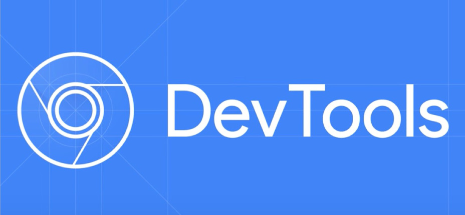

# [Curso de JavaScript Avanzado para desarrolladores Front-end](https://fictizia.com/formacion/curso-javascript-avanzado)
### POO con JS, ECMA6, Patrones de diseño, AJAX avanzado, HTML5 avanzado, APIs externas.

## Clase 2

### Tools for Web Developers



**Recursos**
- [Blog de Chromium](https://blog.chromium.org/)
- [Google Developers](https://developers.google.com/)
- [@ChromiumDev en Twitter](https://twitter.com/chromiumdev)
- [Shows for Web Developers](https://developers.google.com/web/shows/?hl=es)
- [Google Chrome Team en Github](https://github.com/googlechrome)
- [Web Fundamentals: GUIDES](https://developers.google.com/web/fundamentals/?hl=es)
- [Web Fundamentals: Code Labs](https://developers.google.com/web/fundamentals/codelabs/?hl=es)
- [Novedades](https://developers.google.com/web/updates/)

**Herramientas principales**
- Canary
- PageSpeed
- Lighthouse
- Puppeteer
- Workbox
- Chrome Developer Tools

### Canary


- [Web oficial](https://www.google.com/intl/en/chrome/canary/)

### PageSpeed


**Doc**
- [PageSpeed](https://developers.google.com/speed/)
- [Guía PageSpeed Insights](https://developers.google.com/speed/docs/insights/about)
- [Referencia API](https://developers.google.com/speed/docs/insights/v4/reference/)
- [F.A.Q](https://developers.google.com/speed/docs/insights/faq)

### Lighthouse


**Doc**
- [Lighthouse en Github](https://github.com/GoogleChrome/lighthouse)
- [Extensión de Chrome](https://chrome.google.com/webstore/detail/lighthouse/blipmdconlkpinefehnmjammfjpmpbjk)

### puppeteer


**Doc**
- [Web Oficial](https://pptr.dev/)
- [Web Oficial | Video presentación](https://youtu.be/lhZOFUY1weo)
- [Web Oficial | Quick start](https://developers.google.com/web/tools/puppeteer/get-started)
- [Headless Chrome: an answer to server-side rendering JS sites](https://developers.google.com/web/tools/puppeteer/articles/ssr)
- [Github](https://github.com/GoogleChrome/puppeteer)
- [Ejemplos](https://github.com/GoogleChrome/puppeteer/tree/master/examples)

### Workbox


**Doc**
- [Video presentación](https://youtu.be/DtuJ55tmjps)
- [Guias](https://developers.google.com/web/tools/workbox/guides/get-started)
- [Módulos](https://developers.google.com/web/tools/workbox/modules/)
- [Ref. Doc.](https://developers.google.com/web/tools/workbox/reference-docs/latest/)

### ChromeDevTools


**Recursos**
- [Slack](https://chromiumdev.slack.com/?redir=%2Fmessages%2Fdevtools)
- [google-chrome-devtools en Stakoverflow](https://stackoverflow.com/questions/tagged/google-chrome-devtools)
- [@ChromeDevTools en Twitter](https://twitter.com/ChromeDevTools)

**Abrir Chrome DevTools**
- En el Menú de Chrome, selecciona `More Tools` > `Developer Tools`.
- Haz clic con el botón secundario en un elemento de la página y selecciona Inspect.
- Usa las [combinaciones de teclas](https://developers.google.com/web/tools/chrome-devtools/inspect-styles/shortcuts) Ctrl+Mayúscula+I (Windows) o Cmd+Opción+I (Mac).


### ChromeDevTools: Paneles

**Device Mode**
> Device Mode Usa Device Mode para desarrollar experiencias web con una completa capacidad de respuestas y que prioricen los dispositivos móviles.

- [Device Mode](https://developers.google.com/web/tools/chrome-devtools/device-mode/)
- [Prueba ventanas de visualización adaptables y específicas para cada dispositivo](https://developers.google.com/web/tools/chrome-devtools/device-mode/emulate-mobile-viewports)
- [Emula sensores: ubicación geográfica y acelerómetro](https://developers.google.com/web/tools/chrome-devtools/device-mode/device-input-and-sensors)

**Elements**
> Panel Elements Usa el panel Elements para iterar la distribución y el diseño de tu sitio mediante la libre manipulación de DOM y CSS.

- [Inspecciona y modifica ligeramente tus páginas](https://developers.google.com/web/tools/chrome-devtools/inspect-styles/)
- [Edita estilos](https://developers.google.com/web/tools/chrome-devtools/inspect-styles/edit-styles)
- [Edita el DOM](https://developers.google.com/web/tools/chrome-devtools/inspect-styles/edit-dom)

**Console**
> Panel Console Usa el panel Console para registrar información de diagnóstico durante el desarrollo o úsalo como un shell para interactuar con el código JavaScript en la página.

- [Cómo usar la consola](https://developers.google.com/web/tools/chrome-devtools/console/)
- [Interactúa desde la línea de comandos](https://developers.google.com/web/tools/chrome-devtools/console/command-line-reference)

**Sources**
> Panel Sources Depura tu código JavaScript con puntos de interrupción en el panel Sources o conecta los archivos locales mediante espacios de trabajo para usar el editor en tiempo real de DevTools.

- [Depura con puntos de interrupción](https://developers.google.com/web/tools/chrome-devtools/javascript/add-breakpoints)
- [Depura código ofuscado](https://developers.google.com/web/tools/chrome-devtools/javascript/add-breakpoints)
- [Configura la persistencia con los espacios de trabajo de DevTools](https://developers.google.com/web/tools/setup/setup-workflow)

**Network**
> Panel Network Usa el panel Network para obtener información sobre recursos solicitados y descargados, y optimizar el rendimiento de carga de tu página.

- [Conceptos básicos del panel Network](https://developers.google.com/web/tools/chrome-devtools/network-performance/resource-loading)
- [Comprensión de Resource Timing](https://developers.google.com/web/tools/chrome-devtools/network-performance/understanding-resource-timing)
- [Limitación de la red](https://developers.google.com/web/tools/chrome-devtools/network-performance/network-conditions)


**Timeline**
> Panel Timeline Usa el panel Timeline para mejorar el rendimiento del tiempo de ejecución de la página mediante la grabación y la exploración de los diferentes eventos que ocurren durante el ciclo de vida de un sitio.

- [Cómo ver el rendimiento](https://developers.google.com/web/tools/chrome-devtools/evaluate-performance/timeline-tool)
- [Analiza el rendimiento del tiempo de ejecución](https://developers.google.com/web/tools/chrome-devtools/rendering-tools/)
- [Diagnostica diseños sincrónicos forzados](https://developers.google.com/web/tools/chrome-devtools/rendering-tools/forced-synchronous-layouts)


**Profiles**
> Panel Profiles Usa el panel Profiles si necesitas más información que la que proporciona el panel Timeline; por ejemplo, para rastrear pérdidas de memoria.

- [Generador de perfiles de CPU en JavaScript](https://developers.google.com/web/tools/chrome-devtools/rendering-tools/js-execution)
- [Generador de perfiles de montón](https://developers.google.com/web/tools/chrome-devtools/memory-problems/)


**Application**
> Panel Application Usa el panel Resources para inspeccionar todos los recursos que se cargan; entre otros, bases de datos IndexedDB o Web SQL, almacenamiento local y de sesión, cookies, caché de la app, imágenes, fuentes y hojas de estilos.

- [Administra datos](https://developers.google.com/web/tools/chrome-devtools/manage-data/local-storage)


**Security**
> Usa el panel Security para depurar problemas de contenido mixto, problemas de tu certificado y más.

- [Seguridad](https://developers.google.com/web/tools/chrome-devtools/security)


### Extensiones para developers

**Básicas**
- [Lighthouse](https://chrome.google.com/webstore/detail/lighthouse/blipmdconlkpinefehnmjammfjpmpbjk): Test automático para rendimiento y demás, pensado para PWAs
- [aXe](https://chrome.google.com/webstore/detail/axe/lhdoppojpmngadmnindnejefpokejbdd): ¿Piensas que eres Accesibile?
- [Wappalyzer](https://chrome.google.com/webstore/detail/wappalyzer/gppongmhjkpfnbhagpmjfkannfbllamg?hl=en%20): ¿Cómo se crea esta web?
- [Full Page Screen Capture](https://chrome.google.com/webstore/detail/full-page-screen-capture/fdpohaocaechififmbbbbbknoalclacl): Captura de pantalla
- [JSONView](https://chrome.google.com/webstore/detail/jsonview/chklaanhfefbnpoihckbnefhakgolnmc?hl=en%20): Visualiza un JSON bien
- [ColorZilla](https://chrome.google.com/webstore/detail/colorzilla/bhlhnicpbhignbdhedgjhgdocnmhomnp): La vida es color... ¡imprescindible!
- [checkbot](https://www.checkbot.io/): ¿Como va tu SEO, seguridad y velocidad...?

**Extras**
- [Site Palette](https://chrome.google.com/webstore/detail/site-palette/pekhihjiehdafocefoimckjpbkegknoh): Paleta de colores para tu web 
- [WhatFont](https://chrome.google.com/webstore/detail/whatfont/jabopobgcpjmedljpbcaablpmlmfcogm?hl=en): Identifica la fuente a golpe de ratón
- [Web Developer Checklist](https://chrome.google.com/webstore/detail/web-developer-checklist/iahamcpedabephpcgkeikbclmaljebjp): Típica lista con todo lo que debemos de hacer antes de subir a producción
- [BuiltWith Technology Profiler](https://chrome.google.com/webstore/detail/builtwith-technology-prof/dapjbgnjinbpoindlpdmhochffioedbn): ¿Cómo se crea esta web?
- [Awesome Screenshot](https://chrome.google.com/webstore/detail/awesome-screenshot-screen/nlipoenfbbikpbjkfpfillcgkoblgpmj?hl=en): Capturas y videos de la pantalla.
- [Pestaña de Flickr](https://chrome.google.com/webstore/detail/flickr-tab/bhnpmdabjgpimmnbmhefncbghknfegog): Una imagen nueva cada vez
- [Allow-Control-Allow-Origin: *](https://chrome.google.com/webstore/detail/allow-control-allow-origi/nlfbmbojpeacfghkpbjhddihlkkiljbi/reviews): Añade CORS a tus peticiones ajaxs
- [User-Agent Switcher](https://chrome.google.com/webstore/detail/user-agent-switcher/bhchdcejhohfmigjafbampogmaanbfkg): Camufla tu navegador
- [Lorem Ipsum Generator (Default Text)](https://chrome.google.com/webstore/detail/lorem-ipsum-generator-def/mcdcbjjoakogbcopinefncmkcamnfkdb?hl=en%20): Generando Textos para todo xD
- [Site Spider, Mark II](https://chrome.google.com/webstore/detail/site-spider-mark-ii/gedjofgioahckekhpgknhchelbpdogok?hl=en%20): Search Spider super útil
- [CSSViewer](https://chrome.google.com/webstore/detail/cssviewer/ggfgijbpiheegefliciemofobhmofgce): Inspector de CSS
- [Check My Links](https://chrome.google.com/webstore/detail/check-my-links/ojkcdipcgfaekbeaelaapakgnjflfglf?hl=en-US&utm_source=chrome-ntp-launcher): ¿Linsk rotos?
- [Chrome Daltonize!](https://chrome.google.com/webstore/detail/chrome-daltonize/efeladnkafmoofnbagdbfaieabmejfcf?hl=en-US&utm_source=chrome-ntp-launcher): Accesibilidad pensada para el contraste de colores.
- [Search by Image (by Google)](https://chrome.google.com/webstore/detail/search-by-image-by-google/dajedkncpodkggklbegccjpmnglmnflm): Busca la imagen en google con un click
- [Instant Wireframe](https://chrome.google.com/webstore/detail/instant-wireframe/pmpmnmbgidlnoamkpmcikaejhmeldnha): Generando un Wireframe de toda una web existente
- [Dimensions](https://chrome.google.com/webstore/detail/dimensions/baocaagndhipibgklemoalmkljaimfdj): Medir pixeles
- [Window Resizer](https://chrome.google.com/webstore/detail/window-resizer/kkelicaakdanhinjdeammmilcgefonfh?hl=en): ¿Cómo se ve mi web en otros tamaños de dispositivo?


### Extensiones para developers: SAFETY FIRST


- [Browser Extensions Are a Privacy Nightmare: Stop Using So Many of Them](https://www.howtogeek.com/188346/why-browser-extensions-can-be-dangerous-and-how-to-protect-yourself/)
- [Google Chrome WARNING – Using these popular extensions could put your computer at risk](https://www.express.co.uk/life-style/science-technology/907189/Google-Chrome-update-store-extensions-malware-browser-security-risk)
- [Look out: chrome extension malware has evolved](https://www.wired.com/story/chrome-extension-malware/)
- [Hijacked Extensions Put 4.7 Million Chrome Users at Risk](https://www.securityweek.com/hijacked-extensions-put-47-million-chrome-users-risk)
- [Quora | What dangers are associated with Google Chrome extensions?](https://www.quora.com/What-dangers-are-associated-with-Google-Chrome-extensions)
- [Why you should be careful with browser extensions](https://www.kaspersky.com/blog/browser-extensions-security/20886/)
- [Chrome Has a Malware Problem, and Google Needs to Fix It](https://www.tomsguide.com/us/chrome-extension-security-problems,news-26082.html)
- [Understand the Inherent Risk in Browser Extensions](https://www.infosecurity-magazine.com/blogs/risk-browser-extensions/)
- [Google Chrome Extensions: 6 Security Facts](https://www.darkreading.com/risk-management/google-chrome-extensions-6-security-facts/d/d-id/1103551)
- [4 Malicious Chrome Extensions Put 500k Users at Risk of Click Fraud](https://www.hackread.com/malicious-chrome-extensions-click-fraud-risk/)
- [Stackoverflow | How Big a Security Risk are Browser Extensions?](https://stackoverflow.com/questions/1941938/how-big-a-security-risk-are-browser-extensions)


### JSHint
- [JSHint Online](http://jshint.com/)
- [JSHint About](http://jshint.com/about/)
- [JSHint Repository](https://github.com/jshint/jshint)

### EsLint

- [Demo](http://eslint.org/demo/)
- [Configuring ESLint](http://eslint.org/docs/user-guide/configuring)
- [Command Line Interface](http://eslint.org/docs/user-guide/command-line-interface)
- [Rules](http://eslint.org/docs/rules/)
- [Formatters](http://eslint.org/docs/user-guide/formatters/)

### Consola
- [@ChromeDevTools en Twitter](https://twitter.com/chromedevtools?lang=es)
- [Chrome DevTools](https://developer.chrome.com/devtools)

**Métodos:**
- .assert() *Aparece un mensaje de error en la consola si la afirmación es falsa.*:
```javascript
 var controlador = false;
 console.assert(controlador, "\"controlador\" es igual a \"false\"");
```

- .clear() *Limpia la consola*:
```javascript
 console.clear()
```


- .dir() *Retorna una lista interactiva de las propiedades de un objeto*:
```javascript
 console.dir(document.body);
```

- .dirxml() *Retorna una representación HTML del objeto*:
```javascript
 console.dirxml(document.body);
```


- Agrupadores:
 - .group() *Crea un grupo de mensajes de consola*:
 ```javascript
     console.group("bucleFor");
     for(var i=100; i>0; i--){
         console.info("Iteración numero %i", i)
     }
     console.groupEnd();
 ```
 - .groupCollapsed() *Crea un grupo de mensajes de consola minimizados (por defecto)*:
 ```javascript
     console.groupCollapsed("bucleFor");
     for(var i=100; i>0; i--){
         console.info("Iteración numero %i", i)
     }
     console.groupEnd();
 ```
 - .groupEnd() *Cierra el grupo de mensajes*:
 ```javascript
     console.group("bucleFor");
     for(var i=100; i>0; i--){
         console.info("Iteración numero %i", i)
     }
     console.groupEnd();
 ```


- Tablas:
 - .table() *Muestra los datos dentro de una tabla*:
 ```javascript
 var lenguajes = [
     { nombre: "JavaScript", extension: ".js" },
     { nombre: "TypeScript", extension: ".ts" },
     { nombre: "CoffeeScript", extension: ".coffee" }
 ];
 
 console.table(lenguajes);
 
 console.table(lenguajes, "extension");
 ```

- Gestión del tiempo:
 - .time() *Inicia un contador en ms*:
 - .timeEnd() *Para el contador y devuelve el resutlado*:
 ```javascript
  console.time("Medición de miArray");
  var miArray = new Array(1000000);
  for (var i = miArray.length - 1; i >= 0; i--) {    
   miArray[i] = new Object();
  };
  console.timeEnd("Medición de miArray");
 ```

- Notificadores:
 - .log() *Saca un mensaje por consola*:
 ```javascript
  console.log("Hola en formato clásico");
 ```
 - .info() *Similar a console.log*:
 ```javascript
  console.info("Hola en formato informativo");
 ```
 - .warn() *Similar a Console.log*:
 ```javascript
  console.warn("Hola en formato alerta");
 ```
 - .error() *Similar a console.log, invcluye *:
 ```javascript
  console.error("Hola en formato error");
 ```

- Formateadores:

Formato | Descripción
------------ | -------------
%s | Cadena
%d o %i | Número entero
%f | Decimal
%o | DOM
%O | Objeto js
%c | CSS

- Ejemplos:
 - *%o* para estrcuturas del DOM
 ```javascript
  var parrafos = document.getElementsByTagName("p");
  console.log("DOM: %o", parrafos);
 ```
 - *%O* para objectos JS
 ```javascript    
  var objeto = {"nombre":"Yo","Apellido":"Mismo"};
  console.log("Objeto: %O", objeto);
 ```
 - usando CSS:
 ```javascript
  console.log('Esto es aburrido...');
  console.log('%c Pero se puede mejorar fácilmente! ', 'background: #3EBDFF; color: #FFF; font-size:25px;');
 ```
 
 ### Caracteres especiales:

- `\t` *Tabulador*
- `\'` *Comillas Simples*
- `\"` *Comillas Dobles*
- `\\` *\*
- `\n` *Salto de línea*

```javascript
    function caracteresDemo () {
    console.log("Hasta aquí... todo correcto. Ahora vamos a \"tabular\":\tves? Ya estamos más lejos.\n\'Otra linea ;-)\'")
    };
```

### Comentarios
- Una línea
```javascript
// Comentario en una línea
```
- Multiples Líneas
```javascript
/*
Una Línea....
Otra linea...
Etc...
*/
```
- [JSDoc](https://en.wikipedia.org/wiki/JSDoc)

### Variables

- No se pueden usar espacios
```javascript
var con espacios = 1;
```

- No usar un número delante
```javascript
var 1numero = 1;
```

- Válidos, pero no recomendado
```javascript
var con_guiones_bajos = 1;
var dame$ = 1;
```

- Válidos, es mejor usar [camelCase](https://es.wikipedia.org/wiki/CamelCase)
```javascript
var otraOpcion = 1;
var opcionCon123123 = 1;
```


### Tipos de variables

Operador *typeof* y su [especificación](http://www.ecma-international.org/ecma-262/5.1/#sec-11.4.3)

- [x] Undefined
```javascript
typeof undefined
typeof noDefinido
typeof tampocoCreado
```

- [x] Object
```javascript
typeof null
typeof [15, 4]
typeof new Date()
typeof {a:1}
```

- [x] Boolean
```javascript
typeof false
typeof true
typeof Boolean(false)
```

- [x] Number
```javascript
typeof 3
typeof 3.14
typeof NaN
typeof Infinity
```

- [x] String
```javascript
typeof "hola"
```

- [x] Function
```javascript
typeof function(){}
```

- [x] Symbol (ECMA6)

> Ahora tenemos los símbolos, nuevo tipo de datos que sirve como identificador único para atributos de objetos
> [EcmaScript 6: Símbolos](http://miguelsr.js.org/2015/08/20/es6-symbols.html) de [Miguel Sánchez](http://miguelsr.js.org/about/)

```javascript
typeof Symbol()
typeof Symbol('simbolo')
```


### Matemáticas Básicas
```javascript
var suma = 5 + 4;
var resta = 10 - 6;
var multiplicacion = 3 * 3;
var division = 6 / 2;
var modulo = 43 % 10;

function calcular (operacion) {
    console.log(operacion);
};
```

### Matemáticas Básicas (Agrupando operaciones)
```javascript
var expresion1 = (3 + 7) * 10;
var expresion2 = (-56 * 6) - 74 * -25;
var expresion3 = (3 * 3) + 10 - 12 / 2;
var expresion4 = 44 + (83 % (33 + 100));
var expresion5 = -145 + (500 / 10 - 5) + 10 * 10 ;

function calcular (operacion) {
    console.log(operacion);
};
```

### Matemáticas Básicas (crecimiento y decrecimiento)
```javascript
var numero = 5;

console.log(--numero); // 4
console.log(numero--); // 5 (luego 4)
console.log(++numero); // 6
console.log(numero++); // 5 (luego 6)
```

### Operadores de asignación
- = *Asignacion*
```javascript
var x = 1;
var y = 2;
x = y;
console.info("\"x\" vale ", x);
```

- += *Suma*
```javascript
var x = 1;
var y = 2;
x += y;
console.info("\"x\" vale ", x); // x = x + y
```

- -= *Resta*
```javascript
var x = 1;
var y = 2;
x -= y;
console.info("\"x\" vale ", x); // x = x - y
```

- *= *Multiplicación*
```javascript
var x = 1;
var y = 2;
x *= y;
console.info("\"x\" vale ", x); // x = x * y
```

- /= *División*
```javascript
var x = 1;
var y = 2;
x /= y;
console.info("\"x\" vale ", x); // x = x / y
```

- %= *Resto*
```javascript
var x = 1;
var y = 2;
x %= y;
console.info("\"x\" vale ", x); // x = x % y
```


**Jugando con variables**

```javascript
var empezoComo3 = 3;
era3();

empezoComo3 = 35;
era3();

empezoComo3 = empezoComo3 + 30;
era3();

empezoComo3 += 4;
era3();

empezoComo3++;
era3();

empezoComo3 -= 12;
era3();

empezoComo3--;
era3();

empezoComo3 *= 10;
era3();

empezoComo3 /= 11;
era3();

empezoComo3 += "texto";
era3();

empezoComo3 += 20;
era3();

empezoComo3++;
era3();


function era3 () {
    console.log("empezoComo3 debería ser 3, ahora su valor es " + empezoComo3);
};
```

### Interacción Básica con el Usuario

- alert():
    ```javascript
    alert("¡Bienvenido a esta web!");
    ```

- confirm():
    ```javascript
    confirm("¿Esta seguro que desea abandonar esta web?");
    ```


- Ejemplo:
    ```javascript
    var respuesta = confirm("presiona un botón!");
    if (respuesta === true) {
        console.log("Has aceptado!");
    } else {
        console.log("Has cancelado");
    }
    ```

- prompt():
    ```javascript
    prompt("¿Como te llamas?");
    ```

- Registremos los datos en una variable:
    ```javascript
    var nombre = prompt("¿Como te llamas?");
    ```

### Modo Estricto
> El modo estricto hace varios cambios en la semántica normal de JavaScript. Primero, modo estricto elimina algunos errores silenciosos de JavaScript cambiando a que lance los errores. Segundo, modo estricto corrige errores que hacen que sea difícil para los motores de JavaScript para realizar optimizaciones: código de modo estricto a veces se puede hacer para correr más rápido que el código idéntico que no es estricto. Tercero, el modo estricto prohíbe sintaxis que es probable que sea definida en futuras versiones de ECMAScript.
> - [Mozilla](https://developer.mozilla.org/es/docs/Web/JavaScript/Referencia/Modo_estricto)

- [Compatibilidad](http://caniuse.com/#feat=use-strict)

En resumen:
- Detectaremos más errores
- Mejora la interpretación, lo que aumenta la velocidad de ejecucción.
- Previene que usemos sintaxis de futuras versiones de ECMAScript.

Aplicándolo a todo nuestro código

```javascript
// ./script.js
(function() {
  "use strict";

  // Nuestro código

})();
```

Aplicándolo solo en parte del código
```javascript
// ./script.js
function estricta(){
  'use strict';
  function anidada() {
      return "Yo también!";
  }
  return "Hola! Soy una función en modo estricto!  " + anidada();
}

function noEstricta() {
    return "yo no soy una función estricta.";
}
```

Algunos ejemplos:

- Error: Usar variables u objetos sin declararlos antes.

```javascript
    function estricto(){
        'use strict';
        pi = 3.14;
        console.log(pi);
    }
```

- Error: Borrar variables, objetos o funciones. 

```javascript
    function estricto(){
        'use strict';
        pi = 3.14;
        delete pi
    }
```

- Error: Duplicar parámetros

```javascript
    function estricto(){
        'use strict';
        function x (p1, p1){
            // código
        }
    }
```

- Error: Al usar carácteres escapados
 
```javascript
    function estricto(){
        'use strict';
        var x = \010; 
    }
```

Error: Al usar *writable:false*

```javascript
    function estricto(){
        'use strict';
        var obj = {};
        Object.defineProperty(obj, "x", {value:0, writable:false});
        obj.x = 3.14;
    }
```

Error: Al usar *with* 

```javascript
    function estricto(){
        'use strict';
        with(document.getElementById('elemento').style) {
            backgroundColor = 'black';
            color = 'red';
            font_Size = '32px'; // Crea una variable global
        }
    }
```

Error: Al usar *eval()* por seguridad

```javascript
    function estricto(){
        'use strict';
        eval ("var x = 2");
        console.log(x);
    }
```


Otras palabras reservadas en modo estricto:
- implements
- interface
- let
- package
- private
- protected
- public
- static
- yield


### Comparadores básicos

```javascript
var mayorQue = 100 > 10;
var menorQue = 10 < 100;
var mayorIgual = 100 >= 10;
var menorIgual = 10 <= 100;
var igual = 10 == 10;
var igualTotalmente = 10 === 10;
var noIgual = 100 != 10;

function comparar (dato) {
    console.log(dato);
};
```


### Comparadores complejos
- **AND(&&)**
```javascript
    var comparacion;
    comparacion = true && true; // true
    comparacion = true && false // false
    comparacion = false && false // false
    comparacion = false && true // false
```

- **OR(||)**
```javascript
    var comparacion;
    comparacion = true || true; // true
    comparacion = true || false // true
    comparacion = false || false // false
    comparacion = false || true // true
```

- Ejemplos:
```javascript
var ex1 = true && true; // true
var ex2 = (2 == 2) && (3 >= 6); // false
var ex3 = (2>3) || (17 <= 40); // true
var ex4 = false || false; // false

function condicionalAvanzado ( paraComparar ) {
    if (paraComparar) {
        console.log("Verdadero!");
    } else {
        console.log("falso!");
    };
};
```

### Otros datos

- Valor *real* es *true*:
```javascript
console.log("valor boleano de \"Fictizia\":", Boolean("Fictizia")  );
console.log("valor boleano de 1235:", Boolean(1235));
console.log("valor boleano de -1235:", Boolean(-1235));
console.log("valor boleano de un objeto:", Boolean({saludo: "hola"}));
console.log("valor boleano de un array:", Boolean(["platano", -1, false]));
console.log("valor boleano de un array:", Boolean(function(){}));
```

- Sin valor *real* es *false*:
```javascript
console.log("valor boleano de \"\":", Boolean("")  );
console.log("valor boleano de 0:", Boolean(0));
console.log("valor boleano de -0:", Boolean(-0));
console.log("valor boleano de null:", Boolean(null));
console.log("valor boleano de undefined:", Boolean(undefined));
console.log("valor boleano de NaN:", Boolean(NaN));
```

### Asignación por igualdad
```javascript
	var administrador = 'Yo mismo';
	var esAdministrador = (administrador === 'Yo mismo');
```
    
### If... else

- Estructura:
    ```javascript
    /* IF ...ELSE
    if (-algo verdadero-) {
        -ejecutaremos este código-
    } else {
        -Si lo anterior no era verdadero, se ejecutara este código-
    };
    */
    ```

- Documentación:
    - [If... else en w3schools](http://www.w3schools.com/js/js_if_else.asp)
    - [If... else en MDN](https://developer.mozilla.org/en-US/docs/Web/JavaScript/Reference/Statements/if...else)

- Ejemplo:
    ```javascript
    if (true) {
        console.log("true, por eso me ejecuto");
    } else {
        console.log("false, por eso me ejecuto");
    }
    ```


### Else if...

```javascript
function testCondiccion (condicion){
    if (condicion == 1) {
        console.log("1, por eso me ejecuto");
    } else if (condicion == 2){
        console.log("2, por eso me ejecuto");
    } else {
        console.log("no es 1 o 2, por eso me ejecuto");
    }
}
```


### Switch

- Estructura:
    ```javascript
    /* Switch
	switch(expresión) {
	    case n:
	        //Código
	        break;
	    case n:
	        //Código
	        break;
	    default:
	        //Código
	}
    */
    ```

- Documentación:
    - [Switch en w3schools](http://www.w3schools.com/js/js_switch.asp)
    - [Switch en MDN](https://developer.mozilla.org/es/docs/Web/JavaScript/Referencia/Sentencias/switch)

- **Casos únicos:**
    ```javascript
	var nombre = "";
	switch (nombre) {
	  case "Pepe":
	    console.log("Hola Pepe");
	    break;
	  case "Luis":
	    console.log("Hola Luis");
	    break;
	  case "Antonio":
	    console.log("Hola Antonio");
	    break;
	  default:
	    console.log('Ninguno de los nombres que pensamos... es '+nombre);
	}
    ```

- **Multiples coincidencias:**
    ```javascript
	var nombre = "";
	switch (nombre)
	{
	   case "Pepe":
	   case "Luis":
	   case "Antonio":
	       alert('Hola '+nombre);
	       break;

	   default:
	       console.log('Ninguno de los nombres que pensamos... es '+nombre);
	}
    ```

### Operador Ternario (?:)

- Estructura:
    ```javascript
    /* 
    -- Una operación por caso --
	condicion ? expresion1 : expresion2 
    
    -- Multiples Operaciones por caso --
	condicion ? (
		operacion1,
		operacion2,
		otraoperacion
	) : ( 
		operacion1,
		operacion2,
		otraoperacion
	);

    -- Evaluaciones multiples --
    	condicion ? expresion1 : condicion2 ? expresion1 : expresion2;
    */
    ```

- Una operación por caso:
```javascript
	var esMiembro = true;
	console.info("El pago son  " + (esMiembro ? "20.00€" : "50.00€"));
```

- Evalución múltiple:
```javascript
	var esMiembro = true;
	var esAdulto = true;
	console.info(esMiembro ? "El pago son 20.00€" : esAdulto ? "Puedes enviar la solicitud cuando quieras" : "Tines que esperar aún. Lo siento.");
```

- Múltiples Operaciones:
```javascript
	var mensaje,
	esMiembro = true;
	
	esMiembro ? (
		mensaje = "El pago son 20.00€",
		console.info(mensaje)
	) : (
		mensaje = "El pago son 50.00€",
		console.info(mensaje)
	);
```

### While

- Estructura:
    ```javascript
    /*  --while--
    while (-Condición-) {
        -Instrucciones-
    };
    */
    ```

- Documentación:
    - [While en w3schools](http://www.w3schools.com/js/js_loop_while.asp)
    - [While en MDN](https://developer.mozilla.org/en-US/docs/Web/JavaScript/Reference/Statements/while)

- Bucle infinito:
    Este es un error muy común.

    ```javascript
    while (true) {
        console.log("Este texto se imprime hasta el infinito...");
    };
    ```

- Bucle que no se ejecutará:
    ```javascript
    while (false) {
        console.log("Este texto jamas se imprimirá...");
    };
    ```

- Ejemplo:
    ```javascript
    var control = 1;
    while (control <= 10) {
        console.log(control);
        control++;
    };
    ```


### For

- Estructura:
    ```javascript
    /*  --for--
    for (-Expresión inicial-; -Condición-; -Expresión Actualización-) {
        -Instrucciones-
    };
    */
    ```

- Documentación:
    - [For en w3schools](http://www.w3schools.com/js/js_loop_for.asp)
    - [For en MDN](https://developer.mozilla.org/en-US/docs/Web/JavaScript/Reference/Statements/for)
    - [Dominando el rendimiento](https://web.archive.org/web/20141205235948/https://blogs.oracle.com/greimer/entry/best_way_to_code_a)


- Ejemplo clásico:
    ```javascript
    for (var i = 0; i < 10; i++) {
        console.log(i);
    }
    ```


### Do... While

- Estructura:
    ```javascript
    /* --Do...while--
    do{
       -Instrucciones-
    } while (-Condición-);
    */
    ```

- Documentación:
    - [Do... While en w3schools](http://www.w3schools.com/js/js_loop_while.asp)
    - [Do... While en MDN](https://developer.mozilla.org/en-US/docs/Web/JavaScript/Reference/Statements/do...while)

- Ejemplo:
    ```javascript
    var i = 0;
    do {
       i++;
       console.log(i);
   } while (i < 10);
    ```

- Al menos se ejecutará una vez, aunque la premisa no sea verdadera.

    ```javascript
    do{
       console.warn("me ejecuto")
    } while (false);
    ```

### Break y Continue

- *Continue* nos permite saltar parte del bucle.
```javascript
for (var i = 0; i < 10; i++) {
    
    // Salta el 5 y sigue...
    if (i === 5) { 
    	continue; 
    }
    
    console.log("El valor de i es "+i);
}
```

- *Break* nos permite salir del bucle.
```javascript
for (var i = 0; i < 10; i++) {
    
    // Llega a 5 y sale.
    if (i === 5) { 
    	break; 
    }
    
    console.log("El valor de i es "+i);
}
```

### Usos Avanzados

- Ejemplo usando decrecimiento:
    ```javascript
    for (var i = 10; i > 0; i--) {
        console.log(i);
    }    
    ```

- Ejemplo usando varios contadores:
    ```javascript
    for (var i = 0, x = 1, z = 2, tope = 10; i <= tope; x *= z, i++ ) {
        console.log("i vale "+i+", x vale "+x+", z vale "+z);
    }
    ```

### Números

**Propiedades**

- [Notación científica](https://es.wikipedia.org/wiki/Notaci%C3%B3n_cient%C3%ADfica)

- .MAX_VALUE() *El número más grande representable (1.7976931348623157e+308)*:
    ```javascript
       var numero1 = 1.7976931348623157e+308;
       var numero2 = 1.7976931348623157e+310;
       
       function verificarValorMaximo(num){
       
       	if (num <= Number.MAX_VALUE) {
       	  console.log("El número no es infinito");
       	} else {
       	  console.log("El número es infinito");
       	}
       	
       }
       
       verificarValorMaximo(numero1);
       verificarValorMaximo(numero2);    
    ```

- .MIN_VALUE() *El número más pequeño representable (5e-324)*:
    ```javascript
       var numero1 = 5e-323;
       var numero2 = 5e-326;
       
       function verificarValorMinimo(num){
       
       	if (num >= Number.MIN_VALUE) {
       	  console.log("El número no es infinito");
       	} else {
       	  console.log("El número es infinito");
       	}
       	
       }
       
       verificarValorMinimo(numero1);
       verificarValorMinimo(numero2);
    ```

- .NEGATIVE_INFINITY() *El valor negativo de la propiedad del objeto global Infinity*:
    ```javascript
        var numeroMinimo = (-Number.MAX_VALUE) * 2
        console.log(numeroMinimo);
        
        if (numeroMinimo === Number.NEGATIVE_INFINITY) {
         numeroMinimo = 0;
        }
        console.log(numeroMinimo);
    ```

- .NaN() *Not A Number*:
    ```javascript
        NaN === NaN;        // false
        Number.NaN === NaN; // false
        isNaN(NaN);         // true
        isNaN(Number.NaN);  // true    
    ```

- .POSITIVE_INFINITY() *Representa el infinito positivo*:
    ```javascript
        var numeroMaximo = Number.MAX_VALUE * 2
        console.log(numeroMaximo);
        
        if (numeroMaximo === Number.POSITIVE_INFINITY) {
         numeroMaximo = 0;
        }
        console.log(numeroMaximo);    
    ```

**Métodos:**

- .toExponential() *Devuelve una cadena con el valor número en formato de potencia*:
    ```javascript
        var numObj = 77.1234;
        
        console.log(numObj.toExponential());  // 7.71234e+1
        console.log(numObj.toExponential(4)); // 7.7123e+1
        console.log(numObj.toExponential(2)); // 7.71e+1
        console.log(77.1234.toExponential()); // 7.71234e+1   
    ```


- .toFixed() *Devulve un numero con decimales*:
    ```javascript
        var numObj = 12345.6789;
        
        numObj.toFixed();       //'12346' redondeo
        numObj.toFixed(1);      //'12345.7'
        numObj.toFixed(6);      //'12345.678900' Se añaden ceros en caso necesario
        (1.23e+20).toFixed(2);  //'123000000000000000000.00'
        (0).toFixed(2);         //'0.00'
        2.34.toFixed(1);        //'2.3' redondeo
        -2.34.toFixed(1);       //-2.3 Numeros negativos no son devueltos como cadenas.
        (-2.34).toFixed(1);     //'-2.3' En caso de usar paréntesis se salta la limitación 
    ```


- .toLocaleString() *Devulve una cadena con el valor numeral representado en lenguaje local*:
    ```javascript
        var numero = 3500;
        // En Local
        console.log(numero.toLocaleString()); // 3.500
        // En Árabe
        console.log(numero.toLocaleString('ar-EG')); // ٣٬٥٠٠
        // En Chino decimal
        console.log(numero.toLocaleString('zh-Hans-CN-u-nu-hanidec')); // 三,五〇〇
    ```


- .toPrecision() *Devuelve un numero precisado*:
    ```javascript
        var numero = 5.123456;
        
        console.log(numero.toPrecision());    // 5.123456
        console.log(numero.toPrecision(5));   // 5.1235
        console.log(numero.toPrecision(2));   // 5.1
        console.log(numero.toPrecision(1));   // 5
        console.log((1234.5).toPrecision(2)); // 1.2e+3 (En ocasiones )
    ```


- .toString() *Devuelve una cadena con el número en la base que determinemos*:
    ```javascript
        console.log((17).toString());     // '17'
        console.log((17.2).toString());   // '17.2'
        console.log((-0xff).toString(2)); // '-11111111'
        console.log((254).toString(16));  // 'fe'
    ```
 
- .parseFloat() *Devuelve un número décimal partiendo de una cadena*:
    ```javascript
        Number.parseFloat("3.14"); // 3.14
        Number.parseFloat("314e-2"); // 3.14
        Number.parseFloat("0.0314E+2"); // 3.14
        Number.parseFloat("3.14textos..."); // 3.14
        Number.parseFloat("1textos..."); //1
    ```
    
- .parseInt() *Devuelve un número entero en una base especifica o en base 10 partiendo de una cadena*:
    ```javascript
        parseInt(" 0xF", 16); // 15
        parseInt(" F", 16);  // 15
        parseInt("17", 8);  // 15
        parseInt(021, 8);  // 15
        parseInt("015", 10);  // 15
        parseInt(15.99, 10);  // 15
        parseInt("15,123", 10);  // 15
        parseInt("FXX123", 16);  // 15
        parseInt("1111", 2);  // 15
        parseInt("15*3", 10);  // 15
        parseInt("15e2", 10);  // 15
        parseInt("15px", 10);  // 15
        parseInt("12", 13);  // 15
    ```

### Math

**Métodos:**

- .random() *Devuelve un número aleatorio*
    ```javascript
        // Número aleatorio entre 0 (incluido) y 1 (excluido)
        Math.random(); 
        
        // Retorna un número aleatorio entre min (incluido) y max (excluido)
        Math.random() * (max - min) + min;
        Math.random() * (11 - 0) + 0;
        
        // Retorna un entero aleatorio entre min (incluido) y max (excluido)
        Math.floor(Math.random() * (11 - 0)) + 0;
    ```

- .round() *Devuelve el valor de un número redondeado al entero más cercano*
    ```javascript
        Math.round(20.5); // 21
        Math.round(20.49); // 20
        Math.round(-20.51); // -21
    ```

- .Floor() *Devuelve el máximo entero menor o igual a un número.*
    ```javascript
        Math.floor(20.5); // 21
        Math.floor(20.49); // 20
        Math.floor(-20.51); // -21
    ```
- .max() *retorna el mayor de cero o más números*
    ```javascript
        function calcularMayor(valor1, valor2, valor3){
            return Math.max(valor1, valor2, valor3);
        }
        
        // Mejorando calcularMayor
        function calcularMayor(){
        	var args = Array.prototype.slice.call(arguments);
        	return Math.max.apply(null, args);
        }

    ```
- .min() *retorna el menor de cero o más números*
    ```javascript

        function calcularExtremos(){
        	var args = Array.prototype.slice.call(arguments);
        	return {minimo: Math.min.apply(null, args),
        			maximo: Math.max.apply(null, args)
        	};
        }
        
        
        misExtremos = calcularExtremos(1,2,4,56,-123);
        
        console.log("Mínimo: "+misExtremos.minimo+"\n"+"Máximo: "+misExtremos.maximo);
    ```    

**Librerías:**
- [Mathjs](http://mathjs.org/)


### Dates

**Librerías:**
- [Dates.js](http://www.datejs.com/)
- [Momments.js](http://momentjs.com/timezone/)
- [JQuery timeAgo](http://timeago.yarp.com/)
- [Livestamp.js](https://mattbradley.github.io/livestampjs/)

**Metodos**

- Creando Fechas:
    - Fecha Actual:
    ```javascript
        var ahora = new Date();
        console.log(ahora);
    ```
    - Usando milisegundos (desde el 1/1/1970 00:00):
    ```javascript
        var diaDespues = new Date(3600*24*1000);
        console.log(diaDespues);
    ```
    - Usando cadenas de texto:
    ```javascript
        var newYear = new Date("January 1, 2016 00:00:00");
    ```
    - Usando números:
    ```javascript
        var newYear = new Date(2016, 1, 1); // AAAA, MM, DD
        var newYear = new Date(2016, 1, 1, 0, 0, 0); // AAAA, MM, DD, HH, MM, SS
    ```
    - Usando UTC:
    ```javascript
        var newYear = new Date(Date.UTC(2016, 1, 1));
    ```

- Getters:
    - Local
    ```javascript
        var ahora = new Date();
        console.log("La fecha es " + ahora);
        console.log("==== FECHA ====");
        console.log("El año: " + ahora.getFullYear()); // 4 digitos
        console.log("El mes: " + ahora.getMonth()); // 0 - 11
        console.log("El día de la semana: " + ahora.getDay()); // 0 - 6 (D - S)
        console.log("El día del mes: " + ahora.getDate()); // 1-31
        console.log("==== HORA ====");
        console.log("Horas: " + ahora.getHours());
        console.log("Minutos: " + ahora.getMinutes());
        console.log("Segundos: " + ahora.getSeconds());
        console.log("Milisegundos desde 1/1/1970: "+ ahora.getTime());
        console.log("milisegundos: " + ahora.getMilliseconds());
    ```
    - UTC
    ```javascript
        var ahora = new Date();
        console.log("Con UTC: ";
        console.log("==== FECHA ====");
        console.log("El año: " + ahora.getUTCFullYear()); // 4 digitos
        console.log("El mes: " + ahora.getUTCMonth()); // 0 - 11
        console.log("El día de la semana: " + ahora.getUTCDay()); // 0 - 6 (D - S)
        console.log("El día del mes: " + ahora.getUTCDate()); // 1-31
        console.log("==== HORA ====");
        console.log("Horas: " + ahora.getUTCHours());
        console.log("Minutos: " + ahora.getUTCMinutes());
        console.log("Segundos: " + ahora.getUTCSeconds());
        console.log("milisegundos: " + ahora.getUTCMilliseconds());
    ```

- Setters:
    - Local
    ```javascript
        var newYear = new Date(Date.UTC(2016, 1, 1));
        console.info("La fecha es " + newYear);
        
        newYear.setFullYear(1980); // Pasamos a 1980
        console.info("La fecha es " + newYear);
        
        newYear.setDate(56); // 1 Enero + 56 Días
        console.info("La fecha es " + newYear);
        
        newYear.setUTCMilliseconds(1500); // 1500ms en formato UTC
        console.info("La fecha es " + newYear);
        
        newYear.setUTCHours(36); // le sumamos 36 horas
        console.info("La fecha es " + newYear);
        
        newYear.setMonth(-6); // le quitamos 6 meses
        console.info("La fecha es " + newYear);
    ```

- Otros:
    - .getTimezoneOffset() *Devuelve la diferencia entre tu zona horaria y UTC (en minutos)*
    ```javascript
        ahora.getTimezoneOffset();
    ```
    - .toString(), .toDateString(), .toTimeString() *Devuelve una cadena con la fecha*
    ```javascript
        ahora.toString(); // Fecha y Hora
        ahora.toDateString(); // Solo Fecha
        ahora.toTimeString(); // Solo Hora
    ```
    - .toUTCString(), .toISOString() *Devuelve una cadena con la fecha en formatos específicos*
    ```javascript
        ahora.toISOString(); // ISO
        ahora.toUTCString(); // UTC
    ```
    - .toLocaleString() *Devuelve una cadena con la fecha en version local.*
    ```javascript
        
        var ahora = new Date();
        console.info(ahora.toLocaleString());
        
        // Código de idioma IETF para Alemán
        console.info(ahora.toLocaleString("de-DE"));
        
        // Opciones Avanzadas para fechas
        var opciones = { 
        weekday: 'long',
        year: 'numeric', 
        month: 'long', 
        day: 'numeric'};
        console.log(ahora.toLocaleString("de-DE", opciones));
    ```
    
    - Tiempo transcurrido:
    ```javascript
        var inicio = new Date();
        // + código
        var fin = new Date();
        var transcurso = fin.getTime() - inicio.getTime();
        console.info("Pasaron "+transcurso+"ms");
    ```


**Truco**

Usar getters para modificar fechas (días, meses, etc...)

Nota: Partiendo del ejemplo de [MDN](https://developer.mozilla.org/en-US/docs/Web/JavaScript/Reference/Global_Objects/Date/setDate)

- sin *getters*
```javascript
	var theBigDay = new Date(1962, 6, 7);
	theBigDay.toLocaleString(); // 6/7/1962 23:00:00
	
	var theBigDay = new Date(1962, 6, 7);
	theBigDay.setDate(24);
	theBigDay.toLocaleString() // 23/7/1962 23:00:00
	
	var theBigDay = new Date(1962, 6, 7);
	theBigDay.setDate(32);
	theBigDay.toLocaleString() // 31/7/1962 23:00:00
	
	var theBigDay = new Date(1962, 6, 7);
	theBigDay.setDate(22);
	theBigDay.toLocaleString() // 21/7/1962 23:00:00
	
	var theBigDay = new Date(1962, 6, 7);
	theBigDay.setDate(22 + 32 +24);
	theBigDay.toLocaleString() // 15/9/1962 23:00:00
```

- con *getters* 
```javascript
	var theBigDay = new Date(1962, 6, 7);
	theBigDay.toLocaleString(); // 6/7/1962 23:00:00
	
	var theBigDay = new Date(1962, 6, 7);
	theBigDay.setDate(theBigDay.getDate() + 24);  
	theBigDay.toLocaleString(); // 30/7/1962 23:00:00
	
	var theBigDay = new Date(1962, 6, 7);
	theBigDay.setDate(theBigDay.getDate() + 32);
	theBigDay.toLocaleString(); // 7/8/1962 23:00:00
	
	var theBigDay = new Date(1962, 6, 7);
	theBigDay.setDate(theBigDay.getDate() + 22);
	theBigDay.toLocaleString(); // 28/7/1962 23:00:00
	
	var theBigDay = new Date(1962, 6, 7);
	theBigDay.setDate(theBigDay.getDate() + 22 + 32 + 24);
	theBigDay.toLocaleString(); // 22/9/1962 23:00:00
```


### String

**Propiedades:**
- .length() *Devuelve la longitud*:
```javascript
var cadena = "Fictizia";

console.log("Fictizia tiene " + cadena.length + " caracteres.");

console.log("Una cadena vacia tiene " + ''.length + " caracteres.");
```
  
**Métodos:**

- .fromCharCode() *Devuelve una cadena creada mediante una secuencia [Unicode](https://www.wikiwand.com/es/Unicode)*:
```javascript
	console.info("Es es el año 2016 ("+ String.fromCharCode(8559,8559,8553,8548,8544) + ")");
```


- .anchor() *Crea un ancla HTML*:
```javascript
	document.body.innerHTML = "Contenidos".anchor("contenidos"); 
	// "<a name="contenidos">Contenidos</a>"
```

- .link() *Crea un enlace*:
```javascript
var textoActivo="Nuestro Curso"
var url="http://www.fictizia.com/formacion/curso_javascript"
document.body.innerHTML = "Haga click para volver a " + textoActivo.link(url);
```

- .charAt() *Devuelve el carácter específico*:
```javascript
var cadena="Fictizia";
console.log("El carácter(posición) 3 es '" + cadena.charAt(3) + "'")
```


- .charCodeAt() *Devuelve el valor Unicode*:
```javascript
var cadena="Fictizia";
console.log("El carácter(posición) 3 es '" + cadena.charAt(3) + "', en unicode ("+cadena.charCodeAt(3)+")")
```


- .concat() *Combina el texto de dos o más cadenas*:
```javascript
var cadena1 = "Oh ";
var cadena2 = "qué maravillosa ";
var cadena3 = "mañana'.";
var combinacion = cadena1.concat(cadena2,cadena3);
console.log(combinacion); // devuelve "Oh qué maravillosa mañana'."
```


- .indexOf() *Devuelve el índice o -1*:
```javascript
"Mundo Web".indexOf("Web") // 6
"Mundo Web".indexOf("web") // -1
```


- .lastIndexOf() *Devuelve el índice de la última coincidencia o -1*:
```javascript
"Fictizia".lastIndexOf("i"); // 6
"Fictizia".lastIndexOf("f"); // -1
```

- .split() *Divide una cadena usando un separador*:
```javascript
function dividirCadena(cadenaADividir,separador) {
   var arregloDeCadenas = cadenaADividir.split(separador);
   console.log('<p>La cadena original es: "' + cadenaADividir + '"');
   console.warn('<br>El separador es: "' + separador + '"');
   console.log("<br>El arreglo tiene " + arregloDeCadenas.length + " elementos: ");

   var elementos = "";
   for (var i=0; i < arregloDeCadenas.length; i++) {
      elementos += arregloDeCadenas[i] + " / ";
   }

   console.info(elementos);

}

var cadenaVerso = "Lorem Ipsum es simplemente el texto de relleno de las imprentas y archivos de texto. Lorem Ipsum ha sido el texto de relleno estándar de las industrias desde el año 1500";
var cadenaMeses = "Jan,Feb,Mar,Apr,May,Jun,Jul,Aug,Sep,Oct,Nov,Dec";

var espacio = " ";
var coma = ",";

dividirCadena(cadenaVerso, espacio);
dividirCadena(cadenaVerso);
dividirCadena(cadenaMeses, coma);
```

- [Using Slice(), Substring(), And Substr() In Javascript By Ben Nadel](https://www.bennadel.com/blog/2159-using-slice-substring-and-substr-in-javascript.htm)

- .slice() *Devuelve una cadena nueva con una sección de otra*:
```javascript
var cadena = "Fictizia";
console.log(cadena.slice(5)); // zia
console.log(cadena.slice(0, 5)); // Ficti
console.log(cadena.slice(3, -1)); // tizi
```

- .substr() *Devuelve los caracteres de una cadena comenzando en la localización especificada, y en el número de caracteres especificado.*:
```javascript
var cadena = "Fictizia";
console.log("(0,5): "    + cadena.substr(0,5)); // Ficti
console.log("(5,3): "    + cadena.substr(5,3)); // zia
```

- .substring() *Devuelve un subconjunto*:
```javascript
var cadena = "Fictizia";
console.log("(0,5): "    + cadena.substring(0,5)); // Ficti
```

- .toLocaleLowerCase() *Devuelve todo en minúsculas con las características locales*:
```javascript
console.log('FICTIZIA'.toLocaleLowerCase()); // 'fictizia'
```

- .toLocaleUpperCase(Devuelve todo en mayúsculascon las características locales) **:
```javascript
console.log('fictizia'.toLocaleUpperCase()); // 'FICTIZIA'
```

- .toLowerCase() *Devuelve todo en minúsculas*:
```javascript
console.log('FICTIZIA'.toLowerCase()); // 'fictizia'
```


- .toUpperCase() *Devuelve todo en mayúsculas*:
```javascript
console.log('fictizia'.toUpperCase()); // 'FICTIZIA'
```

- .trim() *Elimina espacios vacios al principio y final de la cadena*:
```javascript
console.log('  Fictizia '.trim()); // 'Fictizia'
```
