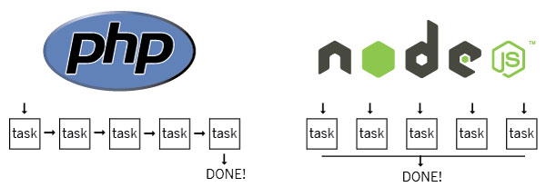
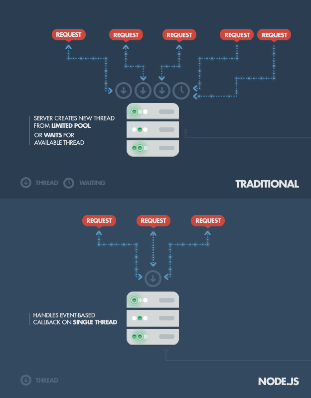
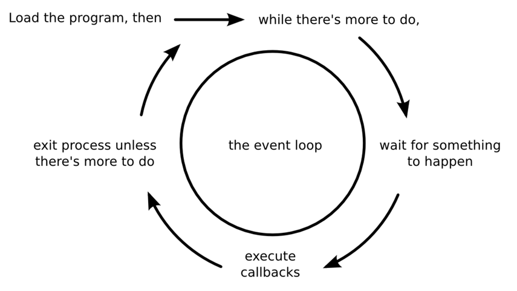

# [Curso de JavaScript Avanzado para desarrolladores Front-end](https://fictizia.com/formacion/curso-javascript-avanzado)
### POO con JS, ECMA6, Patrones de diseño, AJAX avanzado, HTML5 avanzado, APIs externas.


## Clase 21

### Node.js


> Node.js es un entorno en tiempo de ejecución multiplataforma, de código abierto, para la capa del servidor (pero no limitándose a ello) basado en el lenguaje de programación ECMAScript, asíncrono, con I/O de datos en una arquitectura orientada a eventos y basado en el motor V8 de Google. Fue creado con el enfoque de ser útil en la creación de programas de red altamente escalables, como por ejemplo, servidores web. Fue creado por Ryan Dahl en 2009 y su evolución está apadrinada por la empresa Joyent, que además tiene contratado a Dahl en plantilla - [Wikipedia](https://www.wikiwand.com/es/Node.js)


**Otra manera es posible**




**Puntos Fuertes**
- Asincronía (no bloqueo)
- Backend completo
- NPM (comunidad)
- Single thread (paralelismo)
- Librerías propias
- Utilidades
- Código abierto
- Basado en el V8 (escrito en C++) de Google
- Multiplataforma
- Orientado a Eventos
- **No se limita solo a servidores HTTP**

**Librerías interesantes**
- [awesome Node.js](https://github.com/sindresorhus/awesome-nodejs/)
- [Grunt](http://gruntjs.com/)
- [Gulp](http://gulpjs.com/)
- [Express](http://expressjs.com/es/)
- [Mongoose](http://mongoosejs.com/)
- [Socket.io](http://socket.io/)
- [Apache Cordova](http://cordova.apache.org/)
- [Async](https://www.npmjs.com/package/async)
- [Chalk](https://www.npmjs.com/package/chalk)
- [J5](http://johnny-five.io/)
- [GraphicsMagick](http://aheckmann.github.io/gm/)
- [Marked](https://github.com/chjj/marked)
- [Node-restify](https://github.com/restify/node-restify)
- [Webpack](https://github.com/webpack/webpack)
- [Morgan](https://github.com/expressjs/morgan)
- [Nodemailer](https://github.com/nodemailer/nodemailer)
- [Passportjs](http://passportjs.org/)
- [Cheerio](https://github.com/cheeriojs/cheerio)
- [X-ray](https://github.com/lapwinglabs/x-ray)
- [Bower](https://bower.io/)
- [PM2](http://pm2.keymetrics.io/)
- [Electron](http://electron.atom.io/)
- [Yeoman](http://yeoman.io/)
- [Babel](https://babeljs.io/)
- [Helmet](https://www.npmjs.com/package/helmet)
- [Faker](https://www.npmjs.com/package/faker)
- [Protractor](https://www.npmjs.com/package/protractor)
- [Nightwatch.js](http://nightwatchjs.org/)
- [Cypress.io](https://www.cypress.io/)

### JSDramas

**IO.js**


> io.js has merged with the Node.js project again.
There won't be any further io.js releases. All of the features in io.js are available in Node.js v4 and above.

- [Tiempos turbulentos para la comunidad Node.js, ha nacido io.js](http://www.genbetadev.com/actualidad/tiempos-turbulentos-para-la-comunidad-node-js-ha-nacido-io-js)
- [JavaScript I/O](https://iojs.org/es/)

**Dependencias, dependencias, dependencias... y más dependencias**

```javascript
module.exports = leftpad;

function leftpad (str, len, ch) {
  str = String(str);

  var i = -1;

  if (!ch &amp;&amp; ch !== 0) ch = ' ';

  len = len - str.length;

  while (++i &lt; len) {
    str = ch + str;
  }

  return str;
}
```
- [How one developer just broke Node, Babel and thousands of projects in 11 lines of JavaScript](http://www.theregister.co.uk/2016/03/23/npm_left_pad_chaos/)
- [A discussion about the breaking of the Internet](https://medium.com/@mproberts/a-discussion-about-the-breaking-of-the-internet-3d4d2a83aa4d#.r9oqkkuhb)
- [I’ve Just Liberated My Modules](https://medium.com/@azerbike/i-ve-just-liberated-my-modules-9045c06be67c#.mjp6u93c1)
- [Left-pad en GitHub](https://github.com/camwest/left-pad)
- [Is left-pad Indicative of a Fragile JavaScript Ecosystem?](http://developer.telerik.com/featured/left-pad-indicative-fragile-javascript-ecosystem/)
- [Overcoming JavaScript Fatigue](http://developer.telerik.com/topics/web-development/overcoming-javascript-fatigue/)
- [One developer just broke Node, Babel and thousands of projects in 11 lines of JavaScript](https://laravel-news.com/2016/03/one-developer-just-broke-node-babel-thousands-projects-11-lines-javascript/)
- [How 17 Lines of Code Took Down Silicon Valley’s Hottest Startups](http://www.huffingtonpost.com/ken-mazaika/how-17-lines-of-code-took_b_9532846.html)
- [Npm package author revokes his packages, breaking tons of builds](https://evertpot.com/npm-revoke-breaks-the-build/)
- [¿Y si el software Open Source desapareciera?](http://www.xataka.com/servicios/y-si-el-software-open-source-desapareciera)
- [El programador que borró 11 líneas de código y se cargó Internet](http://www.omicrono.com/2016/04/desaparicion-en-node-js-de-left-pad/)


### C9.io


**Características estrella**
- Code together in real time
- Share your IDE, your workspace, a preview, or your running app
- Replay all edits and see your code at any point in time

**Otras características**
- Preview in any browser
- Built-In Terminal
- Language Tools
- Debugger
- Split View
- Themes
- Run Panel
- Key Bindings Editor
- VIM/Emacs/Sublime Mode
- Built-In Image Editor

**Más**
- [Precios y planes](https://c9.io/pricing/webide)
- [Soporte](https://c9.io/support)
- [c9 en GitHub](https://github.com/c9)


### Terminal UNIX

- [400 comandos que deberias conocer](http://blog.desdelinux.net/mas-de-400-comandos-para-gnulinux-que-deberias-conocer/)
- [Terminal online](http://www.tutorialspoint.com/unix_terminal_online.php)
- [Webminal](http://www.webminal.org/)
- [C9 - Terminal - Documentación](https://docs.c9.io/docs/terminal)


### Nodejs


- Versiones:
  - Pares -> Estables
  - Impares -> inestables

- Versiones LTS:

  
  - [Planes e información](https://github.com/nodejs/LTS)


- Grandes Cambios:
- [De v0.2 a v0.3](https://github.com/nodejs/node/wiki/Migrating-from-v0.2-to-v0.3)
- [De v0.3 a v0.4](https://github.com/nodejs/node/wiki/Migrating-from-v0.2-to-v0.4)
- [De v0.4 a v0.6](https://github.com/nodejs/node/wiki/API-changes-between-v0.4-and-v0.6)
- [De v0.6 a v0.8](https://github.com/nodejs/node/wiki/API-changes-between-v0.6-and-v0.8)
- [De v0.8 a v0.10](https://github.com/nodejs/node/wiki/API-changes-between-v0.8-and-v0.10)
- [De v0.10 a v0.12](https://github.com/nodejs/node/wiki/API-changes-between-v0.10-and-v0.12)
- [De v0.10 a v4](https://github.com/nodejs/node/wiki/API-changes-between-v0.10-and-v4)
- [De v4 a v5](https://github.com/nodejs/node/wiki/Breaking-changes-between-v4-and-v5)
- [De v5 a v6](https://github.com/nodejs/node/wiki/Breaking-changes-between-v5-and-v6)
- [De v6 a v7](https://github.com/nodejs/node/wiki/Breaking-changes-between-v6-and-v7)
- [De v4 LTS a v6 LTS](https://github.com/nodejs/node/wiki/Breaking-changes-between-v4-LTS-and-v6-LTS)
- [io.js](https://github.com/nodejs/node/wiki/Breaking-Changes)


- Comprobar version:
  - Node
```
    node -v
```

  - Npm
```
    npm -v
```


### Hello World

- Hola mundo!:
```javascript
  console.log("Hola Mundo!");
```

- Hola mundo! (retraso):
```javascript
  setTimeout(function() {
    console.log("Hola Futuro...!");
  }, 5000);
```

- Hola mundo! (repetición):
```javascript
  setInterval(function() {
    console.log("Hola Futuro...!");
  }, 1000);
```

### Console

**console.assert(value[, message][, ...])**
```javascript
console.assert(true, 'No me muestro!');
console.assert(false, 'Me muestro');
```

**console.time() y console.timeEnd()**
```javascript
console.time('100-elementos');
for (var i = 0; i < 100; i++) {
  console.log(i);
}
console.timeEnd('100-elementos');
// 100-elementos: 5ms
```

**Sustituciones**

- %d Enteros y coma flotante
```javascript
	console.log("Tenemos %d usuarios conectados", 10);
```
- %s Cadenas
```javascript
	console.log("Tenemos %s usuarios conectados", "muchos");
```
- %j Objetos JSON
```javascript
	console.log("Tenemos %j", {alumnos:{total:15, estado:"conectados"}});
```


### Los conceptos clave

**Loop**

- [The JavaScript Event Loop: Explained](http://blog.carbonfive.com/2013/10/27/the-javascript-event-loop-explained/)


**Arquitecura diferente**




**Single Thread**


**Multi Thread**


### Modularización
- Especificación de [CommonJS](https://www.wikiwand.com/en/CommonJS)
- Exports es un objeto que vamos "rellenando"
- La asignacion al exports es inmediata. No se pueden usar callbacks o similares
- No es necesario usar *module.exports* ya es que es global.
	- `const exports = module.exports = {};`
- Es importante controlar la reasignación de *module.exports*

### Modularización: Usando exports

- **Exportar los datos:**
```javascript
// archivo -> config.js

const datoPrivado = "Lo que pasa en Node... se queda en Node";
const datoCompartido = "Hola! desde Config.js"

function privada (){
	return datoPrivado;
}

exports.metodo = function () {
	console.log(datoCompartido);
	console.log(privada());
}
exports.mensaje = datoCompartido;
```

- **Importar los datos:**
```javascript
const config = require('./config');

config.metodo();
console.log(config.mensaje);
```

### Modularización: Usando module.exports

**Exportar los datos:**
```javascript
// archivo -> config.js
const config = {
  token: "<--- MiSecreto--->",
};

module.exports = config;
```

**Importar los datos:**
```javascript
const config = require('./config');

console.log(config.token);
```


### Librerías Nativas en v10 (LTS)

**Changelogs v10.x**
- [10.8.0](https://github.com/nodejs/node/blob/master/doc/changelogs/CHANGELOG_V10.md#10.8.0)
- [10.7.0](https://github.com/nodejs/node/blob/master/doc/changelogs/CHANGELOG_V10.md#10.7.0)
- [10.6.0](https://github.com/nodejs/node/blob/master/doc/changelogs/CHANGELOG_V10.md#10.6.0)
- [10.5.0](https://github.com/nodejs/node/blob/master/doc/changelogs/CHANGELOG_V10.md#10.5.0)
- [10.4.1](https://github.com/nodejs/node/blob/master/doc/changelogs/CHANGELOG_V10.md#10.4.1)
- [10.4.0](https://github.com/nodejs/node/blob/master/doc/changelogs/CHANGELOG_V10.md#10.4.0)
- [10.3.0](https://github.com/nodejs/node/blob/master/doc/changelogs/CHANGELOG_V10.md#10.3.0)
- [10.2.1](https://github.com/nodejs/node/blob/master/doc/changelogs/CHANGELOG_V10.md#10.2.1)
- [10.2.0](https://github.com/nodejs/node/blob/master/doc/changelogs/CHANGELOG_V10.md#10.2.0)
- [10.1.0](https://github.com/nodejs/node/blob/master/doc/changelogs/CHANGELOG_V10.md#10.1.0)
- [10.0.0](https://github.com/nodejs/node/blob/master/doc/changelogs/CHANGELOG_V10.md#10.0.0)

**[El indice de estabildiad actual](https://nodejs.org/docs/latest-v10.x/api/documentation.html)**
- `0 - Deprecated` *This feature is known to be problematic, and changes may be planned. Do not rely on it. Use of the feature may cause warnings to be emitted. Backwards compatibility across major versions should not be expected*
- `1 - Experimental` *This feature is still under active development and subject to non-backwards compatible changes, or even removal, in any future version. Use of the feature is not recommended in production environments. Experimental features are not subject to the Node.js Semantic Versioning model*
- `2 - Stable` *The API has proven satisfactory. Compatibility with the npm ecosystem is a high priority, and will not be broken unless absolutely necessary.*

**Los estados originales**
- 0 *Deprecated*
- 1 *Experimental*
- 2 *Unstable*
- 3 *Stable*
- 4 *API Frozen*
- 5 *Locked*


### Librerías Nativas en v10 (LTS): Librerías Estables (status 2)
- **[Assertion Testing](https://nodejs.org/api/assert.html)** - Librería de testing
- **[Buffer](https://nodejs.org/api/buffer.html)** - Permite el trabajo con datos crudos
- [C/C++ Addons - N-API](https://nodejs.org/api/n-api.html) - [N-API: Next generation Node.js APIs for native modules](https://medium.com/the-node-js-collection/n-api-next-generation-node-js-apis-for-native-modules-169af5235b06)
- **[Child Processes](https://nodejs.org/api/child_process.html)** - Permite crear y gestionar "procesos hijo"
- [Cluster](https://nodejs.org/api/cluster.html) - Permite gestionar nuestro proceso principal e "hijos" entre diversos módulos
- [Console](https://nodejs.org/api/console.html) - Permite trabajar con la consola (terminal), imitando la consola del navegador
- [Crypto](https://nodejs.org/api/crypto.html) - Relacionado a las funcionalidades de criptografía necesarias para algunos protocolos como SSL, Hashes, firmas...
- [Debugger](https://nodejs.org/api/debugger.html) - Utilidades de depuración para utilizar el inspector del V8
- [DNS](https://nodejs.org/api/dns.html) - Gestion y resolución de nombres de Dominios
- **[Events](https://nodejs.org/api/events.html)** - Permite gestionar y crear eventos
- **[File System](https://nodejs.org/api/fs.html)** - Permite manipular y crear ficheros en el sistema
- **[HTTP](https://nodejs.org/api/http.html)** - Gestión del protocolo HTTP (Peticiones y respuestas)
- **[HTTPS](https://nodejs.org/api/https.html)** - Gestión del protocolo HTTPS (http y tls/ssl) con peticiones y respuestas
- **[Modules](https://nodejs.org/api/modules.html)** - Gestión y carga de módulos (`require()` y `exports`)
- [Net](https://nodejs.org/api/net.html) - Nos aporta una capa de red asíncrona y permite gestionar "streams" tanto cliente como servidor sobre TCP/IP
- **[OS](https://nodejs.org/api/os.html)** - Información básica sobre el sistema operativo en el que estamos funcionando
- **[Path](https://nodejs.org/api/path.html)** - Gestión de rutas dentro del sistema (navegación de carpetas y archivos)
- **[Query Strings](https://nodejs.org/api/querystring.html)** - Manipualción y gestion de cadenas URL
- **[Readline](https://nodejs.org/api/readline.html)** - Gestiona entrada de datos interactiva por la terminal (preguntas/respuestas)
- [REPL](https://nodejs.org/api/repl.html) - Una terminal interactiva del estilo `Read-Eval-Print-Loop (REPL)`
- **[Stream](https://nodejs.org/api/stream.html)** - Interfaz abstracta usada por otros módulos para gestionar el flujo de la información
- [String Decoder] - Permite decodificar objetos tipo `buffer` a cadenas de texto UTF-8 y UTF-16
- **[Timers](https://nodejs.org/api/timers.html)** - Funciones globales de tiempo como `setInterval()`, `clearInterval()`, etc...
- [TLS/SSL](https://nodejs.org/api/tls.html) - Capa de encriptación basada en OpenSSL
- [TTY](https://nodejs.org/api/tty.html) - Manejo interno de lectura y escritura de streams
- [UDP/Datagram](https://nodejs.org/api/dgram.html) - Implementación de de UDP Datagram sockets
- **[URL](https://nodejs.org/api/url.html)** - Facilita la resolución y parseo de URLs
- [Utilities](https://nodejs.org/api/util.html) - Utilidades varias que usa internamente Nodejs, la mayoría depreciadas
- [VM](https://nodejs.org/api/vm.html) - Permite aislar código en "sandboxes" y utilizar Maquinas virtuales de JavaScript
- [ZLIB](https://nodejs.org/api/zlib.html) - Permite trabajar con Gzip/Gunzip, Deflate/Inflate y DeflateRaw/InflateRaw


### Librerías Nativas en v10 (LTS): Librerías Experimentales (status 1)
- [Async Hooks](https://nodejs.org/api/async_hooks.html) - Trackea el ciclo de vida de los callbacks
- [ECMAScript Modules](https://nodejs.org/api/esm.html) - Utilización de módulso de es6 (Import/Export)
- [HTTP/2](https://nodejs.org/api/http2.html) - Implementación experimental del protocolo `http2`
- [Inspector](https://nodejs.org/api/inspector.html) - Una API para trabajar con el con el Inspector del V8
- [Trace Events](https://nodejs.org/api/tracing.html) - Facilita un mecanismo que centraliza la información del v8, node core...
- [Worker Threads](https://nodejs.org/api/worker_threads.html) - Proporciona una forma de crear múltiples entornos que se ejecutan en subprocesos independientes con canales de comunicación entre ellos.


### Librerías Nativas en v10 (LTS): Librerías Deprecadas (status 0)
- [Domain](https://nodejs.org/api/domain.html)
- [Punycode](https://nodejs.org/api/punycode.html)
- [Librerías enteras y partes de librerías estables](https://nodejs.org/api/deprecations.html)


### Librerías Nativas en v10 (LTS): Librerías Especiales
- [C/C++ Addons](https://nodejs.org/api/addons.html) - Permite integrar librerias de C/C++
- [Command Line Options](https://nodejs.org/api/cli.html) - API para CLI nativa
- [Errors](https://nodejs.org/api/errors.html) - Gestión de errores de todo Node
- [Globals](https://nodejs.org/api/globals.html) - Ámbito global (`require()`, `exports`, `module`, etc...)
- [Internationalization](https://nodejs.org/api/intl.html) - Gestión de internacional de fechas, números, etc... de ES6
- [Performance Hooks](https://nodejs.org/api/perf_hooks.html) - Métricas de rendimiento siguiendo el [W3C Performance Timeline specification](https://w3c.github.io/performance-timeline/) 
- **[Process](https://nodejs.org/api/process.html)** - Representa nuestro proceso (ejecución) en el sistema operativo
- [V8](https://nodejs.org/api/v8.html) - Información sobre v8

### Librerías Nativas: Debugger
- No es un debugger completo
- Es muy tosco y manual
- No cuenta con GUI
- La mejor alternativa es usar otras herramientas

`node inspect myscript.js`

**Recursos**
- [C9 | Running & debugging code](https://docs.c9.io/docs/running-and-debugging-code)
- [Nodejs | Debugging Guide](https://nodejs.org/en/docs/guides/debugging-getting-started/)
- [Debugging Node.js with Google Chrome](https://medium.com/the-node-js-collection/debugging-node-js-with-google-chrome-4965b5f910f4)
- [Debugging Node.js with Chrome DevTools](https://medium.com/@paul_irish/debugging-node-js-nightlies-with-chrome-devtools-7c4a1b95ae27)
- [Debug Node.js Effectively with Chrome DevTools](https://blog.codeship.com/debug-node-js-effectively-with-chrome-devtools/)
- [Node.js Debugging in VS Code](https://code.visualstudio.com/docs/nodejs/nodejs-debugging)
- [Depurando aplicaciones de Node.js v8.0.0](https://platzi.com/blog/depurando-aplicaciones-de-nodejs-v800/)
- [Joynet | Debug](https://www.joyent.com/node-js/production/debug)
- [Understanding and Debugging in NodeJS](https://codeburst.io/understanding-and-debugging-in-nodejs-fe6d7ab2f362)
- [Debugging Node.js con Node Inspector](https://www.genbeta.com/desarrollo/debugging-node-js-con-node-inspector)


### Librerías Nativas: Assertion
- Cuenta con un modo estricto de igualdad
- Es muy sencillo
- Se orienta exclusivamente a pruebas de tipo unitario
- Existen librerías más potentes


**Métodos**
- [Comparison details](https://nodejs.org/api/assert.html#assert_comparison_details)
- [assert()](https://nodejs.org/api/assert.html#assert_assert_value_message)
- [assert.deepEqual()](https://nodejs.org/api/assert.html#assert_assert_deepequal_actual_expected_message)
- [assert.deepStrictEqual()](https://nodejs.org/api/assert.html#assert_assert_deepstrictequal_actual_expected_message)
- [assert.doesNotReject()](https://nodejs.org/api/assert.html#assert_assert_doesnotreject_block_error_message)
- [assert.doesNotThrow()](https://nodejs.org/api/assert.html#assert_assert_doesnotthrow_block_error_message)
- [assert.equal()](https://nodejs.org/api/assert.html#assert_assert_equal_actual_expected_message)
- [assert.fail()](https://nodejs.org/api/assert.html#assert_assert_fail_message)
- [assert.ifError()](https://nodejs.org/api/assert.html#assert_assert_iferror_value)
- [assert.notDeepEqual()](https://nodejs.org/api/assert.html#assert_assert_notdeepequal_actual_expected_message)
- [assert.notDeepStrictEqual()](https://nodejs.org/api/assert.html#assert_assert_notdeepstrictequal_actual_expected_message)
- [assert.notEqual()](https://nodejs.org/api/assert.html#assert_assert_notequal_actual_expected_message)
- [assert.notStrictEqual()](https://nodejs.org/api/assert.html#assert_assert_notstrictequal_actual_expected_message)
- [assert.ok()](https://nodejs.org/api/assert.html#assert_assert_ok_value_message)
- [assert.rejects()](https://nodejs.org/api/assert.html#assert_assert_rejects_block_error_message)
- [assert.strictEqual()](https://nodejs.org/api/assert.html#assert_assert_strictequal_actual_expected_message)
- [assert.throws()](https://nodejs.org/api/assert.html#assert_assert_throws_block_error_message)


**Básico**
```javascript
const assert = require('assert');

assert.deepEqual([[[1, 2, 3]], 4, 5], [[[1, 2, '3']], 4, 5]);
assert.deepStrictEqual([[[1, 2, 3]], 4, 5], [[[1, 2, '3']], 4, 5]);
```

**Modo Estricto**
```javascript
const assert = require('assert').strict;

// Ahora deepEqual() es lo mismo que deepStrictEqual()
assert.deepEqual([[[1, 2, 3]], 4, 5], [[[1, 2, '3']], 4, 5]);
```


**Detalles del error**
```javascript
const assert = require('assert');

// Generate an AssertionError to compare the error message later:
const { message } = new assert.AssertionError({
  actual: 1,
  expected: 2,
  operator: 'strictEqual'
});

// Verify error output:
try {
  assert.strictEqual(1, 2);
} catch (err) {
  assert(err instanceof assert.AssertionError);
  assert.strictEqual(err.message, message);
  assert.strictEqual(err.name, 'AssertionError [ERR_ASSERTION]');
  assert.strictEqual(err.actual, 1);
  assert.strictEqual(err.expected, 2);
  assert.strictEqual(err.code, 'ERR_ASSERTION');
  assert.strictEqual(err.operator, 'strictEqual');
  assert.strictEqual(err.generatedMessage, true);
}
```

**Recursos**
- [Assert lets you test your code](https://nelsonic.gitbooks.io/node-js-by-example/content/core/assert/README.html)
- [Assert module of Node.js](http://unitjs.com/guide/assert-node-js.html)
- [Assert module use in nodejs?](https://stackoverflow.com/questions/22494268/assert-module-use-in-nodejs)
- [Learning NodeJS - Assert Module Explained for Unit Tests](https://www.youtube.com/watch?v=OB7c7ZZec1Y)
- [30 Days of node | Day 27 : Assert Module in node.js](https://www.nodejsera.com/nodejs-tutorial-day27-assert.html)
- [Simple Node.js tests with assert and mocha](https://alisdair.mcdiarmid.org/simple-nodejs-tests-with-assert-and-mocha/)
- [Asserts](https://www.node-tap.org/asserts/)

### Librerías Nativas: HTTP

**Hello World con HTTP:**
```javascript
//import http from 'http';
const http = require('http');

const puerto = 3000;
const direccion = "127.0.0.1";
const mensaje = 'Hola a todos, ahora usando HTTP\n';


http.createServer((req, res) => {
  res.writeHead(200, {'Content-Type': 'text/plain'});
  res.end(mensaje);
}).listen(puerto, direccion);
console.log(`Server running at http://${direccion}:${puerto}/`);
```

**Hello World desde c9.io:**
```javascript
//import http from 'http';
const http = require('http');

const mensaje = 'Hola a todos, ahora usando HTTP con C9.io\n';

http.createServer((req, res) => {
    res.writeHead(200, {'Content-Type': 'text/plain'});
    res.end(mensaje);
}).listen(process.env.PORT, process.env.IP);

console.log(`Server running at http://${process.env.IP}:${process.env.PORT}/`);
```

**Rediccionamiento:**
```javascript
//import http from 'http';
const http = require('http');

http.createServer((req, res) => {
  res.writeHead(301, {
    'Location': 'http://www.fictizia.com/'
  });
    res.end();
}).listen(process.env.PORT, process.env.IP);

console.log(`Servidor funcionando en http://${process.env.IP}:${process.env.PORT}/`);
```

**Ping (petición http):**
```javascript
//import http from 'http';
const http = require('http');

var url = "google.es";

http.get({ host: url }, resOrigen => {
    http.createServer((req, res) => {
        res.writeHead(200, {'Content-Type': 'text/plain'});
        res.end(`La respuesta de ${url} es ${resOrigen.statusCode}` );
        console.log(`La respuesta de ${url} es ${resOrigen.statusCode}` );
    }).listen(process.env.PORT, process.env.IP);
    console.log(`Servidor disponible en http://${process.env.IP}:${process.env.PORT}/`);
}).on('error', e => {
    http.createServer((req, res) => {
        res.writeHead(200, {'Content-Type': 'text/plain'});
        res.end(`La respuesta de ${url} genera un error - ${e.message}`  );
    }).listen(process.env.PORT, process.env.IP);
    console.log(`Servidor disponible en http://${process.env.IP}:${process.env.PORT}/`);
    console.log(`Tenemos un error!! - ${e.message}`);
});
```

**Recursos**
- [Objeto Request](https://nodejs.org/api/http.html#http_http_request_options_callback)
- [Objeto Response](https://nodejs.org/api/http.html#http_class_http_serverresponse)
- [Guide - Anatomy of an HTTP Transaction](https://nodejs.org/en/docs/guides/anatomy-of-an-http-transaction/)
- [5 Ways to Make HTTP Requests in Node.js](https://www.twilio.com/blog/2017/08/http-requests-in-node-js.html)
- [All about HTTP in node.js and 3 best ways for handling HTTP/HTTPS requests](https://codeburst.io/all-about-http-in-node-js-and-3-best-ways-for-http-requests-in-web-development-6e5b6876c3a4)
- [How To Make An HTTP Request in NodeJs? Http Mechanism & Libraries](https://codeburst.io/how-to-make-an-http-request-in-nodejs-http-mechanism-libraries-f25ec990d307)
- [Do a Basic HTTP Request with Node.js](https://davidwalsh.name/nodejs-http-request)
- [10. Node.js: HTTP, HTTPS](http://book.mixu.net/node/ch10.html)
- [4 + 1 ways for making HTTP requests with Node.js: async/await edition](https://www.valentinog.com/blog/http-requests-node-js-async-await/)
- [Making HTTP Requests in Node.js](https://www.sitepoint.com/making-http-requests-in-node-js/)
- [Hacking Node Core HTTP Module](https://medium.com/walmartlabs/hacking-node-core-http-module-f2a10ea3028e)
- [Creating your first self implemented basic HTTP server (with routing) in Node.js](https://ourcodeworld.com/articles/read/260/creating-your-first-self-implemented-basic-http-server-with-routing-in-node-js)
- [How to get node.js HTTP request promise without a single dependency](https://www.tomas-dvorak.cz/posts/nodejs-request-without-dependencies/)
- [How to create a zero dependency HTTP/2 static file server with Node.js (with examples)](https://dexecure.com/blog/how-to-create-http2-static-file-server-nodejs-with-examples/)


### Librerías Nativas: URL

**Leyendo urls:**
```javascript
//import url from 'url';
const url = require('url');

const demoURL = "http://localhost:3000/ruta?parametro=dato#detalle";

console.log(`El host: ${url.parse(demoURL).hostname}
El puerto: ${url.parse(demoURL).port}
La ruta: ${url.parse(demoURL).pathname}
La parametro: ${url.parse(demoURL).query}
El hash(#): ${url.parse(demoURL).hash}`);
```


### Librerías Nativas: HTTP Avanzado

**Trabajando con rutas**
```javascript
/*
import http from 'http';
import url from 'url';
*/

const http = require('http'),
    url = require('url');

http.createServer((req, res) => {
  const pathname = url.parse(req.url).pathname;
  if (pathname === '/') {
      res.writeHead(200, {
      'Content-Type': 'text/plain'
    });
    res.end('Index!');
  } else if (pathname === '/otro') {
      res.writeHead(200, {
      'Content-Type': 'text/plain; charset=utf-8'
    });
    res.end('sencillamente otra página');
  } else if (pathname === '/alindex') {
      res.writeHead(301, {
      'Location': '/'
    });
    res.end();    
  } else {
      res.writeHead(404, {
      'Content-Type': 'text/plain'
    });
    res.end('Querido... 404!');
  }
}).listen(process.env.PORT, process.env.IP);
console.log(`Servidor funcionando en http://${process.env.IP}:${process.env.PORT}/`);
```

**Ping recurrente por consola**
```javascript
// import http from 'http';
const http = require('http');
const url = "fictizia.es";
const tiempo = 3500;

setInterval(() => {
    http.get({ host: url }, res => {
        if (res.statusCode === 200 ) {  
            console.log(`Sin errores en ${url}`);
        } else {
            console.log(`Respuesta Http ${res.statusCode} en ${url}`);
        }    
    }).on('error', e => {
            console.log(`Con errores -> La respuesta de ${url} es ${e.message}`  );
    });
}, tiempo);
```

### Librerías Nativas: La asincronía es esencial

> El modelo de programación de Node.js es monohilo, asíncrono y dirigido por eventos.
1. No puede haber código bloqueante o todo el servidor quedará bloqueado y esto incluye no responder a nuevas peticiones entrantes.
2. La asincronicidad implica que no sabemos cuándo ni en que orden se va a ejecutar el código, generalmente esto no es importante pero en ocasiones sí lo es y habrá que tenerlo en cuenta.
3. En caso de error inesperado debemos capturarlo y controlar el posible estado en que haya podido quedar la ejecución del código.
> Nicolas Nombela en [nnombela](http://nnombela.com/blog/2012/03/21/asincronicidad-en-node-dot-js/)

**Sincrónico - código bloqueante**

```javascript
//import http from "http";
const http = require("http");

let numeroPeticion = 1;
function writeResponse(response) {
    response.writeHead(200, {"Content-Type": "text/plain"});
    response.write(`Hola Mundo!, numero de peticion ${numeroPeticion}`);
    response.end();
    console.log(`Se termino... ${numeroPeticion}`);
}

function sleepSynch(seconds, response) {
    const startTime = new Date().getTime();
    while (new Date().getTime() < startTime + Math.floor((Math.random() * 1000) + 500) * seconds) {
        // Nada pasa....
    }
    writeResponse(response);
}

http.createServer((request, response) => {
    console.log(`Empezo... ${numeroPeticion}`);
    sleepSynch(10, response);
    numeroPeticion++;
}).listen(process.env.PORT);

console.log(`en puerto ->${process.env.PORT}`);
```

**Asincronico - timeOut()**

```javascript
//import http from "http";
const http = require("http");

function writeResponse(response) {
    response.writeHead(200, {"Content-Type": "text/plain"});
    response.write("Hola Mundo!");
    response.end();
    console.log("Se termino... ");
}

function sleepAsynch(seconds, response) {
    setTimeout(() => {
    writeResponse(response);
    }, Math.floor((Math.random() * 1000) + 100) * seconds);
}

http.createServer((request, response) => {

    console.log("Empezo... ");
    sleepAsynch(10, response);
}).listen(process.env.PORT);

console.log(`en puerto ->${process.env.PORT}`);
```


### Librerías Nativas: Mantener Node funcionando

**Se cierra**
```javascript
setTimeout(() => {
  process.stdout.write("Cerrando Node...")
}, 1000)
```

**Se mantiene**
```javascript
setInterval(() => {
  // Nada pasa... pero sigo funcionando
}, 1000)
```

**Programando una salida**
```javascript
let contador = 0;
setInterval(() => {
  contador++
  if(contador > 10){
    process.exit()
  } else {
      console.log(`Sigo. Valor contador -> ${contador}\n`)
  }
}, 1000);
```


### Librerías Nativas: File System

**Leer un archivo**
```javascript
//import fs from 'fs';
const fs = require('fs');

fs.readFile('archivo.txt', 'utf8', (err, data) => {
    if (!err) {
      console.log(data);
    } else {
      throw err;
    }
});
```

**Escribir un archivo**
```javascript
//import fs from 'fs';
const fs = require('fs');

const data = "y esto... se guardará en el archivo.txt";
fs.writeFile('archivo.txt', data, err => {
  if (!err) {
    console.log('Datos guardados en el archivo.txt');
  } else {
    throw err;
  }
});
```

**Usando Promesas y Callbacks**

```javascript
//import fs from 'fs';
const fs = require('fs');

// Con CallBacks!
fs.readFile("./miArchivo.txt", (error, content) => {
	console.log("Leyendo el archivo...");
	fs.writeFile("./logitud.txt", content.length, error => {
	    if (error) {
	        console.log("error! ", error);
	    } else {
		    console.log("Terminado... hemos almacenado una cadena que vale ",content.length);
	    }
	});
});

// Con Promesas!
function leerArchivo (nombre) {
	return new Promise((resolver, rechazar) => {
		fs.readFile(nombre, (error, contenido) => {
			console.log("Empezando la lectura de ", nombre);
			if(error){
				console.log("Error en la lectura");
				return rechazar(error);
			}
				console.log("Lectura finalizada en ", nombre);
				resolver(contenido);
		});
	});
}

function escribirArchivo (nombre, contenido){
	return new Promise((resolver, rechazar) => {
		fs.writeFile(nombre, contenido, error => {
			if(error){
				console.log("Error en la escritura de ", nombre);
				rechazar(error);
			} else {
				console.log("Escritura Termianda en ", nombre);
				resolver();
			}
		});
	});
}

//Opción1
leerArchivo("./miArchivo.txt")
.then(contenido => {
    escribirArchivo("./longitud.txt", contenido);
})
.catch(error => {
	console.log("Promesas con errores: ");
	console.log(error);
});

//Opción2
Promise.all([
	leerArchivo("./otros.txt"),
	leerArchivo("./usuarios.txt"),
	leerArchivo("./mas_cosas.txt")
	]).then(respuestas => {
		console.log(`Tenemos un total de ${respuestas.length} respuesta/s.`);
		console.log(`El primero tiene ${respuestas[0].length} caracteres`);
		console.log(`El segundo tiene ${respuestas[1].length} caracteres`);
		console.log(`El tercero tiene ${respuestas[2].length} caracteres`);
	});


//Opcion3
Promise.race([
	leerArchivo("./otros.txt"),
	leerArchivo("./usuarios.txt"),
	leerArchivo("./mas_cosas.txt")
	]).then(respuesta => {
		console.log(`El más rápido tiene solo ${respuesta.length} caracteres.`);
	});
```

**[Más métodos para](https://nodejs.org/api/fs.html):**
- Síncronos
- Escucha de cambios
- Manipulación de carpetas
- etc...

**Recursos**
- [Reading and Writing Files With NodeJS](https://tutorialedge.net/javascript/nodejs/reading-writing-files-with-nodejs/)
- [Node.js - File System](https://www.tutorialspoint.com/nodejs/nodejs_file_system.htm)
- [Read file in asynchronously (non-blocking)](https://code-maven.com/reading-a-file-with-nodejs)
- [Mastering the Node.js Core Modules - The File System & fs Module](https://blog.risingstack.com/mastering-the-nodejs-core-modules-file-system-fs-module/)
- [Writing to Files in Node.js](https://stackabuse.com/writing-to-files-in-node-js/)
- [6 Node.js Recipes – Working with the File System](http://www.monitis.com/blog/6-node-js-recipes-working-with-the-file-system/)
- [Accessing the File System in Node.js](https://www.sitepoint.com/accessing-the-file-system-in-node-js/)
- [From callbacks to fs/promises to handle the file system in Node.js](https://dev.to/mrm8488/from-callbacks-to-fspromises-to-handle-the-file-system-in-nodejs-56p2)

### Librerías Nativas: Events


- Patrón Observador
- Similar al navegador

**Suscribiendonos a eventos**
- Sin eventos
```javascript
//import http from 'http';
const http = require('http');

const server = http.createServer((request, response) => {
	response.writeHead(200, {"Content-Type": "text/plain"});
	response.end("¡Hola people!");
}).listen(process.env.PORT);

console.log(`Servidor escuchando por el puerto ${process.env.PORT}`);
```

- Con eventos
```javascript
//import http from 'http';
const http = require('http');

const server = http.createServer().listen(process.env.PORT);

server.on('request', (request, response) => {
	response.writeHead(200, {"Content-Type": "text/plain"});
	response.end("¡Hola people!");
});

console.log(`Servidor escuchando por el puerto ${process.env.PORT}`);
```

**Ejemplo sencillo: Creando nuestros eventos**
```javascript
//import eventos from 'events';
const eventos = require('events');

const EmisorEventos = eventos.EventEmitter;
const ee = new EmisorEventos();

ee.on('datos', fecha => {
   console.log(fecha);
});

setInterval(() => {
   ee.emit('datos', Date.now());
}, 500);
```

**Recursos**
- [Node.js event emitter explained](https://medium.com/technoetics/node-js-event-emitter-explained-d4f7fd141a1a)
- [Node.js - Event Emitter](https://www.tutorialspoint.com/nodejs/nodejs_event_emitter.htm)
- [Node js EventEmitter](https://www.pabbly.com/tutorials/node-js-eventemitter/)
- [Node JS Events Module and EventEmitter](https://www.journaldev.com/7991/node-js-events-module-and-eventemitter)
- [Node.js Events and EventEmitter](https://www.sitepoint.com/nodejs-events-and-eventemitter/)
- [Event Emitters in NodeJs](https://coligo.io/nodejs-event-emitter/)
- [Node.js EventEmitter](http://www.tutorialsteacher.com/nodejs/nodejs-eventemitter)
- [Events and Streams in Node.js](https://codeburst.io/basics-of-events-streams-and-pipe-in-node-js-b84578c2f1be)
- [Writing My First Node.js Module And Event Emitter](https://www.bennadel.com/blog/2168-writing-my-first-node-js-module-and-event-emitter.htm?site-photo=220)
- [Promisify event emitter](https://glebbahmutov.com/blog/promisify-event-emitter/)
- [How to use Event Emitters with ES5 and ES6 in Node.js easily](https://ourcodeworld.com/articles/read/445/how-to-use-event-emitters-with-es5-and-es6-in-node-js-easily)
- [Javascript — The Magic Behind Event Emitter](https://netbasal.com/javascript-the-magic-behind-event-emitter-cce3abcbcef9)
- [El patrón observer y Event Emitter](https://gmoralesc.gitbooks.io/introduccion-a-node-js/content/el-patron-observer.html)
- [The Event Emitter in Node.js](https://anasshekhamis.com/2017/09/25/the-event-emitter-in-node-js/)
- [Using Node's Event Module](https://code.tutsplus.com/tutorials/using-nodes-event-module--net-35941)


### Librerías Nativas: Juguemos al Ping-Pong


```javascript
//import {EventEmitter} from 'events';
const EventEmitter = require('events').EventEmitter;

const pingPong = new EventEmitter();

let pingNumero = 1;

console.log('Bienvenido al juego de Ping/Pong!');
console.log('Empezamos en 5 segundos....');

setTimeout(() => {
  console.log('Primer Ping... que desencadenará el juego');
  pingPong.emit('ping', pingNumero);
  pingNumero++;
}, 5000);

pingPong.on('ping', numero => {
  console.log(`Llegó el Ping(${numero}). Emitimos Pong`);
  setTimeout(() => {
    pingPong.emit('pong');
  }, 1000);
});

pingPong.on('pong', () => {
  console.log('Llegó el Pong. Emitimos Ping');
  setTimeout(() => {
    pingPong.emit('ping', pingNumero);
    pingNumero++;
  }, 1000);
});

const pingLogger = numero => {
  console.log(`Llegó el Ping (${numero}) al nuevo listener`);
};

setTimeout(() => {
  console.log('Añadiendo un nuevo listener a Ping');
  pingPong.on('ping', pingLogger);
}, 10000);

setTimeout(() => {
  console.log('Eliminando el último listener');
  pingPong.removeListener('ping', pingLogger);
}, 12000);

console.log('Nota: Recuerda que los Eventos nos ayudan con la asincronía, ¿no?');
```


### Ejercicios

**1 -** Crea las rutas básicas para tener una página web clásica (¿Quienes somos? | ¿Donde Estamos? | ¿Que hacemos? | Contacto... etc...)

```javascript
/*
import http from 'http';
import process from 'process';
import url from 'url';
*/

const http = require('http'),
    process = require('process'),
    url = require('url');

http.createServer((req, res) => {
const pathname = url.parse(req.url).pathname;
const hola = '<h1>Bienvenido!!</h1>';

if (pathname === '/') {
  res.writeHead(200, {
    'Content-Type': 'text/html'
  });
  res.end(hola);
  
} else if (pathname === '/quienes') {
  res.writeHead(200, {
    'Content-Type': 'text/html; charset=utf-8'
  });
  res.end(`${hola}Somos una empresa que usa <b>la ñ y otros caracteres especiales! </b>....`);

} else if (pathname === '/donde') {
  res.writeHead(200, {
    'Content-Type': 'text/plain; charset=utf-8'
  });
  res.end('Estamos cerca de tí....');

} else if (pathname === '/que') {
  res.writeHead(200, {
    'Content-Type': 'text/plain; charset=utf-8'
  });
  res.end('Hacemos cosas....');

} else if (pathname === '/bug') {
  
  // Termina el proceso de Node
  process.exit(1); 


} else if (pathname === '/contacto') {
  res.writeHead(200, {
    'Content-Type': 'text/plain; charset=utf-8'
  });
  res.end('Contactanos!....');

  
} else {
    res.writeHead(404, {
    'Content-Type': 'text/plain'
  });
  res.end('L-E-G-E-N-D-A-R-I-O... 404!');
}

}).listen(process.env.PORT, process.env.IP);

console.log(`Servidor funcionando en http://${process.env.IP}:${process.env.PORT}/`);
```

**2 -** Realiza un script ejecutable que nos muestre la información de los terremotos acontecidos en la última hora.
- [Fuente de datos](http://earthquake.usgs.gov/earthquakes/feed/v1.0/geojson.php)
- Requisitos:
	- Debemos utilizar párametros cuando se ejecute para definir la magnitud de los terremotos que queremos
	- Si no se detecta el parámetro... la aplicación debe cerrarse.
	- Si el parametro es incorrecto también.
	- Ajustaremos la petición http en función del parámetro. 
- Apariencia(Orientativa):
```
*****************************
USGS All Earthquakes, Past Hour
   ---------------------     
total: 8
status: 200
   ---------------------     
5/10/2016, 3:46:30 PM
==============================
M 1.3 - 6km WNW of Anza, California
5/10/2016, 3:43:01 PM
Magnitud: 1.32
Estatus: automatic
Tipo: earthquake
Lugar: 6km WNW of Anza, California
Coordenadas: -116.7246704 , 33.5830002
Info: http://earthquake.usgs.gov/earthquakes/eventpage/ci37563240
Detalles: http://earthquake.usgs.gov/earthquakes/feed/v1.0/detail/ci37563240.geojson
==============================
... (por cada terremoto de los iguales a los iguales)
```

```javascript
#!/usr/bin/env node

//import http from 'http';
const http = require('http');
const eleccion = process.argv[2];
const magnitudes = ['all', '1.0', '2.5', '4.5', 'significant'];

if (!eleccion) {
  console.error('Necesito un parámetro para afinar mis resultados');
  process.exit(1);
} else {
  if (!magnitudes.includes(eleccion)) {
      console.error(`Parámetro incorrecto!. Solo admito: ${magnitudes.join(", ")}.`);
      process.exit(1);
  }
}

const options = {
  host: 'earthquake.usgs.gov',
  path: `/earthquakes/feed/v1.0/summary/${eleccion}_hour.geojson`
};

http.get(options, res => {
  let data = "";
  let json;
  res.on("data", chunk => {
      data += chunk;
  });
  res.on("end", () => {
      json = JSON.parse(data);

      console.log(`*****************************
      ${json.metadata.title}
      ---------------------
      total: ${json.metadata.count}
      status: ${json.metadata.status}
      ---------------------
      ${new Date(json.metadata.generated).toLocaleString("es-ES")}
      ==============================`);
      
      json.features.forEach(evento => {
          console.log(`${evento.properties.title}
          ${new Date(evento.properties.time).toLocaleString("es-ES")}
          Magnitud: ${evento.properties.mag}
          Estatus: ${evento.properties.status}
          Tipo: ${evento.properties.type}
          Lugar: ${evento.properties.place}
          Coordenadas: ${evento.geometry.coordinates[0]} , ${ evento.geometry.coordinates[1]}
          Info: ${evento.properties.url}
          Detalles: ${evento.properties.detail}
          ==============================`);
      })
      process.exit(0);
  });
}).on('error', e => {
  console.log(`Error fetching data: ${e.message}`);
  process.exit(1);
});
```