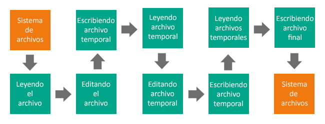

# [Curso de JavaScript Avanzado para desarrolladores Front-end](https://fictizia.com/formacion/curso-javascript-avanzado)
### POO con JS, ECMA6, Patrones de diseño, AJAX avanzado, HTML5 avanzado, APIs externas.


## Clase 22

### NPM


**Documentación**
- [Web Oficial](https://www.npmjs.com/)
- [Features](https://www.npmjs.com/features)
- [Pricing](https://www.npmjs.com/pricing)
- [Documentación](https://docs.npmjs.com/)
- [NPM Community](https://npm.community/)
- [NPM en Github](https://github.com/npm/cli)
- [@npmjs en Twitter](https://twitter.com/npmjs)
- [@npmstatus en Twitter](https://twitter.com/npmstatus)
- [@npm_support en Twitter](https://twitter.com/npm_support)

**Instalar paquetes:**
- global:
```
npm install -g <paquete>
```  

- local:
```
npm install <paquete>
```    

**Buscar paquetes**
```
  npm search <paquete>
```

**Información de los paquetes**
```
  npm view <paquete>
```

**Lista de paquetes instalados**
```
  npm ls
```

**Lista de paquetes instalados globalmente**
```
  npm ls -g
```

**Instalando versiones especificas:**

- la más reciente:
```  
  npm install <paquete>@latest
```  

- versión especifica:
```  
  npm install <paquete>@1.x (1.xx.xx)
```

- Otra versión especifica
```
  npm install <paquete>@2.10.x (2.10.x)
```

**Paquetes desactualziados:**
```
npm outdated
```

**Actualizando paquetes:**
```
npm update <paquete>
```

**Desinstalando paquete:**
```
npm uninstall <paquete>
```

**Información sobre Bugs**
```
npm bugs <paquete>
```

**[Más comandos - CLI](https://docs.npmjs.com/cli/install)**

### Dependency Hell:


**Abyssus abyssum invocat. El abismo llama al abismo (Un paso en falso lleva a otro).**

- [nipster](http://nipstr.com/)
- [Nodei.co](https://nodei.co/)
- [Dependency Hell](http://www.wikiwand.com/en/Dependency_hell)
- [David Dm](https://david-dm.org/)
   - [Ejemplo Twitter-sentiments](https://david-dm.org/UlisesGascon/twitter-sentiments#info=dependencies&view=list)
   - [Ejemplo Grunt](https://david-dm.org/gruntjs/grunt#info=dependencies&view=table)
   - [Ejemplo Express](https://david-dm.org/strongloop/express)
   - [Ejemplo Bower](https://david-dm.org/bower/bower#info=dependencies&view=table)
- [ShieldsIO](http://shields.io/)
   - [Your Badge Service](http://badges.github.io/gh-badges/)


### package.json

- Datos proyecto
- Tareas
- Dependencias (dependencies y devDependencies)
- **[Documentación](https://docs.npmjs.com/files/package.json)**

- **Creación:**
```
  npm init
```

- **Guardar nuevas dependencias:**
```
 npm install <paquete> --save
```

- **Guardar nuevas dependencias (solo para entorno desarrollo):**
```
 npm install <paquete> --save -dev
```

- **Guardando versiones especificas:**
  - (1.xx.xx):
```
  npm install --save <paquete>@1.x
```

  - (2.10.x)
```
  npm install --save <paquete>@2.10.x
```

  - Latest
```
  npm install --save <paquete>@lastest
```

- **Quitando dependencias:**
```
  npm uninstall <paquete> --save
```

- **Instalamos las dependencias en el proyecto:**
  - todo:
```
  npm install (todo)
```

  - Solo production:
```
  npm install --production (solo producción)
```

  - Solo development:
```
  npm install --dev
```

- **[Semantic Versioning](http://semver.org/lang/es/)**
	- Estructura -> X.Y.Z-Extra
	- Cambio Mayor - *No retrocompatible*
	- Cambio Menor - *Retrocompatible - Nuevas funcionaldiades o cambios*
	- Parche - *Retrocompatible - Solución de errores*
	- Extras - Indicativos o versiones especiales (Beta, Alfa, x86, etc...)

### npm scripts (comandos de CLI)

- **Añadiendo comandos:**

```javascript
  // ...
  "scripts": {
      "test": "npm -v",
      "start": "node -v",
      "hola": "echo 'Hola mundo!'"
  }
  // ...
```
- **Mostrando todos los comandos:**
```
    npm run
```

- **Ejecutando comandos:**
  - test
```
    npm test
```

  - start
```
    npm start
```

  - hola
```
    npm run hola
```

### YARN


**Documentación**
- [Web](https://yarnpkg.com/en/)
- [Empezar](https://yarnpkg.com/en/docs/getting-started)
- [Documentación](https://yarnpkg.com/en/docs)
- [Paquetes](https://yarnpkg.com/en/packages/)
- [Blog](https://yarnpkg.com/blog/)
- [Instalar Yarn](https://yarnpkg.com/en/docs/install#debian-stable)

**Iniciar un proyecto**
```
yarn init
```

**Añadir dependencias al proyecto**
```
yarn add [package]
yarn add [package]@[version]
yarn add [package]@[tag]
```

**Añadir dependencias al proyecto en categorías**
```
yarn add [package] --dev
yarn add [package] --peer
yarn add [package] --optional
```

**Actualizar dependencias**
```
yarn upgrade [package]
yarn upgrade [package]@[version]
yarn upgrade [package]@[tag]
```

**Eliminar dependencias**
```
yarn remove [package]
```

**Instalar todas las dependencias**
```
yarn
yarn install
```

**¿quien pidio este paquete?
```
yarn why [package]
```

**Yarn o NPM@5?**
- Yarn es [mas rapido](https://github.com/artberri/npm-yarn-benchmark)
- Yarn es más seguro

**Recursos**
- [npm@5 — Yarn killer?](https://medium.com/netscape/npm-5-yarn-killer-ba69737b24d0)
- [¿Tiene sentido Yarn ahora que tenemos npm 5?](https://www.campusmvp.es/recursos/post/tiene-sentido-yarn-ahora-que-tenemos-npm-5.aspx)
- [Does NPM 5 deprecate yarn?](https://blog.scottlogic.com/2017/06/06/does-npm5-deprecate-yarn.html)
- [Why I’m Sticking With Yarn (Sorry NPM 5)](https://codingwithspike.wordpress.com/2017/08/11/why-im-sticking-with-yarn/)
- [The npm Blog | v5.0.0](https://blog.npmjs.org/post/161081169345/v500)
- [Why i still don't use yarn](https://intoli.com/blog/node-package-manager-benchmarks/)
- [NPM@5 Arrived. But Is It As Fast As Yarn?](http://blog.diovani.com/technology/2017/05/31/npm-5.html)
- [npm vs Yarn – Which Package Manager Should You Use?](https://www.keycdn.com/blog/npm-vs-yarn/)
- [Yarn vs npm: Everything You Need to Know](https://www.sitepoint.com/yarn-vs-npm/)
- [It depends. The art of dependency management in Javascript](https://blog.softwaremill.com/it-depends-the-art-of-dependency-management-in-javascript-f1f9c3cde3f7)

### Bower


> Web sites are made of lots of things — frameworks, libraries, assets, utilities, and rainbows. Bower manages all these things for you.

- [Bower](http://bower.io/)
- [Documentación - API](http://bower.io/docs/api/)
- [Tendencias Bower](http://bower.io/stats/)
- [Buscador Bower](http://bower.io/search/)


**Bower**
Instalamos Bower globalmente

```
  sudo npm install -g bower
```

Dependencias
```
  /home/ubuntu/.nvm/versions/node/v4.1.1/bin/bower -> /home/ubuntu/.nvm/versions/node/v4.1.1/lib/node_modules/bower/bin/bower
  bower@1.6.6 /home/ubuntu/.nvm/versions/node/v4.1.1/lib/node_modules/bower
  ├── is-root@1.0.0
  ├── destroy@1.0.3
  ├── stringify-object@1.0.1
  ├── junk@1.0.2
  ├── chmodr@1.0.2
  ├── user-home@1.1.1
  ├── q@1.4.1
  ├── abbrev@1.0.7
  ├── opn@1.0.2
  ├── bower-endpoint-parser@0.2.2
  ├── bower-logger@0.2.2
  ├── lockfile@1.0.1
  ├── archy@1.0.0
  ├── graceful-fs@3.0.8
  ├── nopt@3.0.6
  ├── lru-cache@2.7.3
  ├── retry@0.6.1
  ├── tmp@0.0.24
  ├── semver@2.3.2
  ├── md5-hex@1.1.0 (md5-o-matic@0.1.1)
  ├── fs-write-stream-atomic@1.0.4 (graceful-fs@4.1.2)
  ├── p-throttler@0.1.1 (q@0.9.7)
  ├── request-progress@0.3.1 (throttleit@0.0.2)
  ├── shell-quote@1.4.3 (array-filter@0.0.1, array-reduce@0.0.0, jsonify@0.0.0, array-map@0.0.0)
  ├── chalk@1.1.1 (escape-string-regexp@1.0.3, supports-color@2.0.0, ansi-styles@2.1.0, strip-ansi@3.0.0, has-ansi@2.0.0)
  ├── bower-json@0.4.0 (intersect@0.0.3, deep-extend@0.2.11, graceful-fs@2.0.3)
  ├── promptly@0.2.0 (read@1.0.7)
  ├── fstream@1.0.8 (inherits@2.0.1, graceful-fs@4.1.2)
  ├── which@1.2.0 (is-absolute@0.1.7)
  ├── bower-registry-client@1.0.0 (async@0.2.10, graceful-fs@4.1.2, request-replay@0.2.0, mkdirp@0.3.5)
  ├── mkdirp@0.5.0 (minimist@0.0.8)
  ├── glob@4.5.3 (inherits@2.0.1, inflight@1.0.4, once@1.3.3, minimatch@2.0.10)
  ├── fstream-ignore@1.0.3 (inherits@2.0.1, minimatch@3.0.0)
  ├── rimraf@2.4.4 (glob@5.0.15)
  ├── insight@0.7.0 (object-assign@4.0.1, async@1.5.0, tough-cookie@2.2.1, lodash.debounce@3.1.1, configstore@1.3.0, os-name@1.0.3)
  ├── bower-config@1.2.2 (graceful-fs@4.1.2, osenv@0.1.3, optimist@0.6.1)
  ├── github@0.2.4 (mime@1.3.4)
  ├── tar-fs@1.8.1 (pump@1.0.1, tar-stream@1.3.1)
  ├── request@2.53.0 (forever-agent@0.5.2, aws-sign2@0.5.0, caseless@0.9.0, tunnel-agent@0.4.1, oauth-sign@0.6.0, isstream@0.1.2, stringstream@0.0.5, json-stringify-safe@5.0.1, tough-cookie@2.2.1, qs@2.3.3, node-uuid@1.4.7, form-data@0.2.0, mime-types@2.0.14, combined-stream@0.0.7, http-signature@0.10.1, bl@0.9.4, hawk@2.3.1)
  ├── cardinal@0.4.4 (ansicolors@0.2.1, redeyed@0.4.4)
  ├── update-notifier@0.3.2 (is-npm@1.0.0, string-length@1.0.1, semver-diff@2.1.0, latest-version@1.0.1)
  ├── decompress-zip@0.1.0 (mkpath@0.1.0, touch@0.0.3, readable-stream@1.1.13, binary@0.3.0)
  ├── handlebars@2.0.0 (optimist@0.3.7, uglify-js@2.3.6)
  ├── inquirer@0.10.0 (strip-ansi@3.0.0, ansi-regex@2.0.0, figures@1.4.0, ansi-escapes@1.1.0, cli-width@1.1.0, rx-lite@3.1.2, through@2.3.8, readline2@1.0.1, cli-cursor@1.0.2, run-async@0.1.0, lodash@3.10.1)
  ├── mout@0.11.1
  └── configstore@0.3.2 (object-assign@2.1.1, xdg-basedir@1.0.1, uuid@2.0.1, osenv@0.1.3, js-yaml@3.4.5)
```

Arrancamos bower.json
```
  bower init
```

```javascript
  {
    "name": "pruebas_bower",
    "homepage": "https://github.com/UlisesGascon/Curso-in-company-NexTReT",
    "authors": [
      "ulisesgascon"
    ],
    "description": "",
    "main": "",
    "moduleType": [],
    "license": "MIT",
    "private": true,
    "ignore": [
      "**/.*",
      "node_modules",
      "bower_components",
      "test",
      "tests"
    ]
  }
```

Buscamos paquetes
```
  bower search <paquete>
  bower search jquery
```

Instalando Paquetes
```
  bower install <paquete>
  bower install jquery
```

Instalando versiones especificas del paquete
```
  bower install <package>#<version>
```

Instalando Paquetes y guardandolos en bower.json
```
  bower install <paquete> -save
  bower install bootstrap -save
```

```
  ulisesgascon:~/workspace/profe/pruebas_bower (master) $ bower install bootstrap -save
  bower jquery#~2.1.4             cached git://github.com/jquery/jquery.git#2.1.4
  bower jquery#~2.1.4           validate 2.1.4 against git://github.com/jquery/jquery.git#~2.1.4
  bower bootstrap#*           not-cached git://github.com/twbs/bootstrap.git#*
  bower bootstrap#*              resolve git://github.com/twbs/bootstrap.git#*
  bower bootstrap#*             download https://github.com/twbs/bootstrap/archive/v3.3.5.tar.gz
  bower bootstrap#*              extract archive.tar.gz
  bower bootstrap#*             resolved git://github.com/twbs/bootstrap.git#3.3.5
  bower jquery#~2.1.4            install jquery#2.1.4
  bower bootstrap#~3.3.5         install bootstrap#3.3.5
```

```javascript
  // bower.json
  {
    "name": "pruebas_bower",
    "homepage": "https://github.com/UlisesGascon/Curso-in-company-NexTReT",
    "authors": [
      "ulisesgascon"
    ],
    "description": "",
    "main": "",
    "moduleType": [],
    "license": "MIT",
    "private": true,
    "ignore": [
      "**/.*",
      "node_modules",
      "bower_components",
      "test",
      "tests"
    ],
    "dependencies": {
      "jquery": "~2.1.4",
      "bootstrap": "~3.3.5"
    }
  }
```

Borrando paquetes
```
  bower uninstall <paquete>
  bower uninstall jquery
```

Borrando paquetes  y guardandolos en bower.json
```
  bower uninstall <paquete>
  bower uninstall jquery
```

Verificando los paquetes instalados y sus dependencias
```
  bower list
```

```
  ulisesgascon:~/workspace/profe/pruebas_bower (master) $ bower list
  bower check-new     Checking for new versions of the project dependencies...
  pruebas_bower /home/ubuntu/workspace/profe/pruebas_bower
  ├─┬ bootstrap#3.3.5 (latest is 4.0.0-alpha)
  │ └── jquery#2.1.4 (3.0.0-alpha1+compat available)
  └── jquery#2.1.4 (latest is 3.0.0-alpha1+compat)
```

Actualizando todo
```
  bower update
```

Actualizando un paquete específico
```
  bower update <package>
```

Usando Bower
```
  bower list -paths
```

```
  ulisesgascon:~/workspace/profe/pruebas_bower (master) $ bower list -paths

    bootstrap: [
      'public/vendor/bootstrap/less/bootstrap.less',
      'public/vendor/bootstrap/dist/js/bootstrap.js'
    ],
    jquery: 'public/vendor/jquery/dist/jquery.js'
```

```html
  <!DOCTYPE html>
  <html lang="es">
    <head>
      <meta charset="utf-8">
      <meta http-equiv="X-UA-Compatible" content="IE=edge">
      <meta name="viewport" content="width=device-width, initial-scale=1">
      <!-- The above 3 meta tags *must* come first in the head; any other head content must come *after* these tags -->
      <title>Bootstrap 101 Template</title>

      <!-- Bootstrap -->
      <link href="public/vendor/bootstrap/dist/css/bootstrap.min.css" rel="stylesheet">

    </head>
    <body>
      <h1>Hello, world!</h1>

      <!-- jQuery (necessary for Bootstrap's JavaScript plugins) -->
      <script src="public/vendor/jquery/dist/jquery.js"></script>
      <!-- Include all compiled plugins (below), or include individual files as needed -->
      <script src="public/vendor/bootstrap/dist/js/bootstrap.js"></script>
    </body>
  </html>
```

**Bower (Entendiendo el funcionamiento)**

bower.json. ¿Qué necesitamos?
```javascript
  {
      "name": "Mi Aplicación",
      "version": "1.0.0",
      "dependencies": {
          "modernizr": "*",
          "jquery": "~2.0.2",
          "bootstrap": "*",
          "requirejs": "*"
      }
  }
```

.bowerrc ¿Donde lo necesitamos?
```javascript
  {
      "directory": "public/vendor",
      "json": "bower.json"
  }
```

Instalamos todo lo anterior
```
  bower install
```


**Bower (Trucos)**

- Se puede instalar componentes aislados primero y luego hacer *bower init* para generar el *bower.json* con todo incluido.
- Ignoramos la carpeta *bower_components* con *.gitignore*. Recuerda que haciendo *bower.init* se instala todo de nuevo.
- Instalación de paquetes más alla de los definidos en search:

- Paquetes registrados:
```
  $ bower install jquery
```

- Acesso directo -> GitHub:
```
  $ bower install desandro/masonry
```

- .git:
```
  $ bower install git://github.com/user/package.git
```

- URLs:
```
  $ bower install http://example.com/script.js
```

### Los problemas de BOWER


**Limitaciones**
- Gestión de conflictos manual
- Fiarnos del patrón SEMVER por parte de otr@s developers
- Sistema de paquetes propio
- Redundancia respecto a NPM
- Maravillo mundo del [Dependency hell](https://en.wikipedia.org/wiki/Dependency_hell)


### Bower ha muerto


> BOWER is dead. Only use it for legacy reasons.

**Literatura al respecto**

- [Bower/bower #2298: Consider deprecating Bower](https://github.com/bower/bower/issues/2298#issuecomment-289846310)
- [Bower is dead, long live npm. And Yarn. And webpack in snyk.io/blog by Assaf Hefetz](https://snyk.io/blog/bower-is-dead/)
- [Reddit: Is bower dead? Should we start using other dependency managers?](https://www.reddit.com/r/javascript/comments/5ls30m/is_bower_dead_should_we_start_using_other/)
- [Quora: Is Bower dying?](https://www.quora.com/Is-Bower-dying?utm_medium=organic&utm_source=google_rich_qa&utm_campaign=google_rich_qa)

### La nueva generación

**Paso 1: Tus herramientas son las de siempre**
- [NPM](https://www.npmjs.com/features)
- [YARN](https://yarnpkg.com/en/)
- [webpack](https://webpack.js.org/concepts/)

**Paso 2: Pasar del `bower.json` al `package.json`**

**Paso 3: Deja de usar `wiredep` y empieza a usar solamente `require()`**

_Nota: Esto es al estilo Browserify exclusivamente_

- [wiredep: Wire Bower dependencies to your source code](https://github.com/taptapship/wiredep)
- [browserify: browser-side require() the node.js way](https://github.com/browserify)
- Debes instalar browserify de forma global con `npm install -g browserify`
- Ejemplo de carga de dependencias
  ```javascript
  var $ = require('jquery'),
      _ = require('lodash'),
      angular = require('angular');
  //..
  ```
- Puedes comprimir y unificar todo el JS en un solo comando `browserify app.js -o bundle.js` y en un único fichero `<script src="bundle.js"></script>`
- Si ademas instalas [watchify](https://github.com/substack/watchify) con `watchify app.js -o bundle.js` refescas los cambios en tiempo real.

**Extra 1: Cosas Interesantes**
- [Usar el campo `browser` en el `package.json`](https://github.com/substack/node-browserify#browser-field)

**Extra 2: Un mundo de información te espera**

- [Why We Should Stop Using Bower – And How to Do It](https://gofore.com/stop-using-bower/)
- [Browserify VS Webpack - JS Drama](http://blog.namangoel.com/browserify-vs-webpack-js-drama)
- [npm and front-end packaging](http://blog.npmjs.org/post/101775448305/npm-and-front-end-packaging)
- [The jQuery Module Fallacy](https://www.evernote.com/shard/s93/sh/390d6836-8797-4f0c-a7c2-fc77fbb0a9b8/649f084e90bae42f)

### Grunt


```javascript
//export default grunt => {
module.exports = grunt => {

grunt.initConfig({
  jshint: {
    files: ['Gruntfile.js', 'src/**/*.js', 'test/**/*.js'],
    options: {
      globals: {
        jQuery: true
      }
    }
  },
  watch: {
    files: ['<%= jshint.files %>'],
    tasks: ['jshint']
  }
});

grunt.loadNpmTasks('grunt-contrib-jshint');
grunt.loadNpmTasks('grunt-contrib-watch');
grunt.registerTask('default', ['jshint']);

};
```


**Caractísticas**
- Filosofía de configuración sobre codigo
- Basado en archivos temporales
- Ecosistema fuerte
- Poco flexible para cosas fuera de lo común
- Ficheros de configuración sobredimensionados
- Facilmente se desactualiza

**Instalación**
- Instalamos Gulp global
```
npm install -g grunt-cli
```

- Incluimos la dependencia en *package.json*
```
npm install grunt --save-dev
```

**Tareas por defecto**
- Creamos *gruntfile.js* y encapsulamos
- Definición
```javascript
module.exports = grunt => {
  //... resto del código de grunt...
};
```
- Instanciamos la configuración 
```javascript
module.exports = grunt => {
  grunt.initConfig({
    //...resto de configuración...
  })
  //... resto del código de grunt...
};
```
- Cargamos las dependencias (plugins)...
```javascript
module.exports = grunt => {
  grunt.initConfig({
    //...resto de configuración...
  })
  //... resto del código de grunt...
};

grunt.loadNpmTasks('grunt-contrib-NOMBRE-PLUGIN');
grunt.loadNpmTasks('grunt-contrib-NOMBRE-PLUGIN');
//... 
```
- Creamos la tarea por defecto
```javascript
module.exports = grunt => {
  grunt.initConfig({
    jshint: {
      files: ['Gruntfile.js', 'src/**/*.js', 'test/**/*.js'],
      options: {
        // options here to override JSHint defaults
        globals: {
          jQuery: true,
          console: true,
          module: true,
          document: true
        }
      }
    }
  })
};

grunt.loadNpmTasks('grunt-contrib-jshint');
grunt.registerTask('default', ['jshint']);
```
- Creamos tarea watch...
```javascript
module.exports = grunt => {
  grunt.initConfig({
    jshint: {
      files: ['Gruntfile.js', 'src/**/*.js', 'test/**/*.js'],
      options: {
        // options here to override JSHint defaults
        globals: {
          jQuery: true,
          console: true,
          module: true,
          document: true
        }
      }
    },
    watch: {
      files: ['<%= jshint.files %>'],
      tasks: ['jshint']
    }
  })
};

grunt.loadNpmTasks('grunt-contrib-jshint');
grunt.registerTask('default', ['jshint']);
```

**Lanzamiento**
- Lanzar la tarea por defecto `grunt`
- Lanzar el watch `grunt watch`
- lanzar una tarea personalizada `grunt TAREA`


### [Grunt: Plugins](https://gruntjs.com/plugins)
- [The 26 grunt plugins we use at qrator.com | Andy's Blog](http://blog.andyhot.gr/the-26-grunt-plugins-we-use-at-qrator-com/)
- [Living list of most useful plugins for Grunt](https://github.com/Pestov/essential-grunt-plugins)
- [6 essential Grunt plugins you should be using | Creative Bloq](https://www.creativebloq.com/web-design/6-essential-grunt-plugins-you-should-be-using-121518118)
- [7 Essential Plug-ins for those New to GruntJS - Web Design Ledger](https://webdesignledger.com/gruntjs-plugins/#e618defdd7)
- [Essential Grunt Plugins - Donna Peplinskie](http://donnapeplinskie.com/blog/essential-grunt-plugins/)
- [Psychedelic Grunt Plugins - Web Design Weekly](https://web-design-weekly.com/2013/06/15/psychedelic-grunt-plugins/)
- [5 Grunt Plugins for a Better Workflow | Chase Adams](https://chaseadams.io/2013/11/5-useful-grunt-plugins/)
- [Building a Better Grunt Plugin | Sprout Social](https://sproutsocial.com/insights/building-better-grunt-plugin/)
- [Supercharging your Gruntfile](https://www.html5rocks.com/en/tutorials/tooling/supercharging-your-gruntfile/)
- [Take Grunt to the Next Level — Jonathan Suh](https://jonsuh.com/blog/take-grunt-to-the-next-level/)


### Grunt: [gruntfile.js](https://gist.github.com/UlisesGascon/5f32b686cc43037adbf5c0ddf33f55d5#file-gruntfile-js)

```javascript
// Generated on 2018-03-31 using
// generator-webapp 1.1.2
'use strict';

// # Globbing
// for performance reasons we're only matching one level down:
// 'test/spec/{,*/}*.js'
// If you want to recursively match all subfolders, use:
// 'test/spec/**/*.js'

//export default grunt => {
module.exports = grunt => {

  // Time how long tasks take. Can help when optimizing build times
  require('time-grunt')(grunt);

  // Automatically load required grunt tasks
  require('jit-grunt')(grunt, {
    useminPrepare: 'grunt-usemin'
  });

  // Configurable paths
  const config = {
    app: 'app',
    dist: 'dist'
  };

  // Define the configuration for all the tasks
  grunt.initConfig({

    // Project settings
    config,

    // Watches files for changes and runs tasks based on the changed files
    watch: {
      bower: {
        files: ['bower.json'],
        tasks: ['wiredep']
      },
      babel: {
        files: ['<%= config.app %>/scripts/{,*/}*.js'],
        tasks: ['babel:dist']
      },
      babelTest: {
        files: ['test/spec/{,*/}*.js'],
        tasks: ['babel:test', 'test:watch']
      },
      gruntfile: {
        files: ['Gruntfile.js']
      },
      sass: {
        files: ['<%= config.app %>/styles/{,*/}*.{scss,sass}'],
        tasks: ['sass', 'postcss']
      },
      styles: {
        files: ['<%= config.app %>/styles/{,*/}*.css'],
        tasks: ['newer:copy:styles', 'postcss']
      }
    },

    browserSync: {
      options: {
        notify: false,
        background: true,
        watchOptions: {
          ignored: ''
        }
      },
      livereload: {
        options: {
          files: [
            '<%= config.app %>/{,*/}*.html',
            '.tmp/styles/{,*/}*.css',
            '<%= config.app %>/images/{,*/}*',
            '.tmp/scripts/{,*/}*.js'
          ],
          port: 9000,
          server: {
            baseDir: ['.tmp', config.app],
            routes: {
              '/bower_components': './bower_components'
            }
          }
        }
      },
      test: {
        options: {
          port: 9001,
          open: false,
          logLevel: 'silent',
          host: 'localhost',
          server: {
            baseDir: ['.tmp', './test', config.app],
            routes: {
              '/bower_components': './bower_components'
            }
          }
        }
      },
      dist: {
        options: {
          background: false,
          server: '<%= config.dist %>'
        }
      }
    },

    // Empties folders to start fresh
    clean: {
      dist: {
        files: [{
          dot: true,
          src: [
            '.tmp',
            '<%= config.dist %>/*',
            '!<%= config.dist %>/.git*'
          ]
        }]
      },
      server: '.tmp'
    },

    // Make sure code styles are up to par and there are no obvious mistakes
    eslint: {
      target: [
        'Gruntfile.js',
        '<%= config.app %>/scripts/{,*/}*.js',
        '!<%= config.app %>/scripts/vendor/*',
        'test/spec/{,*/}*.js'
      ]
    },

    // Mocha testing framework configuration options
    mocha: {
      all: {
        options: {
          run: true,
          urls: ['http://<%= browserSync.test.options.host %>:<%= browserSync.test.options.port %>/index.html']
        }
      }
    },

    // Compiles ES6 with Babel
    babel: {
      options: {
        sourceMap: true,
        presets: ['es2015']
      },
      dist: {
        files: [{
          expand: true,
          cwd: '<%= config.app %>/scripts',
          src: '{,*/}*.js',
          dest: '.tmp/scripts',
          ext: '.js'
        }]
      },
      test: {
        files: [{
          expand: true,
          cwd: 'test/spec',
          src: '{,*/}*.js',
          dest: '.tmp/spec',
          ext: '.js'
        }]
      }
    },

    // Compiles Sass to CSS and generates necessary files if requested
    sass: {
      options: {
        sourceMap: true,
        sourceMapEmbed: true,
        sourceMapContents: true,
        includePaths: ['.']
      },
      dist: {
        files: [{
          expand: true,
          cwd: '<%= config.app %>/styles',
          src: ['*.{scss,sass}'],
          dest: '.tmp/styles',
          ext: '.css'
        }]
      }
    },

    postcss: {
      options: {
        map: true,
        processors: [
          // Add vendor prefixed styles
          require('autoprefixer')({
            browsers: ['> 1%', 'last 2 versions', 'Firefox ESR']
          })
        ]
      },
      dist: {
        files: [{
          expand: true,
          cwd: '.tmp/styles/',
          src: '{,*/}*.css',
          dest: '.tmp/styles/'
        }]
      }
    },

    // Automatically inject Bower components into the HTML file
    wiredep: {
      app: {
        src: ['<%= config.app %>/index.html'],
        exclude: ['bootstrap.js'],
        ignorePath: /^(\.\.\/)*\.\./
      },
      sass: {
        src: ['<%= config.app %>/styles/{,*/}*.{scss,sass}'],
        ignorePath: /^(\.\.\/)+/
      }
    },

    // Renames files for browser caching purposes
    filerev: {
      dist: {
        src: [
          '<%= config.dist %>/scripts/{,*/}*.js',
          '<%= config.dist %>/styles/{,*/}*.css',
          '<%= config.dist %>/images/{,*/}*.*',
          '<%= config.dist %>/fonts/{,*/}*.*',
          '<%= config.dist %>/*.{ico,png}'
        ]
      }
    },

    // Reads HTML for usemin blocks to enable smart builds that automatically
    // concat, minify and revision files. Creates configurations in memory so
    // additional tasks can operate on them
    useminPrepare: {
      options: {
        dest: '<%= config.dist %>'
      },
      html: '<%= config.app %>/index.html'
    },

    // Performs rewrites based on rev and the useminPrepare configuration
    usemin: {
      options: {
        assetsDirs: [
          '<%= config.dist %>',
          '<%= config.dist %>/images',
          '<%= config.dist %>/styles'
        ]
      },
      html: ['<%= config.dist %>/{,*/}*.html'],
      css: ['<%= config.dist %>/styles/{,*/}*.css']
    },

    // The following *-min tasks produce minified files in the dist folder
    imagemin: {
      dist: {
        files: [{
          expand: true,
          cwd: '<%= config.app %>/images',
          src: '{,*/}*.{gif,jpeg,jpg,png}',
          dest: '<%= config.dist %>/images'
        },{
          expand: true,
          cwd: '<%= config.app %>',
          src: '*.{ico,png}',
          dest: '<%= config.dist %>'
        }]
      }
    },

    svgmin: {
      dist: {
        files: [{
          expand: true,
          cwd: '<%= config.app %>/images',
          src: '{,*/}*.svg',
          dest: '<%= config.dist %>/images'
        }]
      }
    },

    htmlmin: {
      dist: {
        options: {
          collapseBooleanAttributes: true,
          collapseWhitespace: true,
          conservativeCollapse: true,
          removeAttributeQuotes: true,
          removeCommentsFromCDATA: true,
          removeEmptyAttributes: true,
          removeOptionalTags: true,
          // true would impact styles with attribute selectors
          removeRedundantAttributes: false,
          useShortDoctype: true
        },
        files: [{
          expand: true,
          cwd: '<%= config.dist %>',
          src: '{,*/}*.html',
          dest: '<%= config.dist %>'
        }]
      }
    },

    // By default, your `index.html`'s <!-- Usemin block --> will take care
    // of minification. These next options are pre-configured if you do not
    // wish to use the Usemin blocks.
    // cssmin: {
    //   dist: {
    //     files: {
    //       '<%= config.dist %>/styles/main.css': [
    //         '.tmp/styles/{,*/}*.css',
    //         '<%= config.app %>/styles/{,*/}*.css'
    //       ]
    //     }
    //   }
    // },
    // uglify: {
    //   dist: {
    //     files: {
    //       '<%= config.dist %>/scripts/scripts.js': [
    //         '<%= config.dist %>/scripts/scripts.js'
    //       ]
    //     }
    //   }
    // },
    // concat: {
    //   dist: {}
    // },

    // Copies remaining files to places other tasks can use
    copy: {
      dist: {
        files: [{
          expand: true,
          dot: true,
          cwd: '<%= config.app %>',
          dest: '<%= config.dist %>',
          src: [
            '*.txt',
            'images/{,*/}*.webp',
            '{,*/}*.html',
            'fonts/{,*/}*.*'
          ]
        }, {
          expand: true,
          dot: true,
          cwd: '.',
          src: 'bower_components/bootstrap-sass/assets/fonts/bootstrap/*',
          dest: '<%= config.dist %>'
        }]
      }
    },

    // Generates a custom Modernizr build that includes only the tests you
    // reference in your app
    modernizr: {
      dist: {
        devFile: 'bower_components/modernizr/modernizr.js',
        outputFile: '<%= config.dist %>/scripts/vendor/modernizr.js',
        files: {
          src: [
            '<%= config.dist %>/scripts/{,*/}*.js',
            '<%= config.dist %>/styles/{,*/}*.css',
            '!<%= config.dist %>/scripts/vendor/*'
          ]
        },
        uglify: true
      }
    },

    // Run some tasks in parallel to speed up build process
    concurrent: {
      server: [
        'babel:dist',
        'sass'
      ],
      test: [
        'babel'
      ],
      dist: [
        'babel',
        'sass',
        'imagemin',
        'svgmin'
      ]
    }
  });


  grunt.registerTask('serve', 'start the server and preview your app', target => {

    if (target === 'dist') {
      return grunt.task.run(['build', 'browserSync:dist']);
    }

    grunt.task.run([
      'clean:server',
      'wiredep',
      'concurrent:server',
      'postcss',
      'browserSync:livereload',
      'watch'
    ]);
  });

  grunt.registerTask('server', target => {
    grunt.log.warn('The `server` task has been deprecated. Use `grunt serve` to start a server.');
    grunt.task.run([target ? (`serve:${target}`) : 'serve']);
  });

  grunt.registerTask('test', target => {
    if (target !== 'watch') {
      grunt.task.run([
        'clean:server',
        'concurrent:test',
        'postcss'
      ]);
    }

    grunt.task.run([
      'browserSync:test',
      'mocha'
    ]);
  });

  grunt.registerTask('build', [
    'clean:dist',
    'wiredep',
    'useminPrepare',
    'concurrent:dist',
    'postcss',
    'concat',
    'cssmin',
    'uglify',
    'copy:dist',
    'modernizr',
    'filerev',
    'usemin',
    'htmlmin'
  ]);

  grunt.registerTask('default', [
    'newer:eslint',
    'test',
    'build'
  ]);
};
```


### Gulp


**Caractísticas**
- Filosofía de código sobre configuración
- Basado en stream
- No es necesario usar archivos temporales
- Claridad en creación de tareas y seguimiento de procesos
- Gran cantidad de Plugins
- Cuenta con una comunidad sólida y madura
- El sistema de `streams` y `Promises`no es sencillo para developers juniors

**Instalación**
- Instalamos Gulp global
```
npm install --global gulp
```

- Incluimos la dependencia en *package.json*
```
npm install --save-dev gulp
```

**Tareas por defecto**
- Creamos *gulpfile.js* y agregamos dependencias y la primera tarea por defecto
- Definición
```javascript
//import gulp from 'gulp';
const gulp = require('gulp');

gulp.task('default', () => {
  console.log("Estas en la tarea por defecto!")
});
```
- Lanzamiento
```
gulp
```

**Más tareas**
- Creamos una tarea nueva para gestionar la concatenación y minificación de los archivos js.
- Definición
```javascript
/*
import gulp from 'gulp';
import concat from 'gulp-concat';
import uglify from 'gulp-uglify';
*/
const gulp = require('gulp'),
  concat = require('gulp-concat'),
  uglify = require('gulp-uglify');

gulp.task('concat-ugly', () => {
  console.log("Estas en la tarea de concatenación!")  
  gulp.src('js/sources/*.js')
  .pipe(concat('app.min.js'))
  .pipe(uglify())
  .pipe(gulp.dest('dist/js'))
});
```
- Instalamos las nuevas dependencias
```
npm install -save gulp-concat && npm install -save gulp-uglify
```
- Lanzamiento
```
gulp concat-ugly
```

**Agrupando tareas**
- Definición
```javascript
gulp.task('distro-lista', ['imagenes', 'css', 'js']);
```
- Lanzamiento
```
gulp distro-lista
```


**Concatenando tareas**
- Definición
```javascript
gulp.task('css-paso-2', ['css-paso-1'], () => {
  console.log("css-paso-2 empieza solo cuando... css-paso-1 haya termiando!")
});
```
- Lanzamiento
```
gulp css-paso-2
```

**[Ejemplo de gulpfile.js](https://gist.github.com/torgeir/8507130)**


**Entendiendo Gulp**
`gulp.src()` y `gulp.dest()`
- Un solo archivo
```javascript
gulp.src('client/templates/index.jade')
// .pipe(...)
```
- Múltiples archivos
```javascript
gulp.src(['client/*.js', '!client/b*.js', 'client/bad.js'])
// .pipe(...)
```
- Múltiples archivos y carpetas
```javascript
gulp.src('client/templates/**/*.jade')
// .pipe(...)
```
- Exclusión
```
!js/secreto-config.js
```
- Especificando la extensión
```
publico/*.+(js|css)
```
- [Más opciones](https://github.com/isaacs/minimatch)

`gulp.watch()`
- Monitoriza de manera activa uno o varios archivos y dispara tareas específicas cuando se hayan modificado
```javascript
gulp.watch('js/source/*.js', ['js']);
```

### [Gulp: Plugins](http://gulpjs.com/plugins/)
- [gulp-debug](https://www.npmjs.com/package/gulp-debug): BÁSICO para debugear las tareas de GULP y los ficheros en scope de la tarea
- [gulp-concat](https://github.com/contra/gulp-concat): Concatenación de archivos
- [gulp-uglify](https://github.com/terinjokes/gulp-uglify): Comprime javascript usando [UglifyJS2](https://github.com/mishoo/UglifyJS2)
- [gulp-stylus](https://www.npmjs.com/package/gulp-stylus): Compilar de .styl a .css
- [gulp-coffee](https://www.npmjs.org/package/gulp-coffee): Compilar de .coffee a .js
- [gulp-jade](https://www.npmjs.org/package/gulp-jade): Compilador de .jade a .html
- [gulp-if](https://www.npmjs.org/package/gulp-if): Control adiccional para el flujo de subtareas
- [gulp-imagemin](https://www.npmjs.org/package/gulp-imagemin): Minificación de imágenes con formato .png, .jpeg, .gif y .svg, [más opciones](https://github.com/sindresorhus/gulp-imagemin#imageminoptions)
- [gulp-jshint](https://www.npmjs.com/package/gulp-jshint): JSHint
- [gulp.spritesmith](https://www.npmjs.com/package/gulp.spritesmith): Crea Sprites y el css adiccional en diversos formatos (.css, .json, Sass, Less)
- [gulp-zip](https://github.com/sindresorhus/gulp-zip): Compresor ZIP
- [gulp-csslint](https://www.npmjs.com/package/gulp-csslint/): CSS Linter
- [gulp-eslint](https://www.npmjs.com/package/gulp-eslint/): [ESLint](http://eslint.org/)
- [gulp-gh-pages](https://www.npmjs.com/package/gulp-gh-pages/): Gestiona la publicación en GitHub Pages
- [gulp-git](https://www.npmjs.com/package/gulp-git/): Gestiona Git desde Gulp
- [gulp-htmlmin](https://www.npmjs.com/package/gulp-htmlmin/): Minificador de HTML
- [gulp-iconfont](https://www.npmjs.com/package/gulp-iconfont/): Creando fuentes de Iconos desde archivos vectoriales
- [gulp-jsonlint](https://www.npmjs.com/package/gulp-jsonlint): Linter para json
- [gulp-markdown](https://www.npmjs.com/package/gulp-markdown/): Markdown a HTML
- [gulp-sourcemaps](https://www.npmjs.com/package/gulp-sourcemaps/): Crea SourceMaps
- [gulp-uncss](https://www.npmjs.com/package/gulp-uncss/): Elimina CSS que no se use
- [gulp-jsdoc-to-markdown](https://www.npmjs.com/package/gulp-jsdoc-to-markdown/): Conversor de jsdocs a markdown
- [gulp-unzip](https://www.npmjs.com/package/gulp-unzip/): Descompresor ZIP
- [gulp-webstandards](https://www.npmjs.com/package/gulp-webstandards): Verifica prefijos CSS, Versión de librerías js, dcoType, compatibildiad entre navegadores,  etc...
- [gulp-filesize](https://www.npmjs.com/package/gulp-filesize): Muestra el tamaño de los archivos.
- [gulp-grunt](https://github.com/gratimax/gulp-grunt): Tareas de Grutn funcionan en Gulp
- [gulp-shell](https://github.com/sun-zheng-an/gulp-shell): Manejando comandos de terminal


### Interesante de integrar en los proyectos:
- [Easy Accessibility Testing with aXe](https://www.axe-core.org/)
- [puppeteer: Headless Chrome Node API](https://github.com/GoogleChrome/puppeteer)
- [pageres: Genera pantallazos de la web en diversos tamaños](https://github.com/sindresorhus/pageres)
- [PSI: PageSpeed Insights desde la terminal](https://github.com/addyosmani/psi)
- [Lighthouse: Auditing, performance metrics, and best practices for Progressive Web Apps](https://github.com/GoogleChrome/lighthouse)


### Gulp: [gulpfile.js](https://gist.github.com/UlisesGascon/5f32b686cc43037adbf5c0ddf33f55d5#file-gulpfile-js)

```javascript
// generated on 2018-03-31 using generator-webapp 3.0.1
const gulp = require('gulp');
const gulpLoadPlugins = require('gulp-load-plugins');
const browserSync = require('browser-sync').create();
const del = require('del');
const wiredep = require('wiredep').stream;
const runSequence = require('run-sequence');

const $ = gulpLoadPlugins();
const reload = browserSync.reload;

let dev = true;

gulp.task('styles', () => {
  return gulp.src('app/styles/*.scss')
    .pipe($.plumber())
    .pipe($.if(dev, $.sourcemaps.init()))
    .pipe($.sass.sync({
      outputStyle: 'expanded',
      precision: 10,
      includePaths: ['.']
    }).on('error', $.sass.logError))
    .pipe($.autoprefixer({browsers: ['> 1%', 'last 2 versions', 'Firefox ESR']}))
    .pipe($.if(dev, $.sourcemaps.write()))
    .pipe(gulp.dest('.tmp/styles'))
    .pipe(reload({stream: true}));
});

gulp.task('scripts', () => {
  return gulp.src('app/scripts/**/*.js')
    .pipe($.plumber())
    .pipe($.if(dev, $.sourcemaps.init()))
    .pipe($.babel())
    .pipe($.if(dev, $.sourcemaps.write('.')))
    .pipe(gulp.dest('.tmp/scripts'))
    .pipe(reload({stream: true}));
});

function lint(files) {
  return gulp.src(files)
    .pipe($.eslint({ fix: true }))
    .pipe(reload({stream: true, once: true}))
    .pipe($.eslint.format())
    .pipe($.if(!browserSync.active, $.eslint.failAfterError()));
}

gulp.task('lint', () => {
  return lint('app/scripts/**/*.js')
    .pipe(gulp.dest('app/scripts'));
});
gulp.task('lint:test', () => {
  return lint('test/spec/**/*.js')
    .pipe(gulp.dest('test/spec'));
});

gulp.task('html', ['styles', 'scripts'], () => {
  return gulp.src('app/*.html')
    .pipe($.useref({searchPath: ['.tmp', 'app', '.']}))
    .pipe($.if(/\.js$/, $.uglify({compress: {drop_console: true}})))
    .pipe($.if(/\.css$/, $.cssnano({safe: true, autoprefixer: false})))
    .pipe($.if(/\.html$/, $.htmlmin({
      collapseWhitespace: true,
      minifyCSS: true,
      minifyJS: {compress: {drop_console: true}},
      processConditionalComments: true,
      removeComments: true,
      removeEmptyAttributes: true,
      removeScriptTypeAttributes: true,
      removeStyleLinkTypeAttributes: true
    })))
    .pipe(gulp.dest('dist'));
});

gulp.task('images', () => {
  return gulp.src('app/images/**/*')
    .pipe($.cache($.imagemin()))
    .pipe(gulp.dest('dist/images'));
});

gulp.task('fonts', () => {
  return gulp.src(require('main-bower-files')('**/*.{eot,svg,ttf,woff,woff2}', function (err) {})
    .concat('app/fonts/**/*'))
    .pipe($.if(dev, gulp.dest('.tmp/fonts'), gulp.dest('dist/fonts')));
});

gulp.task('extras', () => {
  return gulp.src([
    'app/*',
    '!app/*.html'
  ], {
    dot: true
  }).pipe(gulp.dest('dist'));
});

gulp.task('clean', del.bind(null, ['.tmp', 'dist']));

gulp.task('serve', () => {
  runSequence(['clean', 'wiredep'], ['styles', 'scripts', 'fonts'], () => {
    browserSync.init({
      notify: false,
      port: 9000,
      server: {
        baseDir: ['.tmp', 'app'],
        routes: {
          '/bower_components': 'bower_components'
        }
      }
    });

    gulp.watch([
      'app/*.html',
      'app/images/**/*',
      '.tmp/fonts/**/*'
    ]).on('change', reload);

    gulp.watch('app/styles/**/*.scss', ['styles']);
    gulp.watch('app/scripts/**/*.js', ['scripts']);
    gulp.watch('app/fonts/**/*', ['fonts']);
    gulp.watch('bower.json', ['wiredep', 'fonts']);
  });
});

gulp.task('serve:dist', ['default'], () => {
  browserSync.init({
    notify: false,
    port: 9000,
    server: {
      baseDir: ['dist']
    }
  });
});

gulp.task('serve:test', ['scripts'], () => {
  browserSync.init({
    notify: false,
    port: 9000,
    ui: false,
    server: {
      baseDir: 'test',
      routes: {
        '/scripts': '.tmp/scripts',
        '/bower_components': 'bower_components'
      }
    }
  });

  gulp.watch('app/scripts/**/*.js', ['scripts']);
  gulp.watch(['test/spec/**/*.js', 'test/index.html']).on('change', reload);
  gulp.watch('test/spec/**/*.js', ['lint:test']);
});

// inject bower components
gulp.task('wiredep', () => {
  gulp.src('app/styles/*.scss')
    .pipe($.filter(file => file.stat && file.stat.size))
    .pipe(wiredep({
      ignorePath: /^(\.\.\/)+/
    }))
    .pipe(gulp.dest('app/styles'));

  gulp.src('app/*.html')
    .pipe(wiredep({
      exclude: ['bootstrap-sass'],
      ignorePath: /^(\.\.\/)*\.\./
    }))
    .pipe(gulp.dest('app'));
});

gulp.task('build', ['lint', 'html', 'images', 'fonts', 'extras'], () => {
  return gulp.src('dist/**/*').pipe($.size({title: 'build', gzip: true}));
});

gulp.task('default', () => {
  return new Promise(resolve => {
    dev = false;
    runSequence(['clean', 'wiredep'], 'build', resolve);
  });
});
```

### [Gulp 4](https://github.com/gulpjs/gulp/tree/4.0)

### Gulp 4: Cambios

- Nuevo sistema de dependencias `gulp.task()` solo admite 2 argumentos
- `gulp.series()` y 'gulp.parallel()' son ahora nativas. ¡Adios [runSequence](https://www.npmjs.com/package/run-sequence)!.
- El orden de las tareas es clave y ya no podemos organizarlas como queramos, deben ir por orden de carga
- Es necesario terminar cada tarea con un callback o resolver la promesa. En Gulp3 no era necesario.
- Por el momento tiene poca adopción

> Si tienes un `gulpile.js` funcionando con Gulp 3.x, no merece la pena migrarse.

#### Nuevo sistema de dependencias en detalles

**Antes - Gulp 3.9.x**
```javascript
gulp.task('a', function () {
  // Do something.
});
gulp.task('b', ['a'], function () {
  // Do some stuff.
});

gulp.task('c', ['b'], function () {
    // Do some more stuff.
});
```


**Ahora - Gulp 4.x**


- Las tareas solo tienen 2 argumentos.
- La concatenación de tareas puede ser serializada con `gulp.series()` o paralelizada con 'gulp.parallel()'

```javascript
gulp.task('my-tasks', gulp.series('a', 'b', 'c', function() {
  // Do something after a, b, and c are finished.
}));
```

```javascript
gulp.task('build', gulp.parallel('styles', 'scripts', 'images', function () {
  // Build the website.
}));
```

### Gulp 4: Guías
- [The Complete-Ish Guide to Upgrading to Gulp 4](https://www.joezimjs.com/javascript/complete-guide-upgrading-gulp-4/)
- [Web Tooling and Automatisation using gulp 4](http://nealbuerger.com/2017/04/web-tooling-and-automatisation-using-gulp-4/)
- [How to install Gulp 4 before it's officially released](https://demisx.github.io/gulp4/2015/01/15/install-gulp4.html)
- [Migrating to gulp 4 by example](https://blog.wearewizards.io/migrating-to-gulp-4-by-example)
- [How to Upgrade to Gulp 4](https://www.fastless.com/gulp-4/)
- [Getting started with Gulp 4 for Angular](https://hackernoon.com/getting-started-with-gulp-4-for-angular-1280a78fa91a)
- [A quick guide for switching to gulp 4](https://codeburst.io/switching-to-gulp-4-0-271ae63530c0)


### Gulp 4: Ejemplo

```javascript
/*
import gulp from 'gulp';
import less from 'gulp-less';
import babel from 'gulp-babel';
import concat from 'gulp-concat';
import uglify from 'gulp-uglify';
import rename from 'gulp-rename';
import cleanCSS from 'gulp-clean-css';
import del from 'del';
*/

const gulp = require('gulp'),
  less = require('gulp-less'),
  babel = require('gulp-babel'),
  concat = require('gulp-concat'),
  uglify = require('gulp-uglify'),
  rename = require('gulp-rename'),
  cleanCSS = require('gulp-clean-css'),
  del = require('del');

const paths = {
  styles: {
    src: 'src/styles/**/*.less',
    dest: 'assets/styles/'
  },
  scripts: {
    src: 'src/scripts/**/*.js',
    dest: 'assets/scripts/'
  }
};

/* Not all tasks need to use streams, a gulpfile is just another node program
 * and you can use all packages available on npm, but it must return either a
 * Promise, a Stream or take a callback and call it
 */
function clean() {
  // You can use multiple globbing patterns as you would with `gulp.src`,
  // for example if you are using del 2.0 or above, return its promise
  return del([ 'assets' ]);
}

/*
 * Define our tasks using plain functions
 */
function styles() {
  return gulp.src(paths.styles.src)
    .pipe(less())
    .pipe(cleanCSS())
    // pass in options to the stream
    .pipe(rename({
      basename: 'main',
      suffix: '.min'
    }))
    .pipe(gulp.dest(paths.styles.dest));
}

function scripts() {
  return gulp.src(paths.scripts.src, { sourcemaps: true })
    .pipe(babel())
    .pipe(uglify())
    .pipe(concat('main.min.js'))
    .pipe(gulp.dest(paths.scripts.dest));
}

function watch() {
  gulp.watch(paths.scripts.src, scripts);
  gulp.watch(paths.styles.src, styles);
}

// You can use CommonJS `exports` module notation to declare tasks
/*
export {clean};
export {styles};
export {scripts};
export {watch};
*/
exports.clean = clean;
exports.styles = styles;
exports.scripts = scripts;
exports.watch = watch;

// Specify if tasks run in series or parallel using `gulp.series` and `gulp.parallel`
const build = gulp.series(clean, gulp.parallel(styles, scripts));

// You can still use `gulp.task` to expose tasks
gulp.task('build', build);

// Define default task that can be called by just running `gulp` from cli
gulp.task('default', build);
```

### Grunt vs. Gulp

  

Grunt:



Gulp:


### NPM Scripts


**Recursos**
- [Why I Left Gulp and Grunt for npm Scripts by Cory House](https://medium.freecodecamp.org/why-i-left-gulp-and-grunt-for-npm-scripts-3d6853dd22b8)
- [Task automation with npm run by James Holliday](http://substack.net/task_automation_with_npm_run)
- [Advanced front-end automation with npm scripts by Kate Hudson](https://www.youtube.com/watch?v=0RYETb9YVrk)
- [How to use npm as a build tool by Kieth Cirkel](http://blog.keithcirkel.co.uk/how-to-use-npm-as-a-build-tool/)
- [Introduction to npm as a Build Tool by Marcus Hammarberg](http://app.pluralsight.com/courses/npm-build-tool-introduction)
- [Gulp is awesome, but do we really need it? by Gonto](http://gon.to/2015/02/26/gulp-is-awesome-but-do-we-really-need-it/)


### NPM Scripts: Estrategias y vitaminas

- No conoces a [Ashley Williams](https://github.com/ashleygwilliams) ni has visto ["You Don't Know npm"](https://www.youtube.com/watch?v=l_F9xqIdkzE). [Slides](https://ashleygwilliams.github.io/fwdays-2017/#1)
- Existen [convenciones](https://docs.npmjs.com/misc/scripts) en el `package.json` que solemos ignorar como `preinstall`, `install`, `postinstall`, `uninstall`, `test`, `start`, etc...
- Puedes pasarte variables de entorno en los comandos `NODE_ENV=production server.js`
- Puedes ejecutar otros comandos del `package.json`, con solo mencionarlos `npm run otro-comando && echo otras cosas después...`
- Si quieres mantener soporte con todas las plataformas, debes evitar el uso de comandos de shell y abstraerlo con dependencias. Por ejemplo `rm -rf /` vs [rimraf](https://www.npmjs.com/package/rimraf)
- Puedes agrupar comandos en ficheros y siplemente ejecutarlos como una tarea más, `node fichero-comandos.js`
- No agrupes comandos complejos o muy largos, *divide y venceras*
- Recuerda que existen multiples operadores en Linux y OSX:
  - Puedes paralelismo dentro del mismo comando usando el operador `&` y no unicamente `&&`, ejemplo: `npm run watch-js & npm run watch-css`
  - Puedes unir dos tareas usando `&&`. La seguna tarea solo se ejecutará cuando la primera haya concluido con éxito, ejemplo: `npm install && npm start`
  - Puedes usar `;` para ejecutar el siguiente comando aun cuando el primero no funcionó correctamente, ejemplo: `npm run algo-raro; npm run watch-css`
  - Puedes usar `||` para ejecutar el siguiente comando solo cuando el primero no funcionó correctamente, ejemplo: `npm install-unix || npm install windows`
  - Puedes combinar comandos como `[ -f ~/fichero.txt ] && echo "el fichero existe." || touch ~/fichero.txt`, es decir, si el fichero existe me avisa, pero si no... lo crea!
- Si un comando es muy largo... solo necesitas crearte un `fichero.sh` encabezado por `#!/bin/bash` y agrupando comandos con parentesis. No te olvides de los permisos de ejecuación con `chmod +x FICHERO.sh`
```bash
#!/bin/bash
(cd site/main; echo banana)
(cd site/xyz; echo lorem ipsum...)
```
