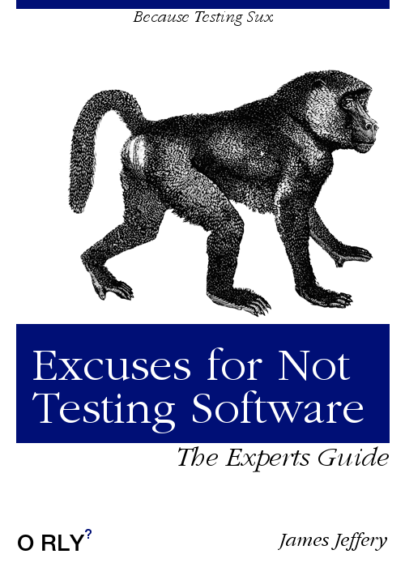
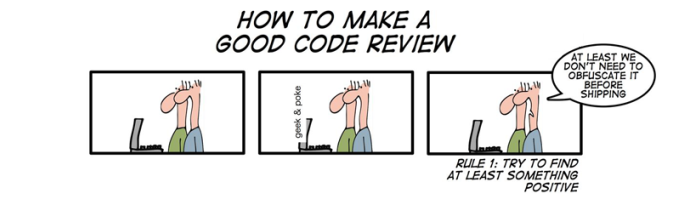
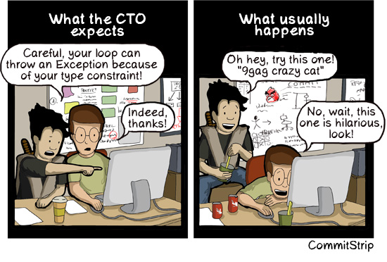
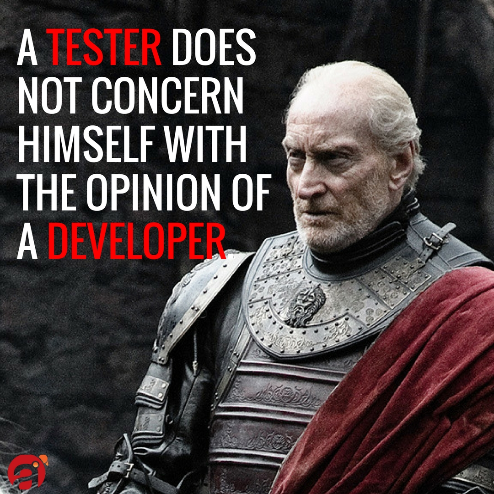
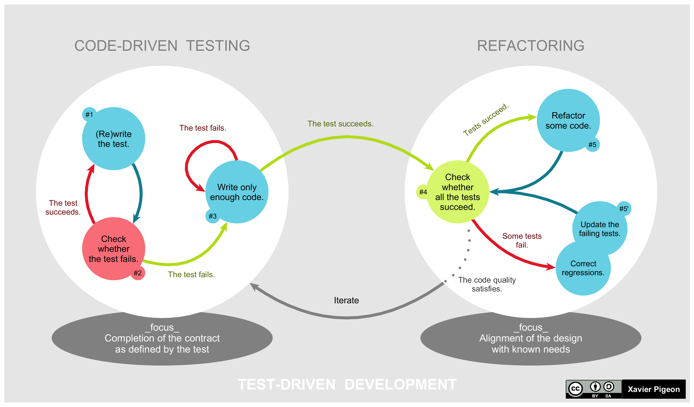
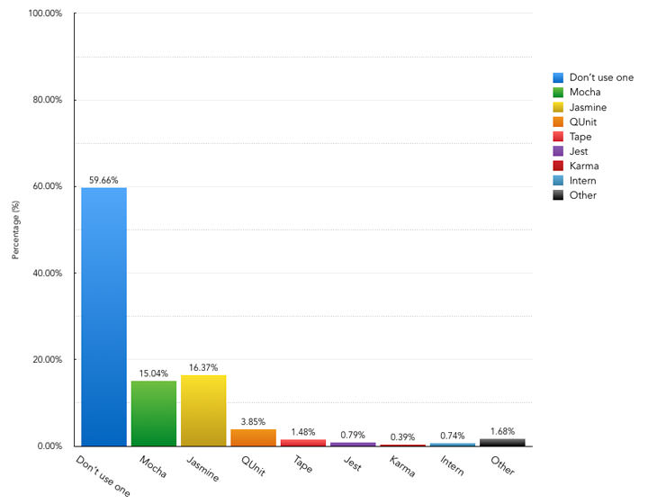
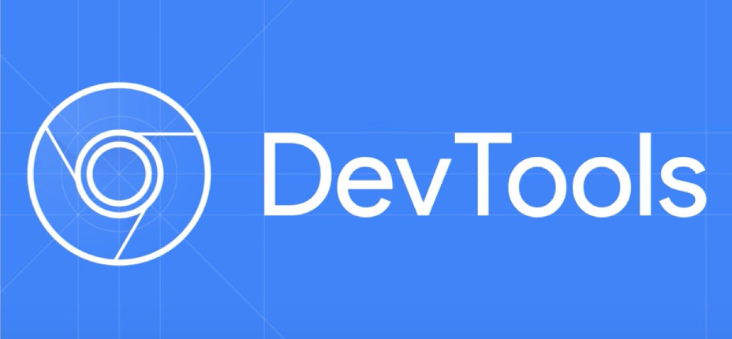
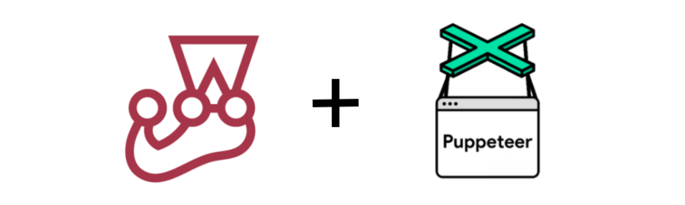

# [Curso de JavaScript Avanzado para desarrolladores Front-end](https://fictizia.com/formacion/curso-javascript-avanzado)
### POO con JS, ECMA6, Patrones de diseño, AJAX avanzado, HTML5 avanzado, APIs externas.


## Clase 23





### Code Review



> Revisión de código es la examinación sistemática (como en la revisión por pares) del código fuente de un programa informático. Se practica con el objetivo de mejorar la calidad del código que se genera en el proceso de desarrollo del software, mediante la detección temprana de errores en el código de los programas o alternativas más eficientes a la implementación inicial. También se utiliza como técnica para mejorar las cualidades de los desarrolladores involucrados en la práctica, mediante la discusión abierta de posibles mejoras en el programa.

> Se realizan principalmente revisiones de código por parte de las metodologías ágiles que practican programación en pareja como parte del proceso, o en otras que pueden implementar revisiones periódicas de código, tanto informales como formales. [Wikipedia](https://es.wikipedia.org/wiki/Revisi%C3%B3n_de_c%C3%B3digo)

**Las claves**
- Forma parte de algunas metodologías ágiles
- Mejora la comunicación y la calidad del grupo
- No culpar a nadie, ni tomarselo personal
- La culpa de un bug es ahora compartida
- Se sugieren los cambios y se discuten

**¿Que revisar?**
- Arquitectura/Diseño (patrones, errores potenciales, manejo de errores, eficiencia...)
- Estilo (Longitudes, legibilidad, nombres...)
- Testing (Cobertura, mocks, etc...)

**Herramientas**
- [Upsource](https://www.jetbrains.com/upsource/)
- [Crucible](https://es.atlassian.com/software/crucible)
- [Gerrit](https://www.gerritcodereview.com/)
INTERESANTE:
- [Github Code Review](https://github.com/features/code-review/)

### Pair coding



> La Programación en Pareja (o Pair Programming en inglés) requiere que dos programadores participen en un esfuerzo combinado de desarrollo en un sitio de trabajo. Cada miembro realiza una acción que el otro no está haciendo actualmente: Mientras que uno codifica las pruebas de unidades el otro piensa en la clase que satisfará la prueba, por ejemplo.

> La persona que está haciendo la codificación se le da el nombre de controlador mientras que a la persona que está dirigiendo se le llama el navegador. Se sugiere a menudo para que a los dos socios cambien de papeles por lo menos cada media hora o después de que se haga una prueba de unidad. [Wikipedia](https://es.wikipedia.org/wiki/Programaci%C3%B3n_en_pareja)

**Lo bueno**
- Mejor código
- Equipo más fuerte y cohesionado
- Se aprende mucho más
- Mejora la propiedad colectiva del código
- Mejora las habilidades sociales
- Reduce el número de bugs

**Lo malo**
- No todo el mundo se siente cómodo
- No es facil juntar niveles distintos
- Es dificil combinar tiempos (balance, vida personal, etc....)
- Es más dificil en remoto
- Los tiempos de desarrollo son distintos


### QA



**Las claves**
- Persona especializada en asegurar la calidad del proyecto
- Se encarga del diseño y ejecucción de pruebas
- Se encarga de validar la caldiad técnica (rendimeinto, optimización, etc...)
- Define standares, medidas y metricas que debemos cumplir
- Revisa y mantiene seguimiento de la calidad
- Coordina el testeo
- Las funciones pueden cambiar entre proyectos y empresas

**Recursos**
- [¿Qué es QA y por qué no debe faltar en tu proyecto?](https://bbvaopen4u.com/es/actualidad/que-es-qa-y-por-que-no-debe-faltar-en-tu-proyecto)
- [¿Que es un QA Tester?](http://iwantic.com/que-es-un-qa-tester/)
- [Tester vs Quality Assurance](https://www.paradigmadigital.com/dev/tester-vs-quality-assurance/)
- [Wikipedia | Aseguramiento de la calidad](https://es.wikipedia.org/wiki/Aseguramiento_de_la_calidad)
- [Qué es QA](https://josehuerta.es/gestion/proyectos/calidad/que-es-qa)
- [Quality Assurance no es sólo Testing](http://www.softqanetwork.com/quality-assurance-no-es-solo-testing)
- [La misión del QA Manager dentro de la Organización](https://www.globetesting.com/2014/06/la-mision-del-qa-manager-dentro-de-la-organizacion/)
- [QA (Quality Assurance) y su mundo](http://blogs.encamina.com/piensa-en-software-desarrolla-en-colores/2017/11/02/qa-quality-assurance-y-su-mundo/)


### Testing


> Las pruebas de software (en inglés software testing) son las investigaciones empíricas y técnicas cuyo objetivo es proporcionar información objetiva e independiente sobre la calidad del producto a la parte interesada o stakeholder. Es una actividad más en el proceso de control de calidad. [Wikipedia](https://es.wikipedia.org/wiki/Pruebas_de_software)

**Tipos de pruebas**
- Estáticas, No necesitan ejecutar código alguno
- Dinámicas, que requieren ejecucción de código

**Según su ejecucción**
- Manuales, requieren de nuestra interacción para funcionar
- Automáticas, la propia máquina es capaz de relaizar las pruebas sin sufrir alteraciones

**Según el enfoque**
- [Caja Blanca](https://es.wikipedia.org/wiki/Pruebas_de_caja_blanca), nos centramos en el funcionamiento interno de las cosas
- [Caja Negra](https://es.wikipedia.org/wiki/Caja_negra_(sistemas)), nos centramos en las entradas (input) y salidas (output) de las clsas y no en su funcionamiento
- [Pruebas aleatorias](https://en.wikipedia.org/wiki/Random_testing), variante de la caja negra donde el input es aletorio


### Testing: ¿Qué podemos testear?

- [Pruebas unitarias (Unit Testing)](https://es.wikipedia.org/wiki/Prueba_unitaria)
- [Pruebas de integración (Integration testing)](https://es.wikipedia.org/wiki/Pruebas_de_integraci%C3%B3n)
- [Pruebas de sistema (System testing)](https://en.wikipedia.org/wiki/System_testing)
- [Pruebas de sanidad (Sanity check)](https://en.wikipedia.org/wiki/Sanity_testing)
- [Pruebas de humo (Smoke testing)](https://es.wikipedia.org/wiki/Pruebas_de_humo)
- [Pruebas alpha (Alpha Testing)](https://es.wikipedia.org/wiki/Pruebas_alpha)
- [Pruebas beta (Beta Testing)](https://es.wikipedia.org/wiki/Pruebas_beta)
- [Pruebas de aceptación (Acceptance Testing)](https://es.wikipedia.org/wiki/Pruebas_de_aceptaci%C3%B3n_(inform%C3%A1tica))

MUY INTERESANTE PARA LIBRERÍAS, PUEDE CONTROLAR INCLUSO SEMANTIC VERSIONING
- [Pruebas de regresión (Regression testing)](https://es.wikipedia.org/wiki/Pruebas_de_regresi%C3%B3n)
- [Pruebas de compatibilidad](https://es.wikipedia.org/wiki/Pruebas_de_compatibilidad)
- [Pruebas de Accesibilidad (Accessibility testing)](https://en.wikipedia.org/wiki/Accessibility)
- [Pruebas de seguridad (Security Testing)](https://en.wikipedia.org/wiki/Security_testing)
- [Pruebas de destrucción (Destructive testing)](https://en.wikipedia.org/wiki/Destructive_testing)
- [Pruebas de Stress (Stress Testing)](https://en.wikipedia.org/wiki/Stress_testing)
- [Pruebas de Carga (Load Testing)](https://en.wikipedia.org/wiki/Load_testing#Software_load_testing)
- [Pruebas de usabilidad (Usability testing)](https://es.wikipedia.org/wiki/Prueba_de_usabilidad)
- [Pruebas de rendimiento (Performance Testing)](https://en.wikipedia.org/wiki/Software_performance_testing)
- [Pruebas de internacionalización y localización](https://en.wikipedia.org/wiki/Internationalization_and_localization)
- [Pruebas de escalabilidad](https://es.wikipedia.org/wiki/Pruebas_de_escalabilidad)
- [A/B testing](https://en.wikipedia.org/wiki/A/B_testing)
- [Pruebas de concurrencia (Concurrent testing)](https://en.wikipedia.org/wiki/Concurrent_testing)
- [Prueba de conformidad (Conformance testing)](https://en.wikipedia.org/wiki/Conformance_testing)

### Testing: ¿Que testeamos en JavaScript?

- Unit Testing
- Integration testing
- End-To-End Testing (e2e) (PRUEBAS SOBRE EL NAVEGADOR)
- Alpha & Beta Testing (CON USUARIOS DE VERDAD)
- Accessibility testing
- Security Testing
- Stress Testing & Load Testing (ESCALABILIDAD Y VER CUANTAS LLAMADAS SOPORTA LA APP)
- A/B testing


### TDD



> Desarrollo guiado por pruebas de software, o Test-driven development (TDD) es una práctica de ingeniería de software que involucra otras dos prácticas: Escribir las pruebas primero (Test First Development) y Refactorización (Refactoring). Para escribir las pruebas generalmente se utilizan las pruebas unitarias (unit test en inglés). En primer lugar, se escribe una prueba y se verifica que las pruebas fallan. A continuación, se implementa el código que hace que la prueba pase satisfactoriamente y seguidamente se refactoriza el código escrito. El propósito del desarrollo guiado por pruebas es lograr un código limpio que funcione. La idea es que los requisitos sean traducidos a pruebas, de este modo, cuando las pruebas pasen se garantizará que el software cumple con los requisitos que se han establecido. [Wikipedia](https://en.wikipedia.org/wiki/Test-driven_development)

**Las claves**
- Implementar solo lo necesario
- Evitar bugs a toda costa
- Creamos software modular y reutilizable
- No tener miedo de tocar "legacy"

**El Ciclo de desarrollo**
- Elegir un requisito
- Escribir las pruebas
- Verificar que fallan las pruebas
- Escribir suficiente código para pasar las preubas
- Pasar las pruebas
- Refactorizar y pasar las pruebas (hasta estar listo)
- El requisito ha sido implementado

**Filosofías derivadas**
- [Acceptance test–driven development (ATDD)](https://en.wikipedia.org/wiki/Acceptance_test%E2%80%93driven_development)
- [Behavior-driven development (BDD)](https://en.wikipedia.org/wiki/Behavior-driven_development)


**Recursos**
- [¿Cuál es la diferencia entre Unit Testing, TDD y BDD?](https://www.beeva.com/beeva-view/sistemas/cual-es-la-diferencia-entre-unit-testing-tdd-y-bdd/)
- [BDD + TDD para descubrir el diseño de tu código](http://enmilocalfunciona.io/bdd-tdd-para-descubrir-el-diseno-de-tu-codigo/)
- [TDD, BDD & Test de Aceptación](https://www.adictosaltrabajo.com/tutoriales/tdd-bdd-test-de-aceptacion/)
- [TDD vs BDD vs ATDD](https://josepablosarco.wordpress.com/2015/03/31/tdd-vs-bdd-vs-atdd/)
- [BDD y TDD en el mundo real (I) – Metodologías y herramientas](https://www.bit.es/knowledge-center/bdd-y-tdd-en-el-mundo-real-i/)
- [BDD y TDD en el mundo real (II) – Ciclo desde la fuente](https://www.bit.es/knowledge-center/bdd-y-tdd-en-el-mundo-real-ii/)
- [The Difference Between TDD and BDD](https://joshldavis.com/2013/05/27/difference-between-tdd-and-bdd/)
- [Orígenes de TDD, BDD, ATDD y sus diferencias](http://ecosistemasagiles.elecnor-deimos.com/index.php/2018/01/19/origenes-de-tdd-bdd-atdd-y-sus-diferencias/)
- [Wikipedia | Desarrollo guiado por comportamiento](https://es.wikipedia.org/wiki/Desarrollo_guiado_por_comportamiento)
- [¿ATDD? ¿BDD?… ¿Cómo? Aclarando el lío de siglas en Testing](http://www.javiergarzas.com/2015/08/atdd-bdd-como-aclarando-el-lio-de-siglas-en-testing.html)
- [Youtube | BDD vs TDD (explained)](https://www.youtube.com/watch?v=mT8QDNNhExg)
- [De testers y code reviews](https://testingfuncional.wordpress.com/2014/12/02/de-testers-y-code-reviews/)


### Piramide de Test creada por Mike Cohn


### Testing en la práctica



**Las claves**
- Código que verifica el funcionamiento de otro código.
- Deben poder realizarse de manera automática.
- Cubrir mayor cantidad de código posible.
- Independientes entre si.
- Capaces de ejercutarse infinidad de veces.
- Pueden agruparse en Test Suites.
- Uso de colores y mensajes claros.
- [A guide to unit testing in JavaScript](https://github.com/mawrkus/js-unit-testing-guide)

**Ejemplo: Versión Browser**
```javascript
// Función
function sumar (p1, p2){
  return p1 + p2;
}

// Test
function testSumar(){
  if (sumar(1, 2) !== 3) {
    document.write('<p style="color: red;">sumar(1, 2) ERROR - No devuelve 3</\p>');
  } else {
    document.write('<p style="color: green;">sumar(1, 2) OK</p>');
  }

  if (sumar("2", 2) !== 4) {
    document.write('<p style="color: red;">sumar("2", 2) ERROR - No devuelve 4</p>');
  } else {
    document.write('<p style="color: green;">sumar("2", 2) OK</p>');
  }
}
```

**Ejemplo: Versión Node.js**
```javascript
const chalk = require('chalk');
const log = console.log;

// Función
function sumar (p1, p2){
  return p1 + p2;
}

// Test
function trueAssert(msg) {
    log(chalk.bgGreen.white(msg))
}

function falseAssert(msg) {
    log(chalk.bgRed.white(msg))
}

function testSumar(){
  if (sumar(1, 2) !== 3) {
    falseAssert("sumar(1, 2) ERROR")
  } else {
    trueAssert("sumar(1, 2) OK")
  }

  if (sumar("2", 2) !== 4) {
    falseAssert('sumar("2", 2) ERROR - No devuelve 4')
  } else {
    trueAssert('sumar("2", 2) OK')
  }
}

testSumar();
```


### Usando `console.assert`


```javascript
const controlador = false;
console.assert(controlador, "\"controlador\" es igual a \"false\"");
```

### Assert Nodejs


```javascript
const assert = require('assert');

assert.equal(1, 1);     // OK, 1 == 1
assert.equal(1, '1');   // OK, 1 == '1'
assert.equal(1, 2);     // AssertionError: 1 == 2

assert.equal({ a: { b: 1 } }, { a: { b: 1 } }); 
// AssertionError: { a: { b: 1 } } == { a: { b: 1 } }
```

**[Assertion Testing](https://nodejs.org/api/assert.html)**
- [Strict mode](https://nodejs.org/api/assert.html#assert_strict_mode)
- [`assert(value[, message])`](https://nodejs.org/api/assert.html#assert_assert_value_message)
- [`assert.deepEqual(actual, expected[, message])`](https://nodejs.org/api/assert.html#assert_assert_deepequal_actual_expected_message)
- [`assert.deepStrictEqual(actual, expected[, message])`](https://nodejs.org/api/assert.html#assert_assert_deepstrictequal_actual_expected_message)
- [`assert.deepStrictEqual`: Comparison details](https://nodejs.org/api/assert.html#assert_comparison_details)
- [`assert.doesNotReject(block[, error][, message])`](https://nodejs.org/api/assert.html#assert_assert_doesnotreject_block_error_message)
- [`assert.doesNotThrow(block[, error][, message])`](https://nodejs.org/api/assert.html#assert_assert_doesnotthrow_block_error_message)
- [`assert.equal(actual, expected[, message])`](https://nodejs.org/api/assert.html#assert_assert_equal_actual_expected_message)
- [`assert.fail([message])`](https://nodejs.org/api/assert.html#assert_assert_fail_message)
- [`assert.ifError(value)`](https://nodejs.org/api/assert.html#assert_assert_iferror_value)
- [`assert.notDeepEqual(actual, expected[, message])`](https://nodejs.org/api/assert.html#assert_assert_notdeepequal_actual_expected_message)
- [`assert.notDeepStrictEqual(actual, expected[, message])`](https://nodejs.org/api/assert.html#assert_assert_notdeepstrictequal_actual_expected_message)
- [`assert.notEqual(actual, expected[, message])`](https://nodejs.org/api/assert.html#assert_assert_notequal_actual_expected_message)
- [`assert.notStrictEqual(actual, expected[, message])`](https://nodejs.org/api/assert.html#assert_assert_notstrictequal_actual_expected_message)
- [`assert.ok(value[, message])`](https://nodejs.org/api/assert.html#assert_assert_ok_value_message)
- [`assert.rejects(block[, error][, message])`](https://nodejs.org/api/assert.html#assert_assert_rejects_block_error_message)
- [`assert.strictEqual(actual, expected[, message])`](https://nodejs.org/api/assert.html#assert_assert_strictequal_actual_expected_message)
- [`assert.throws(block[, error][, message])`](https://nodejs.org/api/assert.html#assert_assert_throws_block_error_message)


### Frameworks de testing

**BDD/TDD**
- [MochaJS](http://mochajs.org/) - ☕️ simple, flexible, fun javascript test framework for node.js & the browser 
- [Jasmine](http://jasmine.github.io/) - Simple JavaScript testing framework for browsers and node.js
- [Intern](https://theintern.github.io/) - Intern. Software testing for humans.
- [Chai](http://chaijs.com/)- BDD / TDD assertion framework for node.js and the browser that can be paired with any testing framework.

MUY BUEN RUNNER DE TESTS, VAN EN PARALELO, OSN MUCHO MÁS RAPIDOS
- [Ava](https://github.com/avajs/ava) - 🚀 Futuristic JavaScript test runner

**BDD**
- [CucumberJS](https://github.com/cucumber/cucumber-js) - Cucumber for JavaScript 
- [Unexpected](http://unexpected.js.org/) - The extensible BDD assertion toolkit


### Test Runners
- [Karma](https://github.com/karma-runner/karma) - Spectacular Test Runner for JavaScript 
- [Jest](https://facebook.github.io/jest/) - 🃏 Delightful JavaScript Testing.
- [GlaceJS](https://glacejs.github.io/glace-core) - glace-core is a quick-start functional & unit testing framework based on mocha and extensible with plugins (how plugins work).
- [Apickli](https://github.com/apickli/apickli) - apickl. REST API integration testing framework based on cucumber.js


### Spies, Stubs & Mock frameworks
- [Sinon.JS](http://sinonjs.org/) - Test spies, stubs and mocks for JavaScript.
- [JSMockito](http://jsmockito.org/) - Javascript mocking framework inspired by the awesome mockito
- [Apimocker](https://github.com/gstroup/apimocker) - node.js module to run a simple http server for mock service responses.
- [Rewire](https://github.com/jhnns/rewire) - Easy monkey-patching for node.js unit tests
- [Enzyme](http://airbnb.io/enzyme/docs/api/) - JavaScript Testing utilities for React
- [Testdouble](https://github.com/testdouble/testdouble.js) - A minimal test double library for TDD with JavaScript

### Code analysis
- [ESLint](http://eslint.org/) - A fully pluggable tool for identifying and reporting on patterns in JavaScript 
- [JsHint](http://jshint.com/) - JSHint is a tool that helps to detect errors and potential problems in your JavaScript code
- [JsLint](http://www.jslint.com/) - The JavaScript Code Quality Tool


### Performance & stress & load
- [k6](https://github.com/loadimpact/k6) - A modern load testing tool, using Go and JavaScript 
- [Artillery](https://artillery.io/) - Flexible and powerful toolkit for load and functional testing. HTTP, Socket.io, WebSockets, Kinesis, HLS. Make your systems indestructible! 👩‍💻 🏰 
- [LoadComplete](https://smartbear.com/product/loadcomplete/overview/) - Load Testing Tool for Websites and Web Apps


### Security checking
- [OWASP Glue](https://github.com/OWASP/glue) - Application Security Automation
- [OWASP ZAP](https://github.com/zaproxy/zaproxy) - The OWASP ZAP core project
- [BeEF](http://beefproject.com/) - Manipulate the browser exploiting any XSS vulns you find

### Reporting

- [ReportPortal.io](http://reportportal.io/) - AI-powered Test Automation Dashboard
- [Istanbul](https://github.com/gotwarlost/istanbul) - Yet another JS code coverage tool that computes statement, line, function and branch coverage with module loader hooks to transparently add coverage when running tests. Supports all JS coverage use cases including unit tests, server side functional tests and browser tests. Built for scale.
- [Blanket](http://blanketjs.org/) - blanket.js is a simple code coverage library for javascript. Designed to be easy to install and use, for both browser and nodejs.
- [Mochawesome](https://github.com/adamgruber/mochawesome) - A Gorgeous HTML/CSS Reporter for Mocha.js 
- [allure](http://allure.qatools.ru/) - There are lots of cool testing frameworks for different programming languages. Unfortunately only a few of them can provide good representation of test execution output. The Yandex testing team is working on Allure - an open-source framework designed to create test execution reports that are clear to everyone in the team.


### Qunit


**Las Claves**
- Facil y sencillo
- Ideal para empezar
- No contiene muchos plugins
- Originalmente creado para testear JQuery


**Implementacion en browser**

fichero `index.html`
```html
<!DOCTYPE html>
<html>
<head>
  <meta charset="utf-8">
  <meta name="viewport" content="width=device-width">
  <title>QUnit Example</title>
  <link rel="stylesheet" href="https://code.jquery.com/qunit/qunit-2.6.2.css">
</head>
<body>
  <div id="qunit"></div>
  <div id="qunit-fixture"></div>
  <script src="https://code.jquery.com/qunit/qunit-2.6.2.js"></script>
  <script src="tests.js"></script>
</body>
</html>
```

fichero `test.js`
```javascript
QUnit.test( "hello test", function( assert ) {
  assert.ok( 1 == "1", "Passed!" );
});
```

**Implementación en Nodejs**

`npm install --save-dev qunit`

**Ejemplo**
```javascript
// Función
function sumar (p1, p2){
return p1 + p2;
}

// Test
test("test de la funcion sumar(p1, p2)", function() {
equal(sumar( 1, 2), 3, "1 + 2 = 3" );
notEqual(sumar( "2", 2), "4", " 2(cadena) + 2 != 4(cadena) ");
});
```

**Documentación**
- [Web Oficial](https://qunitjs.com/)
- [Documentación](https://api.qunitjs.com/)
- [Introduction to Unit Testing](http://qunitjs.com/intro/)
- [QUnit en Github](https://github.com/qunitjs/qunitjs.com)
- [El equipo](https://qunitjs.com/about/#qunit-team)
- [@qunitjs en Twitter](https://twitter.com/qunitjs)
- [QUnit Forum](https://forum.jquery.com/qunit-and-testing)
- [QUnit Cookbook](http://qunitjs.com/cookbook/)


**[API - Main methods](https://api.qunitjs.com/QUnit/)**
- [`QUnit.module( name [, hooks] [, nested ] )`](https://api.qunitjs.com/QUnit/module)
- [`QUnit.only( name, callback )`](https://api.qunitjs.com/QUnit/only)
- [`QUnit.skip( name )`](https://api.qunitjs.com/QUnit/skip)
- [`QUnit.start()`](https://api.qunitjs.com/QUnit/start)
- [`QUnit.test( name, callback )`](https://api.qunitjs.com/QUnit/test)
- [`QUnit.todo( name, callback )`](https://api.qunitjs.com/QUnit/todo)


**[API - Assertions](https://api.qunitjs.com/assert/)**
- [`async( [ acceptCallCount = 1 ] )`](https://api.qunitjs.com/assert/async)
- [`deepEqual( actual, expected [, message ] )`](https://api.qunitjs.com/assert/deepEqual)
- [`equal( actual, expected [, message ] )`](https://api.qunitjs.com/assert/equal)
- [`expect( amount )`](https://api.qunitjs.com/assert/expect)
- [`notDeepEqual( actual, expected [, message ] )`](https://api.qunitjs.com/assert/notDeepEqual)
- [`notEqual( actual, expected [, message ] )`](https://api.qunitjs.com/assert/notEqual)
- [`notOk( state [, message ] )`](https://api.qunitjs.com/assert/notOk)
- [`notPropEqual( actual, expected [, message ] )`](https://api.qunitjs.com/assert/notPropEqual)
- [`notStrictEqual( actual, expected [, message ] )`](https://api.qunitjs.com/assert/notStrictEqual)
- [`ok( state [, message ] )`](https://api.qunitjs.com/assert/ok)
- [`propEqual( actual, expected [, message ] )`](https://api.qunitjs.com/assert/propEqual)
- [`pushResult( data: { result, actual, expected, message } )`](https://api.qunitjs.com/assert/pushResult)
- [`rejects( promise[, expectedMatcher][, message ] )`](https://api.qunitjs.com/assert/rejects)
- [`step( [ message ] )`](https://api.qunitjs.com/assert/step)
- [`strictEqual( actual, expected [, message ] )`](https://api.qunitjs.com/assert/strictEqual)
- [`throws( blockFn[, expectedMatcher][, message ] )`](https://api.qunitjs.com/assert/throws)
- [`timeout( duration )`](https://api.qunitjs.com/assert/timeout)
- [`verifySteps( steps [, message ] )`](https://api.qunitjs.com/assert/verifySteps)


**[API - Config](https://api.qunitjs.com/config/)**
- [`QUnit.assert`](https://api.qunitjs.com/config/QUnit.assert)
- [`QUnit.config`](https://api.qunitjs.com/config/QUnit.config)
- [`QUnit.dump.parse( data )`](https://api.qunitjs.com/config/QUnit.dump.parse)
- [`QUnit.extend( target, mixin )`](https://api.qunitjs.com/config/QUnit.extend)
- [`QUnit.push( result, actual, expected, message )`](https://api.qunitjs.com/config/QUnit.push)
- [`QUnit.stack( [ offset = 0 ] )`](https://api.qunitjs.com/config/QUnit.stack)

**[API - Callbacks](https://api.qunitjs.com/callbacks/)**
- [`QUnit.begin( callback )`](https://api.qunitjs.com/callbacks/QUnit.begin)
- [`QUnit.done( callback )`](https://api.qunitjs.com/callbacks/QUnit.done)
- [`QUnit.log( callback )`](https://api.qunitjs.com/callbacks/QUnit.log)
- [`QUnit.moduleDone( callback )`](https://api.qunitjs.com/callbacks/QUnit.moduleDone)
- [`QUnit.moduleStart( callback )`](https://api.qunitjs.com/callbacks/QUnit.moduleStart)
- [`QUnit.on( eventName, callback )`](https://api.qunitjs.com/callbacks/QUnit.on)
- [`QUnit.testDone( callback )`](https://api.qunitjs.com/callbacks/QUnit.testDone)
- [`QUnit.testStart( callback )`](https://api.qunitjs.com/callbacks/QUnit.testStart)

**[API - Async Control](https://api.qunitjs.com/async)**
- [`async( [ acceptCallCount = 1 ] )`](https://api.qunitjs.com/assert/async)
- [`QUnit.start()`](https://api.qunitjs.com/QUnit/start)
- [`QUnit.test( name, callback )`](https://api.qunitjs.com/QUnit/test)
- [`timeout( duration )`](https://api.qunitjs.com/assert/timeout)

### Mocha & Chai


**Las claves**
- Mocha es el framework de testing isomórfico
- Chai es la librería de aserciones que ofrece [tres interfaces (assert, expect y shpuld)](https://stackoverflow.com/a/52299306)

**Las interfaces de Chai**
```javascript
//Assert: 
assert.typeOf( cadena, 'string', 'cadena es un string' );

//Expect: 
expect( cadena ).to.be.a( 'string' );

//Should: 
cadena.should.be.a( 'string' );
```

**Chai plugins**
- [chai-semver](https://www.chaijs.com/plugins/chai-semver/) - Semver plugin for Chai
- [chai-fs](https://www.chaijs.com/plugins/chai-fs/) - Chai assertion plugin for the Node.js filesystem API. Uses `path` and synchronous `fs` to assert files and directories.
- [Chai Events](https://www.chaijs.com/plugins/chai-events/) - Make assertions about event emitters.
- [Chai HTTP](https://www.chaijs.com/plugins/chai-http/) - HTTP integration testing with Chai assertions.
- [chai-spy](https://www.chaijs.com/plugins/chai-spy/) - :mag_right: Spies for the Chai Assertion Library
- [Chai Assertions for RxJS Observables](https://www.chaijs.com/plugins/chai-rx/) - ChaiRx extends Chai with a simple utility method `emit` for testing emits from an RxJS Observable stream using the `Rx.TestScheduler`.
- [chai-moment-string](https://www.chaijs.com/plugins/chai-moment-string/) - chai plugin for validating a string with an expected moment format
- [chai-fireproof](https://www.chaijs.com/plugins/chai-fireproof/) - Chai assertions and helpers for Firebase and Fireproof.
- [chai-eventemitter](https://www.chaijs.com/plugins/chai-eventemitter/) - This is a plugin for chai to simplify the testing of EventEmitter.
- [Chai Spies](https://www.chaijs.com/plugins/chai-spies/) - It provides the most basic function spy ability and tests.
- [Sinon.JS Assertions for Chai](https://www.chaijs.com/plugins/sinon-chai/) - Sinon–Chai provides a set of custom assertions for using the Sinon.JS spy, stub, and mocking framework with the Chai assertion library. You get all the benefits of Chai with all the powerful tools of Sinon.JS.
- [chai-url](https://www.chaijs.com/plugins/chai-url/) - A chai assertion plugin for working with urls
- [chai-dom](https://www.chaijs.com/plugins/chai-dom/) - chai-dom is an extension to the chai assertion library that provides a set of assertions when working with the DOM (specifically HTMLElement and NodeList)
- [In-Order Sinon-Chai Assertions](https://www.chaijs.com/plugins/sinon-chai-in-order/) - Sinon-Chai provides Chai assertions for Sinon.JS. Unfortunately, it does not deal with making sure a spy was called multiple time in a specific order. 


**Ejemplo**
```javascript
// Función
function sumar (p1, p2){
return p1 + p2;
}

// Test
mocha.setup('bdd');
const expect = chai.expect;
const should = chai.should();
describe("Test de la funcion sumar(p1, p2)", () => {

it('1 + 2 = 3', () => {
  expect(sumar( 1, 2)).to.equal(3);
});

it('\"2\" + 2 != \"4\"', () => {
  expect(sumar( "2", 2)).not.equal("4");
});

});

mocha.run();
```

**Documentación**
- [Chaijs](https://www.chaijs.com/api/)
  - [guide](https://www.chaijs.com/guide/)
    - [Installation](https://www.chaijs.com/guide/installation/)
    - [Assertion Styles](https://www.chaijs.com/guide/styles/)
    - [Core Plugin Concepts](https://www.chaijs.com/guide/plugins/)
    - [Building a Helper](https://www.chaijs.com/guide/helpers/)
    - [Resources](https://www.chaijs.com/guide/resources/)
  - [Api](https://www.chaijs.com/api/)
  - [Expect/Should (BDD)](https://www.chaijs.com/api/bdd/)
  - [Assert (TDD)](https://www.chaijs.com/api/assert/)
  - [Plugin Utilities](https://www.chaijs.com/api/plugins/)
  - [Online Test Suite](https://www.chaijs.com/api/test/?grep=assert)
- [Mochajs](https://mochajs.org/)
  - [Features](https://mochajs.org/#features)
  - [Guía](https://mochajs.org/#table-of-contents)
  - [Github](https://github.com/mochajs/mocha)
  - [#mochajs en Twitter](https://twitter.com/hashtag/mochajs?lang=es)

### Sinon


**Documentación**
- [Web oficial](https://sinonjs.org)
- [Documentación](https://sinonjs.org/releases/v6.3.4/)
- [Releases](https://sinonjs.org/releases/)
- [Guías de Migración](https://sinonjs.org/guides/)
- [How to](https://sinonjs.org/how-to/)

**Ejemplo**
```javascript
// Función
function getTodos(listId, callback) {
    jQuery.ajax({
        url: '/todo/' + listId + '/items',
        success: function (data) {
            // Node-style CPS: callback(err, data)
            callback(null, data);
        }
    });
}

// Testing
after(function () {
    // When the test either fails or passes, restore the original
    // jQuery ajax function (Sinon.JS also provides tools to help
    // test frameworks automate clean-up like this)
    jQuery.ajax.restore();
});

it('makes a GET request for todo items', function () {
    sinon.replace(jQuery, 'ajax', sinon.fake());
    getTodos(42, sinon.fake());

    assert(jQuery.ajax.calledWithMatch({ url: '/todo/42/items' }));
});
```

### Aprendiendo testing en JS y Node


**Recursos**
MUY INTERESANTE
- [A guide to unit testing in JavaScript](https://github.com/mawrkus/js-unit-testing-guide)
- [How Netflix does A/B Testing](https://uxdesign.cc/how-netflix-does-a-b-testing-87df9f9bf57c)
- [An Overview of JavaScript Testing in 2018](https://medium.com/welldone-software/an-overview-of-javascript-testing-in-2018-f68950900bc3)
- [I Spent $30,000 Testing Different Blog Designs — Here’s What I Found](https://medium.com/marketing-and-entrepreneurship/i-spent-30-000-testing-different-blog-designs-heres-what-i-found-8952bf057b8f)
- [An Overview of JavaScript Testing in 2017](https://medium.com/powtoon-engineering/a-complete-guide-to-testing-javascript-in-2017-a217b4cd5a2a)
- [Airbnb Guerilla Usability Testing](https://medium.com/interactive-mind/airbnb-guerilla-usability-testing-548b4676d06c)
- [A crash course on testing with Node.js](https://hackernoon.com/a-crash-course-on-testing-with-node-js-6c7428d3da02)
- [The easy way to start automatically testing your website](https://medium.freecodecamp.org/how-to-easily-start-automatically-testing-your-website-8629ea8df04a)
- [Why End-to-End Testing is Important for Your Team](https://medium.freecodecamp.org/why-end-to-end-testing-is-important-for-your-team-cb7eb0ec1504)
- [JS Vanilla Test Code Coverage](https://medium.com/@WebReflection/js-vanilla-test-code-coverage-7b7ba3740776)
- [Vanilla JS Testing — Part II](https://medium.com/@WebReflection/vanilla-js-testing-part-ii-63b9d736121)
- [AVA, low-config testing for JavaScript](https://blog.hellojs.org/ava-low-config-testing-for-javascript-71bd2d958745)
- [Revisiting Node.js Testing: Part 1](https://codeburst.io/revisiting-node-js-testing-part-1-84c33bb4d711)
- [How to test JavaScript with Mocha — The Basics](https://codeburst.io/how-to-test-javascript-with-mocha-the-basics-80132324752e)
- [Node.js End-to-End Testing with Nightwatch.js](https://hackernoon.com/node-js-end-to-end-testing-with-nightwatch-js-1c11163d442c)
- [How to automate tests and deployments of Node.js apps](https://medium.com/@BuddyWorks/how-to-automate-tests-and-deployments-of-node-js-apps-76f9cfdc6937)
- [Github | TheJambo/awesome-testing](https://github.com/TheJambo/awesome-testing)
- [Github | atinfo/awesome-test-automation](https://github.com/atinfo/awesome-test-automation/blob/master/javascript-test-automation.md)
- [Github | ligurio/awesome-software-quality](https://github.com/ligurio/awesome-software-quality)
- [7 Things Awesome Testers do That Don't Look Like Testing](https://www.linkedin.com/pulse/7-things-awesome-testers-do-dont-look-like-testing-simon-knight/)
- [5 Awesome Mobile Application Testing Tools & Platforms for Testers](https://www.cigniti.com/blog/5-awesome-mobile-application-testing-tools-platforms-testers/)
- [Software Testing for Continuous Delivery](https://www.atlassian.com/software-testing)
- [API Unit Testing with Node JS](https://medium.com/@scottietom/api-unit-testing-with-node-js-b87582bdf9c6)
- [Node Hero - Node.js Unit Testing Tutorial](https://blog.risingstack.com/node-hero-node-js-unit-testing-tutorial/)
- [Unit Testing and TDD in Node.js – Part 1](https://www.codementor.io/davidtang/unit-testing-and-tdd-in-node-js-part-1-8t714s877)
- [JavaScript — Unit Testing using Mocha and Chai](https://codeburst.io/javascript-unit-testing-using-mocha-and-chai-1d97d9f18e71)
- [Lo mejor y peor de Mocha y de los unit tests en JavaScript](https://solidgeargroup.com/mocha-unit-tests-en-javascript?lang=es)
- [How to mock a dependency in a Node.js, and why you should do it.](https://itnext.io/how-to-mock-dependency-in-a-node-js-and-why-2ad4386f6587)
- [How to mock requests for unit testing in Node](https://medium.freecodecamp.org/how-to-mock-requests-for-unit-testing-in-node-bb5d7865814a)
- [Using Jasmine to Test Node.js Applications](https://blog.codeship.com/jasmine-node-js-application-testing-tutorial/)
- [How to correctly unit test Express server](https://glebbahmutov.com/blog/how-to-correctly-unit-test-express-server/)
- [Node.js Unit Testing Tutorial with Jasmine](https://www.guru99.com/node-js-testing-jasmine.html)
- [Testing Node.js with Mocha and Chai](http://mherman.org/blog/2015/09/10/testing-node-js-with-mocha-and-chai/)
- [Getting Started with Node.js and Mocha](https://semaphoreci.com/community/tutorials/getting-started-with-node-js-and-mocha)
- [Github | unicodeveloper/awesome-tdd](https://github.com/unicodeveloper/awesome-tdd)
- [8 Reasons Why Unit Tests are Awesome](http://scottlobdell.me/2014/06/8-reasons-unit-tests-awesome/)
- [The No. 1 unit testing best practice: Stop doing it](https://techbeacon.com/1-unit-testing-best-practice-stop-doing-it)
- [Unit Tests, How to Write Testable Code and Why it Matters](https://www.toptal.com/qa/how-to-write-testable-code-and-why-it-matters)


### End To End (E2E) con Nodejs


**Librerías Clásicas**
- [WebDriverJs](https://github.com/SeleniumHQ/selenium/wiki/WebDriverJs) - WebDriverJs is the Official javascript implementation of selenium. It uses to Selenium’s Json-wire-protocol to interact with browser. It is written by selenium guys.
- [WebdriverIO](http://webdriver.io/) - Webdriver IO is a selenium wrapper written in javascript and runs on node.js. It is a custom implementation of W3C webdriver protocol.
- [Protractor](http://www.protractortest.org/#/) - Protractor is an End-to-End test framework for Angular Js applications. It is packaged under npm and runs on NodeJs.
- [Nightwatch.js](http://nightwatchjs.org/) - Nightwatch.js is a Node.js based End-to-End (E2E) testing solution. It uses the powerful W3C WebDriver API to perform actions on DOM elements.
- [Dalek.js](http://dalekjs.com/) - Automated cross browser testing with JavaScript
- [Nemo](http://nemo.js.org/) - Launch your web sites & applications with confidence
- [TestCafe](https://devexpress.github.io/testcafe/) - A node.js tool to automate end-to-end web testing
- [Nightmare](http://www.nightmarejs.org/) - A high-level browser automation library.
- [Hermione](https://github.com/gemini-testing/hermione#hermione) - Browser test runner based on mocha and wdio
- [Chromeless](https://github.com/graphcool/chromeless) - 🖥 Chrome automation made simple. Runs locally or headless on AWS Lambda. 
- [Chrominator ](https://github.com/jesg/chrominator) - high level api to the chrome remote debugger
- [Chromy](https://github.com/OnetapInc/chromy) - Chromy is a library for operating headless chrome. 🍺🍺🍺
- [Navalia](https://github.com/joelgriffith/navalia) - A bullet-proof, fast, and reliable headless browser API
- [Lambdium](https://github.com/smithclay/lambdium) - headless chrome + selenium webdriver in AWS Lambda using the serverless application model
- [GhostJS](https://github.com/KevinGrandon/ghostjs) - ghostjs provides modern UI testing with async functions
- [CasperJS](http://casperjs.org/) - Navigation scripting & testing for PhantomJS and SlimerJS

MUY BUENO OPENSOURCE TESTING END TO END MUY POTENTE
- [Cypress.io](https://github.com/cypress-io/cypress) - Fast, easy and reliable testing for anything that runs in a browser.


**Recursos**
- [End-to-End Testing With Puppeteer](http://dsheiko.com/weblog/end-to-end-testing-with-puppeteer)
- [End-to-end Tests that Don’t Suck with Puppeteer](https://ropig.com/blog/end-end-tests-dont-suck-puppeteer/)
- [Unit test vs. Integration test](https://medium.com/android-testing-daily/unit-test-vs-integration-tes-fba13b92fbf6)


### La revolución


**Uso soluciones clásicas (Selenium, etc...)?**
- Necesito testear en más de un navegador
- Necesito testear en un único navegador pero no es Chrome

**Uso Puppeteer?**
- Solo necesito testear en Chrome
- [Puppeteer](https://github.com/GoogleChrome/puppeteer)
- [Jest](https://jestjs.io/)

### Otros Test con Nodejs
**Librerias y utlilidades**
- [Supertest](https://github.com/visionmedia/supertest) - Super-agent driven library for testing node.js HTTP servers using a fluent API
- [Faker.js](https://github.com/marak/Faker.js/) - generate massive amounts of fake data in Node.js and the browser
- [Frisby](http://frisbyjs.com/) - The Easiest REST API Testing Framework Out There
- [Gemini](https://gemini-testing.github.io/) - Gemini is a utility for regression testing the visual appearance of web pages.
- [Gremlins.js](https://github.com/marmelab/gremlins.js) - Monkey testing library for web apps and Node.js

PARA TESTEAR EMAILS
- [Mailosaur](https://github.com/mailosaur/mailosaur-node) - Mailosaur Node.js Client Library

PARA TESTEAR LO VISUAL
- [Differencify](https://github.com/NimaSoroush/differencify) - Differencify is a library for visual regression testing
- [CodeceptJS](http://codecept.io/) - Modern era acceptance testing for Nodejs


### Benchmarking


**Librerias**
- [Benchmark.js](https://github.com/bestiejs/benchmark.js) - Benchmarking library that supports high-resolution timers and returns statistically significant results.
- [matcha](https://github.com/logicalparadox/matcha) - Simplistic approach to benchmarking.

**Ejemplo**
```javascript
const suite = new Benchmark.Suite;

// add tests
suite.add('RegExp#test', () => {
  /o/.test('Hello World!');
})
.add('String#indexOf', () => {
  'Hello World!'.includes('o');
})
.add('String#match', () => {
  !!'Hello World!'.match(/o/);
})
// add listeners
.on('cycle', event => {
  console.log(String(event.target));
})
.on('complete', function() {
  console.log(`Fastest is ${this.filter('fastest').pluck('name')}`);
})
// run async
.run({ 'async': true });
```


### Mobile test automation


**Librerías**
- [WebdriverIO's Appium implementation](http://webdriver.io/api/appium/backgroundApp.html)
- [Macaca](https://macacajs.com/)

### UI test automation

[](https://www.youtube.com/watch?v=fsF7enQY8uI)

**Librerías**
- [sikulix](http://www.sikulix.com/) 

AUTOMATIZA COSAS EN EL ESCRITORIO
- [robotjs](https://robotjs.io/)


### Ejercicios

**1 -** Inicializa un repositorio utilizando **npm** y **git**.
Deberás preparar un entorno básico de testing siguiendo los siguientes patrones:
- Crea un directorio `lib/` donde irá el código de tu proyecto.
- Crea un directorio `tests/` donde irán las pruebas unitarias.
- En el `package.json` se debe crear el script `test` para que se ejecuten los tests del proyecto.
- Cuando ejecutes los tests (utilizando `mocha + chai`) se deben ejecutar todos los ficheros en el directorio `tests/`.

**2 -** Aplicando **TDD** y utilizando el repositorio del ejercicio anterior, crea una función `atm` que devuelva el número más eficiente de billetes dados los siguientes casos:
- Si un valor no es válido (ej. negativo) no debe devolver nada.
- La función debe devolver billetes de entre 5 y 50€.

**Ejemplo** (5€)
  - 1 billete de 5€.

**Ejemplo** (35€)
  - 1 billete de 5€.
  - 1 billete de 10€.
  - 1 billetes de 20€.

**Ejemplo** (165€)
  - 1 billete de 5€.
  - 1 billete de 10€.
  - 3 billetes de 50€.

**3 -** Crea una función que acepte como primer argumento un número.
Esa función debe devolver un objeto con los métodos `add()` y `subtract()`, y a su vez esos métodos se podrán ir encadenando hasta el infinito.
- Cuando se llame a la función `add()`, tendrá que imprimir por consola el número anterior `+1`.
- Cuando se llame a la función `subtract()`, tendrá que imprimir por consola el número anterior `-1`.

Ejemplo:

```javascript
function createNumber() {
  // return ...
}

createNumber(5)   // prints "5"
  .add()          // prints "6"
  .add()          // prints "7"
  .subtract()     // prints "6"
  .add()          // prints "7"
  // ...
```

**4 -** Testea la siguiente función utilizando `sinon.js` y [sinon-chai](https://github.com/domenic/sinon-chai):

```javascript
function getFilm(id, adapter) {
  const url = `https://ghibliapi.herokuapp.com/films/${id}`;
  
  if (!id) {
    throw new Error('ID not exists');
  }

  return adapter(url).then((json) => {
    return json.title;
  });
}
```