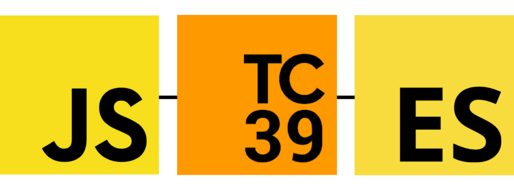

# [Curso de JavaScript Avanzado para desarrolladores Front-end](https://fictizia.com/formacion/curso-javascript-avanzado)
### POO con JS, ECMA6, Patrones de diseño, AJAX avanzado, HTML5 avanzado, APIs externas.


## Clase 5


### Recursos
- [Compatibilidad 2016+](http://kangax.github.io/compat-table/esnext/)
- [Axel Rauschmayer blog | ES2016](http://2ality.com/2016/01/ecmascript-2016.html)
- [What’s coming to Javascript (ES7 + ES8)](https://medium.com/@Murcul/whats-coming-to-javascript-es7-es8-8ce73c9a8ec9)
- [ES7 and ES8 Features](https://node.university/blog/1621685/es7es8)
- [Exploring ES2016 and ES2017](http://exploringjs.com/es2016-es2017.html)


### Implementados

### Iteraciones

**[Array.prototype.entries()](https://developer.mozilla.org/es/docs/Web/JavaScript/Referencia/Objetos_globales/Array/entries)**
```javascript
var lista = ['a', 'b', 'c'];
var iterador = lista.entries();

console.log(iterador.next().value); // [0, "a"]
console.log(iterador.next().value); // [1, "b"]
```

**[Array.prototype.values()](https://developer.mozilla.org/es/docs/Web/JavaScript/Referencia/Objetos_globales/Array/values)**
```javascript
var lista = ['f', 'i', 'c', 't', 'i', 'c', 'i', 'a']; 
var iterator = lista.values();

console.log(iterator.next().value); // f 
console.log(iterator.next().value); // i 
console.log(iterator.next().value); // c 
console.log(iterator.next().value); // t 
console.log(iterator.next().value); // i
//...
```

**[Array.prototype.keys() - ES6](https://developer.mozilla.org/es/docs/Web/JavaScript/Referencia/Objetos_globales/Array/keys)**
```javascript
var lista = ['a', 'b', 'c'];
var iterator = lista.keys(); 
  
for (let key of iterator) {
  console.log(key); // expected output: 0 1 2
}
```

**En la práctica...**
```javascript
var a = [1,2,3];
[...a.values()];	// [1,2,3]
[...a.keys()];		// [0,1,2]
[...a.entries()];	// [ [0,1], [1,2], [2,3] ]
```


### [Array.prototype.includes](http://2ality.com/2016/02/array-prototype-includes.html)
- Retorna un booleno si encuentra el elemento. Tiene muchas mejoras respecto `Array.prototype.indexOf`
- Propuesto por Domenic Denicola y Rick Waldron
- [ECMA documentation](http://www.ecma-international.org/ecma-262/7.0/index.html#sec-array.prototype.includes)

```javascript
['a', 'b', 'c'].includes('a') // true
['a', 'b', 'c'].includes('d') // false

// similitud con indexOf:
// arr.includes(x) -> arr.indexOf(x) >= 0

[NaN].includes(NaN) // true
[NaN].indexOf(NaN) // -1

// @see: http://speakingjs.com/es5/ch11.html#two_zeros
[-0].includes(+0) // true

// Arrays tipados también lo incluyen
let arrTip = Uint8Array.of(12, 5, 3);
console.log(arrTip.includes(5)); // true
```


### [Exponentiation Operator](http://2ality.com/2016/02/exponentiation-operator.html)
- Añade el operador exponencial `x ** y`, su comportamiento es igual que `Math.pow(x, y)`
- Propuesto por Rick Waldron, Claude Pache y Brendan Eich
- [ECMA documentation](http://www.ecma-international.org/ecma-262/7.0/index.html#sec-exp-operator)

```javascript
let cuadrado = 3 ** 2; // 9
let numero = 3;
numero **= 2; // 9
```

## ES2017 (ES8)


### Recursos
- [Async Functions for ECMAScript](https://github.com/tc39/ecmascript-asyncawait)
- [Simplifying asynchronous computations via generators (section in “Exploring ES6”)](http://exploringjs.com/es6/ch_generators.html#sec_co-library)
- [ES proposal: async functions](http://2ality.com/2016/02/async-functions.html)
- [Compatibilidad 2016+](http://kangax.github.io/compat-table/esnext/)
- [Axel Rauschmayer blog | ES2017](http://2ality.com/2016/02/ecmascript-2017.html)
- [Shared memory and atomics for ECMAscript](https://github.com/tc39/ecmascript_sharedmem)
- [ES8, el estándar Javascript de 2017 de Enrique Oriol](http://blog.enriqueoriol.com/2017/07/es8-estandar-javascript-2017.html)
- [Exploring ES2018 and ES2019](http://exploringjs.com/es2018-es2019/index.html)
- [ECMAScript - A Taste from ES2018 (ES9)](https://nitayneeman.com/posts/a-taste-from-ecmascript-2018/)
- [6 Reasons Why JavaScript’s Async/Await Blows Promises Away (Tutorial)](https://hackernoon.com/6-reasons-why-javascripts-async-await-blows-promises-away-tutorial-c7ec10518dd9)


### Implementados cambios principales

#### [Async Functions](http://2ality.com/2016/02/async-functions.html)
Propuesto por Brian Terlson


**Código asíncrono utilizando promesas y generadores**
- Nativo

```javascript
function fetchJson(url) {
    return fetch(url)
    .then(request => request.text())
    .then(text => {
        return JSON.parse(text);
    })
    .catch(error => {
        console.log(`ERROR: ${error.stack}`);
    });
}
fetchJson('http://example.com/some_file.json')
.then(obj => console.log(obj));
```

- Usando la librería [CO](https://github.com/tj/co)

```javascript
const fetchJson = co.wrap(function* (url) {
    try {
        let request = yield fetch(url);
        let text = yield request.text();
        return JSON.parse(text);
    }
    catch (error) {
        console.log(`ERROR: ${error.stack}`);
    }
});
```

- Funciones Asíncronas

```javascript
async function fetchJson(url) {
    try {
        let request = await fetch(url);
        let text = await request.text();
        return JSON.parse(text);
    }
    catch (error) {
        console.log(`ERROR: ${error.stack}`);
    }
}
```

- Variantes

```javascript
// Declaración
async function foo() {}

// Expresión
const foo = async function () {};

// Método
let obj = { async foo() {} }

// Formato Arrow Function
const foo = async () => {};
```

#### [Shared memory and atomics](http://2ality.com/2017/01/shared-array-buffer.html)
- Gestiona multithreading en Javascript, basicamente *web wrokers* con `ArrayBuffer`. 
- Muy bajo nivel
- Propuesto por Lars T. Hansen

### Implementados cambios menores

#### [Object.values/Object.entries](http://2ality.com/2015/11/stage3-object-entries.html)
- Retornan un array o una matriz con los valores o las propiedades iterables de los objetos
- Propuesto por Jordan Harband

**Objetos**
```javascript
const data = { elemnto: 'primero', otro_dato: 1 };
Object.values(data); // ["primero", 1]
Object.entries(data); // [["elemnto", "primero"], ["otro_dato", 1]]
```

**Arrays**
```javascript
const obj = ['p1', 'p2', 'p3']; // equivale a { 0: 'a', 1: 'z', 2: '5' };
Object.values(obj); // ["p1", "p2", "p3"]
Object.entries(obj); // [["0", "p1"], ["1", "p2"], ["2", "p3"]]
```

**Cadenas**
```javascript
Object.values('Fictizia'); // ["F", "i", "c", "t", "i"]
Object.entries('Ficti'); // [["0", "F"], ["1", "i"], ["2", "c"], ["3", "t"], ["4", "i"]]
```


#### [String padding](http://2ality.com/2015/11/string-padding.html)
- Se rellena una cadena por delante con `padStart` o por detras con `padEnd`, puedes especificar el relleno
- Propuesto por Jordan Harband y Rick Waldron

```javascript
// .padStart()
'data'.padStart(1);          // "data"
'data'.padStart(7);          // "   data"
'data'.padStart(6, '-');     // "--data"
'data'.padStart(10, 'info'); // "infoindata"
'data'.padStart(5, '*');     // "*data"

// .padEnd()
'data'.padEnd(1);          // "data"
'data'.padEnd(7);          // "data   "
'data'.padEnd(6, '-');     // "data--"
'data'.padEnd(10, 'info'); // "datainfoin"
'data'.padEnd(5, '*');     // "data*"
```

#### [Object.getOwnPropertyDescriptors()](http://2ality.com/2016/02/object-getownpropertydescriptors.html)
- No confundir con `Object.getOwnPropertyDescriptor()`
- Devulve las descripciones de las propiedades del objeto
- Esta pensado para facilitar el clonado de objetos ya que no se muestran propiedades heredadas por prototype
- Propuesto por Jordan Harband y Andrea Giammarchi
- [Object.getOwnPropertyDescriptors Proposal ](https://github.com/tc39/proposal-object-getownpropertydescriptors)


#### [Trailing commas in function parameter lists and calls](http://2ality.com/2015/11/trailing-comma-parameters.html)
- Se ignorarán las comas extras al final del último parámetro de una función
- Propuesto por Jeff Morrison

```javascript
//En declaración
function foo(p1, p2, p3,) { 
    //... 
}

//En ejecución
foo("a", "b", "b",);
```

## ES2018 (ES9)

### Recursos
- [Compatibilidad ES Next](http://kangax.github.io/compat-table/esnext/)
- [Compatibilidad 2016+](http://kangax.github.io/compat-table/esnext/)
- [Axel Rauschmayer blog | ES2018](http://2ality.com/2017/02/ecmascript-2018.html?utm_source=hashnode.com)

### Propuestas finalizadas (stage 4)
- [Template Literal Revision](http://2ality.com/2016/09/template-literal-revision.html) *Propuesto por Tim Disney*
- [s (dotAll) flag for regular expressions](http://2ality.com/2017/07/regexp-dotall-flag.html) *Propuesto por Mathias Bynens*
- [Rest/Spread Properties](http://2ality.com/2016/10/rest-spread-properties.html) *Propuesto por Sebastian Markbåge*
- [Asynchronous Iteration](http://2ality.com/2016/10/asynchronous-iteration.html) *Propuesto por Domenic Denicola*
- [RegExp Unicode Property Escapes](http://2ality.com/2017/07/regexp-unicode-property-escapes.html) *Propuesto por Brian Terlson, Daniel Ehrenberg y Mathias Bynens*
- [RegExp named capture groups](http://2ality.com/2017/05/regexp-named-capture-groups.html) *Propuesto por Daniel Ehrenberg y Brian Terlson*
- [Promise.prototype.finally()](http://2ality.com/2017/07/promise-prototype-finally.html) *Propuesto por Jordan Harband*

### Candidatos muy probables (stage 3)
- [Function.prototype.toString revision](http://2ality.com/2016/08/function-prototype-tostring.html) *Propuesto por Michael Ficarra*
- [global](http://2ality.com/2016/09/global.html) *Propuesto por Jordan Harband*
- [import()](http://2ality.com/2017/01/import-operator.html) *Propuesto por Domenic Denicola*
- [RegExp Lookbehind Assertions](http://2ality.com/2017/05/regexp-lookbehind-assertions.html) *Propuesto por Daniel Ehrenberg*
- [BigInt – arbitrary precision integers](http://2ality.com/2017/03/es-integer.html) *Propuesto por Daniel Ehrenberg*
- [Class fields](http://2ality.com/2017/07/class-fields.html) *Propuesto por Daniel Ehrenberg y Jeff Morrison*
- [Optional catch binding](http://2ality.com/2017/08/optional-catch-binding.html) *Propuesto por Michael Ficarra*
- [import.meta](http://2ality.com/2017/11/import-meta.html) *Propuesto por Domenic Denicola*
- [Array.prototype.flatMap/flatten](http://2ality.com/2017/04/flatmap.html) *Propuesto por Brian Terlson y Michael Ficarra*


### TC39 y nuestro futuro



**Recursos**
- [SPEC - Proceso del comite](https://tc39.github.io/process-document/)
- [TC39 and its contributions to ECMAScript](https://medium.freecodecamp.org/tc39-and-its-contributions-to-ecmascript-c178b77f32e1)
- [ECMAScript, TC39, and the History of JavaScript](https://www.youtube.com/watch?v=gytOcNFV1dM)
- [TC39, ECMAScript, and the Future of JavaScript](https://ponyfoo.com/articles/tc39-ecmascript-proposals-future-of-javascript)
- [TC39: We want your help making the next JS—BarcelonaJS](https://www.youtube.com/watch?v=4mm3a6Unjj8)

**Estados**
- [TC39 Meeting Notes](http://tc39.github.io/tc39-notes/#tc39-meeting-notes)
- [Stage 0: Strawman](https://github.com/tc39/proposals/blob/master/stage-0-proposals.md)
- [Stage 1: Proposal](https://github.com/tc39/proposals#stage-1)
- [Stage 2: Draft](https://github.com/tc39/proposals#stage-2)
- [Stage 3: Candidate](https://github.com/tc39/proposals#stage-3)
- [Stage 4: Finished](https://github.com/tc39/proposals/blob/master/finished-proposals.md)
- [Propuestas Inactivas (rechazadas)](https://github.com/tc39/proposals/blob/master/inactive-proposals.md)


### Ejercicios


#### 1 - Ayudemos a la NASA!

En Marte tenemos un rover llamado [curiosity](https://es.wikipedia.org/wiki/Curiosity)... Nuestro objetivo es usar la [API de la NASA](https://api.nasa.gov/mars-photos/api/v1/rovers/curiosity/photos) para complementar este ejercicio.

**Problema:**
- La medida del tiempo para esta API son los SOLES, no todos los SOLES tenemos datos, por eso la api retorna un array vacío en algunso soles.
```JSON
{
  "photos": [
    
  ]
}
```

**Solución:**
- Nuestro objetivo es hacer una llamada recursiva a la API de tal forma que si un SOL no tiene información útil pasamos al SOL anterior.
- Para evitar baneos necesitamos determinar la frecuencia de las llamadas recursivas en ms
- Así como podemos establecer un límite de llamadas por si salimos mucho de rango.

**Mensajes esperados por consola:**

```
request started for: https://api.nasa.gov/mars-photos/api/v1/rovers/curiosity/photos?sol=2080&api_key=XXX
Delay for next request 1000ms
request started for: https://api.nasa.gov/mars-photos/api/v1/rovers/curiosity/photos?sol=2079&api_key=XXX
Delay for next request 1000ms
request started for: https://api.nasa.gov/mars-photos/api/v1/rovers/curiosity/photos?sol=2078&api_key=XXX
Delay for next request 1000ms
request started for: https://api.nasa.gov/mars-photos/api/v1/rovers/curiosity/photos?sol=2078&api_key=XXX
Delay for next request 1000ms
request started for: https://api.nasa.gov/mars-photos/api/v1/rovers/curiosity/photos?sol=2077&api_key=XXX
Delay for next request 1000ms
request started for: https://api.nasa.gov/mars-photos/api/v1/rovers/curiosity/photos?sol=2076&api_key=XXX
Delay for next request 1000ms
request started for: https://api.nasa.gov/mars-photos/api/v1/rovers/curiosity/photos?sol=2075&api_key=XXX
Delay for next request 1000ms
request started for: https://api.nasa.gov/mars-photos/api/v1/rovers/curiosity/photos?sol=2074&api_key=XXX
Delay for next request 1000ms
request started for: https://api.nasa.gov/mars-photos/api/v1/rovers/curiosity/photos?sol=2073&api_key=XXX
Delay for next request 1000ms
request started for: https://api.nasa.gov/mars-photos/api/v1/rovers/curiosity/photos?sol=2072&api_key=XXX
Delay for next request 1000ms
request started for: https://api.nasa.gov/mars-photos/api/v1/rovers/curiosity/photos?sol=2071&api_key=XXX
Delay for next request 1000ms
request started for: https://api.nasa.gov/mars-photos/api/v1/rovers/curiosity/photos?sol=2070&api_key=XXX
currentValue: [{…}, {…}, {…}, {…}, {…}, {…}, {…}, {…}, {…}, {…}]
```

**Código Esqueleto**
```javascript
const token = "YOUR TOKEN HERE";

function NasaRequest() {
  
}; 

async function init() {
  /*
    - current sun: 2080
    - limit requests: false
    - frecuency: 1000ms
  */
  const currentValue = await NasaRequest(2080, false, 1000);
  console.log("currentValue:", currentValue);
}
init();
```

```javascript
const token = "";

function NasaRequest(soles=400, limit=true, frecuency=0) {
  return new Promise((resolve, reject) => {
    const url = `https://api.nasa.gov/mars-photos/api/v1/rovers/curiosity/photos?sol=${soles}&api_key=${token}`;
    console.log("request started for:", url);
    fetch(url).then(res => {
      if (res.status === 200){
        res.json().then(data => {
          data = data.photos;
          if(data.length === 0 && !limit) {
            setTimeout(()=> {
              console.log(`Delay for next request ${frecuency}ms`)
              NasaRequest(soles-1, !limit ? false : limit-1, frecuency);
            }, frecuency)
          } else {
            resolve(data);
          }
        })
      } else {
        reject(`ERROR in request, status ${res.status}`)
      }
    });
  })
}; 


async function init() {
  const currentValue = await NasaRequest(2071, false, 1000);
  console.log("currentValue:", currentValue);
}
init();
```
