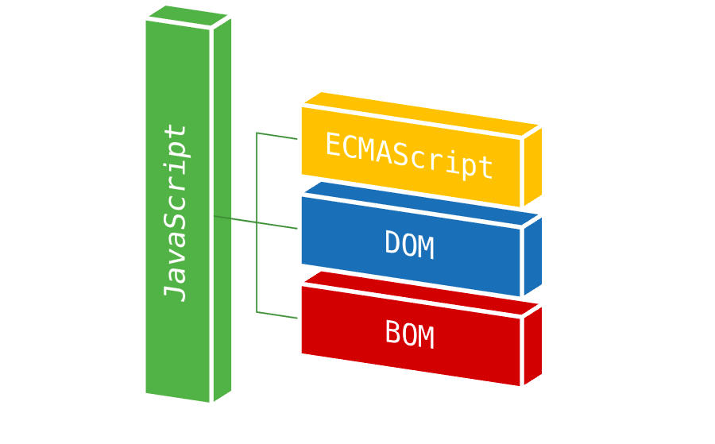
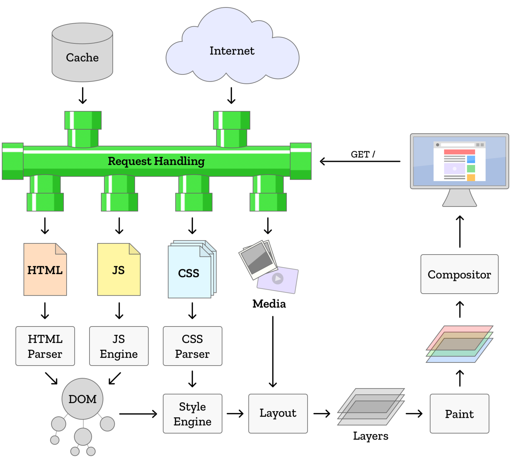
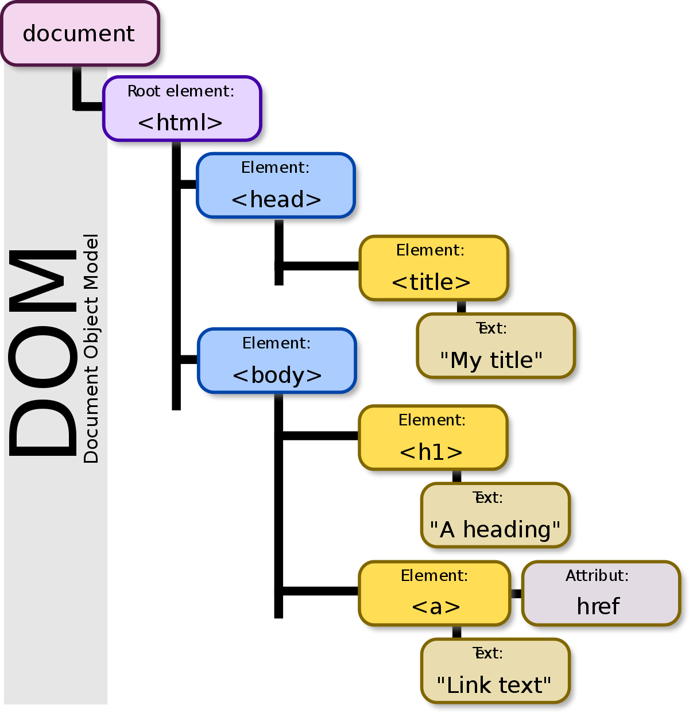

# [Curso de JavaScript Avanzado para desarrolladores Front-end](https://fictizia.com/formacion/curso-javascript-avanzado)
### POO con JS, ECMA6, Patrones de diseño, AJAX avanzado, HTML5 avanzado, APIs externas.


## Clase 7

### BOM (Browser Object Model)



### Window history

```javascript
history.length

// Ir atras
history.go(-1);
history.back();

// Ir adelante
history.go(1);
history.forward();
```

### Window Navigator 

```javascript
function informacionSistema(){
	console.log("appCodeName:", window.navigator.appCodeName);
	console.log("appName:", window.navigator.appName);
	console.log("appVersion:", window.navigator.appVersion);
	console.log("platform:", window.navigator.platform);
	console.log("product:", window.navigator.product);
	console.log("userAgent:", window.navigator.userAgent);
	console.log("javaEnabled:", window.navigator.javaEnabled());
	console.log("language (used):", window.navigator.language);
	console.log("language (support):", window.navigator.languages);
	console.log("conectado a internet?", window.navigator.onLine);
	console.log("mimeTypes:",window.navigator.mimeTypes);
	console.log("Plugins:", navigator.plugins);
}
```

### Window Screen

```javascript
function informacionPantalla(){
	console.log("availTop:", window.screen.availTop);
	console.log("availLeft:", window.screen.availLeft);
	console.log("availHeight:", window.screen.availHeight);
	console.log("availWidth:", window.screen.availWidth);
	console.log("colorDepth:", window.screen.colorDepth);
	console.log("height:", window.screen.height);
	console.log("left:", window.screen.left);
	console.log("orientation:", window.screen.orientation);
	console.log("pixelDepth:", window.screen.pixelDepth);
	console.log("top:", window.screen.top);
	console.log("width:", window.screen.width);
}
```


###  window & document location

```javascript
	function informacionEnlace(url){
	
		var enlace = document.createElement('a');
		enlace.href = url || 'https://fictizia.com:3000/formacion/curso_javascript?q=JS#contenido-curso';
		
		console.log("href:" ,enlace.href);
		console.log("protocol:", enlace.protocol);
		console.log("host:", enlace.host);
		console.log("hostname:", enlace.hostname);
		console.log("port:", enlace.port);
		console.log("pathname:", enlace.pathname);
		console.log("search:", enlace.search);
		console.log("hash:", enlace.hash);
		console.log("origin:", enlace.origin);
	}
```

Vale para hacer routing, ejemplo Navigo js en github.


**Métodos:**
- .assign() *Carga una página nueva*

Se borra el historial en esa pestaña

```javascript
document.location.assign('http://fictizia.com/formacion/curso_javascript');
```
- .reload() *Recarga*
```javascript
document.location.reload(); // Recarga
document.location.reload(true); // Recarga sin usar el cache
```
- .replace() *Carga una página nueva, sustituyendo la actual en el historial*
```javascript
document.location.replace('http://fictizia.com/formacion/curso_javascript');
```
- .toString() *Devuelve el href como cadena*
```javascript
var enlace = document.createElement('a');
enlace.href = 'http://fictizia.com/formacion/curso_javascrip';

console.log("toString:" ,enlace.toString());
```

### Terminología

`<a href="https://fictizia.com">Fictizia</a>`
- `a` es la etiqueta o tag
- `href` es el atributo
- `"https://fictizia.com"` es el valor del atributo
- `Fictizia` es el texto

### Data-Attibutes

```html
<article
  id="electriccars"
  data-columns="3"
  data-index-number="12314"
  data-parent="cars">
...
</article>
```

```javascript
var article = document.getElementById('electriccars');
 
article.dataset.columns // "3"
article.dataset.indexNumber // "12314"
article.dataset.parent // "cars"
```


```css
article::before {
  content: attr(data-parent);
}

article[data-columns='4'] {
  width: 600px;
}
```


### Render del browser



- [An Introduction to Browser Rendering](https://www.youtube.com/watch?v=n1cKlKM3jYI)
- [Ryan Seddon: So how does the browser actually render a website | JSConf EU 2015](https://www.youtube.com/watch?v=SmE4OwHztCc)

INTERESANTE:
- [Kruno: How browsers work | JSUnconf 2017](https://www.youtube.com/watch?v=0IsQqJ7pwhw)

### DOM




- [DOM - Document Object Model](https://developer.mozilla.org/en-US/docs/Web/API/Document_Object_Model)
IMPORTANTE:
- [Element](https://developer.mozilla.org/en-US/docs/Web/API/Element)
- [Node](https://developer.mozilla.org/en-US/docs/Web/API/Node)
- [NodeList](https://developer.mozilla.org/en-US/docs/Web/API/NodeList)
- [Tipos de nodos en el dom](https://developer.mozilla.org/en-US/docs/Web/API/Node/nodeType)


### DOM Selectores: Root Nodes
- `document`
- `document.documentElement`
- `document.head`
- `document.body`


### DOM Selectores: Parent Nodes
- [parentNode](https://developer.mozilla.org/en-US/docs/Web/API/Node/parentNode)
- [parentElement](https://developer.mozilla.org/en-US/docs/Web/API/Node/parentElement)


#### DOM Selectores: Children Nodes
- [childNodes](https://developer.mozilla.org/en-US/docs/Web/API/Node/childNodes)
- [firstChild](https://developer.mozilla.org/en-US/docs/Web/API/Node/firstChild)
- [lastChild](https://developer.mozilla.org/en-US/docs/Web/API/Node/lastChild)
- [children](https://developer.mozilla.org/en-US/docs/Web/API/ParentNode/children)
- [firstElementChild](https://developer.mozilla.org/en-US/docs/Web/API/ParentNode/firstElementChild)
- [lastElementChild](https://developer.mozilla.org/en-US/docs/Web/API/ParentNode/lastElementChild)


#### DOM Selectores: Sibling Nodes
- [previousSibling](https://developer.mozilla.org/en-US/docs/Web/API/Node/previousSibling)
- [nextSibling](https://developer.mozilla.org/en-US/docs/Web/API/Node/nextSibling)
- [previousElementSibling](https://developer.mozilla.org/en-US/docs/Web/API/NonDocumentTypeChildNode/previousElementSibling)
- [nextElementSibling](https://developer.mozilla.org/en-US/docs/Web/API/NonDocumentTypeChildNode/nextElementSibling)


### DOM Selectores: Acceso a los elementos

Mejor usar query selector, ver más abajo.

- getElementById():
```javascript
    // <tag id = "x" >
    document.getElementById("id");
```

- getElementsByName():
```javascript
    // <tag name = "x" >
    document.getElementsByName("x");
```

- getElementsByTagName():
```javascript
    // <tag >
    document.getElementsByTagName("input");
```

- getElementsByClassName():
```javascript
    // <tag class="test-class">
    document.getElementsByClassName("test-class");
```


### DOM Selectores: querySelector & querySelectorAll

- [Soporte querySelector](http://caniuse.com/#search=querySelector)
- :warning: **IMPORTANTE:**  Los retornos de *Node.childNodes* y *document.querySelectorAll* - NO son arrays. 

```javascript

var listaDivs = document.querySelectorAll('div');

// Iteración
for (var i = 0; i < listaDivs.length; ++i) {
  var elemento = listaDivs[i];
  console.log("Elemento: ", elemento);
}

```


**querySelector()**
Devuelve el primer elemento que coincida con el selector 

```html
    <div id="miDiv">
        <span id="miId5" class="miClase" title="cinco"></span>
        <span id="miId4" class="miClase" title="cuatro"></span>
        <span id="miId3" class="miClase" title="tres"></span>
        <span id="miId2" class="miClase" title="dos"></span>
        <span id="miId1" class="miClase" title="uno"></span>
    </div> 
```

```javascript
    document.getElementById('miId1').title // uno
    document.querySelector('#miDiv .miClase').title // cinco
    document.querySelector('#miDiv #miId1.miClase').title // uno
    document.querySelector('#miDiv .inventado').title // ERROR -> undefined
    document.querySelector('#miDiv .miClase[title^=u]').title // uno
```

**querySelectorAll()**
Devuelve todos los elementos que coincida con el selector en un pseudo-array
```javascript
    document.querySelectorAll('#miDiv .miClase') // [<span id="miId5" ... ]
    document.querySelectorAll('p') // todos los parrafos
    document.querySelectorAll('div, img') // todos los divs e imágenes
    document.querySelectorAll('a > img') // todos las imágenes contenidas en enlaces
```


**Conversión a Arrays**

- Mas info en [Convert NodeList to Array de David Walsh](https://davidwalsh.name/nodelist-array)
```javascript

//Opción 1
var nodesArray = Array.prototype.slice.call(document.querySelectorAll("div"));

//Opción 2
var nodesArray = [].slice.call(document.querySelectorAll("div"));
```

### DOM: Recursos

INTERESANTE SELECTORES CSS3
- [Todos los selectores CSS3](https://www.w3schools.com/cssref/css_selectors.asp)
- [Introduction to the DOM](https://www.digitalocean.com/community/tutorials/introduction-to-the-dom)
- [Understanding the DOM Tree and Nodes](https://www.digitalocean.com/community/tutorials/understanding-the-dom-tree-and-nodes)
- [How To Access Elements in the DOM](https://www.digitalocean.com/community/tutorials/how-to-access-elements-in-the-dom)


### DOM: Depuración por consola

Para probar a buscar elementos en la consola, no en el js, no es jquery.

- [Más información](https://developers.google.com/web/tools/chrome-devtools/console/expressions)
```javascript
$('code')		// Muestra el primer elemento que coincide con el selector de CSS especificado.
			// Combinación de teclas para document.querySelector().
$$('figure')		// Muestra un conjunto de todos los elementos que coinciden con el selector de CSS especificado. 
			// Alias para document.querySelectorAll().
$x('html/body/p')	// Muestra un conjunto de elementos que coinciden con XPath especificada.
```


### DOM: Estilos con Javascript
```javascript
// getter
window.getComputedStyle(document.getElementById("id"));
window.getComputedStyle(document.body).getPropertyValue('display');
// setter
document.body.style.display="none";
document.getElementById("id").style.display="none";
```

### Manipulación del DOM: Efectos

**Ocultar un elemento**
```javascript
el.style.display = 'none';
```

**Mostrar un elemento**
```javascript
el.style.display = '';
```

**Librerías útiles**

Para copiarte clases con animaciones css.

- [animate.css](http://daneden.github.io/animate.css/)
- [move.js](https://github.com/visionmedia/move.js)

### Manipulación del DOM: Trabajando con Clases

**Añadir una clase**
```javascript
el.classList.add(className);
```

**Verificar una clase**
```javascript
el.classList.contains(className);
```

**Eliminar una clase**
```javascript
el.classList.remove(className);
```

**Alternar una clase**
```javascript
el.classList.toggle(className);
```

**Remplazar una clase**
```javascript
element.classList.replace('old', 'new');
```

### Manipulación del DOM: Insertando elementos

**Insertar contenido despues de un elemento (after)**
```javascript
el.insertAdjacentHTML('afterend', "<h1>Nuevo contenido</h1>");
```

**Insertar contenido antes de un elemento (before)**
```javascript
el.insertAdjacentHTML('beforebegin', "<h1>Nuevo contenido</h1>");
```

**Insertar contenido al final del propio elemento (append)**
```javascript
elementParent.appendChild(el);
```

**Insertar contenido al principio del propio elemento (prepend)**
```javascript
elementParent.insertBefore(el, elementParent.firstChild);
```


### Manipulación del DOM: Accediendo a elementos 


**Acceder al elemento Hijo**
```javascript
el.children
```

**Acceder al elemento Padre**
```javascript
el.parentNode
```

**Eliminar un elemento**
```javascript
el.parentNode.removeChild(el);
```

**Verificar si un elemento contiene un selector**
```javascript
el.querySelector(selector) !== null
```

**Buscar elementos dentro otro Elemento**
```javascript
el.querySelector(selector)
el.querySelectorAll(selector)
```

### Manipulación del DOM: Modificando contenido


**Cambiar/modificar/borrar el texto de dentro de un elemento**
```javascript
el.textContent = string;
```
**Cambiar/modificar/borrar el html de dentro de un elemento**
```javascript
el.innerHTML = string;
```

**Cambiar/modificar/borrar el html de un elemento**
```javascript
el.outerHTML = string;
```

### Manipulación del DOM: Trabajando con Atributos


**Retornar los valores de un atributo**
```javascript
el.getAttribute('tabindex');
```

**Cambiar/modificarlos valores de un atributo**
```javascript
el.setAttribute('tabindex', 3);
```
**Borrar los valores de un atributo**
```javascript
element.removeAttribute('href');
```

**Verificar si existe un atributo en un elemento**
```javascript
element.hasAttribute('href');
```


### Recursos
- [How To Traverse the DOM](https://www.digitalocean.com/community/tutorials/how-to-traverse-the-dom)
- [How To Make Changes to the DOM](https://www.digitalocean.com/community/tutorials/how-to-make-changes-to-the-dom)
- [How To Modify Attributes, Classes, and Styles in the DOM](https://www.digitalocean.com/community/tutorials/how-to-modify-attributes-classes-and-styles-in-the-dom)


### Trabajar sin JQuery


- **[You Might Not Need Jquery](http://youmightnotneedjquery.com/)**
- **[You Might Not Need Jquery(en GitHub)](https://github.com/HubSpot/youmightnotneedjquery)**


### Carga asincrona de Scripts

- La renderización de la pagian espera hasta tener cargadas todas sus dependencias (src, href, etc..)
- La recomendación de cargar los scripts al final del body sigue vigente
- Otra forma de aliviar este peso es cargar scripts y multimedia haciendo uso de AJAX
- Otra forma de gestionar esto para proyectos grandes es usar [Requirejs](https://requirejs.org/), [Browserify](http://browserify.org/) y demás...
- `async` y `defer` vienen al [rescate](https://es.stackoverflow.com/a/24430)
s
```html
<script src="fichero1.js" async></script>
//Carga fichero1.js sin interferir en el renderizado del DOM

<script src="fichero2.js" defer></script>
//Carga fichero2.js después de haberse descargado.
```

### Frameworks para HTML y CSS


### Frameworks: Bootstrap


**Recursos**
- [twbs/bootstrap](https://github.com/twbs/bootstrap)
- [Bootstrap Expo](https://expo.getbootstrap.com/)
- [Lista gigante de recursos](https://startbootstrap.com/bootstrap-resources)

**Core**
- [Migración de Bootstrap 3.3 a 4.0](https://getbootstrap.com/docs/4.0/migration/)
- [Bootstrap v4](https://getbootstrap.com/)
    - [Introduction](https://getbootstrap.com/docs/4.0/getting-started/introduction/)
    - [Layout](https://getbootstrap.com/docs/4.0/layout/overview/)
    - [Contenido](https://getbootstrap.com/docs/4.0/content/reboot/)
    - [Componentes](https://getbootstrap.com/docs/4.0/components/alerts/)
    - [Utilidades](https://getbootstrap.com/docs/4.0/utilities/borders/)
    - [Extensiones](https://getbootstrap.com/docs/4.0/extend/icons/)
    - [Documentación](https://getbootstrap.com/docs/4.0/getting-started/introduction/)   
    - [Ejemplos](https://getbootstrap.com/docs/4.0/examples/)   
- [Bootstrap v3.3](https://getbootstrap.com/docs/3.3/)
    - [Getting started](https://getbootstrap.com/docs/3.3/getting-started/)
    - [CSS](https://getbootstrap.com/docs/3.3/css/)
    - [Componentes](https://getbootstrap.com/docs/3.3/components/)
    - [JavaScript](https://getbootstrap.com/docs/3.3/javascript/)
    - [Customize & download](https://getbootstrap.com/docs/3.3/customize/)

**Temas**
- [Themes built by or reviewed by Bootstrap's creators](https://themes.getbootstrap.com/)
- [Flat UI](http://designmodo.github.io/Flat-UI/)
- [bootswatch](https://bootswatch.com/)
- [75+ Free Bootstrap HTML5 Website Templates](http://webdesignwheel.com/free-bootstrap-html5-website-templates.html)
- [45 Free Bootstrap Themes For Creating A Professional Website](https://savedelete.com/design/free-bootstrap-themes/174529/)

**Componentes de UI**
- [Bootsnipp](https://bootsnipp.com/)
- [CodesUI](https://codexui.com/)

### Frameworks: Otros...

- [Foundation](https://foundation.zurb.com/)
- [Bulma](https://bulma.io/)
- [Ulkit](https://getuikit.com/)
- [Semantic UI](https://semantic-ui.com/)
- [material.io](https://material.io/)
- [Material Design for Bootstrap](https://fezvrasta.github.io/bootstrap-material-design/)
- [Material Design Lite](https://getmdl.io/)


### Ejercicios

**1 -** Saca una lista de los cursos disponibles en Fictizia en el [área de Desarrollo interactivo y Web](https://www.fictizia.com/planes/desarrollo-interactivo-y-web) y conviertelo en Markdown. 

```javascript
var markdown = "# Cursos de Fictizia en el Área de Desarrollo interactivo y Web\n\n";

var cursos = document.querySelectorAll('.plan');


for (var i = 0; cursos.length > i; i++) {
	
	var curso = cursos[i];
	var horas = curso.querySelector(".mainTag").innerText;
	var titulo = curso.querySelector("a").innerText
	var link = curso.querySelector("a").href
	markdown +=  "- [" + titulo + " (" + horas + ")](" + link + ")\n";
}

console.log(markdown);
```

- Respuesta esperada (consola):

```
# Cursos de Fictizia en el Área de Desarrollo interactivo y Web

- [Máster en Diseño de interfaz y Front-end con HTML5, CSS3 y jQuery (165 HORAS)](https://fictizia.com/formacion/master-interfaz-frontend-html5-css3-jquery)
- [Máster en Programación FullStack con JavaScript y Node.js (300 HORAS)](https://fictizia.com/formacion/master-javascript-nodejs)
- [Curso de Diseño de interfaz en proyectos Web, Apps y Smart TV (45 HORAS)](https://fictizia.com/formacion/curso-diseno-interfaz-web-apps-smart-tv)
- [Curso de UX y diseño de productos digitales (56 HORAS)](https://fictizia.com/formacion/curso-ux)
- [Curso de maquetación y animación Web con HTML5 y CSS3 (72 HORAS)](https://fictizia.com/formacion/curso-frontend-html5-css3)
- [Curso de jQuery para maquetadores web (36 HORAS)](https://fictizia.com/formacion/curso-programacion-jquery)
- [Curso de JavaScript para desarrolladores web (45 HORAS)](https://fictizia.com/formacion/curso-javascript)
- [Curso de JavaScript Avanzado para desarrolladores Front-end (72 HORAS)](https://fictizia.com/formacion/curso-javascript-avanzado)
- [Curso de Angular (v6.x) (36 HORAS)](https://fictizia.com/formacion/curso-angular-javascript)
- [Curso de React + Redux (30 HORAS)](https://fictizia.com/formacion/curso-react-js-redux)
- [Curso de Node.js para desarrolladores Front-end (24 HORAS)](https://fictizia.com/formacion/curso-nodejs)
- [Curso de AngularJS (v1.x) (30 HORAS)](https://fictizia.com/formacion/curso-angularjs)
- [Curso de Polymer (42 HORAS)](https://fictizia.com/formacion/curso-polymer)
- [Curso de PHP (45 HORAS)](https://fictizia.com/formacion/curso-php)
- [Curso de PHP Avanzado con Laravel (36 HORAS)](https://fictizia.com/formacion/curso-laravel-php-avanzado)
- [Curso de Python (45 HORAS)](https://fictizia.com/formacion/curso-python)
- [Curso de aplicación y entrenamiento de Seguridad OWASP Top 10 (32 HORAS)](https://fictizia.com/formacion/curso-seguridad-owasp)
- [Curso de metodologías ágiles para desarrollo de proyectos (33 HORAS)](https://fictizia.com/formacion/curso-agile-scrum)
- [Curso de Vue.JS + Vuex (36 HORAS)](https://fictizia.com/formacion/curso-vue-js)
```

**2 -** Hagamos la [web del Metro](https://www.metromadrid.es/es/index.html) más divertida.
- Saca el estado actual de todas las líneas del metro de Madrid por consola.

```javascript
var lineas = document.querySelectorAll('.bloquet');

for (var i = 0; i < lineas.length; i++) {
  var estado = lineas[i].querySelector('.circulacion > .txt > a');
  
  if(!estado) estado = lineas[i].querySelector('.circulacion > .r > a');
  
  if(estado) console.log(estado.innerText.trim());
  
}
```

- Respuesta esperada:
```txt
Circulación normal en Línea 1
Circulación normal en Línea 8
Circulación normal en Línea 2
Circulación normal en Línea 9
Circulación normal en Línea 3
Circulación normal en Línea 10
Circulación normal en Línea 4
Circulación normal en Línea 11
Circulación normal en Línea 5
Circulación normal en Línea 12
Circulación normal en Línea 6
Circulación normal en Ramal
Circulación normal en Línea 7
Circulación normal en ML1
```


**3 -**  Diseña un script que sustituya todas las imágenes de las entradas de [Tecnología del Mundo Today](http://www.elmundotoday.com/noticias/tecnologia/) por [imágenes dummy de gatitos](https://placekitten.com/).
```javascript
var imagenes = document.querySelectorAll('.td-module-thumb img');

for(var i = 0; i < imagenes.length; i++){
	var url = document.querySelectorAll('.td-module-thumb img')[i].src;
	var ancho = document.querySelectorAll('.td-module-thumb img')[i].width;
	var alto = document.querySelectorAll('.td-module-thumb img')[i].height;
	var sustituto = "https://placekitten.com/"+ancho+"/"+alto;
	document.querySelectorAll('.td-module-thumb img')[i].src = sustituto;
	// Hack para solucionar el visionado
	document.querySelectorAll('.td-module-thumb img')[i].removeAttribute("srcset");
}
```

**4 -** Nos creamos un array de objetos con la informacion, links y fotografias de l@s [profes de Fictizia](https://www.fictizia.com/profesorado)
```javascript
var listaProfesores = [];

var profesores = document.querySelectorAll('.microCard');

for (var i = 0; profesores.length > i; i++) {
	
	var profesor = profesores[i];
	
	detallesProfesor = {
		nombre: profesor.querySelector("h3").innerText,
		bio: profesor.querySelector("p").innerText,
		avatar: profesor.querySelector("img").src,
	};
	
	var links = profesor.querySelectorAll(".microBtns > li")
	
	for (var j = 0; links.length > j; j++) {
		var link = links[j]
		var linkNombre = link.innerText.toLowerCase().trim();
		var linkUrl = link.querySelector("a").href;
		detallesProfesor[linkNombre] = linkUrl
	}
	
	listaProfesores.push(detallesProfesor)
}

console.log(listaProfesores);
```