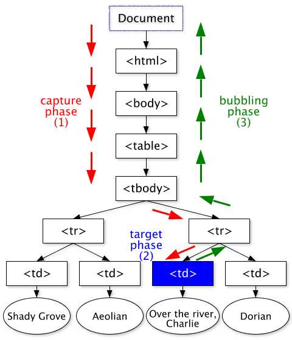
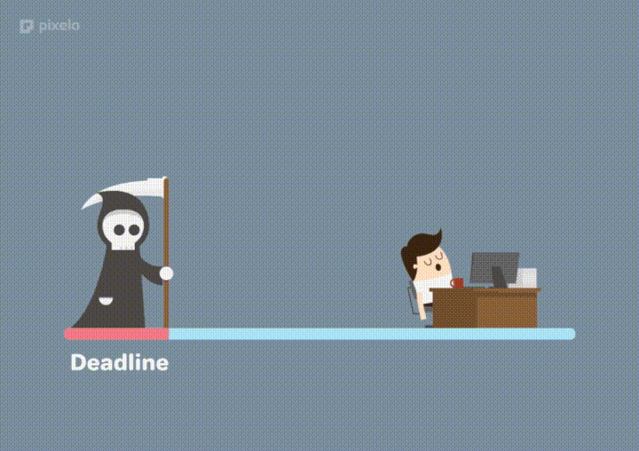

# [Curso de JavaScript Avanzado para desarrolladores Front-end](https://fictizia.com/formacion/curso-javascript-avanzado)
### POO con JS, ECMA6, Patrones de diseño, AJAX avanzado, HTML5 avanzado, APIs externas.


## Clase 8

### Eventos: Funcionamiento

[Soporte](http://caniuse.com/#search=addEventListener)

- Podemos escuchar eventos y enlazar funciones (*event handler*)


[Demo](http://jsfiddle.net/L79xw5ye/)

**Propagación:**
- *Capturing* desde *document* hasta el elemento
- *Target* impacta el elemento
- *Bubbling* sube desde el elemento hasta *document*
	 

### Eventos: Usando Eventos con `onclick` 

Solo una función por evento
```html
	<button onclick="cambiarFondo()">Cambia el fondo</button>
```
	
```javascript
	function cambiarFondo() {
		// color = 'rgb(0-255,0-255,0-255'
		var color = 'rgb(' + Math.floor((Math.random() * 255))+ ',';
		color += Math.floor((Math.random() * 255)) + ',';
		color += Math.floor((Math.random() * 255)) + ')';
		document.body.style.backgroundColor= color;
		console.info("Nuevo color:", color);
	}
```

**Usando Eventos (actualidad):**

- Usando Eventos (Callbacks)
	- Multiples funciones por evento
	- Necesidad de compatibilizar para IE8

- Propiedades

ISTRUSTED ES MUY INTERESANTE, PARA VER SI EL USER ES EL QUE HA HECHO CLICK, ESO EVITA QUE LA FUNCION DEL EVENTO SE EJECUTE SI NO LO HA ACTIVADO EL USUARIO.
	```javascript
		// Callback - Manejador de Eventos
		function manejadorEventos(elEvento) {
		  	// Compatibilizar el evento
		  	var evento = elEvento || window.event;
		  	// Imprimir detalles
		  	console.log("-----------------------------")
		  	console.log("Type: "+evento.type); // Tipo
		  	console.log("Bubbles: "+evento.bubbles);
		  	console.log("Cancelable: "+evento.cancelable);
		  	console.log("CurrentTarget: ", evento.currentTarget);
			console.log("DefaultPrevented: "+evento.defaultPrevented);
			console.log("EventPhase: "+evento.eventPhase);
			console.log("Target: ", evento.target);
			console.log("TimeStamp: "+evento.timeStamp);
			console.log("IsTrusted: "+evento.isTrusted); // true - Usuario o false - Script
			console.log("=============================")
			// Desactivamos
			if (document.removeEventListener){ 
				document.removeEventListener('click', manejadorEventos);
				console.info("Listener quitado con exito");
			} else { // IE8
				document.detachEvent('onclick', manejadorEventos);
				console.info("Listener quitado con exito");
			}
		}
		// Añadimos Listener
		document.addEventListener('click', manejadorEventos);
	```	

- Métodos:
	- .addEventListener() *Añadir un evento a un elemento del DOM*:
	```javascript
	document.body.addEventListener('click', function (e) {
	    var color = 'rgb(' + Math.floor((Math.random() * 255))+ ',';
	    color += Math.floor((Math.random() * 255)) + ',';
	    color += Math.floor((Math.random() * 255)) + ')';
	    document.body.style.backgroundColor= color;
	    console.info("Nuevo color:", color);
	});
	```
	- .attachEvent() *Añadir un evento a un elemento del DOM (<= IE8)*:
	```javascript
	document.attachEvent('onclick', function (e) {
	    var color = 'rgb(' + Math.floor((Math.random() * 255))+ ',';
	    color += Math.floor((Math.random() * 255)) + ',';
	    color += Math.floor((Math.random() * 255)) + ')';
	    document.body.style.backgroundColor= color;
	    console.info("Nuevo color:", color);
	});
	```
	- .removeEventListener() *Elimina un evento previamente añadido*:
	```javascript
	function cambiarColor (){
	    var color = 'rgb(' + Math.floor((Math.random() * 255))+ ',';
	    color += Math.floor((Math.random() * 255)) + ',';
	    color += Math.floor((Math.random() * 255)) + ')';
	    document.body.style.backgroundColor= color;
	    console.info("Nuevo color:", color);
	}
	
	document.body.addEventListener('click', cambiarColor);
	document.body.removeEventListener('click', cambiarColor);
	```
	- .detachEvent() *Elimina un evento previamente añadido (<= IE8)*:
	```javascript
	function cambiarColor (){
	    var color = 'rgb(' + Math.floor((Math.random() * 255))+ ',';
	    color += Math.floor((Math.random() * 255)) + ',';
	    color += Math.floor((Math.random() * 255)) + ')';
	    document.body.style.backgroundColor= color;
	    console.info("Nuevo color:", color);
	}
	
	document.body.attachEvent('onclick', cambiarColor);
	document.body.detachEvent('onclick', cambiarColor);
	```
	- .dispatchEvent() *Lanza un evento manualmente*:
	```javascript
	document.body.addEventListener('click', function (e) {
	    var color = 'rgb(' + Math.floor((Math.random() * 255))+ ',';
	    color += Math.floor((Math.random() * 255)) + ',';
	    color += Math.floor((Math.random() * 255)) + ')';
	    document.body.style.backgroundColor= color;
	    console.info("Nuevo color:", color);
	});
	
	var lanzadorEventos = new Event('click');
	document.body.dispatchEvent(lanzadorEventos);
	```


### Detalles de un evento

```javascript
document.body.addEventListener("click", detallesEvento, false);
document.body.addEventListener("keyup", detallesEvento, false);


function detallesEvento (evento) {
    console.group("Manejador de Eventos");
    	console.log("-----------------------------");
    	for (var propiedad in evento){
    		console.log("evento["+propiedad+"]="+evento[propiedad])
    	}
        console.log("=============================");
    console.groupEnd();
}

```

**Referencia de event.type:**
- Ratón
	- click	*Cuando... se hace click de ratón*
	- dblclick	*Cuando... se hace doble click de ratón*

- Teclado
	- keydown	*Cuando... se presionó la tecla*
	- keypress	*Cuando... se presiona la tecla*
	- keyup	*Cuando... se deja de pulsar la tecla*

- [Más eventos](https://developer.mozilla.org/es/docs/Web/Reference/Events)


### Gestionando el flujo
- Deteniendo el flujo:
	- *.preventDefault()* evita el comportamiento por defecto (ex: Link -> nueva URL)
	- *.stopPropagation()* evita la propagación por el DOM (bubble) pero permite la acción por defecto.

### Gestión de Eventos:
```html
	<ul id="miNav">
		 <li><a href="#nosotros">¿Quienes Somos?</a></li>
		 <li><a href="#objetivos">Los objetivos</a></li>
		 <li><a href="#equipo">Nuestro Equipo</a></li>
		 <li><a href="#detalles">Más detalles</a></li>
		 <li><a href="#contacta">Contactanos</a></li>
	</ul>
```
```javascript
   var miNav = document.getElementById("miNav");
   var miNavLinks = miNav.getElementsByTagName("a");
   for (var i = 0; i < miNavLinks.length; i++) {
     miNavLinks[i].onclick = function(){
        console.info(this.innerHTML);
     }
   }
```

### Delegación de eventos:

*Delegación (asociar un único evento al padre de los elementos)*

```html
	<ul id="miNav">
		 <li><a href="#nosotros">¿Quienes Somos?</a></li>
		 <li><a href="#objetivos">Los objetivos</a></li>
		 <li><a href="#equipo">Nuestro Equipo</a></li>
		 <li><a href="#detalles">Más detalles</a></li>
		 <li><a href="#contacta">Contactanos</a></li>
	</ul>
```
```javascript
   var miNav = document.getElementById("miNav");
   miNav.onclick = function(evento){
      var evento = evento || window.event;
      var elemento = evento.target || evento.srcElement;
      console.info(elemento.innerHTML);
   }
```

### Creación de Eventos Personalizados
```javascript
	var evento = new Event('miEventoInventado');
	
	document.body.addEventListener('miEventoInventado', function (e) {
		console.info(e); // {isTrusted: false}
	});
	
	document.body.dispatchEvent(evento);
```


### Programación dirigida a eventos

> La programación dirigida por eventos es un paradigma de programación en el que tanto la estructura como la ejecución de los programas van determinados por los sucesos que ocurran en el sistema, definidos por el usuario o que ellos mismos provoquen.

> Para entender la programación dirigida por eventos, podemos oponerla a lo que no es: mientras en la programación secuencial (o estructurada) es el programador el que define cuál va a ser el flujo del programa, en la programación dirigida por eventos será el propio usuario —o lo que sea que esté accionando el programa— el que dirija el flujo del programa. Aunque en la programación secuencial puede haber intervención de un agente externo al programa, estas intervenciones ocurrirán cuando el programador lo haya determinado, y no en cualquier momento como puede ser en el caso de la programación dirigida por eventos. [Wikiwand](https://www.wikiwand.com/es/Programaci%C3%B3n_dirigida_por_eventos)

- **Ejemplo:**
	```javascript
		var eventos = {
			agregar: null,
			quitar: null,
			manejador: function(evento) {
		        console.group("Manejador de Eventos");
			        console.log("-----------------------------");
		            console.log("Type: " + evento.type); // Tipo
		            console.log("Bubbles: " + evento.bubbles); // sube por el DOM
		            console.log("Cancelable: " + evento.cancelable);
		            console.log("CurrentTarget: ", evento.currentTarget);
		            console.log("DefaultPrevented: " + evento.defaultPrevented);
		            console.log("EventPhase: " + evento.eventPhase);
		            console.log("Target: ", evento.target);
		            console.log("TimeStamp: " + evento.timeStamp);
		            console.log("IsTrusted: " + evento.isTrusted); // true - Usuario o false - Script
		            console.log("=============================");
		        console.groupEnd();
		    }
		}
		
		// Init-time branching (Patrón)
		if (typeof window.addEventListener === 'function') {
		    eventos.agregar = function(el, type, fn) {
		    	el.addEventListener(type, fn, false);
			};
		    eventos.quitar = function(el, type, fn) {
		    	el.removeEventListener(type, fn, false);
		    };
		} else { // Soporte para IE8
		    eventos.agregar = function(el, type, fn) {
		        el.attachEvent('on' + type, fn);
		    };
		    eventos.quitar = function(el, type, fn) {
		        el.detachEvent('on' + type, fn);
		    };
		}
		
		eventos.agregar(document.body, 'click', function (e) {
			var color = 'rgb(' + Math.floor((Math.random() * 255))+ ',';
			color += Math.floor((Math.random() * 255)) + ',';
			color += Math.floor((Math.random() * 255)) + ')';
			document.body.style.backgroundColor= color;
			console.info("Nuevo color:", color);
		})
	```

### Depuración de Eventos en Consola
- [Más información](https://developers.google.com/web/tools/chrome-devtools/console/events)
- [Digital Ocean | Understanding Events in JavaScript](https://www.digitalocean.com/community/tutorials/understanding-events-in-javascript)

```javascript
monitorEvents(document.body, "click");		// info de los eventos
unmonitorEvents(document.body);				// Dejar de seguir los eventos del elemento
unmonitorEvents(document.body, "click");	// Dejar de seguir los eventos de un tipo especifico sobre el elemento
```


### Buenas prácticas

**Lo esencial**
- NO tener demasiadas dependencias (ficheros y librerias)
- NO tener mucha manipulación del DOM
- Gestionar los eventos bien, haciendo uso de patrones
- Pensar siempre en la Experiencia del usuario y contar con patrones para ello
- OFFLINE First, piensa en reducir la carga de la multimedia siempre que puedas
- Estructura bien tu código
- Usa linters para todo (HTML, CSS y JS)
- Encola y empaqueta los cambios del DOM
- minifica, ofusca y comprime siempre que peudas los ficheros
- Vlaida las accioens del susuario usando js cuando lo necesites
- Considera el FrontEnd como una zona de riesgo y piensa en la seguridad primero
- Utiliza naming para tu CSS
- Utiliza plugins y herramientas para calidar tu proyecto en todo momento
- Primero carga el CSS (Final del head) y despues JS (Final del body)
- Usa CDNs o carga tus dependencias de forma local

**Recursos**
- [20 Best Practices for Improving JavaScript Performance](https://www.keycdn.com/blog/javascript-performance/)
- [MDN | Performance best practices for Firefox front-end engineers](https://developer.mozilla.org/en-US/docs/Mozilla/Firefox/Performance_best_practices_for_Firefox_fe_engineers)
- [23 front-end performance rules for web applications](https://techbeacon.com/23-front-end-performance-rules-web-applications)
- [thedaviddias/Front-End-Performance-Checklist](https://github.com/thedaviddias/Front-End-Performance-Checklist)
- [front-end performance checklist 2018](http://bradfrost.com/blog/link/front-end-performance-checklist-2018/)
- [CSS Tricks | Front-End Performance Checklist](https://css-tricks.com/front-end-performance-checklist/)
- [Front End Optimization – 9 Tips to Improve Web Performance](https://www.keycdn.com/blog/front-end-optimization/)
- [12 Days of Christmas Performance](https://www.revsys.com/12days/front-end-performance/)
- [5 Important Ways to Boost Your Frontend Performance](https://www.ezeep.com/five-ways-to-boost-your-frontend-performance/)
- [Need for Speed 2: Improving Front-End Performance](https://jonsuh.com/blog/need-for-speed-2/)
- [O'really Book | Security and Frontend Performance](https://www.oreilly.com/webops-perf/free/security-and-frontend-performance.csp)

### Ejercicios

**1 -** Realiza una pagina web que muestre la cuenta atrás para terminar el curso en días, horas, minutos y segundos.
Objetivos Adicionales:
- Además debería de seguir actualizando la cuenta atrás de manera dinámica.
- Los datos horarios siempre deben mostrarse con dos dígitos, añadiendo un cero a la izquierda cuando sea necesario.

[Solucion](../OTROS/cuenta-atras.html)

### Proyecto Personal
